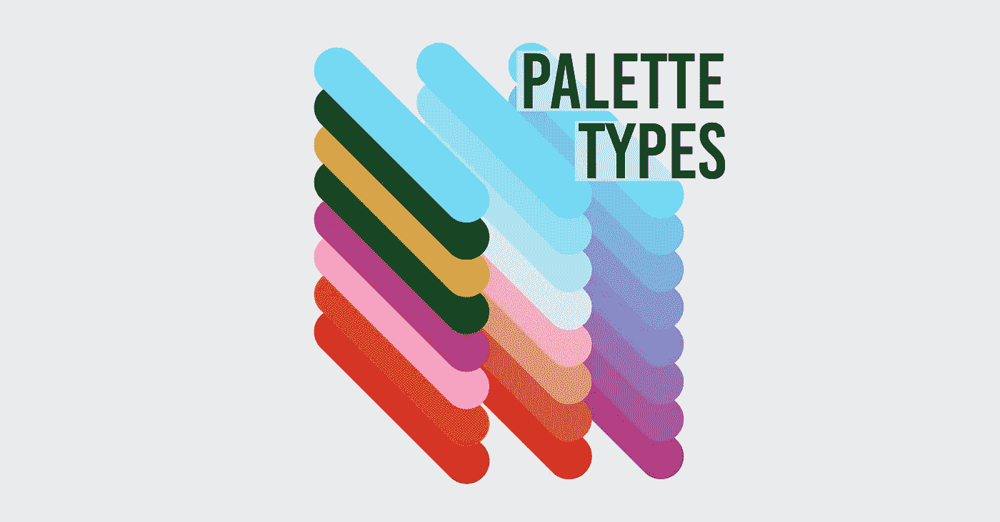
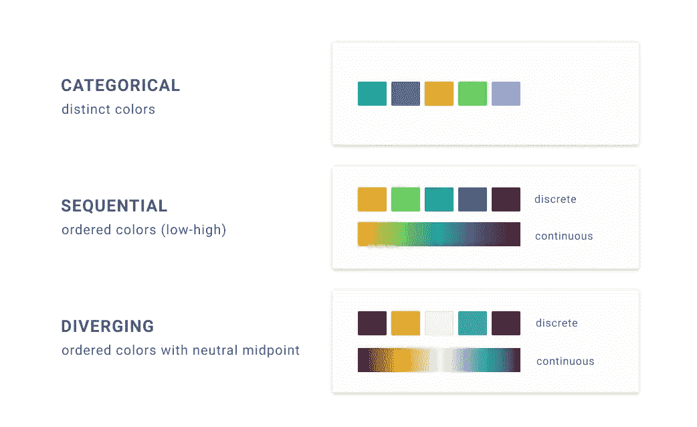
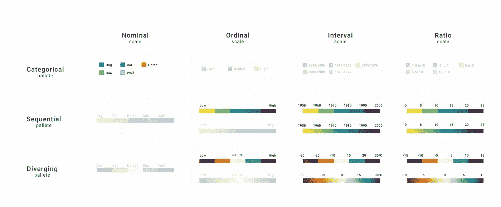

# 从选择合适的调色板开始

> 原文：<https://towardsdatascience.com/use-color-meaningfully-choose-the-proper-pallet-2cfbb71a30f4>

## 有意义地使用颜色

## 调色板有哪些类型，如何选择合适的？

作者图片

在可视化数据时，颜色是一个强大的工具，但如果使用过度或不正确，它会毁了你的作品，并在你的观众中造成混乱。因此，我们应该深思熟虑地选择颜色，并牢记人类的感知是如何工作的。

在本文中，我将关注调色板类型以及如何选择正确的类型。

# 不同的调色板类型

我们有三种类型的调色板—**(也称为定性的)**、**和**发散的。****

**在这种分类中，颜色不是决定性的方面，不同的调色板类型可以共享一些颜色。定义每个调色板的是这些颜色之间的关系。在**分类调色板**中，颜色应该能够很好地相互区分，并且它们不应该暗示任何顺序。另一方面，在**顺序**和**发散调色板中，**我们应该根据亮度、辉度或饱和度*对颜色进行排序。**

****如果这些术语对你来说是新的，请查看这篇精彩易懂的* [*色彩理论简介*](https://learnui.design/blog/the-hsb-color-system-practicioners-primer.html)*[1]。***

**除了有序的颜色，**发散的调色板**在中间有一个中性点。通常，它是白色，浅灰色，或米色。但是在某些情况下，其他颜色也可能会起作用。如果你有一个彩色的背景，你可以用这个颜色作为你的中性点(即使这是一个黑暗的)。所以实际上，中性颜色取决于上下文，我们应该使用任何暗示“没有颜色”的颜色。**

**连续性方面是**分类**和**非分类调色板**之间的另一个区别(顺序和发散)。前者只存在于离散的变体中，而后者可以具有离散的(阶梯式)和连续的(平滑的)变体。**

**我们应该在什么时候使用每个变体？很简单，每次你有离散数据，你应该使用离散变量，如果你有连续数据…是的，你应该使用连续的。以测试结果为例。如果您想显示成绩，请使用连续调色板的离散版本，如果您想以百分比显示实际结果，请使用连续的连续版本。**

****

**调色板类型-作者绘制的图表**

# **不同的规模类型**

**了解了调色板类型之后，让我们后退一步，关注数据。这一步至关重要。因为如果你想选择正确的调色板，你必须了解你要可视化什么样的数据。**

**有两种类型的数据——定量数据和定性数据。定量数据由年龄、温度或利润等数字表示。**定性**数据，也称为非数字数据，由名称或学校成绩等描述性类别组成。定性数据的另一个例子是满意度量表(例如，非常好—好—差—非常差)。**

**这两种数据类型可以进一步分割。在定性数据中，我们有一个**名义标度**和一个**序数标度**，而在定量数据中，有一个**区间标度**和一个**比率标度**【2】。**

## **额定值**

****主要特征:**无自然顺序的非数值(定性)数据**

*****举例:*** *性别，城市，家具***

## **顺序量表**

****主要特点:**非数值(定性)数据具有自然顺序**

*****举例:*** *李克特量表变体(如很好—好—差—很差)，高—中—低***

## **等距量表**

****主要特点:**数值(定量)数据不带任意 0**

*****举例:*** *温度，日期***

## **比例标尺**

****主要特征:**数值(定量)数据用任意的 0**

*****举例:*** *持续时间、长度、重量、金额***

****

**标度类型—作者绘制的图表**

## ****边注:**任意 0 是什么意思？**

***还有音程和比音阶有什么区别？***

**我们有多种测量单位。值可以用不同的货币、各种单位系统(英制或公制)中的重量和长度、摄氏度或开尔文中的温度以及公历、伊斯兰历或希伯来历中的日期(仅举几个例子)来表示。那么，为什么温度和日期属于不同的类别呢？**

**这是由于它们的构造方式。以温度为例。摄氏温标是根据水的冰点和沸点创建的，而开尔文温标指的是绝对零度，即可观察到的最低温度。日历都是相似的，每一个都有不同的(任意选择的)起点。这个任意选择的零点是音程和比例音阶的主要区别。这使得计算比例变得不可能(我们不能说 20℃比 10℃热一倍)。**

**确定我们处理的是区间还是比例标度的最简单方法是检查零在所有单位系统中的意义是否相同。例如，零米与零英尺的意思相同，但 0℃与 0 开尔文不一样。**

# **调色板和比例尺之间的关系**

**现在是时候把音阶和调板结合起来，关注它们之间的关系了。在选择调色板类型时，您需要记住一些简单的规则，但最重要的一条是:**

> **分类尺度与分类调色板相匹配。我们应该对其他类型的数据使用序列，除非我们有一个有意义的中间点，在这种情况下，我们应该使用发散调色板。**

**听起来势不可挡？那么，让我们深入了解更多的细节。为了简化事情，我们将只专注于选择合适的类型，而不是颜色。**

## **何时使用分类调色板？**

**提醒:在分类调色板中，颜色是对比鲜明的，不遵循任何顺序。**

*   ****用法:**他们的目的是强调类别之间的差异，而不是它们之间的联系。**
*   ****最佳实践:**限制颜色的数量，因为它们必须易于区分。如果你有 7-10 个以上的类别，重新考虑你的分组(改变类别或将一些值捆绑在一起)。**
*   ****搭配:**标称刻度**

## **何时使用连续调色板？**

***提醒:在连续调色板中，颜色从浅到深排序。我们可以根据一种颜色(单一色调)或多种颜色(多色调)创建调色板。在实践中，我们不应该使用两种以上的色调(为什么？检查上面彩虹色调的部分)。***

*   ****用法**:它们的用途是通过改变亮度来显示秩序。**
*   ****最佳实践**:通常，较低的值与较浅的颜色相关，较高的值与较深的颜色相关。然而，在深色背景上分配相反的值是很常见的。**
*   ****搭配:**序数刻度、区间刻度、比例刻度**

## **什么时候使用发散调色板？**

***提醒:发散调色板是由两个连续的调色板组合而成，中间是中性色。作为中性色，我们可以使用白色、米色、灰色或背景色。***

*   ****用法**:显示与特定值的偏差，如平均值、0 或目标值。**
*   ****最佳做法**:中心值一般赋给浅色，所以颜色越深，离中心越远。标尺的两端应该具有相似的亮度。**
*   ****搭配:**序数刻度，区间刻度，比例刻度**

****

**调色板和比例尺的关系——作者的图表**

# **典型错误**

**选择合适的调色板类型时会出现什么问题？可能是几件事。让我们讨论一下最常见的错误，这样你就可以避免它们。**

## **1)对没有意义的 0 点的数据使用发散调色板**

**只有当你有一个有意义的中间点时，才应该使用发散调色板。如果是这种情况，应该将中间点分配给中性(中心)颜色。将其他值设置为中性色会产生误导。如果我们选择平均值作为中间点，我们应该让用户清楚(例如，通过添加注释)。**

****

**发散调色板中的中点——作者绘制的图表**

## **2)使用不同的间隔**

**使用颜色背后的想法是让用户可以轻松地比较这些值。但是底线是我们必须有相等的间隔。否则，颜色的变化不会反映值的变化。**

****

**构建区间—作者的图表**

## ****3)发散调色板中的扭曲刻度****

**发散的颜色被设计成从中心点(0)开始平衡。可能发生的情况是，数据最大值和最小值离中心点的距离不相等。在这种情况下，应该通过“裁剪掉”颜色来调整比例。颜色强度应该反映离中心的绝对距离。**

****

**作者对发散标度图的正确构造**

## **4)使用彩虹色调调色板**

**连续调色板应该从最高亮度到最低亮度[3]。在彩虹调色板中，我们有许多不同的色调，这导致亮度的突然跳跃。此外，亮度甚至不会在一致的方向上变化[4]。就像下面的例子，最暗的点落在一个随机的地方。**

****

**光度的差异——作者的图表**

# **用于创建调色板的工具**

**幸运的是，有许多工具可以帮助我们创建一个好的调色板，所以我们不需要手动操作。我可以推荐两个方便直观的工具来创建你的调色板:**

*   **第一个是[颜色生成器](https://colorbrewer2.org/#type=sequential&scheme=BuGn&n=6)，它允许你快速找到一个预定义的调色板，最适合你的数据。一个额外的优势是色盲和打印友好的选择。**
*   **第二个是[数据颜色选择器](https://learnui.design/tools/data-color-picker.html#divergent)，让你对选择的颜色有更多的控制。您可以修改颜色，但仍然可以创建一致的调色板。**

**不想错过我的任何帖子？ [***直接把它们***](https://gawarska-tywonek.medium.com/subscribe)**发到你的收件箱里！****

***如果你还不是中等家庭的一员，考虑注册成为会员。它每月只需 5 美元，支持数千名作家。 [***注册我的会员链接***](https://gawarska-tywonek.medium.com/membership) *，除了可以访问所有发表的内容，你将得到我永远的感激。****

## ***链接***

***[1] E. Kennedy，[《HSB 色彩系统:从业者的初级读本](https://learnui.design/blog/the-hsb-color-system-practicioners-primer.html)，学习 UI 设计博客***

***[2] S. S .史蒂文斯，[论测量的尺度](https://www.science.org/doi/10.1126/science.103.2684.677) (1946)，科学***

***[3] C. Shanley，[混合等亮度颜色—第 1 部分](https://medium.com/sketch-app-sources/mixing-colours-of-equal-luminance-part-1-41f69518d647)，中等出版物***

***[4] R. Kosara，[彩虹色地图如何误导](https://eagereyes.org/basics/rainbow-color-map) (2013)，渴望之眼博客***

***<https://medium.datadriveninvestor.com/less-is-more-best-data-visualization-principle-c166e2797d60> [## 少即是多—最佳数据可视化原则

medium.datadriveninvestor.com](https://medium.datadriveninvestor.com/less-is-more-best-data-visualization-principle-c166e2797d60) <https://medium.com/analytics-vidhya/how-to-make-your-audience-look-right-where-you-want-them-to-984df6d0338a> ***