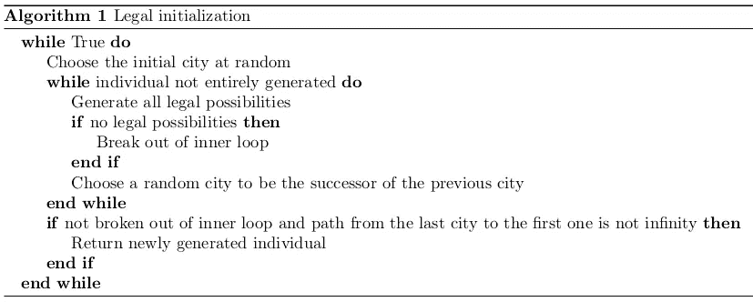
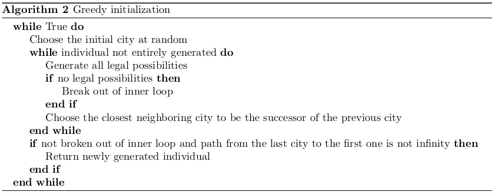
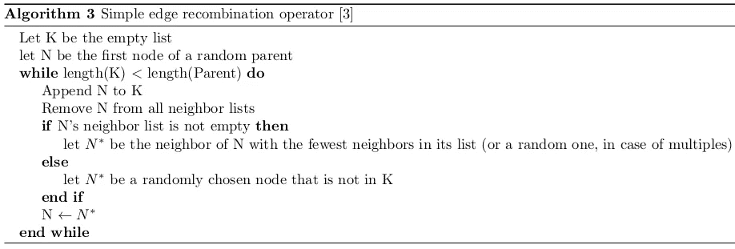
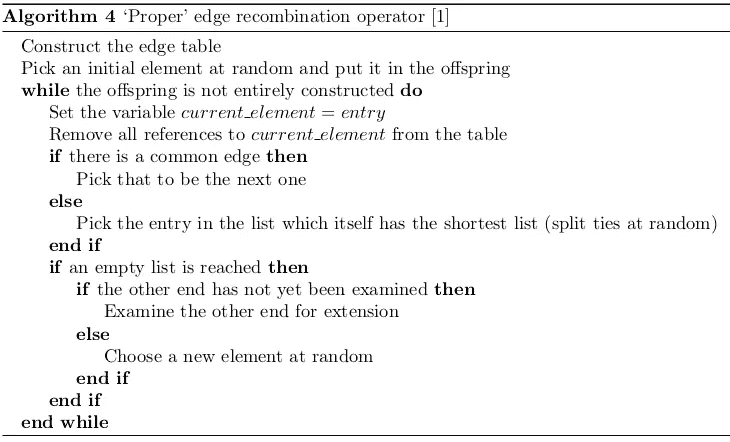
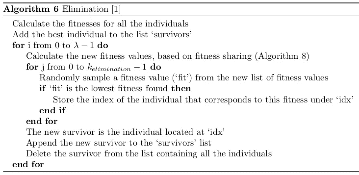
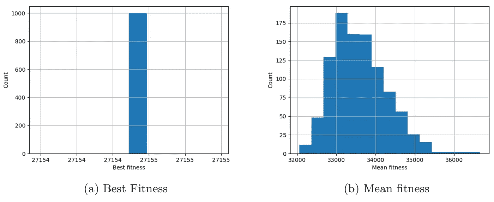
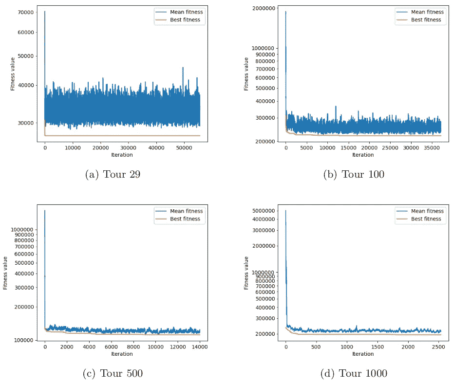

# 遗传算法和进化计算如何用于寻找旅行推销员问题的近似最优解

> 原文：<https://towardsdatascience.com/use-genetic-algorithms-and-evolutionary-computing-for-solving-the-travelling-salesman-problem-b9623ccc9427>

## 元启发式算法可以找到 NP 完全问题的近似最优解

去年，我在鲁汶大学学习了遗传算法和进化计算课程。本课程的评估完全基于 Python 中的一个编程项目，该项目的任务是为旅行推销员问题找到接近最优的解决方案。从概念上讲，给出了几个矩阵来表示某些城市之间的距离，在此之后，算法应该找到最短的解决方案。设计好的算法必须提交，然后在部门计算机上运行 5 分钟。

照片由 [DeepMind](https://unsplash.com/@deepmind?utm_source=unsplash&utm_medium=referral&utm_content=creditCopyText) 在 [Unsplash](https://unsplash.com/s/photos/genetic-algorithms?utm_source=unsplash&utm_medium=referral&utm_content=creditCopyText) 上拍摄

# 1)进化算法的设计

## 1.1)三个主要特征:

1.  **适应度共享**已用于算法的淘汰步骤。这种多样性促进方案对于**避免过早收敛**至关重要，因此确保可以找到更好的解决方案，而不是让所有个体收敛到一个局部最小值。
2.  通过引入 2-opt **局部搜索操作符**，可以更快地找到更好的解决方案。没有局部搜索算子，需要更多的迭代来找到相同的适应值，以及必然更大的群体。尽管这种操作本质上计算量非常大，但它却是算法的关键。特别是在这个操作符中，诸如利用**动态编程**和使用 **Numba** 之类的优化对于使操作符在计算上可行是决定性的。
3.  最后一个关键的改进是引入了贪婪的初始化和合法的初始化。贪婪初始化从一个随机节点开始，根据最小距离选择下一个。这种初始化方案的细节在第 4.4 节中详述，同时考虑了引入的偏差。此外，合法初始化只是从一个随机邻居中选择下一个节点，在它们之间有一条现有的道路。

## 1.2)主回路:

进化算法的主循环

## 1.3)代表权

可能的解决方案以**排列**表示，并以**循环符号**记下。例如，排列(1423)从 1 开始，然后到 4，然后 2，然后 3，最后返回 1。这种符号的一个优点是
,只要我们将表示初始化为排列，就不会出现循环。

这种表示在中实现为一个 Numpy 数组，其长度等于问题中城市的数量。数组中的每个元素代表一个城市号码。

## 1.4)初始化

最初，个体是通过**随机排列**产生的，它们的大小由距离矩阵决定。然而，特别是对于较大的问题，相当多的路径不存在或者非常长。因此，所有个体的随机初始化几乎总是产生没有一个代表有效路径的个体。

引入了两种新的初始化方案，合法初始化和贪婪初始化，其中合法初始化的目标是在初始化个体时不创建不存在的路径。这同时不会引入某些偏见，例如个人立即接管群体。另一方面，贪婪初始化的目标是以计算成本低廉的方式引入具有高适应度的局部最优个体。这里，已经特别注意到个体不会引入高偏差，也不会立即接管群体。

## 1.4.1)合法初始化

合法初始化个体时，要确保生成的路径**存在**。因此，随机选择一个城市，然后从所有具有非无限路径成本的邻居中随机选择旅程中的下一个城市。然而，如果没有现有的邻居可用作下一个城市，则整个过程重新开始。算法 1 中给出了伪算法。

算法 1:合法初始化

## 1.4.2)贪婪初始化

除了合法的初始化方案之外，还使用了另一种称为贪婪初始化的初始化方案。该算法类似于合法的初始化方案，唯一的变化是后继城市被选为最接近的邻居**而不是随机的合法邻居。算法 2 中给出了伪算法。**

算法 2:贪婪初始化

这个初始化方案**确实引入了某些偏差**，这可能导致一些个体立即接管群体。因此，必须采取措施防止这种偏见，例如通过仅用这种方案初始化所有个体的一小部分。

引入的偏差是所有个体都是局部最优的，其中理论上不同解的最大数量由问题大小给出。假设很难避开局部极小值，人们必须考虑这种初始化方案的有用性。

然而，在对这种初始化方案进行实验后，很明显，对于问题的好的解决方案会更快地被发现，同时仍然保持多样性的 T2，以及平滑收敛的 T4。由于只有一小部分个体用这种方案初始化，完全陷入局部极小值的情况没有被观察到，对我来说，这带来了巨大的好处，因为给定的五分钟现在可以用来以某种方式开始搜索空间中更有趣的区域。

## 1.4.3)概述

距离矩阵可以以贪婪初始化陷入无限循环的方式给出，因为贪婪初始化可能总是构造死路径(由于总是采取最近的邻居)，从每个节点开始。为了在特殊情况下创建合法路径，有时应该采用次优路径到达邻居，以避免在接近初始化结束时出现死路径。为了防止整个算法崩溃，对一个个体的初始化引入了一个**时间约束**。一旦一个个体初始化时间超过两秒，该个体的简单随机初始化随之发生。

一个个体还被赋予一个随机α值，该值代表该个体在算法的变异步骤中发生变异的概率。这样，合适的变异率由**自适应性**决定。

α的初始值由下式给出:

> α = max(0.04，0.20+0.08(X∞N(0，1)))

在对人口规模进行了一些测试后，选择了 15 人的规模。此外，如 1.4.2 节所述，只有一小部分人应该被贪婪地初始化。假设群体大小为 15，我发现贪婪地初始化 20%的个体(即 3 个个体)在实践中表现得相当好。剩下的 80%的个体是合法初始化的。

对于大型问题，初始化可能需要 10 秒钟。由于一个个体的初始化完全独立于其他个体，**多处理**被添加到这一步骤中，这使得具有四个物理核心(八个虚拟核心)的机器的速度提高了五倍。

## 1.5)选择运算符

小组赛部分的 **k 赛选择符**被保留。该选择算子在计算上是廉价的，因为只需要计算 k 个适应值，而这在基于适应值的方法中需要适应值。此外，由于贪婪初始化方案在群体中引入了一些非常好的个体，所以 sigma-scaled 选择例如不是合适的选择。这些个体将在这样的方案中占主导地位，因为他们的选择概率将非常高。

经过多次实验，选择了 k 值为 5。

## 1.6)变异算子

用于最终实现的变异算子是**反转变异**，由此选择一个随机子向量，并将其顺序反转。早先使用的交换变异操作符不能很好地适应更大的问题，因为它只能交换两个随机位置。因此，当问题规模增大时，变异算子对解决方案的影响相对更小。

倒位变异没有这个比例问题，因为决定子向量的城市是随机选择的。因此，变异操作符的效果随着问题规模的增大而保持不变。

自适应性已经被用于突变率，因此突变率对于每个个体是特定的。如前所述，它被初始化，并且如下面两个公式所述，它在交叉中改变:

> β= 2(X∞N(0，1))—0.5
> 
> α = max(0.04，α_ parent _ 1+β(α_ parent _ 2α_ parent _ 1))

最后一点，**精英主义**被用来防止最好的种子个体变异。

## 1.7)重组运算符

最初，**边缘交叉算子**的**简化版本**被用作重组算子，其过程在算法 3【3】中描述。这种重组产生了一条新路径，在这条新路径中，子代的几乎所有边都存在于至少一个父代中。但是，它不会将双亲中存在的边优先于单个双亲中存在的边。

算法 3:简单的边缘重组算子

这种算法非常简单，是遗传算法中最薄弱的部分。然而，该算法尽管简单，但仍有一些可取的特征。双亲中存在的边传播给子代的概率相对较高，因此重要的特征大多被保留。另一方面，当父母差异很大时，孩子看起来会与父母完全不同。因此，这个操作符比其他操作符更倾向于探索端。

之所以采用这种简化算法，而不是 Eiben & Smith [1]的正确算法，是因为相信这种算法的计算成本比 Eiben & Smith 的算法(低得多)。

在项目后期，对 Eiben & Smith 的顺序交叉和适当的边交叉算法进行了分析。经过一些研究，在许多矛盾的建议下，已经做出了一个任意的选择，首先尝试'**适当的'边缘交叉算法**(算法 4)。

算法 4:“适当的”边缘重组算子[1]

就实现而言，已经做了相当多的努力来捕捉算法的所有极限情况，同时实现相对优化的代码。此后，该算法保持了很长时间，直到人们注意到，对于较大的问题规模，交叉花费了**非常长的时间**(高达 95%的总运行时间花费在边缘交叉算子上)。

由于这种缓慢的执行时间，订单交叉[1]也被实现(算法 5)。

算法 5:顺序交叉算子[1]

这种交叉算法的计算成本本来就低得多，在最终算法中只占总执行时间的 5%左右。这正是这个交叉算子最终被使用的原因。

事后看来，边交叉操作符执行时间慢的一个原因可能是由于在操作符中使用了集合。边缘表基本上是一个带有集合的列表，其中减号表示双重条目。使用集合是因为希望快速检查边表中是否存在边。然而，由于每个元素最多可以有四条边，所以列表可能就足够了。鉴于集合也需要相当多的簿记，使用列表还有一点可以说明(例如，删除第二次出现的正数条目，然后在前面插入一个减号)。

性能差距大的另一个原因是，order crossover 操作符能够使用 **Numba** 来编译 Python 代码，并通过使用 decorator `@jit(nopython=True)`来更快地运行它。这是因为 order crossover 操作符只使用 Numpy 数组上的操作(Numba 处理得很好)，而 Numba 在 edge crossover 实现中抛出了数百个编译错误，因为 Numba(在`nopython=True`模式中)不能创建新的 Numpy 数组，在处理集合时有困难，并且大多数时候不能推断出`dtype`。

## 1.8)消除运算符

长期以来，算法中使用的是**(κ+)-消去**算子。然而，对于较小的问题规模，人们注意到群体收敛速度极快，即使存在健康促进方案(如 4.10 节中进一步讨论的)。经过一些研究之后，很明显(κ+)-消去算子实际上施加了相当大的选择压力。相反，**k-锦标赛操作符**可以减轻这种选择压力，因此,(κ+)-淘汰操作符已经被 k-锦标赛操作符取代。

把 k 赛运营和健身分享运营结合起来，分工。算法 6 用于 k-锦标赛操作符(以及一些预备计算)，而算法 8 每次被调用用于健身共享多样性促进方案本身，如稍后在 1.10 节中解释的。

算法 6:消除[1]

经过多次试验，选择了 k 值为 8，这将在 1.12 节中进一步讨论。

## 1.9)本地搜索运算符

已经实现了 **2-opt 局部搜索算子**，其在给定的周期中交换每两个可能的边。在该算法的第一个版本中，为给定个体的每个可能的邻居重新计算适应度，这需要不可接受的高计算成本，特别是对于较大的问题规模。在一些调查之后，在适合度的计算中检测到模式。因此，不是为每个邻居重新计算适应度，而是采用了某种类型的**动态编程**方法。对每一个人来说，都有一个预处理步骤，由此产生所谓的“累积量”。这些累积量捕获从第一个城市到累积数组中相应城市的路径长度。相同的过程适用于从最后一个城市到数组中相应城市的路径长度的计算(即，以相反的顺序，由此最后一个城市到第一个城市的返回成本也被合并)。很明显，这些累积量的计算是在 *O(N )* 中完成的，其中 N 是问题规模中城市的数量。

现在，计算个人的适合度只是一个记账的问题。该过程在算法 7 中解释。

算法 7:局部搜索操作符

如图 2 所示，旅程的第一部分与之前的迭代完全相同，从`first — 1`到`first`增加了一个额外的成本。同样的推理也适用于旅行的最后一部分，在这种情况下，总成本每次都会减少从`second — 1`到`second`的成本。最后，中间部分也可以以类似的方式构建。这样，2-opt 局部搜索算法的总开销仅为 *O(N )* ，其中 N 表示城市总数。

图 2:本地搜索操作符(2-opt) [2]

还应该注意到，通过在方法声明上面使用 Numba 和命令`@jit(nopython=True)`，本地搜索操作符运行**的速度是**的 745 倍。Numba 能够做出这些巨大的改进是因为这些方法的编译，尤其是循环可以被利用。

## 1.10)多样性促进机制

所使用的多样性促进方案是**适应度共享消除**，其改变已经选择的幸存者的σ-邻域中的个体的适应度。在算法 8 中解释了适应度共享消除算子。

算法八:健身分享算法

子方法“从到的距离”计算两个人之间的距离，通过两个人之间的**公共边**的数量来测量。为了有效地做到这一点，在初始化时，每个个体的边被计算并存储在一个集合中。为了测量两个人之间的距离，计算集合之间的**交集**。

一遍又一遍地计算许多单个配对的交集，结果证明计算量相当大。一个改进是将所有计算出的距离存储在一个**散列表**中，这是一个不错的改进，因为相当多的个体会在群体中停留不止一次迭代。如果系统的内存使用率超过 95%,通过简单地清空散列表来预防系统颠簸。

## 1.11)停止标准

在实现停止标准方面并没有投入太多的精力，因为所有较大的问题在运行五分钟后仍然会收敛。假设即使最佳适应度保持很长时间不变，由于良好选择的变异/交叉操作，算法突然可以进行得更远。因此，停止标准就是**五分钟**的**时限**。

## 1.12)参数选择

**种群**和**后代规模**很大程度上取决于算法的计算成本。对于大型问题，每次迭代的最大计算成本是适应度共享消除步骤。这是因为具有所有个体和幸存者之间的公共边的数量的矩阵平方增长，并且该矩阵中的一个条目的计算也线性增长。因此，如果群体中有 15 个以上的个体(以及 15 个以上的后代)，计算成本就会变得太大。少于 15 个个体自然也是不可取的，因为进化算法依赖于拥有一些不同的个体。

**k-锦标赛参数**由**超参数搜索**确定，其中已经尝试了范围从 2 到 10 的值。鉴于这两个参数高度相关，需要进行网格搜索或随机搜索。为了使超参数搜索可行，对这些值进行了随机搜索，这产生了等于 5 的选择的 k-锦标赛值和等于 8 的淘汰值。

当打印出带有公共边数的矩阵时，很明显，许多条目要么是最大问题尺寸，要么是零。因此，经过一些实验，σ值为问题大小的 50%，α值为 0.25。在我看来，这个低 alpha 值也更好，因为真正“接近”的解决方案应该比仍然有一些不同边缘的解决方案受到更多的惩罚。

作为总结，使用了以下超参数:

*   人口规模= 15
*   后代大小= 15
*   选择操作符的 k-锦标赛参数= 5
*   消除运算符的 k-锦标赛参数=
*   健身共享的α值= 0.25
*   健身共享的σ值=问题大小的一半

## 1.13)其他考虑

正如 4.10 节所讨论的，通过在散列表中存储个体之间的距离，获得了相当大的加速。出于同样的原因，引入了一个 hashmap 来存储所有个体的健康值。因为在每次迭代中，都知道从群体中删除了哪些个体(如果应用了变异，局部搜索会产生一个新的个体，或者在淘汰步骤中杀死了一些个体)，所以也可以很容易地从散列表中删除它们的值。通过这种方式，hashmap 的大小始终保持不变，这更有利于提高性能，因为在内存级别超过阈值后不会重新启动，也不会浪费垃圾收集器需要启动的时间。

# 2)数值实验

## 2.1)元数据

这些实验在英特尔酷睿 i7–6700 HQ CPU 上进行，时钟频率为 3.60GHz，有 8 个虚拟内核。该系统包含 16 GB 的主内存，测试使用的是 Python 版本。第 1.12 节总结了所用的超参数。

所有的收敛图都是半对数绘制的，因为算法开始时的变化比接近结束时的变化大得多。

## 2.2)游览 29 个城市

找到的最佳旅游的适合度为 27154.5。

图 3:在第 29 轮 1000 次跑步后，最佳和平均体能的直方图

如图 3 所示，每次都找到了(可能是最佳的)适应值 27154.5。此外，平均适应度由于多样性提升方案而具有一些变化。它永远不等于最佳适应值，这意味着**多样性**被**永远保留**。注意，对于这个实验，每次运行的时间限制为 10 秒，以使计算可行。

平均拟合度的一千次运行的平均值等于 33551.6，标准偏差的值为 657.6。

从图 4a 的收敛图可以看出(见 2.6 节)，最佳适应度的收敛发生得非常快。然而，平均适应度并不收敛，这意味着由于适应度提升消除方案，人口保持多样化。

## 2.3)100 个城市之旅

找到的最佳旅游的适合度为 219948.4。

收敛图如图 4b 所示(见第 2.6 节)。该算法显然表现很好，通过快速跳到搜索空间中最感兴趣的区域，之后最佳适应度保持收敛，直到超过五分钟的时间限制。从平均适应度可以看出，群体保持多样化，因此有能力不断探索更好的解决方案。

对于本次巡视以及接下来的巡视，很难估计该解决方案与最佳解决方案的接近程度，因为只知道一个启发式值，而该算法明显优于该值。

## 2.4)游览 500 个城市

找到的最佳旅游的适合度为 110814.2。

收敛图如图 4c 所示(见第 2.6 节)。通过再次跳转到最感兴趣的搜索区域，结合平滑的收敛，该算法显然再次表现出色。此外，人口保持多样化。

## 2.5)1000 个城市之旅

找到的最佳旅游有 194955.2 的适合度。

最佳健身再次保持收敛，直到超过五分钟的时间限制。再一次可以从群体保持多样性的平均适合度中推导出来。

## 2.6)收敛图

图 4:基准的收敛图(半对数)

# 3)批判性反思

## 3.1)进化算法的三大优势是什么？

1.  通过使用基于群体的元启发式算法，可以在**探索**和**开发**之间进行权衡。这种折衷被证明有助于为旅行推销员问题找到好的解决方案。纯粹的随机搜索在计算上太昂贵了(在找到一个“体面的”、简单的贪婪的解决方案之前，它甚至需要一个无穷大)。另一方面，纯粹的局部优化器会很快收敛到一个次优解，这个次优解也很可能离最优解相对较远。进化算法提供了一种在相当长的时间内找到好的次优解的方法。
2.  原则上，进化算法相对容易**并行化**，因为群体可以在许多方向上同时探索搜索空间。虽然在这个项目中，没有使用很多并行化(仅在初始化步骤中)，但它可能是下一个最有益的任务。已经开始尝试使用多处理，但是与在一个 CPU 内核上简单的顺序执行相比，使用多处理时的执行时间要慢一千多倍。这可能是由于大量的进程间通信(IPC)造成的，因为例如个人列表是共享的，这导致了大量的锁和信号量，明显地控制了执行时间。
3.  关于进化算法，最后一件让我印象深刻的事情是，它们本质上优化了一个函数**而没有使用导数**(仅通过使用适应值，暂时抛开局部搜索算子)。特别是对于不可微的函数，进化算法可能提供拯救。

## 3.2)进化算法的三个主要弱点是什么？

1.  进化算法效果很好，只要是**精心设计**合理的参数。例如，以 100 而不是 15 为人口规模，算法很难进行一些迭代。这当然是由于适应度共享消除，它在种群(和后代)规模方面具有立方复杂性。此外，必须选择许多其他参数来获得合理的性能。例如，如果 k-锦标赛参数(来自选择和淘汰)没有被显著选择，要么群体立即收敛，要么个体的总体适合度几乎没有增加。最后，这并不令人惊讶，因为根据“没有免费的午餐”定理，不可能存在任何算法可以解决所有问题，并且通常优于任何竞争者。
2.  这个项目中使用的表示法在杂交后明显产生了有价值的后代。如果对这种表示进行推理，很明显，双亲的子向量可能是好的子序列。当进行交叉时，这些**特征**现在可以以更优化的方式组合，因此后代显然也有相对较高的机会具有较低的适应值。然而，对于许多其他问题，这种表示和交叉算子不是那么清楚(即，不能从父代中提取特征)，因此进化算法不能为这些问题提供很多。
3.  进化算法在计算上非常昂贵**。由于进行了大量的探索，在寻找的过程中，自然会构建出许多无意义的个体。**

## **3.3)从本项目中吸取的主要教训。进化算法适用于旅行推销员问题吗？**

**我认为旅行推销员问题非常适合旅行推销员问题。找到一个精确的解决方案当然是不可行的，因此元启发式的使用变得很有必要，并且它们证明了自己非常有效。考虑到许多现实世界的应用程序需要最佳解的良好近似，很明显这些元启发式算法(尤其是进化算法)是一个必须拥有的工具。**

**此外，我学会了欣赏像 Numba 这样的库的价值，它们可以通过编译代码来大幅提高 Python 代码的速度。当然，并不是所有的操作都被允许，但是考虑到 Numba 社区正在快速发展，我会继续关注它。**

**进化算法的一个缺点是你必须测试某些改进的方式。由于进化算法固有的**随机性**，在不同的运行之间可以观察到相当多的**变化**。当然，如果超参数的改进仅产生相对较小的差异，则在最佳参数变得明显之前，必须重复多次实验。**

# **参考**

**[1] A.E .艾本和 J.E .史密斯。进化计算导论。斯普林格国际出版公司，第 2 版。
【2】尼克·范尼文霍芬。本地搜索运营商。技术报告，2021 年。
[3]达雷尔·惠特利，蒂莫西·斯塔克韦瑟，丹尼尔·尚纳。旅行推销员和序列调度:使用遗传边重组的高质量解决方案。第十八页。**

**这个项目的代码可以在[这里](https://github.com/JorritWillaert/Genetic-Algorithms-and-Evolutionary-Computing-Project)找到。**

**除非另有说明，所有图片均由作者创作。**

**如果你还有其他问题，或者你想保持联系，你可以通过 [Github](https://github.com/JorritWillaert) 或者 [Linkedin](https://www.linkedin.com/in/jorrit-willaert-166a64198/) 联系我。**