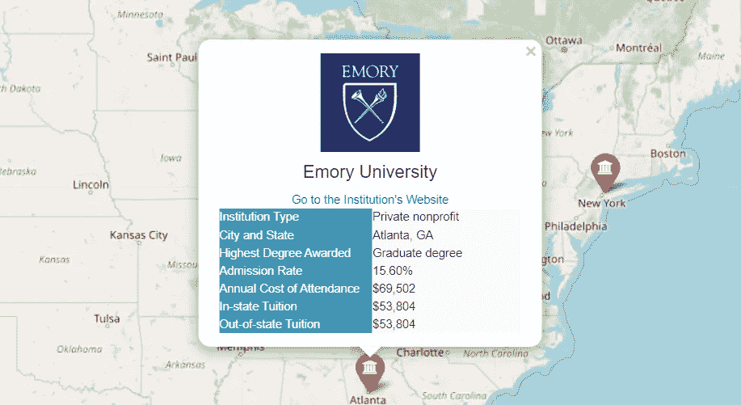
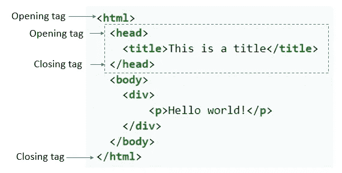
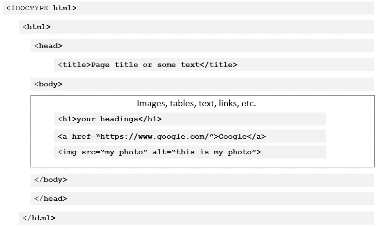
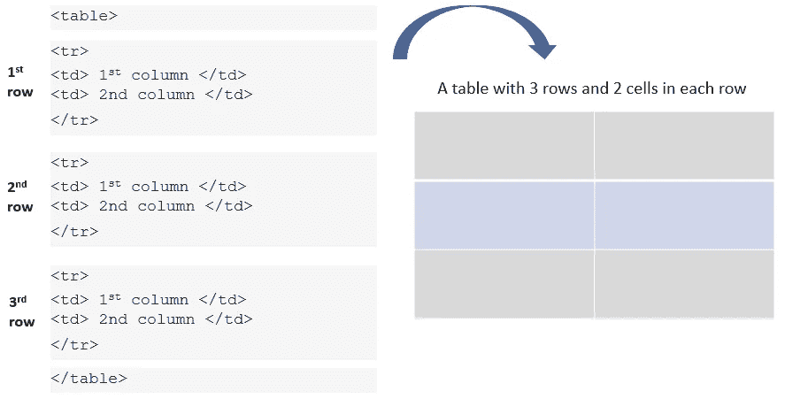
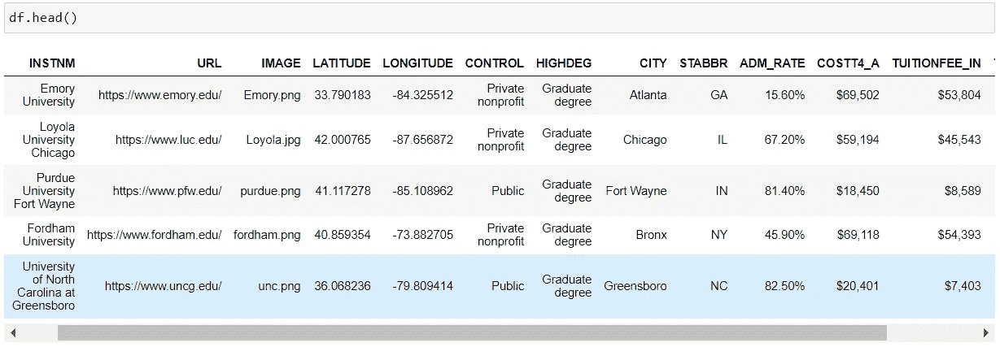
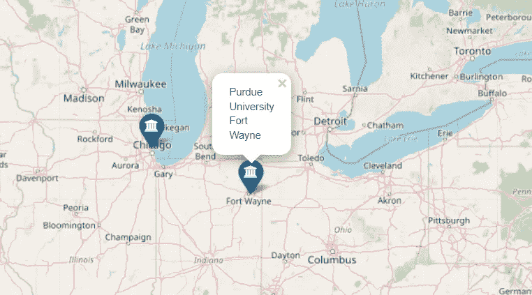
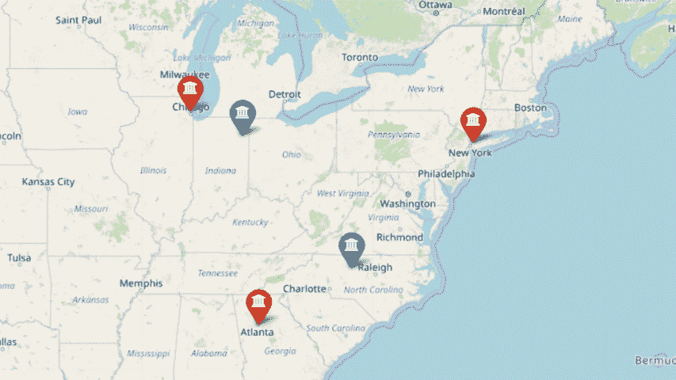

# 在树叶地图中使用 HTML:数据科学家综合指南

> 原文：<https://towardsdatascience.com/use-html-in-folium-maps-a-comprehensive-guide-for-data-scientists-3af10baf9190>

## 逐步了解如何使用 HTML 将动态图像、链接、文本和表格添加到叶子地图弹出窗口

图片来源: [Pixabay](https://pixabay.com/photos/globe-union-children-hands-love-2164673/)

***目录:***

[简介](#5436)
[第一部分:HTML 基础知识](#349f)
∘ [什么是 HTML？](#e0a3)
∘ [标签和属性](#5113)
∘ [一个 HTML 页面的简单构造](#6121)
∘ [如何在 HTML 中添加文本、链接、图片和表格](#8e37)

[第二部分:使用 HTML 创建定制的叶子弹出菜单](#430e)
∘ [导入库并读取数据](#7bc4)
∘ [创建基本叶子地图](#2b2f)
∘ [为每个标记创建 HTML 页面](#f03b)
∘ [将 HTML 传递给叶子地图标记](#2d18)
[关闭思路](#0c33)
[引用和数据源](#02bd)

# 介绍

你可能会想:作为一名数据科学家，而不是 web 开发人员，为什么我需要学习和理解 HTML？投入宝贵的时间去学习 it 的基础知识对我有好处吗？我会不会遇到需要在工作中使用它的情况，并为花时间学习它而感到高兴？

直到几个月前我遇到了我的第一个地理空间项目，我也有同样的疑问和怀疑。在那个项目中，我需要将 HTML 作为标记传递给一个叶子地图，并努力使它看起来和工作起来符合我的要求。我在网上做了大量研究，但找不到一个好的资源页面，将核心概念和代码放在一个地方，并用数据科学上下文详细解释它们。

这就是这篇文章背后的动机。在这篇文章中，我想首先从一个完全初学者的角度带你了解 HTML 的核心概念。然后我们将运用这些知识，学习如何通过添加标题、图片、链接和表格来构建一个 HTML 网页。最后，我们将 HTML 传递给 follow map markers，并将其添加到弹出窗口中，如下面的屏幕截图所示。

作者图片

# 第一部分:HTML 基础知识

在我们动手使用上图中显示的弹出窗口创建一个叶子地图之前，让我们先花些时间学习 HTML 的基础知识。这样做，你会更容易理解第二部分写的代码，并能在将来有效地使用它们。所以如果你对 HTML 完全陌生，请不要跳过这一节。

## 什么是 HTML？

HTML 是一种广泛用于创建网页的语言。你可能也听说过 CSS。CSS 不同于 HTML。CSS 是用来帮助 HTML 使网页在视觉上吸引人的代码。在这篇文章中，我们将主要关注 HTML。

下面是来自[维基百科](https://en.wikipedia.org/wiki/HTML)的 HTML 的简短描述:

超文本标记语言，简称 HTML，是设计用于在网络浏览器中显示的文档的标准标记语言。它可以通过级联样式表(CSS)和 JavaScript 等脚本语言等技术来辅助。

## 标签和属性

HTML 是一种标记语言，计算机使用它来解释和控制文本、图像或其他对象如何在 web 浏览器中处理和显示。为此，HTML 使用了*标签*和*属性*——你需要理解的两个最重要的概念是 HTML 的基础。

什么是标签？

HTML 元素是 HTML 页面的构建块，标签用于标记 HTML 元素的开始。

标签写在尖括号中，绝大多数是成对的，如下例所示。它有一个开始标签和一个结束标签以及一些元素信息，比如放在标签之间的标题。但是也有一些例外:例如，标签是不成对的，没有结束标签。标签也可以嵌套在标签中。

标签示例(图片来源:[维基百科](https://en.wikipedia.org/wiki/HTML))

什么是属性？

属性为标签提供附加信息，只放在开始标签中。看看下面的例子，我们在其中创建了一个图像标签。在标签中，图像源(src)、替代文本(alt)、宽度和高度都是这个标签的属性。

作者图片

## HTML 页面的简单构造

下图展示了一个简单的 HTML 页面结构。

HTML 文档需要以使用标签的文档类型声明开始，它指定了我们将在页面上书写的语言(HTML 5)。

标签指出了我们在 HTML 代码中开始写的地方，并被用作整个文档中所有 HTML 的容器。

标签是元数据(关于数据的数据)如文档标题等的容器。

标签包含了网页的内容。

作者图片

## 如何在 HTML 中添加文本、链接、图像和表格

在 HTML 中添加文本:使用标签

添加文本或段落。

在 HTML 中添加链接:使用标签添加链接

在 HTML 中添加图片:使用标签来添加图片

在 HTML 中添加表格:

与添加文本、链接或图像相比，在 HTML 中添加表格在语法上稍微复杂一些。我们使用标签创建一个表格，在标签内部，我们使用指定行数，使用

| 指定列(单元格)。 |

作者图片

# 第二部分:使用 HTML 创建定制的叶子弹出窗口

现在我们已经学习了 HTML 的基础知识，我们准备在现实世界的用例中应用我们刚刚学到的知识。假设我们想要建立一个大学选择工具。在该工具中，我们希望创建一个交互式地图，并将美国大学的标记添加到地图中。当用户单击一个标记时，会出现一个弹出窗口，在一个表格中显示大学的徽标图像、网站 URL 和一些附加信息。

## 导入库和读取数据

让我们首先导入所有必要的库并将数据读入 pandas 数据框。为了便于演示，我从可以从[DATA.ED.GOV](https://data.ed.gov/dataset/college-scorecard-all-data-files-through-6-2020/resources)(美国教育部)下载的原始数据集创建了一个非常小的样本数据集，其中仅包括 5 所大学。这是一个开放的数据集，不需要许可即可使用。我还将所有图像文件保存在我的 python 代码文件的同一个文件夹中。

作者图片

在数据中，对于每个大学，我们都有一个 URL、一个图像、地理信息(如纬度和经度)以及附加信息(如州、公立或私立、学费、录取率等)。

## 创建一个基本的树叶地图

创建一个基本的叶子地图很简单。我们首先启动一个空地图，然后遍历数据框中的行，根据每个大学的纬度和经度向地图添加标记。在叶子里。Marker()函数我们可以指定在弹出窗口中显示什么——在本例中，是每所大学的机构名称。

一个非常基本的叶子地图(图片由作者提供)

## 为每个标记创建一个 HTML 页面

上面的地图非常简单。让我们看看如何使用 HTML 在弹出窗口中包含更多信息。为此，我们需要首先定义一个函数，为每个标记创建一个 HTML 页面。每个标记的 HTML 页面应该显示大学的徽标、网站链接和一个包含大学附加信息的表格。

让我们详细检查一下上面的代码。既然你已经在第一部分中学习了 HTML 的所有基础知识，我希望你会发现这些代码非常容易理解！

第 18 行:我们使用以文档类型声明开始 HTML 文档。这指定了我们将在页面上书写的语言——在本例中，是 HTML 5。

第 19 行:标记表示从这一行开始，我们将使用 HTML 代码。

第 21 行:我们使用标签插入每所大学的徽标图像。放置在标签周围的

标签确保图像放置在页面的中央。我们还在标记中包含 src、alt、width 和 height 等属性。

由于每所大学都有自己的徽标图像，我们需要在 *for* 循环中创建一个名为‘institution _ img’(第 5 行)的变量，以相应地获取每所大学的徽标。在< img >标签中，我们还需要使用‘institution _ img’作为 src 属性的值。

为了让 src 属性接受' institution_img '变量，我们不能只使用 src=institution_img。该变量需要用以下格式包装:

作者图片

第 23 和 25 行:我们创建一个显示每个机构名称的标题。在标题下，我们插入每个大学网站的链接。

第 27–64 行:我们使用标签创建一个表格，并在开始标签中用 style 属性指定表格大小。从第 29 行到第 62 行，我们使用和

| 标签绘制了一个 7 行 2 列的表格。在这些标记中，我们还使用 style 属性来指定背景颜色、单元格大小、字体颜色等。 |

作者图片

## 将 HTML 传递给树叶地图标记

我们现在可以将 HTML 传递给 leav 地图标记。在下面的代码中，请注意我们创建了一个新的变量“color ”,这样我们可以将它传递给 marker，并使公立和私立大学的图标颜色看起来不同。

从第 12 行到第 15 行，我们首先使用上一步中定义的 popup_html 函数为每个标记创建一个 HTML。然后，我们使用 leav 将每个 HTML 页面插入到其对应的标记弹出窗口中。Popup()方法。最后，我们将弹出窗口传递给叶子标记，并将标记添加到我们的地图中。这就对了。您已经创建了一个带有自定义弹出窗口的漂亮的叶子地图，所有这些都是使用 HTML 完成的！

作者图片

# 结束语

Folium 是一个用于绘制地图的出色的 Python 库，因为它可以将丰富的 HTML 可视化作为标记传递到地图上，所以它提供了无限的可能性，使您的地图更具交互性和信息量。

对于那些不熟悉 HTML 的人，我希望这篇文章有助于理解如何使用它来提升自己的 feil 技能。学习和理解 HTML 对于我们这些数据科学家来说是非常有益的，尤其是在处理叶子的时候。也许下一次我们可以尝试创建一些交互式 Plotly 图表，并以 HTML 格式将它们传递给叶子弹出窗口！

# 参考和数据源

1.  简单的方法:今天就开始学习 HTML 和 CSS([https://html.com/](https://html.com/))
2.  大卫·贝克的《奇妙的叶子:[https://www.kaggle.com/dabaker/fancy-folium](https://www.kaggle.com/dabaker/fancy-folium)
3.  数据来源:美国教育部大学记分卡开放数据([https://data . ed . gov/dataset/College-score card-all-data-files-through-6-2020](https://data.ed.gov/dataset/college-scorecard-all-data-files-through-6-2020))。使用这些数据不需要许可证。

你可以通过这个[推荐链接](https://medium.com/@insightsbees/membership)注册 Medium 会员(每月 5 美元)来获得我的作品和 Medium 的其他内容。通过这个链接注册，我将收到你的一部分会员费，不需要你额外付费。谢谢大家！