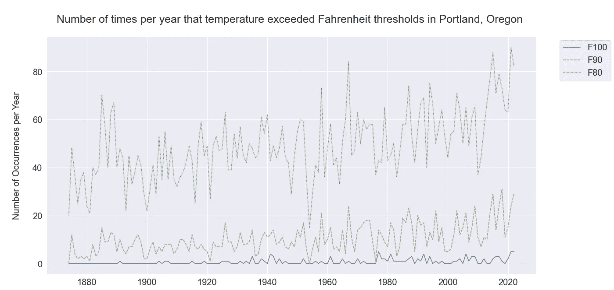
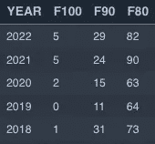
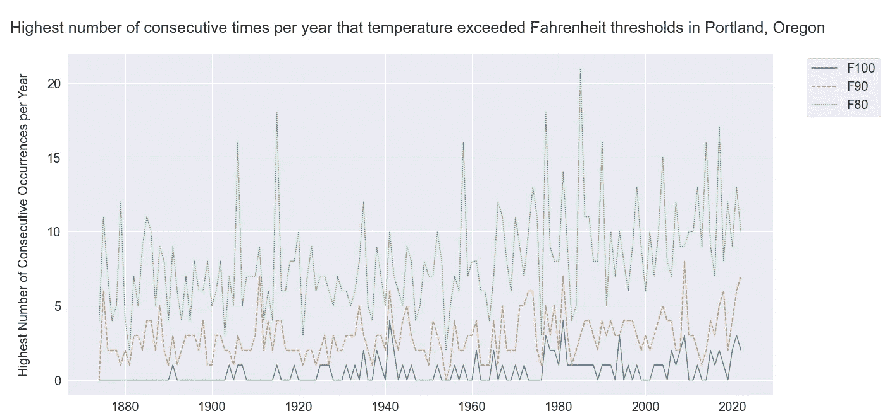

# 使用 itertools.groupby()计算 Python 中连续出现的次数

> 原文：<https://towardsdatascience.com/use-itertools-groupby-to-count-consecutive-occurrences-in-python-7bb83248b83e>

## 比如最长的热浪持续了几天？


在 [Unsplash](https://unsplash.com?utm_source=medium&utm_medium=referral) 上由 [Ridham Nagralawala](https://unsplash.com/@ridham?utm_source=medium&utm_medium=referral) 拍摄的照片

# 语境决定一切。这为什么有用？

作为一名分析师，您可能希望探究诸如连续性等细微差别，以了解根本原因或移除数据中的异常值。

激发这篇文章的主题是天气。2022 年，俄勒冈州波特兰的气温与前一年世界其他地区甚至波特兰的许多创纪录热浪相比是温和的。

然而，尽管与 2021 年创纪录的高温相比，2022 年可能是温和的，但这一年似乎很热。也许连续几天的炎热天气影响了我的感知？让我们用 Python 来统计热天条纹(也称为热浪)来分析这个假设。

# 美国的天气数据

在之前的一篇文章中，我写了关于来自国家环境信息中心(NCEI)的[公开可用数据](https://www.noaa.gov/big-data-project-frequently-asked-questions)来源。请阅读该文章，了解有关如何访问数据的更多详细信息，并访问 [NCEI](https://www.ncei.noaa.gov/about) 了解更多有关 NCEI 和国家环境卫星、数据和信息服务(NESDIS)任务的信息。

</democratizing-historical-weather-data-with-r-cc3c76dde7c5>  

在这篇文章中，重点将是 TMAX，在特定气象站观测到的最高日温度。俄勒冈州波特兰市的数据和我的探索性数据分析可在 [GitHub](https://github.com/wpbSabi/weather/blob/main/consecutive%20days%20of%20heat.ipynb) 上获得。

以下数据框是为此分析而创建的，包含真/假布尔型字段，用于指示温度是至少 80 度、至少 90 度还是至少 100 华氏度。


一个数据框，包含按日期和年份划分的温度阈值的真/假布尔字段(图片由作者提供)

# 连续几天气温都在华氏 90 度以上

**计算连续发生的次数并不像你想象的那么简单。**需要进行多次计算才能得出解决方案，开发一种能够处理多年数据的算法并不容易。

然而，有一些软件包可以减少为这个算法编写的函数的数量。Python 的`itertools.groupby()`包是我实现这一分析的最简单的方法。

首先，从`itertools`包中导入`groupby()`函数。

```
**from** itertools **import** groupby
```

接下来，定义一个函数，该函数将一年的数据点列表作为参数，然后返回一个列表。

这个返回列表中的每个元素都包含了那一年每一次热浪的持续时间。例如，如果我们为热设定的阈值是 90 华氏度，那么对于给定的年份，具有四个元素如[1，5，1，2]的列表将意味着该年有四次热浪。第一波有一天最高温度达到或超过 90 度。第二波包括连续 5 天超过 90 度。诸如此类。

*   第一波有一天最高温度达到或超过 90 度。第二波包括连续 5 天超过 90 度。诸如此类。

然后，编写另一个函数来执行以下操作:

1.  使用上面定义的函数确定每年最长的热浪
2.  在数据框中循环遍历每一年
3.  返回每年最长 90 度热浪的数据框(以天为单位)

为了获得比较，为 80 度和 100 度编写了类似的函数。

# 结果分析

在回顾每年最长的热浪之前，我们先来考察一下每年的总体高温天数。



截至 2022 年的年度趋势，这是该视图中的最后一年，位于俄勒冈州波特兰市(图片由作者提供)

确实 2021 年*是*热！80 度或以上的天气有 90 天，是有记录以来最多的。100 度和 90 度的天气也是今年有记录以来最热的一年。

*在这篇文章的原始版本写于夏末之后，波特兰实际上在 10 月有破纪录的 12 个 80 度的天。否则，2021 年大约会有 20 多个 80 度的日子。*



过去 5 年中超过热阈值的总天数(图片由作者提供)

下一张图表显示了 2022 年最长的热浪。



2022 年前最长的热浪(图片由作者提供)

对于 80 度以上

*   有记录以来最长的热浪(21 天)发生在 1985 年。
*   2022 以 10 天排名第 27
*   2021 以 13 天排在第 11 位

对于 90 度以上

*   有记录以来最长的热浪(8 天)发生在 2009 年
*   2022 以 7 天排名第二
*   2021 以 6 天排第 5

对于 100 度以上

*   有记录以来最长的热浪(4 天)发生在 1941 年和 1981 年
*   2022 以 2 天排名第 7
*   2021 以 3 天排名第四

# 结论:我的假设是错误的

虽然这一分析没有包括统计意义上的实验设计，但两年热浪的总结已经表明，最近的记忆正在偏见我对 2022 年炎热夏天的看法。


2022 年到 2021 年最长的热浪(图片由作者提供)

我发现了几个有趣的趋势:

*   与其他最热的年份相比，2021 年有更多的冷却期。这就是为什么总的高温日数没有导致有记录以来最长的热浪。
*   连续的高温天气似乎是周期性的。最后一年(2022 年)处于周期的低端。
*   每年高温天气的天数有增加的趋势，但热浪的趋势不太明显。

*最后更新 2022-12 月:添加了文章图片，更新了 9 月和 10 月数据的图表，并为可读性做了一些小编辑。*

如果你喜欢这篇文章，并想阅读(和写)更多这样的文章，请考虑点击我的个人资料图片旁边的*关注*按钮和/或使用我的推荐链接[https://sabolch-horvat.medium.com/membership](https://sabolch-horvat.medium.com/membership)订阅中等会员