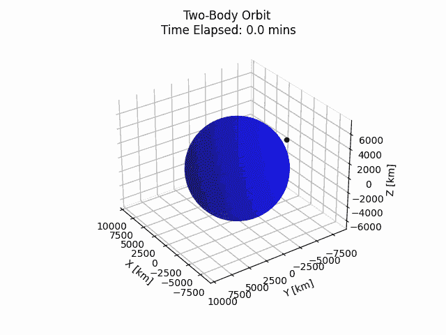
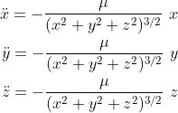
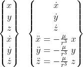
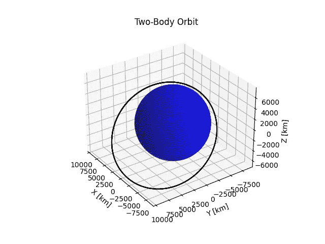

# 使用 Python 创建两体轨道

> 原文：<https://towardsdatascience.com/use-python-to-create-two-body-orbits-a68aed78099c>

## 了解如何使用 Python 来确定航天器在较大物体重力影响下的运动



双体轨道动画[作者创作]

一般的两体问题包括求解两个在彼此引力影响下运动的质量的运动。在轨道力学中，通常认为其中一个质量可以忽略不计，因此对另一个质量没有影响。可忽略质量的运动是令人感兴趣的，也是要解决的问题。事实上，较小的质量确实对较大的质量有影响，但这种影响是如此之小，以至于实际上为零。

为了在 Python 中创建两体轨道，首先需要推导感兴趣质量的运动方程(无论是卫星、小行星等)。).我在另一篇文章(见下文)中演示了如何做到这一点，所以我鼓励您去探索这一点，并真正理解方程背后的物理原理。但是，你会发现下面的运动方程。

<https://medium.com/illumination/astrodynamics-two-body-problem-ec2c5e148184>  

两体问题是一个很好的学习工具，可以作为非常接近大质量的轨道的第一近似，但一旦我们的轨道远离这个质量，其他引力就应该包括在内。即使在接近大质量时，也应包括大气阻力、[太阳辐射](https://medium.com/illumination/deriving-the-effect-of-solar-radiation-pressure-on-orbits-150792f64d0b)和非球形物体的影响等干扰力。我们不会在这里讨论这些，但这是一件值得记住的事情。在较大质量的重力影响下，可忽略质量的运动方程如下:



现在我们有了运动方程，我们需要把它们转换成可以数值积分的状态形式。状态形式包括某一时刻的位置和速度矢量。这是状态及其时间导数。



状态时间导数将成为一个可以数值积分的函数。Python 有内置的数字积分器，我们可以利用它来完成这个任务。为了创建我们的轨道，我们将使用 *SciPy* 包中的`odeint`函数。让我们开始我们的代码，它将为地球轨道卫星生成一个图。

## **导入包**

这段代码需要的重要包如下:

*   *NumPy* 用于创建数值数组和使用三角函数(为便于调用，定义为 *np* )
*   *SciPy* 用于`odeint`函数，该函数用于对我们的运动方程进行数值积分
*   `pyplot`*from*matplotlib*用于显示我们在代码末尾的轨道*

```
*# Importing Packages
import numpy as np
from scipy.integrate import odeint
import matplotlib.pyplot as plt*
```

## ***创建数值积分函数***

*下一步是创建一个由`odeint`运行的函数，对我们的状态向量进行数值积分。该函数将包括每个 *x* 、 *y* 和 *z* 的速度和加速度(如上定义)。该函数在创建时应该如下所示:*

```
*# Earth Model
def model_2BP(state, t):
    mu = 3.986004418E+05  # Earth's gravitational parameter  
                          # [km^3/s^2]
    x = state[0]
    y = state[1]
    z = state[2]
    x_dot = state[3]
    y_dot = state[4]
    z_dot = state[5]
    x_ddot = -mu * x / (x ** 2 + y ** 2 + z ** 2) ** (3 / 2)
    y_ddot = -mu * y / (x ** 2 + y ** 2 + z ** 2) ** (3 / 2)
    z_ddot = -mu * z / (x ** 2 + y ** 2 + z ** 2) ** (3 / 2)
    dstate_dt = [x_dot, y_dot, z_dot, x_ddot, y_ddot, z_ddot]
    return dstate_dt*
```

## ***运行 ODE 解算器***

*所选的 ODE 求解器需要三个输入来运行:要进行数值积分的函数、初始条件和时间数组。我们已经创建了这个函数，叫做`model_2BP`。初始条件可以是任何东西(确保你在地球表面之外！).美国宇航局有一个[应用](https://ssd.jpl.nasa.gov/horizons/app.html#/)，如果你想查看特定卫星的轨道，它可以用来提取状态向量。可以使用 *NumPy* 包创建时间数组(注意:确保包含足够的时间步长来创建平滑的轨道)。我们现在可以运行求解器，并将其设置为等于`sol`(意为“解”)。*

```
*# Initial Conditions
X_0 = -2500  # [km]
Y_0 = -5500  # [km]
Z_0 = 3400  # [km]
VX_0 = 7.5  # [km/s]
VY_0 = 0.0  # [km/s]
VZ_0 = 4.0  # [km/s]
state_0 = [X_0, Y_0, Z_0, VX_0, VY_0, VZ_0]

# Time Array
t = np.linspace(0, 6*3600, 200)  # Simulates for a time period of 6
                                 # hours [s]

# Solving ODE
sol = odeint(model_2BP, state_0, t)
X_Sat = sol[:, 0]  # X-coord [km] of satellite over time interval 
Y_Sat = sol[:, 1]  # Y-coord [km] of satellite over time interval
Z_Sat = sol[:, 2]  # Z-coord [km] of satellite over time interval*
```

## ***可视化数据***

*最后，我们创建轨道的最终目标可以通过使用 *matplotlib* 创建一个 3D 图形来完成。我们使用了来自`sol`变量的 *x* 、 *y* 和 *z* 时间历程，这些时间历程我们已经获得。为了增加视觉效果，我们还可以创建一个球体来代表我们的地球(地球的平均半径为 6378.14 公里)。我们将把我们的地球放在我们阴谋的起点。*

```
*# Setting up Spherical Earth to Plot
N = 50
phi = np.linspace(0, 2 * np.pi, N)
theta = np.linspace(0, np.pi, N)
theta, phi = np.meshgrid(theta, phi)

r_Earth = 6378.14  # Average radius of Earth [km]
X_Earth = r_Earth * np.cos(phi) * np.sin(theta)
Y_Earth = r_Earth * np.sin(phi) * np.sin(theta)
Z_Earth = r_Earth * np.cos(theta)

# Plotting Earth and Orbit
fig = plt.figure()
ax = plt.axes(projection='3d')
ax.plot_surface(X_Earth, Y_Earth, Z_Earth, color='blue', alpha=0.7)
ax.plot3D(X_Sat, Y_Sat, Z_Sat, 'black')
ax.view_init(30, 145)  # Changing viewing angle (adjust as needed)
plt.title('Two-Body Orbit')
ax.set_xlabel('X [km]')
ax.set_ylabel('Y [km]')
ax.set_zlabel('Z [km]')*
```

*我们应该在我们的计划中增加一件事。在我们的课程中，我的教授们总是坚持让轴在轨道图上等距分布。这将给出物理空间中轨道的真实表示。我们可以用下面的代码来实现。*

```
*# Make axes limits
xyzlim = np.array([ax.get_xlim3d(), ax.get_ylim3d(),      
                   ax.get_zlim3d()]).T
XYZlim = np.asarray([min(xyzlim[0]), max(xyzlim[1])])
ax.set_xlim3d(XYZlim)
ax.set_ylim3d(XYZlim)
ax.set_zlim3d(XYZlim * 3/4)
plt.show()*
```

*编译完所有代码并运行它之后，您应该会得到下面的轨道。还是那句话，这是个近似值，随着轨道的演化，它会开始偏离真实的轨道。为了得到一个更好的轨道模型，你应该包括扰动力，像月球的引力，太阳的引力，地球的非球形性质，太阳辐射，甚至大气阻力。我将在某个时候写一篇关于这个主题的文章，所以如果你感兴趣，给我一个关注，订阅我的电子邮件来保持更新。*

**

*二体轨道[作者创作]*

*顺便说一句，如果您想要像本文开头那样制作动态观察的动画，您可以按照本文学习:*

*</how-to-animate-plots-in-python-2512327c8263> * 

*感谢您阅读文章！我将继续写容易理解的轨道力学文章，包括代码和推导，所以如果你感兴趣，请给我一个关注！有问题就评论！*