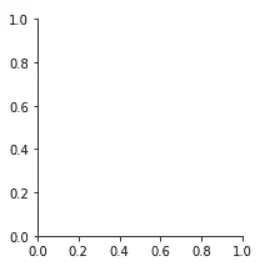
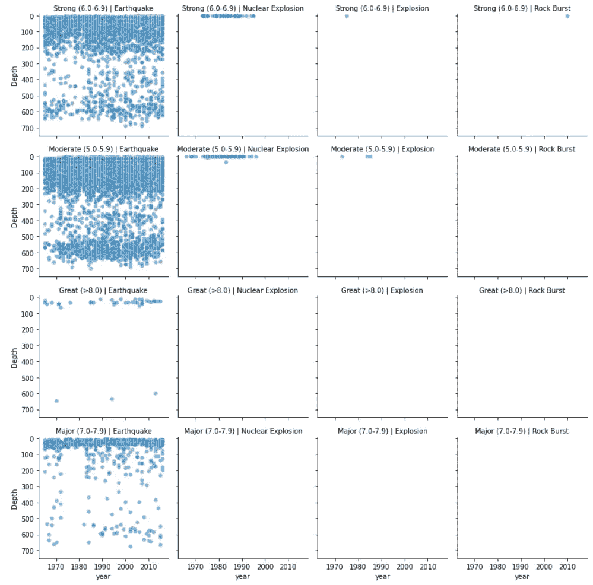
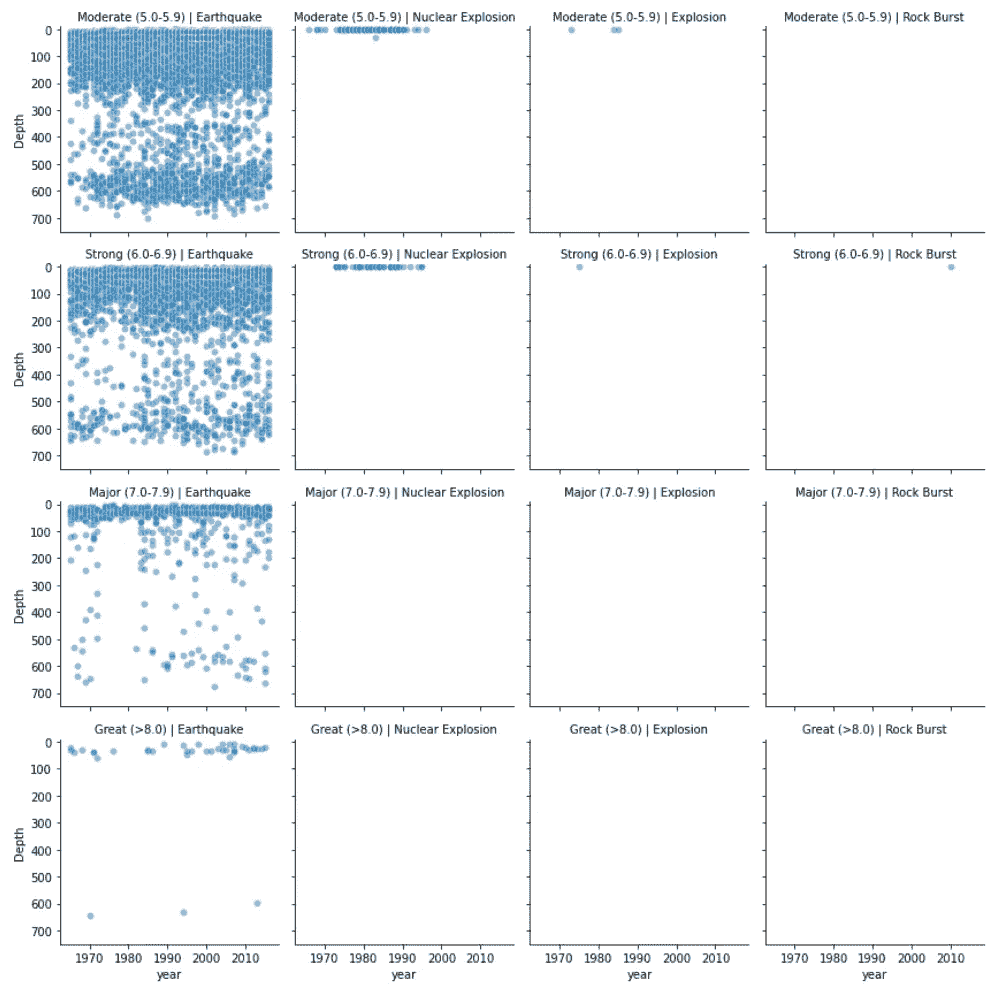

# 使用 Seaborn FacetGrid 快速创建带有支线剧情的人物

> 原文：<https://towardsdatascience.com/use-seaborn-facetgrid-to-quickly-create-figures-with-subplots-6fd72dc90b5d>

## 通过使用 Seaborn 的 FacetGrid(一个使用地震数据的例子)增强您的探索性数据分析过程


丹尼尔·塞勒在 [Unsplash](https://unsplash.com?utm_source=medium&utm_medium=referral) 上拍摄的照片

数据可视化是任何数据分析或机器学习工作流的重要组成部分。它让我们对数据有了更深入的了解，正如那句名言所说，“一张图片胜过千言万语”。

当在 [Python](https://www.python.org) 中处理数据可视化时，我们可能希望按照类别或不同的组来分割数据。这是通过使用 Seaborn 的 FacetGrid 函数实现的。这允许我们创建一个网格，在网格上我们可以用最少的代码绘制许多其他类型的图，特别是与使用 matplotlib 相比。

## 教程的数据源

本教程使用的数据可以在 CC0: Public Domain 下使用，并且来自 Kaggle。这是一个数据集，包含 1965 年至 2016 年期间世界上震级为 5.5 或更高的最重大地震的数据。

您可以通过以下链接查看原始数据。

[https://www.kaggle.com/datasets/usgs/earthquake-database?select=database.csv](https://www.kaggle.com/datasets/usgs/earthquake-database?select=database.csv)

## 视频教程

我还制作了这个教程的以下视频，你可能会感兴趣。

# 加载和导入库

我们教程的第一步是导入必要的库，它们是 [Pandas](https://pandas.pydata.org) 和 [Seaborn](https://seaborn.pydata.org/index.html) 。

[Pandas](https://pandas.pydata.org) 是一个 [Python](https://www.python.org) 库，用于数据分析、操作，并允许我们从各种数据源加载数据，包括。csv，。xlsx 等。

Seaborn 是一个数据可视化库，它建立在 matplotlib 之上，允许它用几行代码创建非常强大和有洞察力的图形。它为创建更高级的绘图提供了更容易使用的语法。与 [matplotib](https://matplotlib.org/) 相比，默认数字也更具视觉吸引力

```
import seaborn as sns
import pandas as pd
```

# 加载数据

一旦库被导入，我们现在可以开始从 Kaggle 导入地震数据集。这是通过调用`pd.read_csv()`并将文件名传递给括号来完成的。

```
#Significant (Magnitude > 5.5) Earthquake data from 1965 to 2015.
#Licence: CC0 - Public Domain
#[https://www.kaggle.com/datasets/usgs/earthquake-database](https://www.kaggle.com/datasets/usgs/earthquake-database)earthquakes = pd.read_csv('data/kaggle_significant_earthquakes_database.csv')
```

我们可以通过拨打以下电话确认我们的数据已成功加载:

```
earthquakes.info()
```

它返回数据帧的摘要，包括列名、非空计数和数据类型(Dtype)。

```
<class 'pandas.core.frame.DataFrame'>
RangeIndex: 23412 entries, 0 to 23411
Data columns (total 24 columns):
 #   Column                      Non-Null Count  Dtype  
---  ------                      --------------  -----  
 0   Date                        23412 non-null  object 
 1   Time                        23412 non-null  object 
 2   Latitude                    23412 non-null  float64
 3   Longitude                   23412 non-null  float64
 4   Type                        23412 non-null  object 
 5   Depth                       23412 non-null  float64
 6   Depth Error                 4461 non-null   float64
 7   Depth Seismic Stations      7097 non-null   float64
 8   Magnitude                   23412 non-null  float64
 9   Magnitude Type              23409 non-null  object 
 10  Magnitude Error             327 non-null    float64
 11  Magnitude Seismic Stations  2564 non-null   float64
 12  Azimuthal Gap               7299 non-null   float64
 13  Horizontal Distance         1604 non-null   float64
 14  Horizontal Error            1156 non-null   float64
 15  Root Mean Square            17352 non-null  float64
 16  ID                          23412 non-null  object 
 17  Source                      23412 non-null  object 
 18  Location Source             23412 non-null  object 
 19  Magnitude Source            23412 non-null  object 
 20  Status                      23412 non-null  object 
 21  date_parsed                 23412 non-null  object 
 22  year                        23412 non-null  int64  
 23  month                       23412 non-null  int64  
dtypes: float64(12), int64(2), object(10)
memory usage: 4.3+ MB
```

# 数据准备

在继续显示我们的数据之前，我们需要在地震数据集中创建一个额外的列，这将允许我们稍后分割我们的数据。

下面的函数根据震级将地震分为中等(5.0-5.9)、强烈(6.0-6.9)、大(7.0-7.9)和大(> 8.0)。

```
def magnitude_classification(dataframe: pd.DataFrame):
    """
    Classify earthquakes based on magnitude.Parameters
    ----------
    dataframe : pd.DataFrame
        Dataframe containing earthquake dataReturns
    -------
    str
        Returns the classification of the earthquake as a string.
    """
    if dataframe['Magnitude'] >= 5.0 and dataframe['Magnitude'] <= 5.9:
        return 'Moderate (5.0-5.9)'
    elif dataframe['Magnitude'] >= 6.0 and dataframe['Magnitude'] <= 6.9:
        return 'Strong (6.0-6.9)'
    elif dataframe['Magnitude'] >= 7.0 and dataframe['Magnitude'] <= 7.9:
        return 'Major (7.0-7.9)'
    elif dataframe['Magnitude'] >= 8.0:
        return 'Great (>8.0)'
```

创建函数后，我们现在可以使用 [pandas apply](https://pandas.pydata.org/docs/reference/api/pandas.DataFrame.apply.html) 方法在 dataframe 中创建新列，如下所示:

```
earthquakes['Class'] = earthquakes.apply(magnitude_classification, axis=1)
```

当我们查看数据集时，我们现在可以看到 Class 列已经成功添加。


# 使用 Seaborn 创建面网格

创建绘图过程的第一步是创建一个新变量——在本例中是`g`,然后将它赋给`sns.FacetGrid()`。然后我们可以传入地震数据帧并运行代码。

```
g = sns.FacetGrid(earthquakes)
```

这将返回一组没有数据的轴。



从 Seaborn FacetGrid 返回的一组轴没有数据。图片由作者提供。

现在我们有了轴，我们可以开始向它添加数据，方法是使用`.map()`函数将我们选择的图应用到轴上。

```
g = sns.FacetGrid(earthquakes)
g.map(sns.scatterplot, 'year', 'Magnitude', alpha=0.5);
```


映射数据后的 Seaborn FactGrid 轴。图片由作者提供。

## 使用列在 FacetGrid 中创建子情节

我们现在可以开始使用数据集中的一个分类变量创建子图(面)。在这种情况下，我们将使用地震类型(原因),并将 y 轴更改为深度。

为了将剧情分成多个支线剧情(层面),我们在`FacetGrid()`中添加了一个`col`参数，并传入我们想要使用的列的名称。

此外，我们还可以通过调用`g.set()`并传入我们想要更改的参数来控制绘图限制。在这个例子中，我们将设置`ylim` (ylimit)从 750 到-10。像这样把数字反过来，可以让我们反转 y 轴。

```
g = sns.FacetGrid(earthquakes, col='Type')
g.map(sns.scatterplot, 'year', 'Depth', alpha=0.5)
g.set(ylim=(750, -10));
```

当我们运行这段代码时，我们得到了四个子情节(方面)。每种地震类型一个:地震、核爆炸和岩爆。


按地震类型划分的海鸟。图片由作者提供。

从返回的图中可以看出，地震的深度值范围很广，核爆炸、爆炸、岩爆都是比较浅的到达事件。

## 使用列和行在 FacetGrid 中创建子情节

除了能够将我们的可视化拆分成列，我们还可以应用第二个分类变量来进一步将可视化拆分成行。

为了实现这一点，我们添加了一个`row`参数，在本例中，我们将把它分配给我们之前创建的 Class 列。

```
g = sns.FacetGrid(earthquakes, col='Type', row='Class')
g.map(sns.scatterplot, 'year', 'Depth', alpha=0.5)
g.set(ylim=(750, -10));
```

当我们运行这段代码时，我们得到了一个由子 plots(facet)组成的网格。我们有显示地震类型(原因)的列，和显示分类(中等、强烈、主要和大)的行。


Seaborn FacetGrid 在按照地震类型和级别分割数据后。图片由作者提供。

然而，我们可以立即看到，每个情节(方面)的标题是非常混乱，难以阅读。

## 修改 FacetGrid 标题

为了整理每个情节(层面)的标题，我们可以调用`g.set_titles()`，在这个函数中，我们需要调用`col_template`和`row_template`。这两个参数允许我们控制标题。

在本例中，我们将替换:

```
Class = Major(7.0-7.9)|Type = Earthquake
```

随着

```
Major(7.0-7.9)|Earthquake
```

这是通过指定格式化的字符串作为参数来实现的，然而，我们不需要以`f`或者使用`.format`来开始它们，我们只需在{ }括号中传递变量。

在这种情况下，我们将只传入 col_name 和 row_name。

```
g = sns.FacetGrid(earthquakes, col='Type', row='Class')
g.map(sns.scatterplot, 'year', 'Depth', alpha=0.5)
g.set_titles(col_template = '{col_name}', row_template='{row_name}')
g.set(ylim=(750, -10));
```

这将返回下面的图，标题更容易阅读。



使用 set_titles 整理 facet 标题后的 Seaborn FacetGrid。图片由作者提供。

## 更改 FacetGrid 中行的顺序

从图中我们可以看到，第一行显示的是震级范围 6.0-6.9 的数据，下一行是 5.0-5.9 的数据。将这些行按升序排列更有意义，这样第一行是 5.0–5.9，第二行是 6.0–6.9，依此类推。

我们可以通过使用`row_order`参数并按照我们希望的顺序传入分类变量(Class)的值列表来实现这一点。

```
g = sns.FacetGrid(earthquakes, col='Type', row='Class', 
                  row_order=['Moderate (5.0-5.9)',
                             'Strong (6.0-6.9)',  
                             'Major (7.0-7.9)', 
                             'Great (>8.0)'])g.map(sns.scatterplot, 'year', 'Depth', alpha=0.5)
g.set_titles(col_template = '{col_name}', row_template='{row_name}')
g.set(ylim=(750, -10));
```

我们的 FacetGrid 现在看起来更像样了。我们将行按升序排序，标题也清晰易读。



使用 row_order 对行进行排序后，Seaborn FacetGrid。图片由作者提供。

# 在 Seaborn FacetGrid 上显示其他类型的绘图

## 使用 histplot 在 FacetGrid 上显示直方图

在前面的例子中，我们使用了散点图，但是这可以很容易地改变为 Seaborn 提供的任何其他类型的图。

为了调用`sns.histplot`，我们简单地将它传递给`g.map()`函数。

```
g = sns.FacetGrid(earthquakes, col='Type')
g.map(sns.histplot, 'year');
```

这给出了下面的图。


Histplots 映射到 Seaborn FacetGrid。图片由作者提供。

从回报图中，我们可以看到地震计数覆盖了所有年份，这里和那里略有下降。从 1965 年到 1995 年左右发生了 5.5 级以上的核爆炸。

如果我们想改变直方图上显示的条块，我们只需向`bins`参数传递一个值。如果我们有一个较小的数量，那么数据将被分成较小数量的箱。

```
g = sns.FacetGrid(earthquakes, col='Type')
g.map(sns.histplot, 'year', bins=5);
```


在应用较少数量的面元后，Histplots 映射到 Seaborn FacetGrid。图片由作者提供。

## 在面网格上显示箱线图

我们也可以以非常相似的方式显示箱线图，只需像这样将`sns.boxplot`传递给`.map()`函数。

```
g = sns.FacetGrid(earthquakes, col='Type')
g.map(sns.boxplot, 'year');
```


在 Seaborn FacetGrid 上显示的箱线图。图片由作者提供。

在本文中，您可以找到更多关于 Seaborn 中的箱线图的信息:

[](/creating-boxplots-with-the-seaborn-python-library-f0c20f09bd57)  

# 摘要

与 matplotlib 相比，Seaborn 中的 FacetGrid 函数提供了一种非常有用、快速和方便的方法来创建具有多个子情节的图形。通过内置的功能，这些图可以以多种方式进行定制，并制作非常漂亮的图表，以包含在您的演示或报告中。

*感谢阅读。在你走之前，你一定要订阅我的内容，把我的文章放到你的收件箱里。* [***你可以在这里做！***](https://andymcdonaldgeo.medium.com/subscribe)

其次，通过注册会员，你可以获得完整的媒介体验，并支持我自己和成千上万的其他作家。它每个月只花你 5 美元，你可以完全接触到所有令人惊叹的媒体文章，也有机会用你的写作赚钱。如果你用 [***我的链接***](https://andymcdonaldgeo.medium.com/membership)**报名，你会直接用你的一部分费用支持我，不会多花你多少钱。如果你这样做了，非常感谢你的支持！**