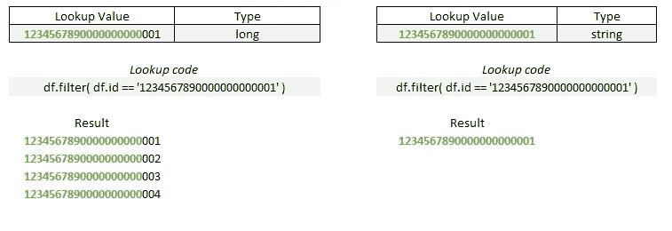

# PySpark 的有用代码片段

> 原文：<https://towardsdatascience.com/useful-code-snippets-for-pyspark-c0e0c00f0269>

## 当您处理大数据时，您需要将这些代码放在手边


照片由[泰勒维克](https://unsplash.com/@tvick?utm_source=unsplash&utm_medium=referral&utm_content=creditCopyText)在 [Unsplash](https://unsplash.com/s/photos/network?utm_source=unsplash&utm_medium=referral&utm_content=creditCopyText) 拍摄

## PySpark

*PySpark* 是我们在 Spark 环境中使用 Python 语言编写分布式计算查询代码时调用的方式。这方面最著名的例子是专有框架 Databricks。

Databricks 是由 Apache Spark 的创造者于 2013 年成立的公司，Apache Spark 是分布式计算背后的技术。它目前正在持续增长，并成为该领域的主要解决方案。

然而，不利的一面是，即使语法是相似的，但它不是相同的，您必须了解代码中的一些特性，否则您将不得不等待很长时间来运行您的代码。

## 初始提示

在我使用 Databricks 的第一年，我学会了一些技巧，我将在下面进行描述，这样您就不会遇到我在运行代码时遇到的同样的性能问题。

> 使用筛选和选择数据启动查询，以缩短数据集的大小

黄金法则:在创建脚本时，您总是希望只过滤和选择您实际使用的变量。这个简单的操作减少了数据的大小，从而转化为更快的脚本。

> 对于大型列表，join 比 isin()更快。

当您有一个数据框、一个值列表，并且您希望只为列表中的那些值过滤 df 时，如果您有一个大于一手值的列表，那么最好使用连接而不是`isin()`。

> groupBy 对于大数据来说是痛苦的

是的，这将是一个与数据集大小成比例的缓慢分组。即使这是一个懒惰的功能——意味着只有当你请求像`display()`或`count()` 或`collect()`这样的动作时，它才会被执行——它仍然需要读取所有的数据，这需要时间。

> 处理发生在内存上。内存越多，交付时间越快。

Spark 最大的优点是处理发生在内存上，而不是磁盘上，因此速度更快。因此，集群的内存越多，速度就越快。

> 尽可能远离环路

远离循环。但是跑大的时候！如果您习惯于在 Python 脚本中执行循环操作，要知道 PySpark 绝对不是运行循环的地方。考虑到数据的大小以及该命令将被拆分到许多节点中，它将永远运行下去。

> 总是按表的分区过滤

数据块中的许多表是由给定的字段划分的。如果你知道是哪一个，使用那个变量作为你的过滤器。

> PySpark 使用驼色表壳

大部分功能将会是`camelCase` | `inThisFormat()`

> 在将大整数转换为字符串之前，不要过滤它们

如果你想过滤一个类型为`long`的变量，你会看到 PySpark 不让你使用使用数字的过滤函数。它将要求你把你的过滤值作为一个字符串(如`df.filter( col(‘x’) == ‘12345678900000000001’)`)。如果变量“x”没有被转换成字符串，您可能会看到多个结果，而不仅仅是一个过滤值，因为 PySpark 会寻找最接近那个大整数的第 19 位的匹配。



过滤“long”类型变量，并将其转换为字符串或不转换为字符串。图片由作者提供。

## 有用的代码片段

这里有一些有用的代码片段，是我在今年使用 Databricks 时收集到的。

## 进口

```
# Basic functions
from pyspark.sql import functions as F# These ones I use the most
from pyspark.sql.functions import col, sum, max, min, countDistinct, datediff, when# To create Loops, use Windows
from pyspark.sql.window import Window# For datetime transformations
from datetime import timedelta, date
```

## 列出、保存、删除命令

```
# List files
%fs ls dbfs:/your mount point address# Save a file to dbfs
df.write.format('parquet').save('address')# Save with Overwrite
df.write.mode('overwrite').csv(path)# SIZE OF A FILE
display( dbutils.fs.ls("file_address") )# Remove (Delete) a file
dbutils.fs.rm('file_address',True)
```

要保存文件并将其导出到你的本地机器上，[阅读这篇文章](https://tinyurl.com/2p8k97n9)。

## 基本命令

```
# Display a table
df.display()
display( df.select('col1') )# SELECT
df.select('col1', 'col2', 'col3')# LIMIT Number of rows
df.limit(n)# FILTER
df.filter( df.col1 == xxx )# COUNT
df.select('col1').count()# COUNT DISTINCT
df.select('col1').distinct().count()# JOIN
df1.join( df2, df1.column == df2.column, 'jointype')
df1.join( df2, on='column', how='inner')# Join Left_anti: 
# It is like df1-df2: selects rows from df1 NOT present in df2
df1.join(df2, on=['key'], how='left_anti')# SORT
df.sort('column', ascending=False)# Show NULL values
display( df.filter(df.col_name.isNull() )# CAST VALUES TO OTHER TYPES
df = df.withColumn("col_name", df.col_name.cast('type'))
```

## 填充 NAs

```
# FILL NAs
df = df.fillna(value)
df = df.fillna(value, subset=['col1', 'col2'])
```

## 价值观在

```
# Value IS IN
df.filter( df.col_name.isin(listed_values) )
```

## 值介于

```
df.filter(col('xx').between("2020-01-01", "2020-01-02") ) 
```

## 日期差异

```
from pyspark.sql.functions import datediff, coldf1.withColumn( "diff_in_days", 
                 datediff(col("col_date1"),
                          col("col_date2")) )
   .show()
```

## 列出列中的值

```
# LIST VALUES
data = [row.col for row in df.select('col').distinct().collect()]
```

## 分组依据和聚集

```
# GROUP BY
df.groupBy('col1').sum()# Aggregate
df.groupBy(['col1', 'col2']).agg({'col1':'sum', 'col2':'mean')# Put a List of grouped values in a single column
df.groupBy('colx').agg(F.collect_list('colA'),  
                       F.collect_list('colB')).show()
```

## 创建新列

使用`withColumn('col_name', operation or condition)`

```
# Create column C as the sum of A + B
df.withColumn( 'C', col('A') + col('B') )
```

创建具有常数值的新列。您可以使用 pyspark 函数中的函数`lit`并在其中添加任何值。

```
# New column with a constant text value
df_1.withColumn( 'new_col', F.lit('text') )

# New column with a constant number value
df_1.withColumn( 'new_col', F.lit(10) )
```

## Spark 数据帧中的转换列表

```
# Import Row
from pyspark.sql import Row# Create a list
my_list = [1,2,3,4]# Parallelize abuse cards list
rdd1 = sc.parallelize(my_list)
row_rdd = rdd1.map(lambda x: Row(x))
my_df = sqlContext.createDataFrame(row_rdd,['variable_name'])
```

## 何时/否则

```
# Single condition
df.withColumn('my_col', when(col('A').isNull(),'Nothing')\
                        .otherwise('Something')# Multiple conditions
df.withColumn( 'Result', 
               when( (col('A') == 0), 'Zero')
              .when( (col('A') < 0) , 'Negative')
              .when( (col('A') > 0) , 'Positive') 
              .otherwise('NA')  )
```

## 计算列的百分比

```
from pyspark.sql.window import Window

df.withColumn('col_pct', col('col_A')/F.sum('col_A')
  .over(Window.partitionBy()) *100 )
```

## 随机抽样调查

根据数据大小的百分比获取数据的随机样本。在本例中，50%的数据没有替换—一旦选择了数据点，就不能再次选择。

```
df.sample(withReplacement=False, fraction=0.5, seed=None)
```

## 在你走之前

很明显，这只是使用 PySpark 可以完成的一小部分工作。此外，最近推出了 Spark 的熊猫，因此它将变得更好。

我知道这些代码片段每天都给我很大帮助，因此我相信它也会帮助你。

别忘了跟着我。

<https://gustavorsantos.medium.com/>  

或者使用我的[推荐代码](https://gustavorsantos.medium.com/membership)订阅 Medium。