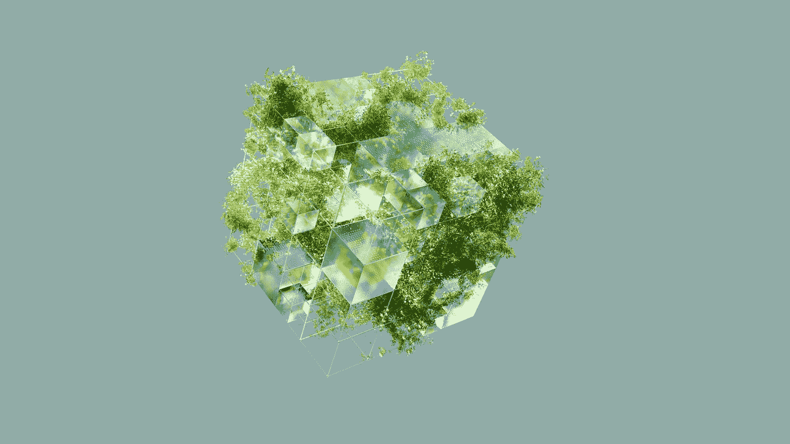
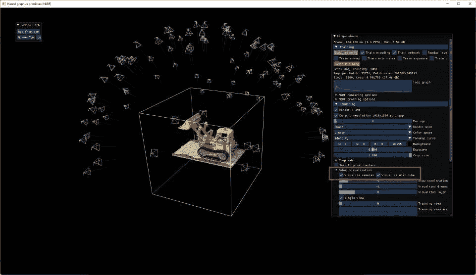
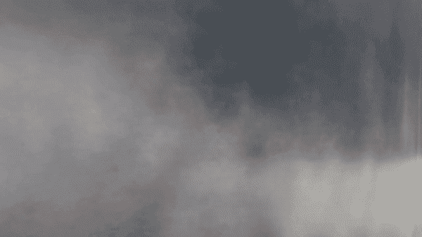
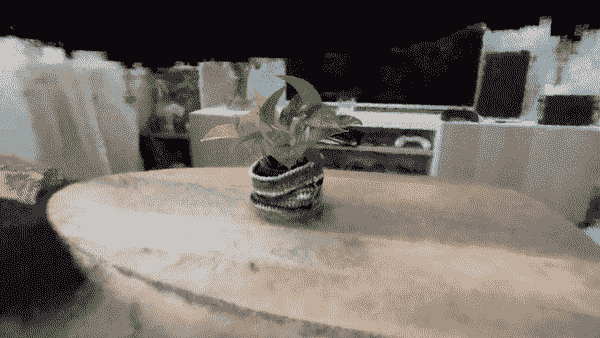
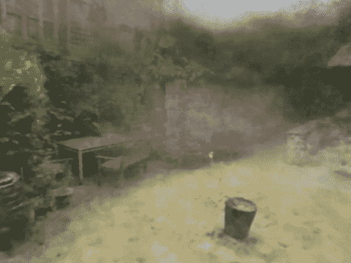

# 用 AI 生成 3D 模型，快！

> 原文：<https://towardsdatascience.com/using-ai-to-generate-3d-models-2634398c0799>

## AR/VR/3D

## 如何使用 NVIDIA 的 NeRF 代码创建 3D 模型

照片由 [DeepMind](https://unsplash.com/@deepmind?utm_source=medium&utm_medium=referral) 在 [Unsplash](https://unsplash.com?utm_source=medium&utm_medium=referral) 上拍摄

生成 3D 模型可能非常耗时，或者需要大量的参考图像。解决这个问题的一种方法是神经辐射场(NeRF)，这是一种生成图像的人工智能方法。NeRFs 利用你对一个物体或场景拍摄的一小组 2D 图像，并使用它们(有效地)构建一个 3D 表示。这是通过学习在你已经拥有的图像之间转换来完成的。这种跳跃(或插值，这是一个稍微有点花哨的术语)让你产生物体的新的视角的图像！

听起来很棒，对吧？从一小组图像中，您可以制作一个 3D 模型！这比标准摄影测量有好处，标准摄影测量需要一个巨大的图像库来生成一些东西(你需要每个角度的镜头)。然而，我们在一开始就承诺 NeRFs 很快，直到最近，情况并非如此。以前，NeRFs 花了很长时间来学习如何将你的一组图像转换成 3D 图像。

现在情况不再是这样了。Nvidia 发布了其 instant [NeRF 软件](https://nvlabs.github.io/instant-ngp/assets/mueller2022instant.pdf)，该软件利用 GPU 硬件来运行必要的复杂计算。这将创建模型所需的时间从几天减少到了几秒钟！NVIDIA 对`instant-ngp`软件的可用性和速度做了很多令人兴奋的声明。他们提供的结果和例子令人印象深刻:

NVIDIA 建造了一个很酷的机器人实验室。Gif 由[https://github.com/NVlabs/instant-ngp](https://github.com/NVlabs/instant-ngp)

我认为很难不对它印象深刻——它看起来棒极了！我想看看把它转移到我自己的图像上并生成我自己的 NeRF 模型有多容易。所以我决定自己安装使用这个软件。在这篇文章中，我将通过我的尝试，并详细介绍我所做的模型！我们走吧！

# 管道

那我们该怎么办？

*   我们需要参考录像。我们去录些我们想 3D 化的东西吧！
*   我们将把它转换成静态图像。这个过程也试图理解我们记录的角度。
*   我们将它传递给`instant-ngp`。然后，这将训练人工智能理解我们生成的图像之间的空间。这实际上与制作 3D 模型是一样的。
*   最后，我们要制作一个我们创作的视频！在 NVIDIA 制作的软件内部，我们将为摄像机绘制一条路径，以便在模型周围拍摄，然后渲染视频。

我不会深入了解这一切是如何工作的(尽管可以随意提问！)，但我会放上很多我觉得有用的资源的链接。相反，我会专注于我制作的视频，以及旅途中偶然发现的小部分。

# 我的尝试(又名邋遢的 Nerf Herding)

我不会说谎，我发现这很难安装。虽然说明很清楚，但我觉得当涉及到您需要的特定软件版本时，没有回购协议的要求部分所暗示的那么大的回旋余地。使用`CUDA 11.7`或 VS2022 对我来说似乎是不可能的，但我认为是切换回`11.6`和 VS2019 帮助安装过程向前推进。我有很多错误，比如:`CUDA_ARCHITECTURES is empty for target.`这是由于 CUDA 不想很好地使用 Visual Studio 造成的。我真的推荐[这个](https://github.com/bycloudai/instant-ngp-Windows) [视频](https://www.youtube.com/watch?v=kq9xlvz73Rg)和这个[回购](https://github.com/bycloudai/instant-ngp-Windows)进一步帮助设置一切！

除此之外，这个过程很顺利。Python 脚本有助于指导将您拍摄的视频转换为图像，以及随后将其转换为模型和视频的步骤。

## **尝试 1** :乐高汽车

最初，我试图在办公室里改装一辆小型乐高汽车。我认为我的摄影技术有所欠缺，因为我根本无法创作出任何有意义的东西。只是一个奇怪的 3D 污迹。为什么呢？好吧，让我们看看英伟达给我们提供的一个例子。注意摄像机的位置:

NVIDIA 提供的默认 NeRF 的“摄像机”位置，挖掘机。照片由[https://github.com/NVlabs/instant-ngp](https://github.com/NVlabs/instant-ngp)拍摄

训练良好的设置的一个特点是像上面那样放置“摄像机”。这些摄像头是软件认为你拍摄视频时面对的角度。它应该是一个漂亮的圆圈。我的第一辆乐高汽车完全不是这样的，而是一个压扁的半圆。

## **尝试二:乐高车(不过这次更大！)**

试图从我的第一次尝试中吸取教训，我找到了一张可以完全走动的桌子，并找到了一辆更大的乐高汽车。我试着确保我比以前拍得更久。最后，我从各个角度拍摄了 1 分钟的流畅镜头。我训练模型不到 30 秒。经过 4 个小时 720p 的渲染，这是我做的视频:

我的第二辆 NeRF——乐高技术车！

## **尝试三:植物**

好吧，所以第二次尝试更好，至少技术上可行。然而，有一个奇怪的雾，它不是超级尖锐的。对于我的下一次尝试，我也试图从更远的后面拍摄(我假设雾是由 AI 对那里的东西“困惑”引起的)。我试着更多地控制`aabc_scale`(一种测量场景大小的方法)，然后训练了几分钟。渲染后，视频看起来是这样的:

我在客厅的桌子上用一株植物做了一个 NeRF。

好多了！这里令人难以置信的是，它是如何设法精确地呈现钩针花盆和木材上的凹槽，以及错综复杂的树叶。看看相机在树叶间的小俯冲！

**尝试四**:所以，我们越来越好了！不过，我想要一个外面的——让我们试试吧。我在公寓外拍摄了不到两分钟的镜头，并开始处理。这是特别厚的渲染/训练。我的猜测是，我的值`aabc_scale`相当高(8)，因此渲染“光线”必须走得相当远(也就是说，我想要渲染的东西更多)。我不得不切换到 480p，并将渲染 fps 从 30 降低到 10。这表明你选择的设置确实会影响你的渲染时间。经过 8 个小时的渲染，我做出了这个:

我在公寓外面做的一个 NeRF。

我认为尝试 3 仍然是我的最爱。我想我可以把第四次尝试做得更好。然而，当渲染时间如此之长时，迭代版本和尝试不同的渲染和训练设置是很困难的。现在甚至为渲染设置摄像机角度都很困难，导致程序对我来说变得迟钝。

尽管如此，多么惊人的输出，从短短一两分钟的视频，我有一个详细的，栩栩如生的 3D 模型！

# 利弊

我认为最令人印象深刻的是，给定 1-2 分钟的镜头，一个完全没有受过摄影测量(me)训练的人可以创建一个可行的 3D 模型。这需要一些技术知识，但是一旦你安装好了所有的东西，它就会变得非常光滑和简单。将视频转换成图像效果很好，有 Python 脚本可以做到这一点。一旦这些都做好了，输入到人工智能就顺利了。

然而，这很难指责 NVIDIA，但我觉得我应该提出来:这需要一个相当强大的 GPU。我的笔记本电脑里有一台 T500，它将它推到了绝对的极限。训练时间确实比宣传的 5 秒长，尝试在 1080 渲染会导致程序崩溃(我是在 135*74 附近动态渲染下来的)。现在，这仍然是一个巨大的进步，以前的 NeRF 实现需要几天时间。我不认为每个人都有 3090 用于这样的项目，所以有必要简单提一下。低性能使它很难使用程序，特别是当我试图“飞”着相机来设置我的渲染视频时。尽管如此，还是很难不对这个过程的输出留下深刻的印象。

我面临的另一个问题是寻找`render.py`(正如你可能猜到的，这对于渲染视频至关重要)。非常奇怪的是，它不在回购协议中，尽管在大多数广告文章和其他文件中被大量提及。我不得不把它从[这里](https://github.com/bycloudai/instant-ngp-Windows)挖出来。

最后，我也希望能够提取这些作为一个`.obj`——也许这已经是可能的了？

一张狐狸的 gif 图——这不是我做的，是英伟达做的。干得好，嗯？https://github.com/NVlabs/instant-ngp[gif](https://github.com/NVlabs/instant-ngp)

## 最后的想法和下一步

这让我想到的是 [DALL-E](https://huggingface.co/spaces/dalle-mini/dalle-mini) ，生成图像的 AI。这已经变得难以置信的流行，部分是因为它是如此容易获得。它给了人们一个非常酷的例子，展示了人工智能模型可以做什么，以及它们的局限性。它已经进入了流行文化(或者至少在我的 Twitter 上占据了重要位置)，人们制作自己的怪异 DALL-E 图像并分享它们。我可以想象这种技术也会发生类似的事情。一个可以让任何人上传视频并创建一个你可以与朋友分享的 3D 模型的网站的病毒潜力是巨大的。最终有人做出这个几乎是必然的。

就我个人而言，我期待着更多的尝试。我希望能够生成超级逼真的模型，然后将其转储到 AR/VR 中。从那里你可以在那个空间主持会议——那不是很有趣吗？因为你只需要手机上的摄像头，所以大部分需要的硬件已经在用户手中了。

总的来说，我真的很感动。能够在手机上拍摄 1 分钟的视频，并将其转化为一个你可以一步一步走过的模型，这太棒了。是的，渲染需要一段时间，安装有点困难，但是效果很好。经过几次尝试，我已经得到了非常酷的输出！我期待更多的尝试！

安德鲁·布朗斯

请在 Medium 上订阅我，以跟踪任何令人兴奋的未来文章！也可以在这里联系: [LinkedIn](https://www.linkedin.com/in/andrew-blance/) | [Twitter](https://twitter.com/andrewblance)

# 参考

*   英伟达 Git:[https://github.com/NVlabs/instant-ngp](https://github.com/NVlabs/instant-ngp)
*   NVIDIA 博客:[https://developer . NVIDIA . com/blog/getting-started-with-NVIDIA-instant-nerfs/](https://developer.nvidia.com/blog/getting-started-with-nvidia-instant-nerfs/)
*   补充 Git:[https://github.com/bycloudai/instant-ngp-Windows](https://github.com/bycloudai/instant-ngp-Windows)