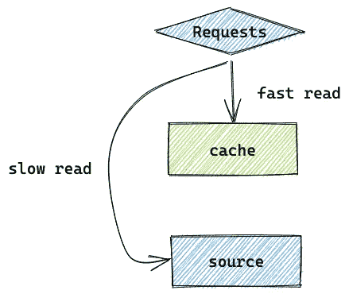
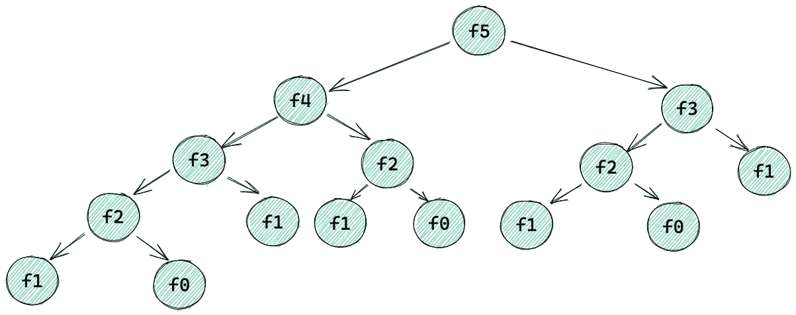
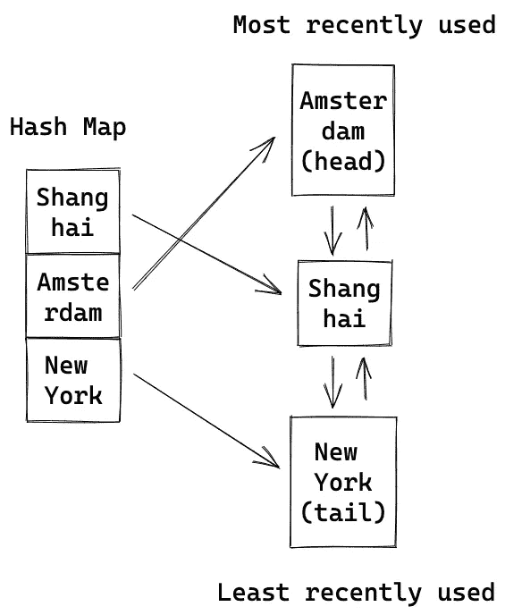
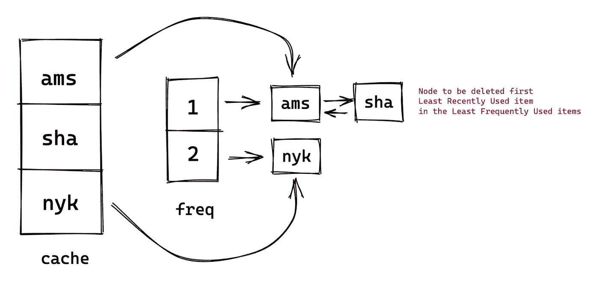
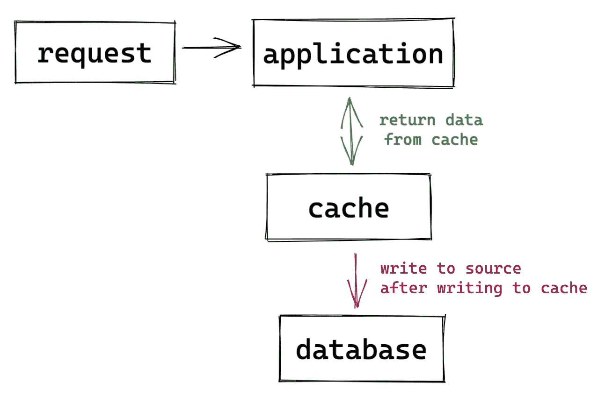
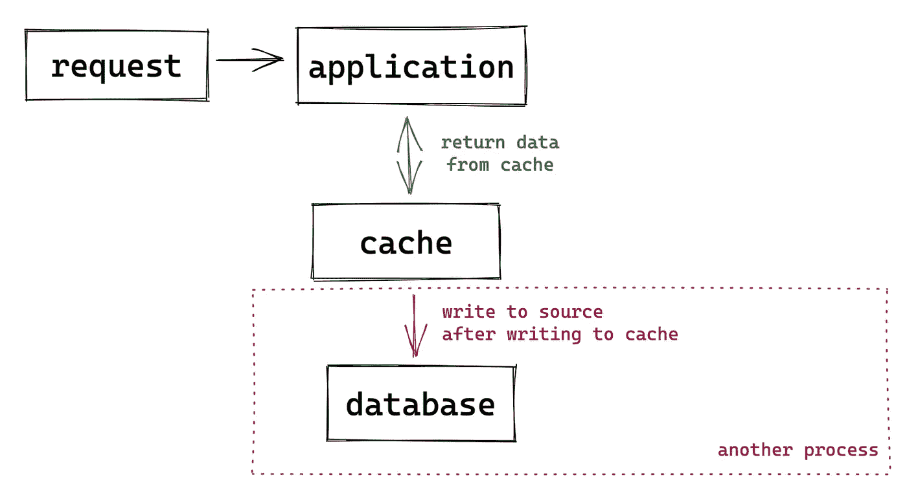
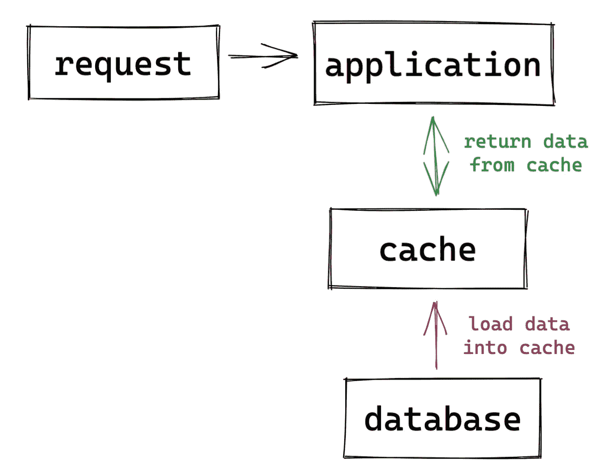

# 使用缓存加速 Python 代码

> 原文：<https://towardsdatascience.com/using-caching-to-speed-up-your-python-code-871e9c08aefd>

## 在 Python 中实现各种缓存策略


照片由[维里·伊万诺娃](https://unsplash.com/@veri_ivanova)在 [Unsplash](https://unsplash.com/) 上拍摄

在上一篇文章中，我谈到了[如何找出我的 Python 代码](/how-to-find-out-the-bottleneck-of-my-python-code-46383d8ef9f)的瓶颈。其中一个要点是分析程序并找到需要很长时间的代码段。作为后续，在本文中，我想介绍一种流行的架构模式来打破瓶颈并加速您的 Python 代码——缓存。除了讲述理论，我还将解释 Python 中的一些内置缓存解决方案，以及如何使用 Python 来实现流行的缓存策略(如 LRU、LFU 等)。

## 什么是缓存？

缓存是一个通用术语，用于将一些数据临时存储在一个比从源(数据库、文件系统、服务等)读取数据更快的地方。存储层*缓存*要么是源的子集，要么是一些繁重计算的预计算结果。缓存中的数据通常存储在快速访问硬件中，如 RAM 和内存引擎。因此，缓存允许您提高系统的整体吞吐量，因为单位时间内可以处理更多的读取请求。



缓存(由[高](https://medium.com/u/2adc5a07e772?source=post_page-----871e9c08aefd--------------------------------)创建)

## 我们什么时候需要缓存？

当涉及到性能问题时，我们通常会将问题归结为 CPU 限制或 I/O 限制。缓存在这两种情况下都很有用。

**存储先前计算的数据**

加速 CPU 受限程序的一个例子是缓存先前计算的结果以避免重复计算。我们可以用递归的方法用它来解决斐波那契问题。这是递归树。



斐波那契递归树(由[高](https://medium.com/u/2adc5a07e772?source=post_page-----871e9c08aefd--------------------------------)创建)

基本算法要求您编写一个递归函数，根据需要多次调用自己。以这个图为例，计算`f5`，函数要调用自己 15 次，其中`f1`节点 5 次，`f0`节点 3 次，`f2`节点 3 次，等等。所需时间呈指数增长，因为该函数反复计算许多相同的子问题。

一种使算法更有效的技术叫做记忆化。记忆通过将先前计算的结果存储在高速缓存中来加速算法。因此，该函数只需要查找节点的结果，而无需再次运行计算。如果你对斐波那契问题感兴趣，可以用 Real Python 查看这篇文章。

[](https://realpython.com/fibonacci-sequence-python/#generating-the-fibonacci-sequence-recursively-in-python) [## 斐波纳契数列的 Python 指南-真正的 Python

### 让我们开始吧！列奥纳多·斐波那契是一位意大利数学家，他能够很快给出这个问题的答案…

realpython.com](https://realpython.com/fibonacci-sequence-python/#generating-the-fibonacci-sequence-recursively-in-python) 

**存储最常请求的数据**

许多存储层，如数据库和文件系统，由于它们的低 IOPS(每秒输入/输出操作数)，可能是对程序整体性能影响最大的因素。为了加快 I/O 绑定程序的速度，缓存在原始存储位置(数据库、文件系统等)前面创建了一个存储层，以便更快地进行数据检索。缓存可以通过不同的技术层来应用:

*   操作系统—从较低层读取数据比从较高层读取数据要慢。操作系统中的缓存是为了确保最频繁请求的数据位于最高级别。
*   数据库——大多数数据库，如 [MySQL](https://dev.mysql.com/doc/internals/en/caching.html) 都采用内部缓存来保存内存中的热数据或昂贵查询的结果。如果数据已经在缓存中，它就响应数据库请求。这通过降低数据库引擎上的资源利用率极大地提高了性能。尽管它完全由数据库管理，但理解这些机制有助于调试性能问题。
*   应用程序—开发人员可以在由活动驱动的应用程序层中实现自定义缓存解决方案。如果您对数据库中内置的缓存解决方案不满意，您可以根据需要在您的数据库前面再设置一个缓存，用于存储*热* *数据*及其到期日期。
*   Web 缓存—缓存在 web 应用程序中广泛使用。在服务器端和客户端都可以采用各种缓存策略。服务器通常使用 web 代理来保留 web 响应。客户端(例如浏览器)通常缓存图像、HTML 页面、HTTP 会话等 web 资产，以便在所有 web 服务器和设备上提供更好的用户体验。
*   CDN(内容交付网络)—当您的 web 流量分散在不同的地理位置时，将整个基础架构复制到每个新位置的成本很高。CDN 能够将视频和网页等网络内容的缓存副本提供给各地的客户。

## **有哪些缓存**策略**？**

大多数缓存被设计成键值对，其中缓存键是缓存中每个对象的唯一标识符。当请求生成匹配的缓存密钥，并且对象将作为响应返回时，就会发生缓存命中。实现缓存时，我们应该了解一些常见的缓存特征和策略:

**缓存是为读密集型应用而设计的**

现在应该很清楚，缓存是一种快速读取的解决方案。它主要有益于进行大量读取操作的程序。为达到最佳性能，读取操作应具有时间复杂性 **O(1)** 。如果您熟悉基本的数据结构，您应该知道哈希映射——这是 Python 中的字典。字典中给定关键字的值可能被最新的设置操作覆盖，该操作的时间复杂度也是 O(1)。

```
cache = {}
cache["user1"] = "res1"
```

然而，这种实现方式存在一些问题。在最坏的情况下(虽然非常罕见)，密钥冲突问题将导致读取操作的 [O(n)时间复杂度](https://wiki.python.org/moin/TimeComplexity)。另一个问题是，您不能将*所有的*都放在内存缓存中，因为它最终会爆炸内存，所以您应该决定缓存应该存储什么。

**根据内容的创建时间存储内容**

控制缓存大小的一种方法是拥有一种自动清理机制。将新的键值对插入缓存时，会为该键分配一个 TTL(生存时间)值。它是一个整数值，指定密钥到期前的秒数。换句话说，该对将在 TTL 秒后被删除，以保持缓存在可管理的大小。它避免了用太多过时的数据来扰乱缓存。

根据对象的时间敏感性选择合适的 TTL。一般来说，对于不常变化的数据或客户端对陈旧数据更宽容的数据，会设置较高的 TTL。对于对时间敏感的数据，如股票市场和天气，通过强制缓存更频繁地重新验证内容，可以设置较低的 TTL。

要用 TTL 创建缓存，我们可以安装软件包`cachetools`。在本例中，缓存存储从 [OpenWeatherMap](https://openweathermap.org/) 中检索到的天气数据，每 10 分钟刷新一次。

TTL 缓存示例

在后台，第一个函数调用 API 并将响应存储在缓存中，TTL 设置为 10 分钟。因此，第二个函数花费的时间要少得多，因为它直接从缓存中检索数据。第三个函数是在密钥已经过期时执行的，所以它再次调用 API 并刷新缓存中的阿姆斯特丹天气数据。

TTL 广泛应用于 CDNs 环境中。它控制网站资源的刷新率，理想地确保客户端不会看到太陈旧的内容，同时提高页面加载速度。TTL 也是一种 DSN 服务器设置，它告诉缓存在从名称服务器再次搜索之前存储 DNS 记录的时间。

**根据访问模式存储内容——LRU&LFU**

除了时间之外，决定何时从缓存中清除对象的另一个重要因素是它的访问模式。当缓存已满时，使用两种常见策略:

*   LRU(最近最少使用)—首先丢弃最近最少使用的项目。它按照使用顺序对项目进行排序。每次访问一个对象时，算法都会将它移动到缓存的顶部。这样，算法可以快速识别哪个项目最长时间没有被访问。
*   LFU(租赁常用)-首先丢弃最不常用的项目。它不是删除最近最少使用的数据，而是驱逐最少使用的数据。它可能会丢弃最近使用过但不像其他数据那样经常使用的数据。

例如，如果您实现了一个缓存来存储浏览器历史，并且您对最近访问过的页面更感兴趣，那么 LRU 缓存就更有用。另一方面，如果你使用缓存来存储浏览器的书签，那么 LFU 更有用，因为用户可以快速打开他们最喜欢的页面。

Python 为 LRU 缓存提供了[内置库](https://docs.python.org/3/library/functools.html)。高速缓存最多保存最近的`maxsize`次呼叫。在本例中，高速缓存的大小为 1。通过查看日志，前 3 个函数实际上调用了 API ,因为它们都请求来自前一个函数的不同数据。只有最后一个函数利用了缓存，因为它与前一个函数检索相同的对象。

lru 缓存的示例

接下来，让我们看看 LRU 缓存的实现，以理解为什么它是如此受欢迎的缓存策略。作为一个缓存，它必须是时间高效的，即所有操作的时间复杂度应为 O(1)。

哈希映射是一种存储键值对的良好数据结构，具有较低的时间复杂度。在 LRU 缓存中，我们需要另一种数据结构来维护**的使用顺序**。整个过程包括以下步骤:

*   在哈希表中查找项目。哈希映射存储对象及其使用顺序。
*   将对象移动到行首，其他对象应该相应地向后移动。值得注意的是，这个机动的时间复杂度应该是 O(1)。您可以在这里暂停一下，想想哪种数据结构最合适。
*   如果该项不在哈希表中，它将被添加到行首。如果缓存已满，我们需要驱逐最近最少使用的项——行尾。时间复杂度也被认为是 O(1)。

哪个数据结构在你的脑海里？数组？LinkedList？数组的一个问题是将一个项目移动或添加到数组的前面需要 O(n)时间。然而，一个单链表只需要 O(1)时间。但是删除尾节点需要 O(n)时间，因为它需要遍历整个 LinkedList。

所以最好的解决方案是使用双向链表。



LRU 缓存示例(由[高](https://medium.com/u/2adc5a07e772?source=post_page-----871e9c08aefd--------------------------------)创建)

哈希映射存储相应的链表节点。将一个节点移动到列表的头部的时间复杂度是 O(1)。因为它是一个双向链表，删除尾部节点也需要 O(1)时间。

这里有一种用 Python 实现 LRU 缓存的方法。

Lru 缓存实现

LFU 的工作方式与 LRU 缓存类似，但它根据数据的使用频率来驱逐数据。如果有多个项目具有相同的频率，它将驱逐最近最少使用的项目。与 LRU 缓存相比，它需要额外的哈希映射来存储频率信息。关键是频率，值是具有该频率的项目列表，并按访问时间排序。在实现中，我也使用了双向链表。但是这部分可以用 Python 中的 [OrderedDict](https://github.com/python/cpython/blob/3.10/Lib/collections/__init__.py#L78) 来代替，它是使用相同的数据结构实现的。



Lfu 缓存(由[高](https://medium.com/u/2adc5a07e772?source=post_page-----871e9c08aefd--------------------------------)创建)

Lfu cahce 实施

**根据内容的创建时间和访问模式存储内容**

LRU/LFU 缓存的一个问题是，如果数据被反复请求，它将永远不会从源获取更新。为了解决这个问题，我们可以添加 TTL 值。如果请求试图访问过期数据，该函数将从源获取更新并刷新缓存。我们可以通过在`@lru_cache`之上创建一个装饰器来实现这一点。

在最后一个函数中，虽然缓存还没有满，但是函数仍然调用 API，因为数据已经过期。当时间和访问模式都相关时，这种策略很有用。例如，我想设计一个缓存来存储 Twitter 用户最近的推文。LFU 缓存确保只有受欢迎的用户的推文存储在缓存中，TTL 值确保缓存中不包含太陈旧的推文。

## 如何将缓存集成到系统中？

到目前为止，我们已经讨论了缓存的内部设计和回收策略。最终，我们需要将缓存集成到应用程序中。根据应用程序的类型，可以应用一些模式。

**通读**


通读(由[高](https://medium.com/u/2adc5a07e772?source=post_page-----871e9c08aefd--------------------------------)创作)

这是最常用的模式。收到请求时，应用程序会尝试在缓存中查找匹配项。如果找到了数据，它会立即返回数据。否则，它会到底层数据库获取数据，并将其加载到缓存中。

在这种模式中，由于频繁的缓存未命中，初始请求的延迟会很高。

**写通**



直写(由[高](https://medium.com/u/2adc5a07e772?source=post_page-----871e9c08aefd--------------------------------)创作)

直写与填充缓存的顺序相反。每次写入都是先写入缓存，然后再写入源。这意味着缓存总是与源同步。应用程序从不需要从数据源读取数据。

因为缓存与源同步，所以很可能可以在缓存中找到数据。从而导致更好的性能。然而，缺点是包括不经常请求的数据在内的所有数据也存储在高速缓存中，导致高速缓存庞大而昂贵。缓存和源之间的同步是一个同步过程，可能会导致高延迟。

使用直写和通读模式是很常见的。例如，数据首先被写入缓存，并设置一个 TTL 值以保持其相关性和精简性。如果再次请求已删除的数据，它可以使用通读模式从源中检索回来。

**写在**后面



写在后面(由[高](https://medium.com/u/2adc5a07e772?source=post_page-----871e9c08aefd--------------------------------)创作)

这类似于直写模式。应用程序首先将数据写入缓存。但之后，应用程序会立即返回到主进程。另一个进程将定期运行，以同步缓存和源之间的数据。与直写不同，缓存和源之间的备份是一个异步过程。

如果我们不想承担每次写入源的高延迟成本，并且同步过程足够可靠，这种方法会更有效。但是，这种模式需要从缓存到源的可靠备份过程，以确保数据不会丢失。

**提前刷新**



提前刷新(由[高](https://medium.com/u/2adc5a07e772?source=post_page-----871e9c08aefd--------------------------------)创作)

在这种模式中，缓存被配置为在数据过期之前自动和异步地从数据源重新加载数据。因此，应用程序将总是从缓存中检索数据。万一出现罕见的缓存未命中，它将从源执行同步读取并刷新缓存。

提前刷新对于大量读取的应用程序很有用。值在高速缓存中保持新鲜，并且避免了从源过度重载的问题。

通常，预刷新和通读是为只读应用程序设计的。提前刷新在低延迟的情况下更有效，但是它需要缓存中的一种机制来决定何时从源加载什么。通读很容易实现，但是我们需要忍受初始请求中的高延迟，因为大多数请求将直接到达源。

对于读/写应用程序，直写和后写都很有用。同样，直写相对容易实施，但由于缓存和源之间的同步备份，会导致高延迟。而后写具有低延迟，但需要确保在将缓存转储到源时不会丢失任何东西。

## 结论

在本文中，我们讨论了一些关于缓存的理论，包括什么是缓存，何时需要缓存，以及不同的缓存策略和模式。我们还看到了 Python 中 TTL 缓存、LRU 缓存和 LFU 缓存的实现。希望你觉得有用。干杯！

## 参考

[](https://aws.amazon.com/caching/) [## 什么是缓存及其工作原理| AWS

### 缓存是一个高速数据存储层，它存储数据的一个子集，通常是短暂的，以便将来…

aws.amazon.com](https://aws.amazon.com/caching/) [](https://kislayverma.com/software-architecture/architecture-patterns-caching-part-1/) [## 架构模式:缓存(第 1 部分)|基斯利·维尔马

### 性能一直是技术系统的关键特征。今天在互联网上，亚秒级的延迟是…

kislayverma.com](https://kislayverma.com/software-architecture/architecture-patterns-caching-part-1/)