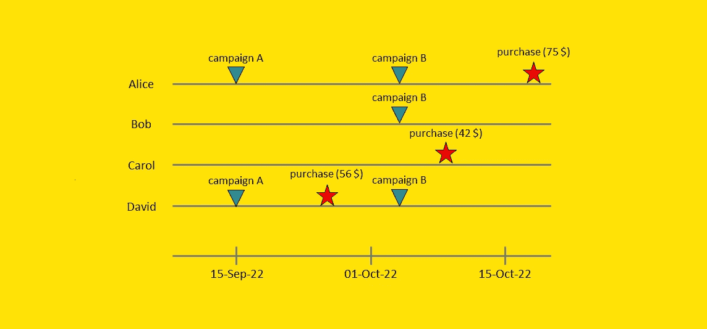
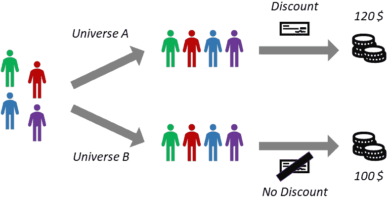
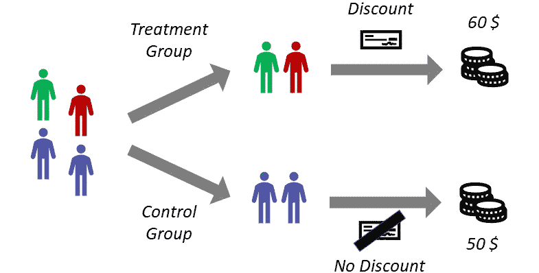
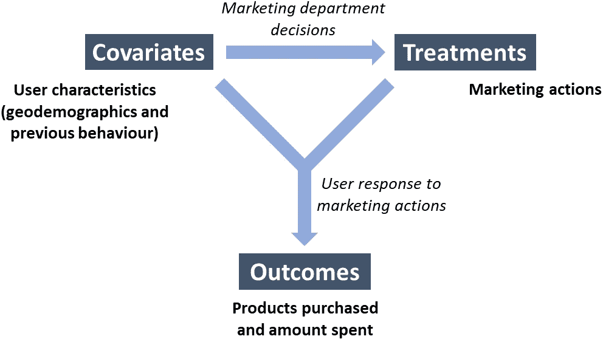
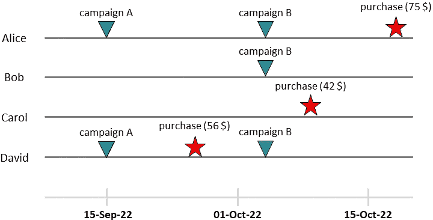
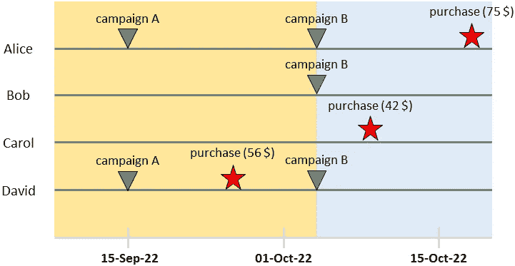
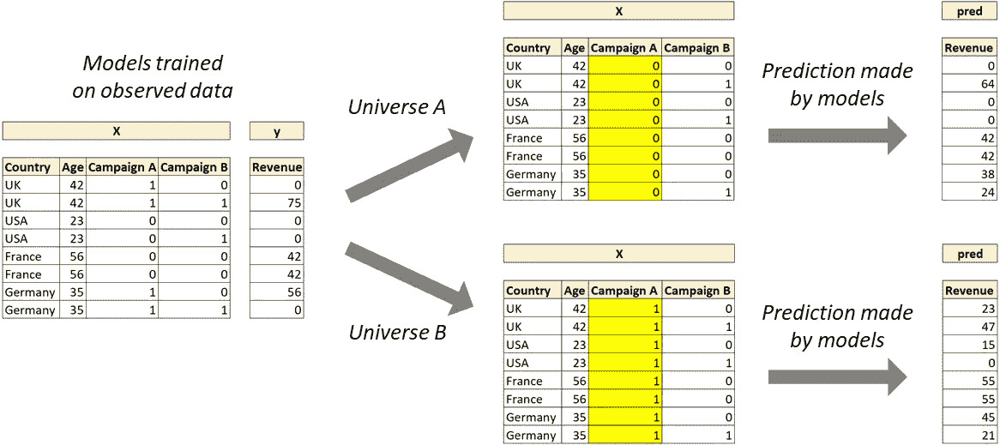

# 使用因果 ML 代替 A/B 测试

> 原文：<https://towardsdatascience.com/using-causal-ml-instead-of-a-b-testing-eeb1067d7fc0>

## 在复杂的环境中，因果 ML 是一个强大的工具，因为它比 A/B 测试更灵活，并且不需要强有力的假设



[图片由作者提供]

反事实问题是商业中最重要的话题之一。我经常听到公司问这种问题。

> “我们做了这个动作。之后，平均用户支出为 100 美元。但是如果我们不采取行动，我们怎么知道他们会花多少钱？”

这些问题通常通过 A/B 测试来解决。然而，A/B 测试有几个要求，其中之一是不能同时运行太多的测试。

但是真正的组织是极其混乱的，不同的过程持续不断地进行着。所以，通常不可能假设，当你运行一个测试时，其他一切都保持不变。

这就是为什么在这篇文章中，我将通过一个不同的工具来解决反事实问题，即因果机器学习。因果 ML 的好处是它更加灵活，最重要的是，当您对所有业务流程几乎没有或完全没有控制时，可以使用它(对于数据科学家来说经常是这样)。

# 框定问题

我们举个简单的例子。假设我们有 4 个用户。我们想知道给他们折扣是否会导致他们在我们的平台上花更多的钱。

这就像要求**观察两个平行的宇宙**。

在一个宇宙中，所有的用户都得到折扣。在另一个世界里，没有一个用户得到折扣。请注意，在我们给(或不给)用户折扣之前，两个世界是完全一样的。

想象一下我们可以实际观察两个宇宙。在下图中，我们可以看到我们的实验结果:



在多元宇宙中测试一个营销行为:在一个宇宙中，所有用户都有折扣。在另一个世界里，他们都没有折扣。[图片由作者提供]

在第一个世界中，用户总共花费了 120 美元，而在第二个世界中，他们总共花费了 100 美元。因此，我们可以得出结论，折扣的效果是使用户平均多花 5 美元(即 120 美元减去 100 美元除以 4 个用户)。

太好了，折扣有效！

# 从平行宇宙到 A/B 测试

不幸的是，在实践中，我们没有特权同时观察不同的宇宙。所以，我们必须找到不同的方法。这种方式由 A/B 测试提供。

A/B 测试是在我们的单一宇宙中产生不同宇宙的聪明绝招。在 A/B 测试中，我们将用户分成两组:一组称为治疗组，另一组称为对照组。然后我们只给治疗组打折。

假设两组足够“相似”，两组互不影响，这就很像观察两个不同的宇宙。



A/B 测试，也就是在一个宇宙中测试一个营销行为。[图片由作者提供]

因此，我们所要做的就是将治疗组中的平均用户支出(30 美元)与对照组中的平均用户支出(25 美元)进行比较，以得出折扣具有使用户平均多支出 5 美元(30 美元减去 25 美元)的效果的结论。

# 那么，A/B 测试有什么问题呢？

没什么，A/B 测试工作正常。

但是**A/B 测试的要求之一是不要同时运行太多的测试，因为它们会“污染”彼此的结果**。

> 真实的组织非常混乱，真实的过程通常不尊重 A/B 测试所要求的假设。

我在现实公司中看到的情况是，不同的团队对相同的用户做出不同的营销动作。然后，他们让你(数据科学家)评估他们所做的营销活动的有效性。

所以你分析数据，你会发现:

1.  一些团队忘记留出一个控制组；
2.  一些团队保留了一个与治疗组不太相似的对照组；
3.  一些团队保留了一个太小的控制组；
4.  不同的团队向相同的用户发送了相互冲突的营销活动(例如保留活动和追加销售活动)。
5.  一些团队向属于另一个团队的控制组的用户发送营销活动。

怎样才能处理好这种乱七八糟的过程，却保持扎实的统计基础？

# 因果 ML 来拯救

因果推理提供了一个非常适合我们情况的框架。

我们有一组协变量，这意味着一组关于我们用户的信息。营销团队根据这些信息做出决策。这些决定采取营销行动的形式(又称治疗)。例如，他们可能决定向过去 3 个月没有购买的用户发送折扣。

协变量和处理的组合产生结果，这是我们感兴趣的 KPI。在这种情况下，这可能是用户的消费。

让我们用图表概括一下这个过程:



因果图。[图片由作者提供]

为了使事情更具体一点，让我们想象一个小数据集。数据集将由 3 个表组成，每个表代表一个因果要素。协变量可以在用户表中找到。治疗或行动可以在活动表中找到。结果可以在购买表中找到。


玩具数据集。[图片由作者提供]

我们可以在时间轴上以图形方式显示每个用户的旅程:



每个用户的客户之旅。[图片由作者提供]

让我们带上爱丽丝。她在 9 月 15 日成为 A 阵营的目标，在 10 月 4 日成为 B 阵营的目标。然后她在 10 月 18 日买了一件东西(她花了 75 美元)。

现在，我们如何知道购买是由于活动 A，活动 B，还是两者的结合？但最重要的是，如果我们不给她发送任何广告，我们怎么知道她是否会购买呢？

为了解决这个问题，我们需要做一个机器学习中常用的简化。我们需要选择一个时间点(姑且称之为分界点)，并假设在那个时刻之前发生的一切(行动)导致了在那个时刻之后发生的一切(结果)。


预测模型的时间维度。[图片由作者提供]

既然我们同意了这一点，我们就必须决定两个时期应该有多长。这在很大程度上取决于业务，并且可以进行调整(例如，根据离截止点的距离对事件进行不同的加权)。

为了简单起见，我们假设行动期(图中的黄色带)和结果期(蓝色带)都必须是一个月。

通过这种方法，我们可以回到我们的数据。我们知道活动 A 是在 9 月 15 日发出的。因此，我们可以把这一天作为所有用户的截止点。


黄色背景:观察动作。蓝色背景:观察结果。[图片由作者提供]

请注意，当我们观察结果(蓝色背景)时，我们会简单地忽略这些行为。在这种情况下，最重要的是结果。

我们可以重复这一过程，将活动 B 的发送日期作为截止点。在这种情况下，我们将拥有以下内容:



黄色背景:观察动作。蓝色背景:观察结果。[图片由作者提供]

将协变量、治疗和结果放在一起，我们以下列形式重新排列我们的初始数据:


数据准备后的数据集。[图片由作者提供]

所以现在我们有了一组由协变量和治疗组成的独立变量(矩阵 *X* )和一个包含结果的目标变量(向量 *y* )。

有了这两种成分，我们现在能够训练任何机器学习模型。

注意**模型不仅可以学习处理和目标变量之间的关系(如在 A/B 测试中发生的那样)，还可以学习处理和协变量之间的关系**。例如，它可能了解到法国用户对活动 A 更敏感，而德国用户对活动 b 更敏感。

到目前为止，我们一直把这个问题作为一个典型的机器学习问题来处理，但是你可能会反对我们在这种情况下没有任何东西可以预测。那么，我们当初为什么要用 ML 呢？

# 工作中的因果 ML

我们最初的目的是回答如下问题:

> 如果我们不向任何用户发送活动，会发生什么情况？如果我们将活动发送给所有用户，会发生什么？

因果 ML 允许我们回答反事实的问题。或者——如果你想用更高调的话——因果 ML 允许模拟不同的宇宙。

例如，假设我们想要模拟两个场景:

*   宇宙 A:如果我们不向任何用户发送活动，会发生什么？
*   宇宙 B:如果我们把活动发送给所有用户，会发生什么？

模拟这些情况意味着改变预测矩阵中治疗变量的值。我想强调这一点，因为它非常重要:**我们只能改变治疗变量，不能改变协变量**。

从图形上看，



使用因果 ML 模拟不同的场景。[图片由作者提供]

你看到这种方法有多灵活了吗？我们可以在我们感兴趣的任何用户子集上模拟几乎任何场景。

此时，您可能会有一个问题:我们如何对训练模型的相同数据进行预测？不就是机器学习的第一个*别*吗？

将数据集拆分成多个部分并为每个数据集训练不同的模型就足够了，就像交叉验证一样:

```
import pandas as pd
from sklearn.model_selection import KFold
from lightgbm import LGBMRegressor

# initialize the number of folds and a dictionary to store the folds
n_folds = 5
folds = {fold: dict() for fold in range(n_folds)}

# for each fold...
for fold, (ix_train, ix_test) in enumerate(KFold(n_splits=n_folds).split(X=X)):

  # ... store test index and trained model
  folds[fold]["ix_test"] = ix_test
  folds[fold]["model"] = LGBMRegressor().fit(
    X=X.loc[ix_train, :], 
    y=y.loc[ix_train]
  )
```

现在我们有了一个为每个褶皱进行样本外训练的模型。在这一点上，我们可以使用这些模型来预测在两个宇宙中会发生什么:

```
# make counterfactual datasets for campaign A
X_zeros = X.replace({"campaign_A": {1: 0}}) # universe A: nobody gets the discount
X_ones = X.replace({"campaign_A": {0: 1}}) # universe B: everybody gets the discount

pred_zeros = pd.Series(index = X.index)
pred_ones = pd.Series(index = X.index)

# for each fold, use model to make predictions on test individuals and store them
for fold in folds.keys():

  ix_test = folds[fold]["ix_test"]
  model = folds[fold]["model"]

  pred_zeros.loc[ix_test] = model.predict(X_zeros.loc[ix_test, :])
  pred_ones.loc[ix_test] = model.predict(X_ones.loc[ix_test, :])
```

`pred_ones`回答问题“如果我们向所有用户发送活动 A，而其他一切保持不变，会发生什么？”

`pred_zeros`回答问题“如果我们不将活动 A 发送给任何用户，其他一切保持不变，会发生什么？”

现在我们已经有了`pred_zeros`和`pred_ones` **，我们可以计算出关于活动 A** 的几乎所有我们想要的东西:特定亚组中的平均治疗效果，中值治疗效果，或者我们可能感兴趣的任何其他度量。

例如，平均治疗效果可计算如下:

```
ate = (pred_ones - pred_zeros).mean()
```

请注意，我们在上面看到的相同逻辑可以应用于二进制响应变量(例如，用户是否购买，是或否？).在这种情况下，你应该记得校准模型，以确保你能够预测实际的概率。

# 总结

真实的组织是复杂的，许多不同的过程不断地涉及到用户。在这种情况下，不一定满足 A/B 测试所依赖的要求。

在这种情况下，因果 ML 可以用来回答反事实问题。因果 ML 有许多优点:它是灵活的，它是不可知的，它允许模拟几乎任何场景。


*感谢您的阅读！我希望你喜欢这篇文章。如果你愿意，* [*在 Linkedin 上加我*](https://www.linkedin.com/in/samuelemazzanti/) *！*