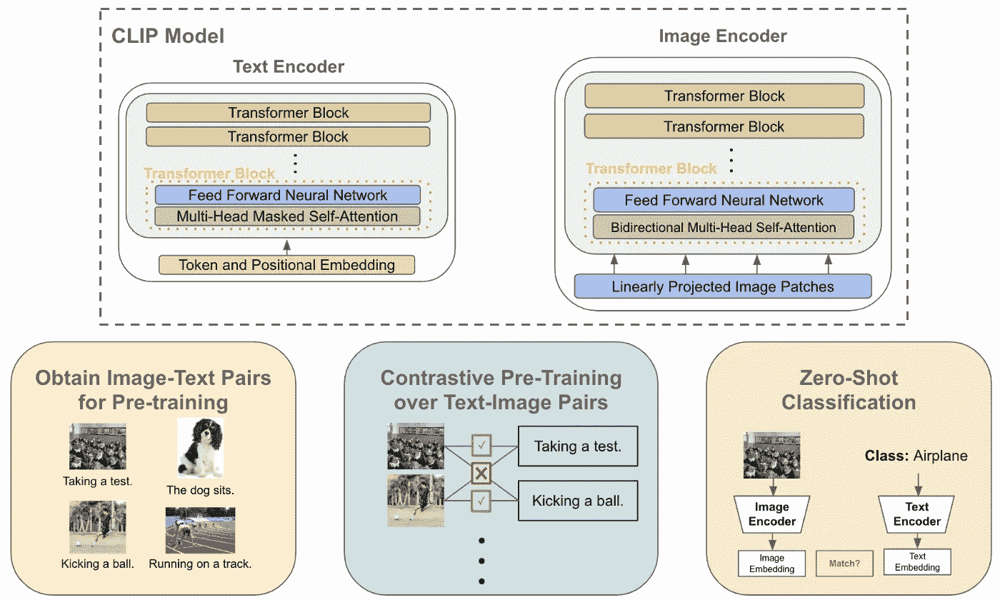
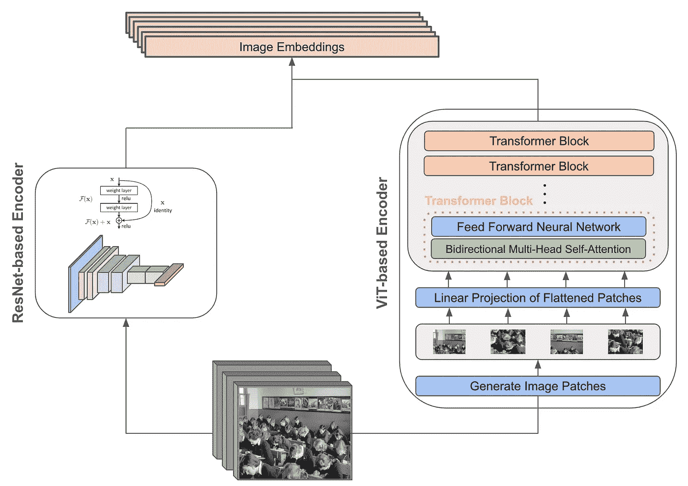
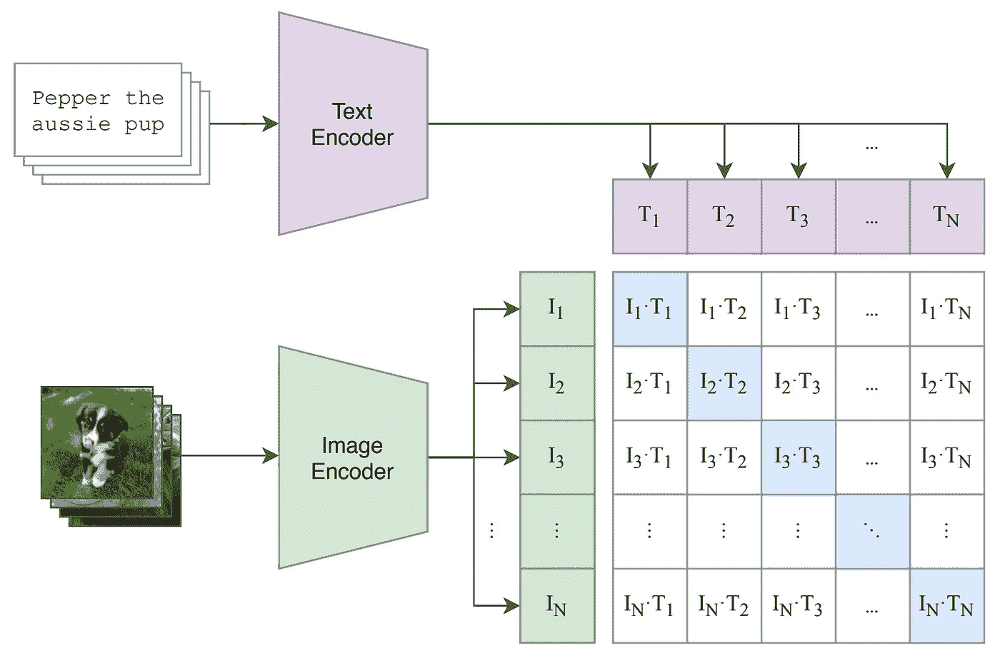
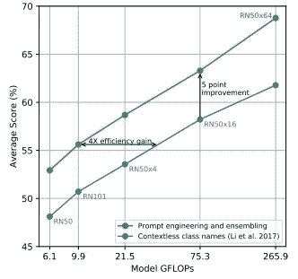
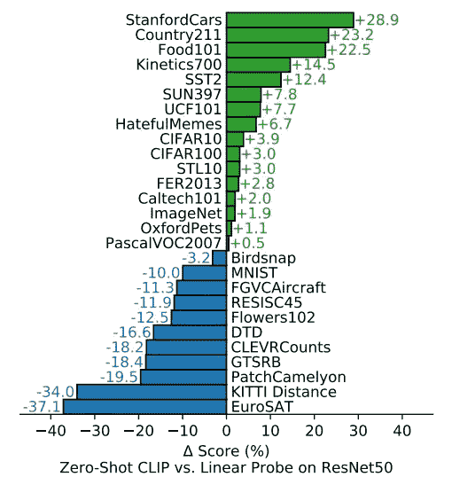
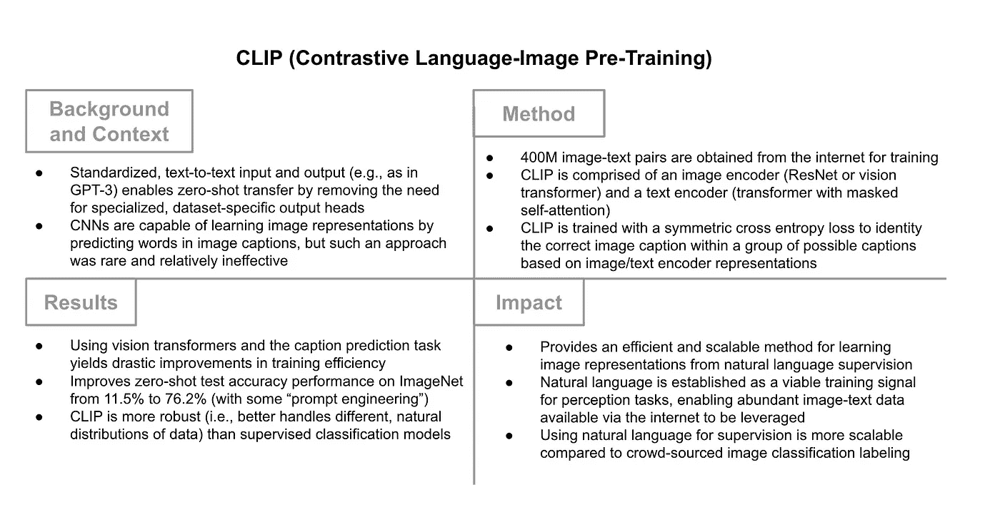

# 使用 CLIP 对无标签图像进行分类

> 原文：<https://towardsdatascience.com/using-clip-to-classify-images-without-any-labels-b255bb7205de>

## 如何在不观察单个标签的情况下在 ImageNet 上实现 76.2%的测试准确度

对比语言图像预训练(剪辑)(由作者创建)

深度图像分类模型通常以监督的方式在大型注释数据集上训练。虽然模型的性能会随着更多的注释数据变得可用而提高，但是用于监督学习的大规模数据集通常很难获得并且成本高昂，需要专家注释者花费大量时间。考虑到这一点，人们可能开始怀疑是否存在更廉价的监管来源。简而言之，*有没有可能从已经公开的数据中学习高质量的图像分类模型？*

OpenAI 提出的对比语言-图像预训练(CLIP)模型[1]——最近因其在 [DALLE-2 模型](https://openai.com/dall-e-2/)中的使用而重新流行起来——以一种积极的方式回答了这个问题。特别是，CLIP 提出了一个简单的预训练任务——选择哪个字幕与哪个图像匹配——允许深度神经网络仅从自然语言(即图像字幕)中学习高质量的图像表示。因为图像-文本对容易在线获得并且通常容易获得，所以人们可以容易地为 CLIP 策划大的预训练数据集，从而最小化训练深度网络所需的标注成本和努力。

除了学习丰富的图像表示，CLIP 还通过在 ImageNet 上实现 76.2%的测试准确度而无需观察单个标签，彻底改变了零镜头图像分类——与之前最先进的零镜头学习框架的 11.5%的测试准确度相比，这是一个重大改进[2]。通过建立自然语言作为图像感知任务的可行训练信号，CLIP 改变了监督学习范式，使神经网络大大减少了对注释数据的依赖。在这篇文章中，我将概述 CLIP 的细节，如何使用它来最小化对传统的一次性监督数据的依赖，以及它对深度学习实践者的影响。

# 剪辑之前是什么？

在了解 CLIP 的细节之前，了解模型的上下文是有帮助的。在本节中，我将概述相关的前期工作，并提供关于 CLIP 的灵感和发展的直觉。也就是说，初步的工作证明了自然语言是图像感知的一个有用的监督来源。但是，由于这些方法相对于替代方法表现不佳(例如，监督培训、监督不力等)。)，在 CLIP 提出之前，通过自然语言的训练仍然不常见。

## 以前的工作

用 CNN 预测图像字幕。先前的工作表明，预测图像字幕允许 CNN 开发有用的图像表示[3]。这种分类是通过将每个图像的标题、描述和标签元数据转换成一个[单词袋](https://en.wikipedia.org/wiki/Bag-of-words_model)向量来执行的，该向量然后可以用作多标签分类任务的目标。有趣的是，以这种方式学习的特征显示出与通过 ImageNet 上的预训练获得的特征的质量相匹配，从而证明图像标题提供了关于每个图像的足够信息来学习区别性表示。

后来的工作扩展了这种方法，以预测与每个图像相关的短语[2]，使零射击转移到其他分类数据集。尽管这种方法产生了差的零镜头性能(即，在 ImageNet 上 11.5%的测试准确度)，但它表明仅使用自然语言就可以产生远远超过随机性能的零镜头图像分类结果，从而充当弱监督零镜头分类的概念的初步证明。

**用变形金刚从文字中形象再现。**同时，包括 VirTex [4]、ICMLM [5]和 ConVIRT [6]在内的几部作品探索了使用[变压器架构从文本数据中学习视觉特征](https://jalammar.github.io/illustrated-transformer/)。在高层次上，这种方法使用变压器的通用训练任务来从相关联的图像标题中学习有用的图像表示。作为这种工作的结果，[掩蔽语言建模](/masked-language-modelling-with-bert-7d49793e5d2c) (MLM)、[语言建模](https://jalammar.github.io/illustrated-gpt2/)和[对比学习](/understanding-contrastive-learning-d5b19fd96607)目标——通常用于训练自然语言处理领域中的转换器——被发现是用于学习高质量图像表示的有用的代理任务。

## 为未来的发现铺平了道路

虽然以前没有方法在大规模数据集上实现令人印象深刻的零射击性能，但这些基础工作提供了有用的教训。也就是说，先前的工作表明 *i)* 自然语言是计算机视觉的有效监督源，并且 *ii)* 通过自然语言监督的零镜头分类是可能的。由于这些发现，进一步的研究工作投入到执行监督来源较弱的零射击分类。这些努力产生了突破性的方法，如 CLIP，它将自然语言监督从罕见的零镜头图像分类方法转变为杰出的方法。

# 深入剪辑

CLIP 架构和培训方法的可视化概述(由作者创建)

简而言之，上图中总结的剪辑模型旨在从相关的图像标题中学习图像中的视觉概念。在本节中，我将概述 CLIP 体系结构、其训练以及如何将生成的模型应用于零镜头分类。

## 模型架构

CLIP 由两个编码器模块组成，分别用于编码文本和图像数据。对于图像编码器，研究了许多不同的模型架构，包括不同大小的五个 resnet[7](即，使用 EfficientNet-style [8]模型缩放规则确定模型尺寸)和三个[视觉转换器](https://theaisummer.com/vision-transformer/)架构【9】。图像编码器的这两个选项如下所示。然而，CLIP 的 vision transformer 变体的训练计算效率提高了 3 倍，使其成为首选的图像编码器架构。

剪辑中图像编码器架构的不同选项(由作者创建)

CLIP 中的文本编码器只是一个仅用于解码器的转换器，这意味着在每一层中都使用了屏蔽自我关注(与双向自我关注相反)。[被屏蔽的自我关注](https://stackoverflow.com/questions/58127059/how-to-understand-masked-multi-head-attention-in-transformer)确保了变压器对序列中每个标记的表示仅依赖于它之前的标记，从而防止任何标记“展望未来”以更好地告知其表示。下面提供了文本编码器架构的基本描述。然而，应该注意的是，这种架构非常类似于大多数先前提出的语言建模架构(例如， [GPT-2](https://jalammar.github.io/illustrated-gpt2/) 或 [OPT](/understanding-the-open-pre-trained-transformers-opt-library-193a29c14a15) )。

剪辑的文本编码器架构(由作者创建)

尽管 CLIP 没有应用于原始出版物中的任何语言建模应用程序，但作者利用掩蔽的自我关注使 CLIP 在未来更容易扩展到此类应用程序。

## 通过自然语言监督进行训练

尽管先前的工作已经表明自然语言是计算机视觉的可行的训练信号，但是用于在成对的图像和文本上训练剪辑的确切的训练任务并不明显。我们应该根据图片标题中的文字对图片进行分类吗？嗯，以前的工作已经尝试过这种方法，效果很好，但不是很好[2，3]。*使用语言建模为每张图片生成标题怎么样？*有趣的是，作者发现预测准确的图像标题太难了，导致模型学习非常缓慢，因为任何图像都有多种不同的描述方式。

CLIP 的理想预训练任务应该是可扩展的，这意味着它允许模型从自然语言监督中有效地学习有用的表示。借鉴[对比表征学习](https://lilianweng.github.io/posts/2021-05-31-contrastive/)中的相关工作，作者发现 CLIP 可以通过一个令人惊讶的简单任务来有效训练——在一组候选字幕中预测正确的关联字幕。下图说明了这样一项任务。

剪辑的图文对比预训练([来源](https://arxiv.org/pdf/2103.00020.pdf)

实际上，这一目标是通过以下方式实现的:

*   通过它们各自的编码器传递一组图像和文本标题
*   最大化真实图像字幕对的图像和文本嵌入之间的[余弦相似度](https://en.wikipedia.org/wiki/Cosine_similarity)
*   最小化所有其他图像-字幕对之间的余弦相似性

这种目标被称为多类 N 对(或 InfoNCE)损失[10]，通常应用于对比和度量学习中的问题。作为该预训练过程的结果，CLIP 形成了用于图像和文本的联合嵌入空间，使得对应于相似概念的图像和字幕具有相似的嵌入。

更好的任务=更快的学习。通过用这个更简单的代理任务训练 CLIP 模型，作者观察到训练效率提高了 4 倍；如下图所示。

CLIP 因其对比目标而提高了培训效率([来源](https://arxiv.org/pdf/2103.00020.pdf)

这里，使用 ImageNet 上的零射击学习迁移率来测量培训效率。换句话说，当使用这个简单的目标时，剪辑模型花费更少的训练时间(就观察到的图像-文本示例的数量而言)来实现在 ImageNet 上产生高零拍摄准确度的模型。因此，培训目标的正确选择对模型的效率和性能有重大影响。

## **没有训练样本，我们怎么分类图像？**

CLIP 执行分类功能最初看起来似乎是个谜。鉴于它只从非结构化的文本描述中学习，*怎么可能推广到图像分类中看不见的物体类别？*

训练 CLIP 来预测图像和文本片段是否配对在一起。有趣的是，这种能力可以重新用于执行零射击分类。具体而言，通过利用对看不见的类的文本描述(例如，类名)，可以通过将文本和图像传递通过它们各自的编码器并比较所得的嵌入来评估每个候选类；请参见下面的视觉描述。

使用剪辑([源](https://arxiv.org/pdf/2103.00020.pdf))执行零镜头分类

将这一过程形式化，零炮分类实际上由以下步骤组成:

*   计算机图像特征嵌入
*   根据相关文本(即类名/描述)计算每个类的嵌入
*   计算图像类嵌入对的余弦相似度
*   对所有相似性进行归一化，以形成类别概率分布

这种方法具有局限性-类的名称可能缺乏揭示其含义的相关上下文(即[多义性](https://en.wikipedia.org/wiki/Polysemy)问题)，一些数据集可能完全缺乏类的元数据或文本描述，并且在用于训练的图像-文本对中具有图像的单个单词描述相对不常见。这些问题可以通过制作“提示”来以文本形式表示不同的类或创建多个零命中率分类器的集合来缓解；见下图。

当(I)提示用于生成类嵌入，以及(ii)零触发分类器的集合用于预测([源](https://arxiv.org/pdf/2103.00020.pdf))时，CLIP 实现了改进的性能

然而，这种方法仍然具有基本的局限性，必须最终解决这些局限性，以提高零射击学习能力。

# 实践中的剪辑—无需训练数据的精确分类！

在最初的出版物中，剪辑是在零炮域中进行评估的，并增加了微调(即，少炮或全监督域)。在这里，我将概述这些 CLIP 实验的主要发现，并提供有关 CLIP 何时可以和不可以用于解决给定分类问题的相关细节。

**零距离拍摄。**在零炮领域，CLIP 取得了突破性的成果，将 ImageNet 上最先进的零炮测试准确率从 11.5%提升至 76.2%；见下文。

零炮剪辑精度与之前最先进水平的比较([来源](https://arxiv.org/pdf/2103.00020.pdf)

当将 CLIP 的零触发性能与使用预训练 ResNet50 特征作为输入的全监督线性分类器的性能进行比较时，CLIP 继续在各种数据集上取得显著结果。也就是说，CLIP 优于线性分类器(线性分类器是完全监督的！)在总共 27 个被研究的数据集的 16 个上，尽管从未观察到一个训练样本。

用预训练的 ResNet50 特征作为输入的剪辑与线性分类器([来源](https://arxiv.org/pdf/2103.00020.pdf))

当分析每个数据集的性能时，很明显 CLIP 在一般对象分类数据集(例如 ImageNet 或 CIFAR10/100)上表现良好，在动作识别数据集上表现更好。直观地说，在这些任务上的良好表现是由于 CLIP 在训练期间接受的监督范围广，以及图像标题通常以动词为中心的事实，因此与 ImageNet 等数据集内使用的以名词为中心的类相比，它与动作识别标签更相似。有趣的是，CLIP 在复杂和专业的数据集上表现最差，如卫星图像分类和肿瘤检测。

**少射。还将 CLIP 的零镜头和少镜头性能与其他少镜头线性分类器进行了比较。在观察每个类中的四个训练示例后，发现零镜头剪辑与少镜头线性分类器的平均性能相匹配。此外，当允许观察训练样本本身时，CLIP 优于所有少数镜头线性分类器。下图总结了这些结果。**

与少量镜头线性分类器相比，剪辑零镜头和少量镜头的性能([来源](https://arxiv.org/pdf/2103.00020.pdf))

当使用 CLIP 特征训练完全监督的线性分类器时，发现它在准确性和计算成本方面都优于许多基线，因此强调了通过自然语言监督由 CLIP 学习的表示的质量；见下文。

使用 CLIP 的全监督线性分类器性能([来源](https://arxiv.org/pdf/2103.00020.pdf))

尽管 CLIP 的性能并不完美(例如，它在专门的任务上苦苦挣扎，并且只对每个类都有良好的文本描述的数据集有效)，但 CLIP 实现的零镜头和少镜头结果预示着高质量的图像和文本联合嵌入空间带来的可能性。更多是可能的，但是 CLIP 为这种通用的分类方法提供了一个初步的(令人印象深刻的)概念证明。

# 影响和收获

剪辑贡献摘要(由作者创建)

毫无疑问，CLIP 彻底改变了零镜头图像分类的领域。虽然之前的语言建模工作已经表明，非结构化的输出空间(例如，像 GPT 3[11]这样的文本到文本语言模型)可以用于零镜头分类目的，但 CLIP 通过 *i)* 形成适用于计算机视觉的方法和 *ii)* 将整个训练过程建立在易于获得的图像文本描述的基础上，扩展了这些结果。上图概述了 CLIP 及其贡献。

CLIP 坚定地认为，自然语言为学习高质量的感知特征提供了足够的训练信号。这一发现对深度学习研究的未来方向具有重大影响。特别地，图像的自然语言描述比遵循特定任务本体的图像注释(即，用于分类的传统的一次性标签)更容易获得。因此，为剪辑风格的分类器标注训练数据更具可扩展性，*特别是由于许多图像-文本配对可以免费在线下载的事实*。

CLIP 的主要局限性源于这样的事实，即 *i)* 很难获得分类问题中每个类别的良好文本嵌入，并且 *ii)* 复杂/特定的任务(例如，肿瘤检测或预测图像中对象的深度)很难通过通用自然语言监督来学习。尽管如此，通过 CLIP 学习的表征是高质量的，并且通过探索对预训练过程中观察到的数据的修改，可以在更专业的任务上提高性能。

**使用夹子。**如果你对利用 CLIP 产生的高质量图像-文本嵌入感兴趣，OpenAI 已经为该模型发布了一个 [python 包](https://github.com/openai/CLIP)。在这个包中，下载不同版本的 CLIP(即，使用 vision transformer 或 ResNet 风格的图像编码器，并具有不同的模型大小)是直观的，并在 PyTorch 中有效地实现。只需使用`pip`下载软件包，并检查/下载可用的预训练模型，如下所示。

如何在 CLIP python 包中检查和下载预训练模型(由作者创建)

## 结论

非常感谢你阅读这篇文章！我希望你发现它是有帮助和有见地的。如果你对这篇文章有任何反馈，请随时发表评论或通过 [LinkedIn](https://www.linkedin.com/in/cameron-wolfe-04744a238/) 或 [Twitter](https://twitter.com/cwolferesearch) 与我联系。这篇文章也可以在我的个人博客上看到。为了跟上我未来的博客文章和其他作品，你可以[在这里注册](https://cameronrwolfe.me/signup)接收电子邮件通知，或者访问我的[个人网页](https://cameronrwolfe.me/)。这篇文章是我在 [Alegion](https://www.alegion.com/) 做研究科学家时研究和学习的一部分，Alegion 是一个数据注释平台，具有业界领先的视频和计算机视觉注释功能。

*参考书目*

[1]拉德福德、亚历克等，“从自然语言监督中学习可转移的视觉模型。”*机器学习国际会议*。PMLR，2021 年。

[2]李，昂，等.“从 web 数据中学习可视 n 元图”*IEEE 计算机视觉国际会议论文集*。2017.

[3] Joulin，Armand 等人，“从大量弱监督数据中学习视觉特征”欧洲计算机视觉会议。施普林格，查姆，2016。

[4]德赛、卡兰和贾斯廷·约翰逊。" Virtex:从文本注释中学习视觉表现."IEEE/CVF 计算机视觉和模式识别会议论文集。2021.

[5]萨里伊尔迪兹、梅尔特·比伦特、朱利安·佩雷兹和黛安·拉勒斯。"学习带有标题注释的视觉表现."欧洲计算机视觉会议。施普林格，查姆，2020。

[6]张，，等.“成对图像与文本的医学视觉表征的对比学习”arXiv 预印本 arXiv:2010.00747 (2020)。

[7]何，，等.“用于图像识别的深度残差学习”*IEEE 计算机视觉和模式识别会议论文集*。2016.

[8]谭、明星和郭乐。"效率网:重新思考卷积神经网络的模型缩放."*机器学习国际会议*。PMLR，2019。

[9] Dosovitskiy，Alexey 等，“一幅图像相当于 16x16 个字:大规模图像识别的变形金刚。”arXiv 预印本 arXiv:2010.11929 (2020)。

[10] Sohn，Kihyuk。“具有多类 n 对损失目标的改进深度度量学习。”*神经信息处理系统进展* 29 (2016)。

[11]布朗、汤姆等人，“语言模型是一次性学习者。”*神经信息处理系统进展*33(2020):1877–1901。