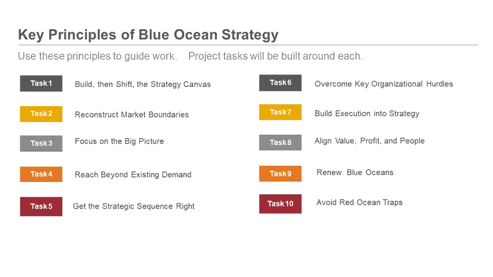
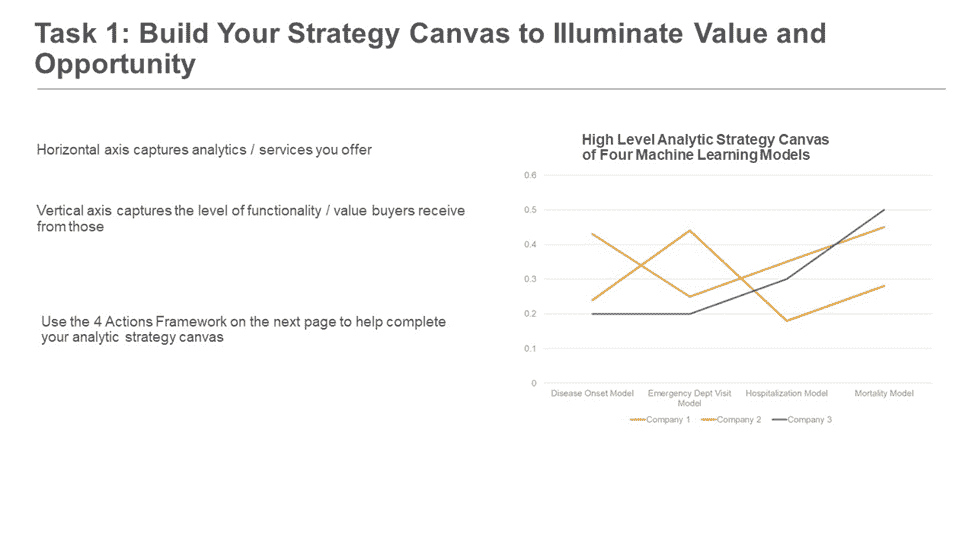
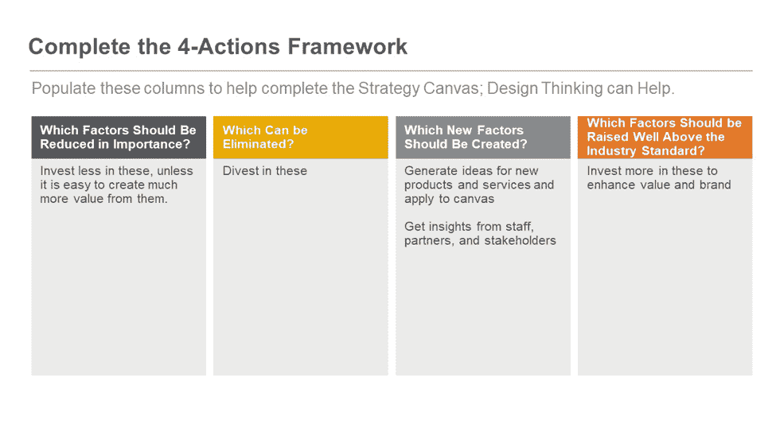

# 使用数据科学制定成功的商业战略，第 1 部分

> 原文：<https://towardsdatascience.com/using-data-science-to-develop-a-winning-business-strategy-part-1-2d25ca993223>

## ***将分析与蓝海战略相结合，以开发新客户、增加利润、培养员工和客户忠诚度***

## ***第一部分:概述、项目任务、战略画布***

桑加·里马·罗曼·塞利亚在 unsplash.com 拍摄的照片

(本文之前发表于 2022 年 1 月 20 日的《开放数据科学》上[https://opendata Science . com/using-Data-Science-to-develop-a-winning-business-strategy-part-1/](https://opendatascience.com/using-data-science-to-develop-a-winning-business-strategy-part-1/)。)

在创建让竞争对手变得无关紧要的伟大商业战略时，数据科学团队应该扮演什么角色？答案在于蓝海战略的一个应用，蓝海战略是由 W. Chan Kim 和 Renee Mauborgne(2015)在其著名的同名著作中提出的一套概念。

Kim 和 maoborgne(K&M)的文本与数据科学没有特别的联系。在这个由三部分组成的系列中，我将从数据科学的角度来看待他们的概念。我描述了数据科学家如何与每个组织单位的其他人合作，制定有利可图的业务战略，获得更多客户并提高他们的满意度，而不受现有竞争对手的干扰。在第 1 部分中，我介绍了蓝海过程，并描述了它的关键概念，即驱动每个主要任务的战略画布。正确的战略布局是其成功的关键因素；出错会导致大量时间和金钱的浪费。

蓝海战略是关于创造新市场的，所以第 2 部分将描述数据科学家如何让其他人做这件事。

第 3 部分将关注蓝海战略中的效率管理，以及通过调整有利于蓝海战略的激励来获得对蓝海战略的支持。由于战略本质上是长期的，第 3 部分还描述了数据科学家如何帮助更新蓝海并避免可能颠覆它的陷阱。最后，我将指出它的局限性，并提供关于数据科学家如何为蓝海成功做出贡献的结论。

**蓝色的海洋**

到底什么是*蓝海*？根据 K & M 的说法，这是潜在客户工作而你的竞争对手不工作的地方(至少现在还没有)。引用他们的文字(第 18 页)，蓝海是你可以:

创造无竞争的市场空间

让竞争变得无关紧要

创造和捕捉新的需求

打破价值-成本权衡

调整公司活动的整个系统，以追求差异化*和*低成本。

蓝海是商业天堂——还没有竞争对手削减利润，在 it 领域更容易获得创新声誉。实现这一目标并不容易，但数据科学可以提供帮助。这篇文章描述了如何。

将蓝色海洋与红色海洋进行对比，可以更好地理解蓝色海洋。再次引用他们的文本第 18 页，K&M 描述红海为公司:

在现有市场空间中竞争

击败竞争对手

利用现有需求

进行价值-成本权衡

将企业活动的整个系统与其差异化战略选择*或*低成本相结合

这两个海洋之间的差异是显而易见的。红海是大多数公司运营的地方。它们很有竞争力，很难在其中茁壮成长，并且被现有市场很好地规定了。他们的重点是击败其他提供重叠或类似产品或服务的公司。随着更多竞争对手的出现，或者现有竞争对手抓住最新的技术或服务浪潮，红色市场的利润可能会减少。相比之下，蓝海专注于让竞争变得无关紧要。他们通过率先解决与你的红海客户面临的相同或相似的问题来做到这一点，但他们是为不同行业的不同类型的客户而做的。这创造了巨大的新价值和增长潜力。

**数据科学在蓝海中的作用**

简而言之，数据科学在蓝海战略中的作用是为整个企业的团队成员提供所需的洞察力，帮助他们找到蓝海并在那里茁壮成长。这些见解来自 K&M 描述的以下十条原则，在本系列中，我们将描述数据科学家如何为每一条原则做出贡献。

作者图片

**构建战略画布**

根据 K&M 的说法，数据科学家和其他人的首要任务是构建一个*战略画布*，然后将其转移到客户认为更有价值的建模工作的各个方面。因此，这些方面可能会吸引潜在客户(即潜在的新客户)，他们有贵公司可以解决的问题，但不在您当前的市场空间内。因此，此任务的目的是更好地了解客户最有兴趣购买的价值类型。K & M 将战略画布描述为“对价值创新和创造蓝海至关重要的分析框架”(第 27 页)。

下图说明了四个机器学习(ML)预测模型的概念。为了说明这幅画布，假设综合起来，生产这些模型有助于为一个对利益人群的福利最大化感兴趣的公司创造一个无竞争的市场空间。一种模型侧重于预测特定医学问题的发作。其他三种侧重于预测该疾病的后果(即，因该疾病的急性表现而去急诊室、因严重发展而住院治疗以及该疾病的死亡率):

作者图片

战略画布的纵轴从零到一，对公用事业客户期望从每个分析模型中获得多少进行评级。水平轴标记模型来描述它们的焦点。这三条线代表了三个不同的公司寻求进入蓝海的战略蓝图。进入的人可以通过执行剩余的九个任务来进入。

在医疗保健应用中，这样的风险模型例子比比皆是。例如，它们可能包括逻辑回归或其他线性或非线性分类模型，由流行病学家生成，用于估计被诊断为新冠肺炎、因其住院、因其死亡、幸存但随后出现长期健康问题或完全康复的概率。也可以为许多其他急性或慢性疾病生成这样的模型。在 Chandan K Reddy 和 Charu C Aggarwal (2015)的*医疗保健数据分析*中可以找到几十个例子。这些模型可以直接销售给客户，客户可以从基于云的平台获得这些模型。模型也可以作为输入与许多其他特征一起被聚集，以创建由许多客户使用的产品或服务。那些其他特性也可以显示在策略画布上。

为上面显示的公司创建画布包括估计他们的客户或潜在客户将从每个模型中获得的效用。假设这种知识可以帮助每个公司找出如何为其他公司创造有价值的东西，这些公司有类似的问题要解决，并且在另一个目前没有服务的行业中运营。

还可以制作策略画布，以反映数据科学家进行的更细粒度的活动，对许多不同类型的机器学习或深度学习方法创造的价值进行评级。如果公司基于其建模方法的相对复杂性或性能来营销其产品，可能会出现这种情况。关于性能指标的深入讨论可以在任何一本好的机器学习教材中找到(例如 Geron，2019)。Hall 和 Gill (2019)详细讨论了其他建模属性，如可解释性、透明性、公平性或可扩展性。这里的想法可能是“我们的模型更好，所以你从它们那里得到的见解更有用”，或者类似的东西。参见[我之前的文章](/what-do-101-dalmations-and-machine-learning-have-in-common-9e389b899df3)中关于 101 种不同建模方法的信息，数据科学家在努力产生有用的见解时可能会考虑这些方法。

战略画布背后的一般思想是评估潜在市场感兴趣的每个模型或每个模型特征的效用。画布上每条线之间的差异表明了这三家公司在感知客户从每种模式中获得的价值方面的差异。它们在每种模式中的相对投资水平可能会相应变化。

既然三家公司的界限不同，那么哪一家(如果有的话)是正确的呢？是否存在最优组合？我们主要对蓝海感兴趣，而不是红海，所以我们不太关心每个公司。我们想知道如何利用我们行业中公司目前提供的最佳产品信息(例如，关于技术水平的信息)来帮助我们在其他地方创造无竞争的市场空间。

为了理解艺术的状态，我们需要一个与策略画布所表示的每个模型或特性相关的事实的仲裁者。这个仲裁者也许是基于公司间的行业销售趋势。如果整个行业的销售都在增长，并且如果一家公司在销售上明显与其他公司拉开距离，那么它正在开发的功能或模型可能对其他地方的客户也更有用。因此，行业销售额的增长和关于哪些公司正在主导当前行业的情报，可能会提供重要的线索，告诉你在为竞争对手不在的另一片蓝色海洋设计分析模型时，如何调整投资。

另一个仲裁者可能是由第三方产生的公司比较，如 [IDC](https://www.idc.com/solutions/data) 、 [Chilmark](https://go.chilmarkresearch.com/ai-for-healthcare-operations-market-trends-research-report-interest-page?_ga=2.227327000.429348718.1640626458-621324135.1640626458) 和 [Gartner](https://www.gartner.com/en/research/methodologies/magic-quadrants-research?&utm_source=google&utm_medium=cpc&utm_campaign=GTR_NA_2021_GTR_CPC_SEM1_BRAND-CAMPAIGN&utm_adgroup=131779717873&utm_term=gartner&ad=565304816812&matchtype=e&gclid=Cj0KCQiA5aWOBhDMARIsAIXLlkd4ncWSrBlQvT_AttZmm6sKLPRbYPiQaCguLPiduWYFNdWk8QoMKAsaAkT-EALw_wcB&gclsrc=aw.ds) 。这三家公司都对许多行业的公司产品进行评级，并不止一次关注许多公司基于分析的产品质量。虽然这些评级通常用于区分红海中的公司，但被认为拥有最佳或领先分析的公司可能也更有可能在蓝海中应用他们的产品。他们可能拥有在蓝海中更有可能成功的模型或模型特征。因此，希望更好地了解客户价值的数据科学家和策略师可能会从 IDC、Chilmark 或 Gartner 的市场洞察中找到一些线索。他们可能会使用这些报告，以及前面提到的销售趋势和情报，来精心设计可能在蓝海中发展良好的模型或功能的最佳组合。

**移动战略画布**

通过考虑下一个数字，可以解释改变你的策略画布的概念。图中所示的*4-行动框架*是由 K & M 创建的。利用市场情报和来自客户和潜在客户的信息，回答图中每一栏提出的问题，可以帮助您的公司决定哪些型号或型号特征在几个市场中更有价值。数据科学家可以在他们帮助寻找蓝海的努力中强调这些。

作者图片

关于上图还有一点值得一提。它关于[设计思维](https://www.interaction-design.org/literature/article/what-is-design-thinking-and-why-is-it-so-popular)的评论是指数据科学家、产品经理、业务开发和营销人员以及其他人如何与客户和潜在客户合作。他们会合作以更好地理解哪些问题最值得解决；通过解决这些问题，客户的效用、声誉、收入和利润会得到什么；解决这些问题存在哪些障碍；克服这些障碍需要什么和花费多少；以及如何着手解决这些问题。

设计思考会议系统地解决了每个问题，并听取了每个利益相关者的意见。数据科学家的角色是增加对每个问题的看法，并相应地影响思考和讨论，就像其他利益相关者一样。将数据科学家排除在这些讨论之外(即事后向数据科学团队提供反馈)通常是一个错误，因为大多数其他人不会意识到时间、资源或数据科学家认为使模型有用的其他问题。遗漏分析师也剥夺了数据科学家对利益相关者如何思考的第一手知识；这可能会增加误解，最终导致有用的产品减少、生产延迟或成本增加。数据科学家和其他人的设计思维可以提供许多有用的线索，这些线索是关于在蓝海中会成功的模型或模型特征的。

由于蓝海战略的全部目的是为数据科学家和其他人生产的产品创造新的市场，因此本系列的第 2 部分将建立在战略画布概念的基础上，并描述如何重建市场边界并超越现有需求以找到蓝海。将提供一个示例，并描述数据科学家使用的可视化工具的重要性。这将为本系列的最后一篇文章打下基础，在这篇文章中，我们将描述如何管理蓝海过程中的挑战，并避免可能导致我们回到竞争激烈的红海的错误。敬请关注。

**参考文献**

A.Géron，*使用 Scikit-Learn、Keras 和 TensorFlow 进行动手机器学习:构建智能系统的概念、工具和技术，第二版* (2019)，加利福尼亚州塞瓦斯托波尔:O'Reilly Media，Inc .

页（page 的缩写）Hall 和 N. Gill，*机器学习可解释性介绍:公平、问责、透明和可解释人工智能的应用视角* (2021)，波士顿，MA: O'Reilly Media，Inc .

IDEO.org,《以人为本的设计实地指南》( 2015 年), designkit.org

W.C. Kim 和 R. Mauborgne，*蓝海战略* (2015)，马萨诸塞州波士顿:哈佛商业评论出版社

T.穆拉利在[https://Towards Data Science . com/advanced-Pandas-plots-e 2347 a 33d 576](/advanced-pandas-plots-e2347a33d576)上用一行代码创建令人惊叹的可视化熊猫数据框架(2022)*走向数据科学*

R.Ozminkowski，101 Dalmations 和机器学习有什么共同点？(2021)，*走向数据科学*，在[https://towardsdatascience . com/what-do-101-dalmations-and-machine-learning-have-in-common-9e 389 b 899 df 3](/what-do-101-dalmations-and-machine-learning-have-in-common-9e389b899df3)

C.K. Reddy 和 C.C. Aggarwal，*医疗保健数据分析* (2015)，佛罗里达州博卡拉顿:CRC 出版社，泰勒&弗朗西斯集团