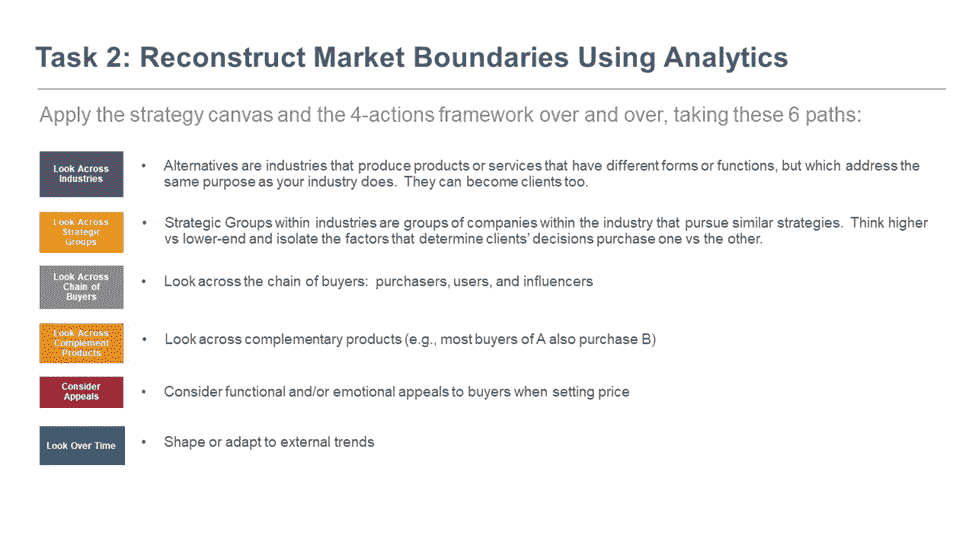
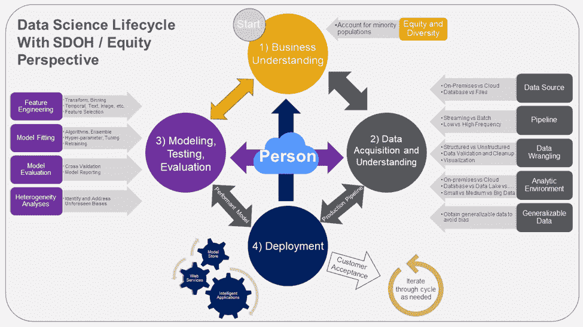
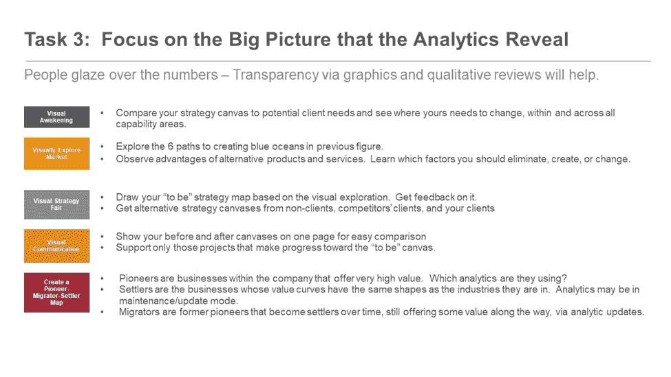

# 使用数据科学制定成功的商业战略，第 2 部分

> 原文：<https://towardsdatascience.com/using-data-science-to-develop-a-winning-business-strategy-part-2-905433548a3c>

## 将分析与蓝海战略相结合，以开发新客户、增加利润、培养员工和客户忠诚度

***第二部分:创造新市场***

照片由 Cytonn 摄影在 unsplash.com

(本文此前发表于 2022 年 1 月 25 日[https://opendatascience . com/using-Data-Science-to-develop-a-winning-business-strategy-part-2/](https://opendatascience.com/using-data-science-to-develop-a-winning-business-strategy-part-1/)的《开放数据科学》(Open Data Science)。)

在本系列的[第一部分](https://opendatascience.com/using-data-science-to-develop-a-winning-business-strategy-part-1/)中，我们开始研究数据科学家在创建一个让竞争对手变得无关紧要的伟大商业战略时可以发挥的作用。该角色首先创建一个战略画布，使用 W. Chan Kim 和 Renee maoborgne(2015)在他们的名著《蓝海战略》中开发的一套概念。正确的战略布局是其成功的关键因素；出错会导致时间和金钱的浪费。

Kim 和 maoborgne(K&M)的文本与数据科学没有特别的联系。在这个由三部分组成的系列中，我将从数据科学的角度来看待他们的概念。我描述了数据科学家如何与每个组织单位的其他人合作，制定有利可图的业务战略，获得更多客户并提高他们的满意度，而不受现有竞争对手的干扰。在第 2 部分中，我将描述数据科学家如何使用策略画布和其他工具来帮助完成这项工作。

第 3 部分将关注蓝海战略中的效率管理，以及通过调整有利于蓝海战略的激励来获得对蓝海战略的支持。由于战略本质上是长期的，第 3 部分还描述了数据科学家如何帮助更新蓝海并避免可能颠覆它的陷阱。最后，指出了局限性，并提供了关于数据科学家如何为蓝海成功做出贡献的结论。

**简单回顾一下——什么是蓝海，数据科学家在其中扮演什么角色？**

根据 K&M 的说法，正如前面第一部分提到的，蓝海是潜在客户工作而你的竞争对手不工作的地方(至少现在还没有)。引用他们的文字(第 18 页)，蓝海是你可以:

创造无竞争的市场空间

让竞争变得无关紧要

创造和捕捉新的需求

打破价值-成本权衡

调整公司活动的整个系统，以追求差异化*和*低成本。

蓝海是商业天堂——还没有竞争对手削减利润，在 it 领域更容易获得创新声誉。实现这一目标并不容易，但数据科学可以提供帮助。

简而言之，数据科学在蓝海战略中的作用是为整个企业的团队成员提供所需的洞察力，帮助他们找到蓝海并在那里茁壮成长。这些见解来自 K&M 描述的十大原则。下面列出了这些。

作者图片

**构建战略画布**

根据 K&M 的说法，数据科学家和其他人的首要任务是构建一个*战略画布*，然后将其转移到客户认为更有价值的建模工作的各个方面。因此，这些方面可能会吸引潜在客户(潜在的新客户)，他们有你的公司可以解决的问题，但不在你当前的市场空间。因此，此任务的目的是更好地了解客户最有兴趣购买的价值类型。K & M 将战略画布描述为“对价值创新和创造蓝海至关重要的分析框架”(第 27 页)。[本系列的第 1 部分](https://opendatascience.com/using-data-science-to-develop-a-winning-business-strategy-part-1/)描述了如何构建战略画布。在第 2 部分中，我们通过展示如何使用它来重建市场边界，并为数据科学家帮助构建的产品创造新的市场，来继续这场对话。

**重构市场边界**

K&M 认为，蓝海战略的第二个主要任务是重建市场边界。他们的想法是通过寻找你通常不会服务的新客户来扩大你的市场。下图简要描述了他们确定的在这个新市场工作的六条途径。

作者图片

从战术上讲，这六条路径帮助公司多次重新应用他们的战略画布，每次都专注于为有类似问题要解决的新公司提供价值。LinkedIn 的公司描述可以帮助识别潜在的新客户。

新客户也可能包括现有市场中的各种群体，他们还没有成为努力的焦点。随着市场萎缩或饱和，这些战略集团变得更受关注，而早期的重点集团变得更受关注。随着为战略集团服务的技术的出现，战略集团也可能出现。

从分析的角度来看，扩大市场边界的任务很简单，因为科学家使用的分析模型非常适合跨行业应用。许多相同种类的分类或回归建模方法可以很好地用于医疗保健应用，或者用于教育、公共政策、环境健康、国防、零售、食品配送和其他行业的应用，在这些行业中，员工和客户的健康和幸福对成功至关重要。

对于一个新行业或战略集团来说，预测任务最困难的部分很可能是获取生成有用模型所需的主题专业知识。在这一领域的投资是成功的关键，因为行业专业知识不容易被非人类技术取代。

**一个例子**

医疗保健行业的例子可以说明重建市场边界的努力。在过去的几年里，已经做出了许多努力，以使所有少数民族和多数民族人口更公平地获得医疗保健服务和医疗服务。这些努力的目标是改善全社会的健康和福祉。出现了相应的以人为中心的护理运动，确保个体患者的需求驱动适当治疗的使用，而不管他们的人口统计、经济和社会特征。

下图描述了数据科学在这些运动中的作用，其根源在于数据挖掘的跨行业标准流程(Chapman 等人，1999 年)和称为数据科学生命周期的更新版本(staple，2017 年)。关于这些的更多信息可以在[我之前的论文](/garbage-in-garbage-out-721b5b299bc1)中找到，它展示了另一个(我的)数据科学生命周期图，你可以在下面看到。那篇论文描述了数据科学家可以使用它描述的科学过程来解决健康公平和健康的社会决定因素的几种方法(SDOH——参见*健康人 2030* 关于 SDOH 的讨论)。

作者图片

在这里，我想重点谈谈我的数据科学生命周期的战略方面。第一条重建市场边界的道路，如上面任务 2 图所示，是寻找与你的行业具有相同目的的替代行业。可以说，社会服务行业(例如，解决教育服务、无家可归、食物短缺、交通问题、环境问题等的公司。)正致力于解决许多也导致健康不佳的问题。因此，在医疗保健环境中工作的数据科学家在使用以股票和 SDOH 为重点的数据科学生命周期时产生的预测模型和可视化对其他社会服务行业的公司也有价值，因此我们可以将这些相关行业视为蓝海扩张的目标。

第二条重建市场边界的途径是关注自己所在行业或替代行业的战略集团。我的数据科学生命周期中对健康公平和健康的社会决定因素的关注可以被视为对健康相关的预测或推理模型和可视化的扩展关注，针对不同的人口统计和社会经济子群进行定制。我们的模型、推理和可视化可以非常有效地应用于敏感性分析，以确定这些模型有多健壮，并显示它们应该如何改进以服务于不同群体的成员。这样做可以扩大市场，创造新的客户，这些客户也为代表不足的少数群体服务。

接下来，如任务 2 图中所示，查看购买者链和互补产品有助于我们将模型聚焦于特定的影响者、购买者和用户，他们最有兴趣从数据科学家生产的模型、功能或其他产品中获得效用。同样的概念也适用于互补产品，如果我们知道购买基于特定类型的数据科学模型或功能的产品的客户也会购买其他特定的产品，我们可以改进或扩展我们的模型或建模功能，以创建更多的产品，为这些购买者带来效用。这使得数据科学家能够为市场扩张做出更大贡献。

如上图中任务 2 所述，重建市场边界的第五条途径是在为产品定价时考虑对购买者的功能或情感吸引力。这为数据科学家创造了两个机会。一种是了解决定客户端效用的心理或认知因素，然后用有助于更好地执行数据科学模型的变量来衡量这些因素。第二个机会是进行系统地改变这些变量的实验，以更好地理解并预测购买者的行为。这也将有助于创造新的客户。

最后，正如任务 2 图中所指出的，K&M 提到的重建市场边界的最后一条途径是塑造或适应市场的外部趋势。这些应该会影响我们的模型，因为不这样做会导致模型性能随着时间的推移而降低。数据科学家应该与整个公司的其他人合作，不断更新他们对市场运作方式和潜在买家需求的理解。更好的预测能力可以创造在红蓝海扩张的机会。

**可视化的价值**

到目前为止，我们的重点一直是模型或模型特征。已经顺便提到了相应的可视化，但是蓝海战略过程中的下一个任务可以极大地受益于数据科学家产生的可视化，所以让我们暂时更关注那些。

作者图片

这个过程的第三项任务很大程度上依赖于可视化练习，因为，正如 K&M 所说，人们经常迷失在数字中，盯着表格显示的结果发呆。许多人更喜欢图示视图。如果一张图片值一千个单词，那么就要由数据科学家来确保正确的一千个单词是由他们的模型的可视化所暗示的。

许多统计软件包都带有相应的可视化工具来帮助实现这一目标。我发现 SAS 可视化数据挖掘和机器学习( [VDMML](https://www.sas.com/content/dam/SAS/en_ca/User%20Group%20Presentations/Edmonton-User-Group/joyce_data_visualization.pdf) )软件包的可视化非常有用。与 Python 和 R 等开源工具相比，VDMML 中的许多可视化工具只需很少的额外编码就可以生成。VDMML 中的可视化信息丰富且快速。然而，开源工具中可用的各种可视化仍然令人印象深刻，对数据科学生命周期的所有阶段都很有用。例如，Aishwarya Ajaykumar (2021)提供了二十多个例子，说明如何用 Python 创建有用的[可视化。图瓦拉凯什·穆拉利(2022)。](https://www.analyticsvidhya.com/blog/2021/02/an-intuitive-guide-to-visualization-in-python/) [Tableau](https://www.tableau.com/learn/articles/data-visualization) 还提供了强大的可视化功能；这些倾向于在数据科学过程的早期使用，当数据第一次被接收、清理并在图示视图中描述时，以帮助生成早期的或模型不可知的故事。

读者可能也熟悉许多其他可视化过程。例如，Jair Ribiero (2022)描述了数据科学家如何使用网络图来帮助讲述难以通过其他方式收集的数据故事。

可视化在策略开发中有三重作用。首先，与许多数据科学应用一样，可视化有助于分析师及其客户以易于理解的方式理解数据讲述的故事。这建立了对建模过程和该过程产生的结果的信心。第二，可视化可以说明战略画布的许多不同版本，如上面的任务 3 图所示。获得每个方面的反馈可以帮助产品开发人员和其他人找到模型、功能或其他产品属性的最佳组合，为蓝海的成功铺平道路。第三，可视化有助于理解拓荒者、移民者和定居者的业务，帮助战略家做出更好的选择，将有限的资金投资于新产品，而不是更新和维护现有产品。

**超出现有需求**

根据 K&M 的说法，蓝海战略过程的下一个任务是超越现有需求，找到新的买家。数据科学家产生的分析促进了这一过程。来自文献、销售、市场营销、产品开发和其他人员的情报可以帮助分析人员将工作重点放在这方面。下面的任务 4 图描述了这项工作。决定关注哪些非客户可以帮助每个人理解要生成的最佳模型和功能，无论是作为独立产品还是作为更大产品的组件。

作者图片

**总结和未来**

到目前为止，在本系列的第 1 部分和第 2 部分中，我们已经介绍了蓝海战略的概念和过程，强调了战略画布的价值。该折线图展示了客户期望从数据科学家提供的分析以及其他产品中获得的价值。由于蓝海工作的重点是如何为其他行业的新客户或现有市场的新群体将潜在价值转化为实际价值，我们已经展示了数据科学家如何通过与业务的其他部分合作来促进这项工作。在第 3 部分中，我们将重点关注如何有效地进行这项工作，如何在执行蓝海工作时克服组织障碍，以及如何调整内部和外部利益相关者的激励，以帮助确保成功。我们还将关注一旦竞争对手抓住这些新市场，如何更新蓝海，以及如何避免竞争威胁和陷阱，迫使人们离开蓝海。这种方法的局限性和这一系列论文中的材料将被指出，并提供最终结论。请加入我们；这个信息很快就会出来。

**参考文献**

A.Ajaykuman，Python 中数据可视化的直观指南(2021)， *Analytics Vidhya* ，在[https://www . Analytics vid hya . com/blog/2021/02/An-Intuitive-Guide-to-Visualization-in-Python/](https://www.analyticsvidhya.com/blog/2021/02/an-intuitive-guide-to-visualization-in-python/)。

页（page 的缩写）Chapman，J. Clinton 和 R Kerber 等人，CRISP-DM 1.0:逐步数据挖掘指南(1999 年)，关于[https://www.the-modeling-agency.com/crisp-dm.pdf](https://www.the-modeling-agency.com/crisp-dm.pdf)

健康人 2030，*健康的社会决定因素*，在[https://Health . gov/Health ypeople/objectives-and-data/Social-determinators-Health](https://health.gov/healthypeople/objectives-and-data/social-determinants-health)

W.C. Kim 和 R. Mauborgne，*蓝海战略* (2015)，哈佛商业评论出版社，马萨诸塞州波士顿

T.穆拉利在[https://Towards Data Science . com/advanced-Pandas-plots-e 2347 a 33d 576](/advanced-pandas-plots-e2347a33d576)上用一行代码创建令人惊叹的可视化熊猫数据框架(2022)*走向数据科学*

R.Ozminkowski，101 Dalmations 和机器学习有什么共同点？(2021)，*走向数据科学*，在[https://towardsdatascience . com/what-do-101-dalmations-and-machine-learning-have-in-common-9e 389 b 899 df 3](/what-do-101-dalmations-and-machine-learning-have-in-common-9e389b899df3)

R.Ozminkowski，使用数据科学制定成功的商业战略，第 1 部分，*开放数据科学*(2022 年 1 月 20 日)，在[https://opendatascience . com/Using-Data-Science-to-Develop-a-Winning-Business-Strategy-Part-1/](https://opendatascience.com/using-data-science-to-develop-a-winning-business-strategy-part-1/)

J.Ribiero，网络图和我们如何可视化我们的世界的温和介绍(2022)，https://jairribeiro . medium . com/A-Gentle-Introduction-to-Network-Graphs-and-how-we-can-Visualize-our-World-connecting-the-dots-6b b5 a2 db 5558

J.马镫，CRISP-DM 怎么了，有替代方案吗？(2017)，于*[https://jen staple . com/2017/07/01/whats-wrong-with-crisp-DM-and-is-there-an-alternative/](https://jenstirrup.com/2017/07/01/whats-wrong-with-crisp-dm-and-is-there-an-alternative/.%C2%A0)*