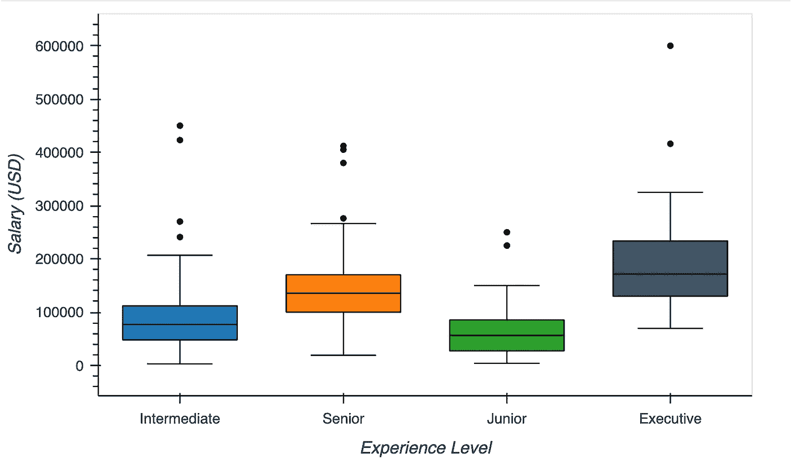
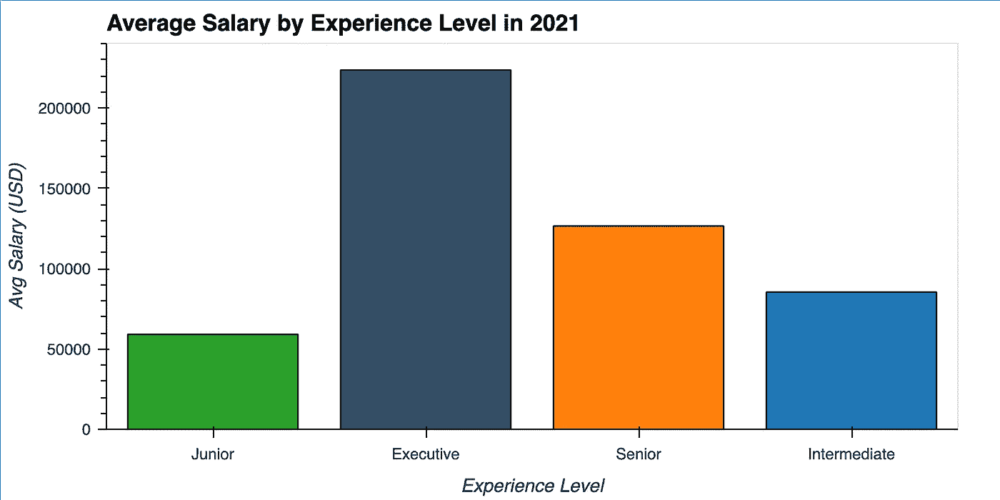
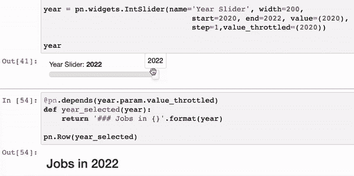
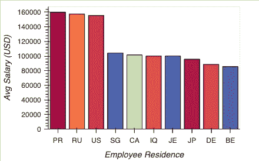
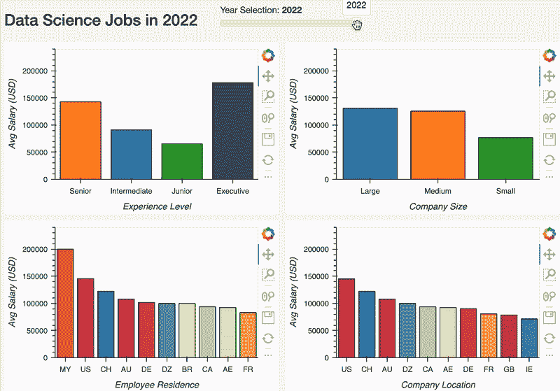

# 使用 Panel 在 Python 中构建数据仪表板

> 原文：<https://towardsdatascience.com/using-panel-to-build-data-dashboards-in-python-e87a04c9034d>

## 让我们使用 Holoviz 的 Panel 构建一个交互式数据仪表板

由 [Unsplash](https://unsplash.com/s/photos/data-dashboard?utm_source=unsplash&utm_medium=referral&utm_content=creditCopyText) 上的[路径数码](https://unsplash.com/@pathdigital?utm_source=unsplash&utm_medium=referral&utm_content=creditCopyText)拍摄

Holoviz 正迅速成为一套流行的 Python 绘图库，适用于初学者和老手。Holoviz 由几个包组成，目的是使可视化数据变得更容易，而不管数据类型如何，同时提高绘图的质量。其中一些库包括 hvPlot、Panel、HoloViews 和 GeoViews。

在本帖中，我们将学习如何使用 Panel 来创建交互式数据面板和 web 应用程序。Panel 很快成为我最喜欢的仪表板工具之一，因为它很容易学习基础知识，同时还有足够的深度来创建更复杂的应用程序。它还非常灵活地支持您可以使用的绘图类型，这意味着如果您已经使用 follow 创建了一个地图，您不必花费时间使用另一个工具重新构建它，以将其集成到仪表板中。

## 为什么选择仪表板？

数据仪表板并不是新的实践；多年来，企业一直使用仪表板来跟踪和了解他们的数据。仪表板通常是用 JavaScript 或无代码软件构建的，然而，有了 Panel 这样的新库，使用 Python 创建仪表板变得前所未有的简单。在整个工作流程中选择使用相同的语言可以帮助节省大量时间，尤其是在您进行原型设计的时候。

仪表板提供了几个关键的好处，如**交互性**、**可定制性**和**可共享性**。因为我们可以定义小部件，比如改变时间序列中年份的滑块，所以我们可以进行有意义的交互，帮助用户看到数据的变化。

能够自定义布局还允许混合不同种类的图或使用多个图来显示数据集的不同维度。最后，可分享性。Panel 可以轻松地将仪表板部署为 web 应用程序，这意味着您可以快速地与更多用户在线共享您的工作。

## 材料

我们在本帖中创建了几个互动的情节，然而，它们不容易直接嵌入媒体，所以你可以跟随这个[互动 Jupyter 笔记本](https://nbviewer.org/github/wino6687/medium_hvPlot_Intro/blob/master/Examples.ipynb)。

# 小组介绍

在我们开始使用 Panel 创建第一个仪表板之前，让我们先快速讨论一下它的基本工作原理。

# 成分

使用 Panel 制作的应用程序由三个主要组件组成:

*   **窗格**:窗格是你的地块的渲染视图。您的绘图可以是用许多流行的 Python 绘图库创建的对象。窗格本质上只是将现有的绘图转换成 Panel 可以处理的对象。
*   小部件:小部件允许用户输入，比如点击或输入数据，允许用户与应用程序交互。
*   **面板**:面板是一个容器，它包含了组成你的应用程序的窗格和小部件。面板是分层的，这意味着面板中可以有面板。面板还可以将元素组织成行和列、选项卡或网格。

这三个对象是面板仪表板的基本构件。我们将绘图转换成窗格，创建小部件来控制变量，然后将它们组织成一个面板——或一组面板。

# 蜜蜂

Panel 的主要优势之一是它的灵活性。我们可以使用 Panel 在 15 分钟内创建一个快速仪表板，如果这个概念可行，我们可以继续定制我们的仪表板，甚至将其集成到一个更大的软件项目中，而不必重新开始使用新工具。

Panel 通过提供四种不同 API 的选项，能够提供快速绘图和更复杂的功能。在这篇文章中，我们将关注其中的两个:交互函数和反应函数。

## 交互 API

交互功能是开始构建交互式仪表板的最简单的方法。您只需提供一个函数，然后 Panel 就会生成与之交互所需的 UI。我们可以用 Jupyter 笔记本内部的面板创建一个简单的交互功能，如下所示:

由作者创建

这里我们创建一个简单的函数，它返回一个数的乘积，然后我们告诉 Panel 我们想要与这个函数交互。现在,`x`的值根据滑块改变，我们可以使用`x`作为函数的参数，使它们响应我们的交互。

## 反应功能

交互功能之所以如此简单，是因为它们为我们创建了 UI 元素，就像上面例子中的滑块一样。反应式功能允许我们分别构建 UI 元素和功能，并决定如何链接它们。

我们可以使用流行的帕尔默企鹅数据集制作一个快速的示例图，如下所示:

由作者创建

这里有三个步骤:

1.  声明我们的两个选择小部件，这将让我们选择我们的任何列作为 x 轴或 y 轴。
2.  使用嵌套的行和列，`pn.Row(pn.Column(<TITLE AND WIDGETS>), <PLOT>)`，把我们的内容组织成一行，但把它分成两列。
3.  使用`pn.bind()`将我们的散点图与我们的两个小部件连接起来，然后 Panel 为我们处理剩下的部分。

从图中单独声明窗口小部件可以让我们更好地控制 UI 元素的样式和组织，与使用交互函数相比，唯一的缺点是必须编写一些额外的代码。我真的很喜欢反应式函数更具声明性，这使得每个元素要做什么变得非常清楚。

# 创建带有面板的仪表板

我们将在本帖中使用的数据集包括 2020 年至 2022 年全球数据科学工作的信息。数据集中大约有 600 个作业，这对于一个例子来说是一个很好的大小，不管我们决定制作什么样的情节，浏览器都不会很难加载这个例子。

让我们将数据导入 Python，看看我们在处理什么。

由作者创建

我们可以看到，我们有员工的经验水平、工资、远程工作比率以及公司和员工的位置等信息。我们可以从中制作出很多有趣的图表，所以让我们创建一些来研究数据，然后填充我们的仪表板。

## 基本情节

Medium 不支持直接上传 HTML，所以文章中的情节不是交互式的。如果你想与剧情互动，你可以跟随这个[互动笔记本](https://nbviewer.org/github/wino6687/medium_hvPlot_Intro/blob/master/Examples.ipynb)。

让我们从导入 hvplot pandas 库开始，并将 holoviews 扩展设置为 bokeh。我是 Plotly 的长期粉丝，这也是 holoviews 扩展的一个选项，但我真的很喜欢 bokeh 的默认样式。

我们先做一个简单的箱线图来看一下工资根据经验水平的分布。

由作者创建

这里我们可以看到 hvPlot 是如何取代 DataFrame 的正常绘图功能的。现在，对于其余的图，我希望能够按年份对数据进行子集划分，因此我们将使用以年份作为参数的函数。我们的下一个图将是一个条形图，显示按经验水平划分的平均工资。

由作者创建

现在，我们可以调用`plot_bars1(2021)`将数据子集化为当年的工作。你可能已经明白我的意思了…

现在我们有了一个函数，它将年份作为参数并返回一个图，我们准备将它连接到一个滑块来控制我们的年份。当我们可以用 Panel 创建一个简单的 UI 时，为什么要用不同的输入手动运行函数呢？

## 年份滑块

我们将创建我们的年份滑块，很像反应式函数演示中的选择菜单，只是使用了不同类型的小部件。我们还可以创建一个简单的函数来显示 markdown 中的年份，这样我们就可以看到如何将滑块的值链接到函数的输入。

将小部件的值链接到函数有两种主要方法，要么是我们上面看到的`pn.bind()`方法，要么是我们在本例中看到的`@pn.depends()`装饰器。这两种方式都可以，但是我很喜欢装饰者立即声明依赖关系，而不是等到展示仪表板的时候。

现在，在 Jupyter 笔记本中，我们可以呈现这些，并查看滑块的值如何改变显示降价的函数的输入值。

由作者创建

如果你想知道，`value_throttled`只是告诉面板不要重新运行该功能，直到你释放你的鼠标；这可以防止当您将滑块移动几个槽口时它运行多次。

## 最终剧情！

我们已经有了我们的基础设施，现在我们只需要制作几个图来填充我们的仪表板，并将它们连接到我们的滑块。让我们看看哪些国家在某一年的平均工资最高。

由作者创建

我知道配色方案不是很好，但我想给近 60 个国家中的每一个国家分配一种独特的颜色，这样当一年发生变化时，不同国家的颜色就不会重复。

你可能已经注意到，这是根据雇员居住的国家来计算平均工资，但是公司所在地呢？我还创建了一个功能来完成几乎相同的任务，除了使用公司位置。

由作者创建

## 盘面设计

现在我们已经准备好把它们放在一起了。Panel 支持多种排列对象的方式。在这个例子中，我们将使用行和列，因为这是最直观的开始。我们可以在彼此内部嵌套任意多的行和列。

我们将使用一个`WidgetBox`作为我们的容器，它基本上只是一个`Column`，但有一点额外的样式，使里面的项目更明显地组合在一起。我还使用了`pn.bind()`来展示将年份滑块附加到每个绘图上的效果。

由作者创建

我们终于在 Jupyter 笔记本上有了一个正常工作的仪表盘！一旦掌握了这三个基本步骤，您可能会发现使用 Panel 创建交互式仪表板有多快——**创建绘图功能** , **定义小部件**，以及**定义布局**。

当然，仪表板可以比这复杂得多，但是，像为时间序列数据集的年份添加一个滑块这样简单的事情可以对数据可视化的影响产生巨大的影响，特别是如果您想与没有编码的任何人共享它。

## 本地提供仪表板

要在本地托管我们的仪表板，我们所要做的就是从您的工作目录在终端中运行`panel serve xxxx.ipynb`。现在您可以在`localhost`通过浏览器访问它。

# 包扎

我们在这篇文章中讨论了很多，但是我希望我们如何使用 Panel 来制作交互式仪表板的核心概念是清楚的。这篇文章仅仅触及了使用 Panel 和其他 Holoviz 库所能做的事情的表面。我们可以从像 Folium 这样的库中添加地图，或者我们可以配置一个套索样式的选择工具，以允许查看者自己选择数据子集。幸运的是，Holoviz 拥有优秀的文档，我将在未来几周内在 Panel 上发布一系列帖子。

# 资源

*   [带剧情的互动 Jupyter 笔记本](https://nbviewer.org/github/wino6687/medium_hvPlot_Intro/blob/master/Examples.ipynb)
*   [面板文件](https://panel.holoviz.org/user_guide/index.html)
*   [HV plot 简介](/holoviz-is-simplifying-data-visualization-in-python-d51ca89739cf)

> ***注:*** *如果你喜欢在 Medium 上阅读我和其他人的内容，可以考虑使用下面的链接订阅，以支持这样的内容创作，并解锁无限的故事！*

<https://medium.com/@willmnorris/membership>  

# 数据引用

*   **数据科学职位数据—** 公共领域(CC0 1.0)
    [https://www . ka ggle . com/datasets/ruchi 798/Data-Science-job-salary](https://www.kaggle.com/datasets/ruchi798/data-science-job-salaries)
*   **企鹅数据集** —知识共享， [PamlerPenguins](https://github.com/allisonhorst/palmerpenguins)

艾莉森·玛丽·霍斯特。(2020).帕尔默企鹅:帕尔默群岛(南极洲)企鹅数据。https://doi.org/10.5281/zenodo.3960218