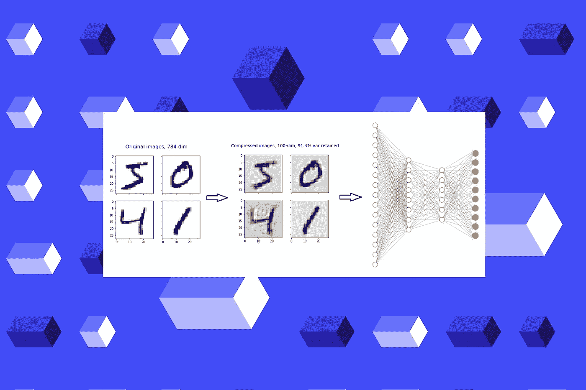
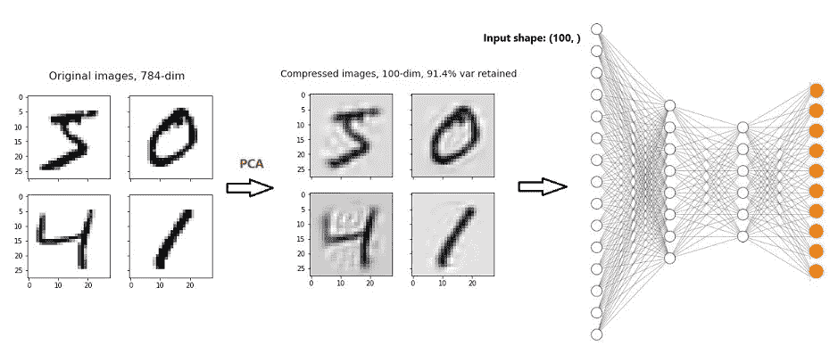
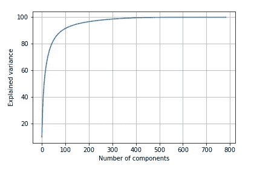
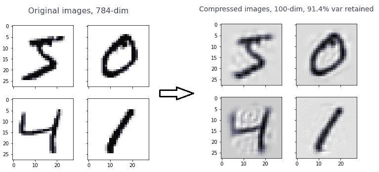
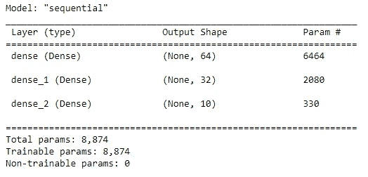
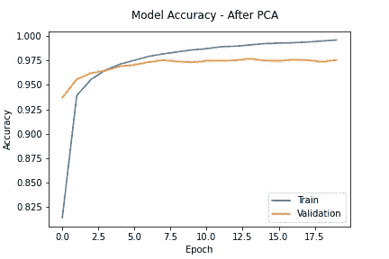
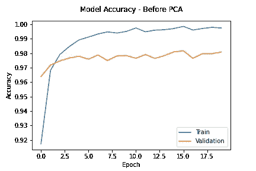

# 使用 PCA 将神经网络中的参数数量减少 30 倍

> 原文：<https://towardsdatascience.com/using-pca-to-reduce-number-of-parameters-in-a-neural-network-by-30x-times-fcc737159282>

## 同时还能获得更好的性能！—神经网络和深度学习课程:第 17 部分



[Unsplash](https://unsplash.com/?utm_source=unsplash&utm_medium=referral&utm_content=creditCopyText) 上 [MagicPattern](https://unsplash.com/es/@magicpattern?utm_source=unsplash&utm_medium=referral&utm_content=creditCopyText) 原图，作者编辑

在[之前的文章](/creating-a-multilayer-perceptron-mlp-classifier-model-to-identify-handwritten-digits-9bac1b16fe10)中，我们创建了一个多层感知器(MLP)分类器模型来识别手写数字。

我们为网络架构使用了两个具有 256 个神经元的隐藏层。即使是这样一个小网络，我们总共得到了 269，322 个参数(权重和偏差项)。获得如此大量的网络参数的主要原因是输入层的大尺寸。

因为 MLP 的输入图层采用 1D 张量，所以我们需要将二维 MNIST 影像数据重塑为一维数据。这个过程在技术上叫做 ***展平*** 图像。


(图片由作者提供，用 draw.io 制作)

图像中的每个像素代表一个输入。如果图像中有 784 个像素，我们在 MLP 的输入层需要 784 个神经元。当输入层的大小增加时，我们得到网络中大量的总参数。这就是为什么 MLP 不是参数有效的。当我们使用高像素值图像数据(例如 500 x 500 px 图像)时，输入层的大小会显著增加。

获得网络中大量总参数的问题是，我们需要大量计算资源来训练神经网络，并且这也是耗时的。

MLP 不适用于图像数据。还有一种更好的神经网络架构，称为**卷积神经网络(CNN 或 ConvNets)** ，用于处理图像数据。它的输入层可以获取高维数据，因此我们不需要展平图像。

如果有一种方法可以减少图像中的像素数量，而不会损失太多的图像质量，我们仍然可以有效地将 MLPs 用于图像数据。如果我们能做到这一点，输入层的大小将会非常小，MLP 模型将是参数有效的。

我们可以将**主成分分析(PCA)** 应用到展平的图像中，以显著减少像素数量，同时仍然获得几乎相同的图像质量，但现在像素更少了！

一般的工作流程是:



(图片由作者提供，用 draw.io 制作)

首先，我们将 PCA 应用于 MNIST 数字数据，并在保持 91.4%图像质量的同时将维数(像素数)减少了 7.48 倍！然后，我们建立我们在[第 16 部分](/creating-a-multilayer-perceptron-mlp-classifier-model-to-identify-handwritten-digits-9bac1b16fe10)中建立的相同的 MLP 模型。现在，输入的形状是(100，)，而不是(784，)。这将显著减少网络中总参数的数量。此外，我们有机会减少隐藏层中的神经元数量，因为现在输入大小很小。这也将有助于显著减少网络中的总参数数量。

# 将主成分分析应用于 MNIST 数据

如果您[通过 Keras API](https://rukshanpramoditha.medium.com/acquire-understand-and-prepare-the-mnist-dataset-3d71a84e07e7#9d79) 获取 MNSIT 数据，您将为训练集获得 60，000 幅手写数字灰度图像，为测试集获得 10，000 幅手写数字灰度图像。每个灰度图像都是二维的，宽 28 像素，高 28 像素。


(图片由作者提供)

我们需要在应用 PCA 之前展平这些图像。展平后，我们得到:


(图片由作者提供)

我们可以将这个新的训练集图像数组视为一个简单的数据集，它有 60，000 行(图像数)和 784 列(图像中的像素数)。现在，我们可以像往常一样应用 PCA。注意，我们将 PCA 分别应用于训练集和测试集。

当考虑单个展平的图像时，像素的数量代表它的维度。当我们降低维度时，我们减少了图像中的像素数量。

**对 MNSIT 数据进行主成分分析，选择最佳主成分数**(作者代码)

运行上述代码后，我们得到以下输出。



**选择最佳主成分数**(图片作者提供)

我们可以看到，前 100 个分量捕获了原始图像数据中大约 90%的可变性。这足以保持原始图像的质量。因此，我们选择了前 100 个组件，并对所选组件的数量再次应用 PCA。

**用所选组件再次应用 PCA**(作者代码)


(图片由作者提供)

我们将原始图像数据的维数减少了 7.84 倍(784/100)，同时保持了原始数据中 91.43%的可变性。



**图像样本:应用 PCA 前后**(图片由作者提供)

压缩后的图像依然清晰可辨！

**注意:**这里不打算多解释 PCA 过程。敬请参考下面的文章系列(我写的)，了解 PCA 和降维的一切。

[](https://rukshanpramoditha.medium.com/list/pca-and-dimensionality-reduction-special-collection-146045a5acb5)

**点击此图进入我的 PCA 与降维特辑**(作者截图)

# 使用压缩(缩减)的图像数据构建 MLP 分类器

现在，我们建立与在[第 16 部分](/creating-a-multilayer-perceptron-mlp-classifier-model-to-identify-handwritten-digits-9bac1b16fe10)中相同的 MLP 分类器模型，但是使用压缩的图像数据(更少的维度和更少的像素)！

(作者代码)


(图片由作者提供)

这次我们得到了 0.9745 的准确度分数。之前(即在应用 PCA 之前)，我们得到了 0.9804 的准确度分数。我们只损失了很少的准确度分数。也就是 0.0059。

如果我们现在检查总参数的数量，我们会得到:

```
MLP.summary()
```



**应用 PCA 后的可训练参数数量**(图片由作者提供)

先前(即，在应用 PCA 之前)，我们总共获得了 269，322 个参数。这次我们总共只得到 8874 个参数。因此，在应用 PCA 后，我们将总参数数量减少了 30 倍(269，322 / 8，874 )!我们只损失了 0.0059 的模型精度。

我们可以通过应用主成分分析得到更好的结果。这次我说的是过度拟合的问题。

我在培训期间测量了模型的性能。

(作者代码)



(图片由作者提供)

这可以与相应的前一种情况相比较:在应用五氯苯甲醚之前。



(图片由作者提供)

很明显， ***模型在应用 PCA*** 后过拟合更少。该模型对新的未见过的数据(测试数据)进行了很好的概括。原因是:

> PCA 去除数据中的噪声，只保留数据集中最重要的特征。这将减轻数据的过度拟合，并提高模型对未知数据的性能。除此之外，当数据中有许多要素时，模型会变得更加复杂。复杂的模型往往会过度拟合数据。PCA 通过减少数据中的特征数量(维度)来处理模型的复杂性—来源: [**如何通过维度减少来缓解过度拟合**](/how-to-mitigate-overfitting-with-dimensionality-reduction-555b755b3d66) (我自己的文章)

# 摘要

*   我们将 PCA 应用于 MNIST 数据，并成功地将原始图像数据的维数降低了 7.84 倍。因此，我们可以显著减小 MLP 输入层的大小。我们在原始数据中保留了 91.43%的可变性。所以，图像还是可以识别的。
*   在应用 PCA 之后，我们仅损失了非常少量的准确性。
*   我们可以将 MLP 模型中的总参数数量减少 30 倍！这是因为我们大大减少了 MLP 输入层的大小和隐藏层中神经元的数量。因为现在输入量很小，我们有机会减少隐藏层中神经元的数量。通过增加隐藏层中神经元的数量，您不会获得太多的性能改善。不过，最好还是通过设置不同的值来做一些实验，然后测量性能。
*   应用主成分分析后，模型的过拟合程度降低。我解释了原因。另外，请注意，该模型仍然过拟合，因为我们还没有对该模型应用任何正则化技术。
*   对 MNIST 图像数据应用 PCA 是容易的，因为图像是灰度的，其被表示为二维(2D)张量。PCA 过程对于表示为三维(3D)的 RGB 图像来说是复杂的。阅读[这篇文章](/rgb-color-image-compression-using-principal-component-analysis-fce3f48dfdd0)了解如何将 PCA 应用于 RGB 图像。要了解 RGB 和灰度图像的区别，请阅读[这篇文章](/exploring-the-mnist-digits-dataset-7ff62631766a)。

今天的帖子到此结束。

**如果您有任何问题或反馈，请告诉我。**

我希望你喜欢阅读这篇文章。如果你愿意支持我成为一名作家，请考虑 [***注册会员***](https://rukshanpramoditha.medium.com/membership) *以获得无限制的媒体访问权限。它只需要每月 5 美元，我会收到你的会员费的一部分。*

[](https://rukshanpramoditha.medium.com/membership)  

非常感谢你一直以来的支持！下一篇文章再见。祝大家学习愉快！

## 加入我的神经网络和深度学习课程

[](https://rukshanpramoditha.medium.com/list/neural-networks-and-deep-learning-course-a2779b9c3f75)

**点击此图片进入我的神经网络和深度学习课程**(作者截图)

[鲁克山·普拉莫迪塔](https://medium.com/u/f90a3bb1d400?source=post_page-----fcc737159282--------------------------------)
**2022–06–12**