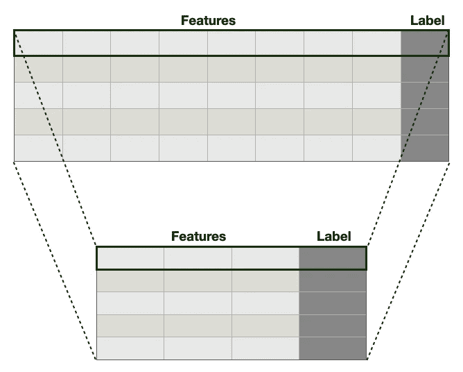
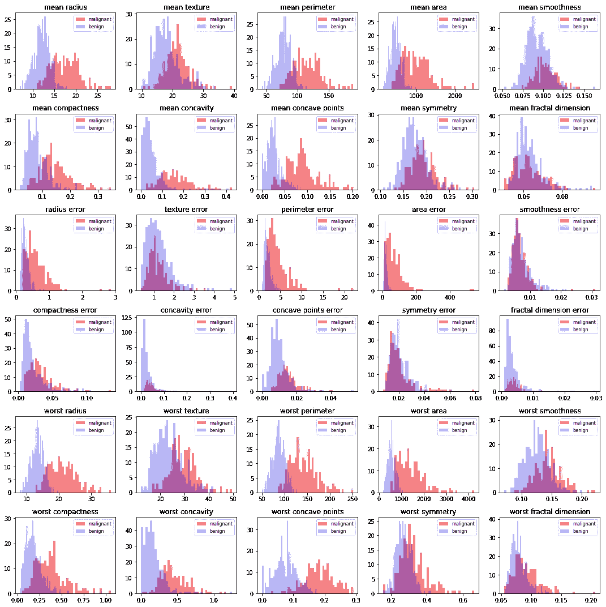
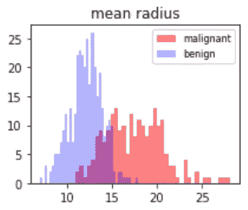
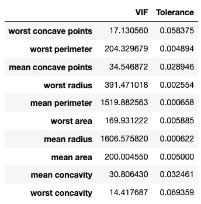
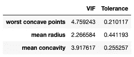
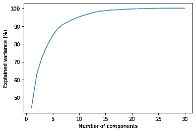
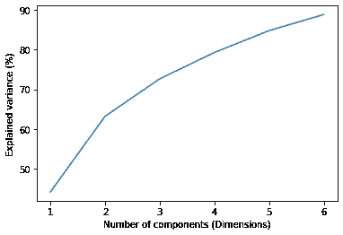

# 使用主成分分析(PCA)进行机器学习

> 原文：<https://towardsdatascience.com/using-principal-component-analysis-pca-for-machine-learning-b6e803f5bf1e>

## 了解如何使用 PCA 来降低数据集的维数


萨姆·张在 [Unsplash](https://unsplash.com?utm_source=medium&utm_medium=referral) 上的照片

在机器学习中，经常会有包含大量特征的*高维度*数据集。高维数据集带来了许多问题，最常见的是过度拟合，这降低了超出训练集中内容的概括能力。因此，您应该采用*降维*技术来减少数据集中的要素数量。**主成分分析** ( **PCA** )就是这样一种技术。

在本文中，我将讨论 PCA 以及如何将它用于机器学习。特别是，我将向您展示如何在一个样本数据集上应用 PCA。

# 什么是主成分分析？

简而言之，PCA 是一种**降维**技术，它将数据集中的一组特征转换为数量更少的特征，称为*主成分*，同时试图在原始数据集中保留尽可能多的信息:



作者图片

> PCA 的主要目的是*减少数据集的变量数量，同时尽可能多地保留信息。*

在本文中，我不解释 PCA 的工作原理，而是将解释留到下面的视频中，该视频提供了一个很好的 PCA 工作原理的演示。

【https://www.youtube.com/watch?v=FgakZw6K1QQ 

理解 PCA 的一个很好的类比是想象自己拍了一张照片。想象你在一场音乐会上，你想通过拍照来捕捉气氛。一张照片只能在二维空间捕捉，而不是在三维空间捕捉大气。虽然维度的减少会导致您丢失一些细节，但是您仍然能够捕获大部分信息。例如，照片中一个人的相对大小告诉我们谁站在前面，谁站在后面。因此，2D 图像仍将使我们能够对大部分信息进行编码，否则这些信息只能在 3D 中获得:


尼古拉斯·格林在 [Unsplash](https://unsplash.com?utm_source=medium&utm_medium=referral) 上的照片

同样，在对数据集应用 PCA 后，减少的特征(称为*主成分*)仍然能够充分表示原始数据集中的信息。

那么在数据集上使用 PCA 有什么优势呢？以下是您希望使用 PCA 的几个原因:

*   **删除相关特征**。PCA 将帮助您移除所有相关的要素，这种现象称为*多重共线性*。查找相关的要素非常耗时，尤其是在要素数量很大的情况下。
*   **提高机器学习算法性能**。随着 PCA 减少了特征的数量，训练模型所需的时间也大大减少了。
*   **减少过拟合**。通过移除数据集中不必要的要素，PCA 有助于克服过度拟合。

另一方面，PCA 也有其缺点:

*   **自变量现在更难解释了**。PCA 把你的特征简化成更少的组件。每个组件现在都是原始特征的线性组合，这使得它的可读性和可解释性更差。
*   **信息丢失**。如果不小心选择正确的组件数量，可能会发生数据丢失。
*   **特征缩放**。因为 PCA 是一个*方差最大化*练习，所以 PCA 要求在处理之前对特征进行缩放。

在数据集中有大量要素的情况下，PCA 非常有用。

> 在机器学习中，PCA 是一种无监督的机器学习算法。

# 使用样本数据集

在这篇文章中，我将使用来自 sklearn 的经典乳腺癌数据集来演示 PCA:

```
from sklearn.datasets import load_breast_cancer
breast_cancer = load_breast_cancer()
```

乳腺癌数据集是说明 PCA 的一个很好的例子，因为它具有大量的特征，并且所有特征的数据类型都是浮点数。让我们打印该数据集中的要素名称和数量:

```
print(breast_cancer.feature_names)
print(len(breast_cancer.feature_names))
```

您应该看到以下内容:

```
['mean radius' 'mean texture' 'mean perimeter' 'mean area'
 'mean smoothness' 'mean compactness' 'mean concavity'
 'mean concave points' 'mean symmetry' 'mean fractal dimension'
 'radius error' 'texture error' 'perimeter error' 'area error'
 'smoothness error' 'compactness error' 'concavity error'
 'concave points error' 'symmetry error' 'fractal dimension error'
 'worst radius' 'worst texture' 'worst perimeter' 'worst area'
 'worst smoothness' 'worst compactness' 'worst concavity'
 'worst concave points' 'worst symmetry' 'worst fractal dimension']
30
```

让我们也打印出目标，并检查目标的含义和目标的分布:

```
import numpy as npprint(breast_cancer.target) 
print(breast_cancer.target_names) 
print(np.array(np.unique(breast_cancer.target, return_counts=True)))
```

您应该会看到类似这样的内容:

```
[0 0 0 0 0 0 0 0 0 0 0 0 0 0 
 ...
 1 1 1 1 1 1 1 0 0 0 0 0 0 1]
['malignant' 'benign']
[[  0   1]
 [212 357]]
```

目标值 0 表示肿瘤是恶性的，而 1 表示肿瘤是良性的。目标不平衡，但不严重。

# 检查特征和目标之间的关系

此时，能够可视化每个特征如何影响诊断是有用的——肿瘤是恶性的还是良性的。让我们为每个特征绘制一个直方图，然后用颜色区分恶性和良性肿瘤:

```
import numpy as np
import matplotlib.pyplot as plt_, axes = plt.subplots(6,5, figsize=(15, 15))malignant = breast_cancer.data[breast_cancer.target==0]
benign = breast_cancer.data[breast_cancer.target==1]ax = axes.ravel()                     # flatten the 2D arrayfor i in range(30):                   # for each of the 30 features
    bins = 40 #---plot histogram for each feature---
    ax[i].hist(malignant[:,i], bins=bins, color='r', alpha=.5)
    ax[i].hist(benign[:,i], bins=bins, color='b', alpha=0.3) #---set the title---
    ax[i].set_title(breast_cancer.feature_names[i], fontsize=12)    #---display the legend---
    ax[i].legend(['malignant','benign'], loc='best', fontsize=8)

plt.tight_layout()
plt.show()
```

您应该会看到以下输出:



作者图片

对于每个特征，如果两个直方图是分开的，这意味着该特征是重要的，并且它直接影响目标(诊断)。例如，如果您查看**平均半径**特征的直方图，您会发现肿瘤越大，肿瘤越有可能是恶性的(红色):



作者图片

另一方面，**平滑度误差**功能并不能真正告诉您肿瘤是恶性还是良性:


作者图片

# 将数据加载到数据帧中

下一步是将乳腺癌数据加载到熊猫数据框架中:

```
import pandas as pddf = pd.DataFrame(breast_cancer.data, 
                  columns = breast_cancer.feature_names)
df['diagnosis'] = breast_cancer.target
df
```

您应该会看到以下输出:


# 方法 1-使用所有特征训练模型

在我们对数据集执行 PCA 之前，让我们使用逻辑回归来训练一个使用数据集中所有 30 个特征的模型，并看看它的表现如何:

```
from sklearn.linear_model import LogisticRegression
from sklearn.model_selection import train_test_splitX = df.iloc[:,:-1]      
y = df.iloc[:,-1]#---perform a split---
random_state = 12
X_train, X_test, y_train, y_test = \
    train_test_split(X, y,
                     test_size = 0.3,
                     shuffle = True,
                     random_state=random_state)#---train the model using Logistic Regression---
log_reg = LogisticRegression(max_iter = 5000)
log_reg.fit(X_train, y_train)#---evaluate the model---
log_reg.score(X_test,y_test)
```

该模型的精度为:

```
0.9239766081871345
```

# 方法 2-使用简化的特征训练模型

对于下一个方法，让我们检查各种特性，并尝试消除那些与目标最不相关的特性。同时，我们还希望移除那些显示多重共线性的特征。目的是减少特征的数量，看看是否可以提高模型的精度。

## 获取相关因子

让我们首先获得每个特征相对于目标(诊断)的相关性:

```
df_corr = df.corr()['diagnosis'].abs().sort_values(ascending=False)
df_corr
```

您应该看到以下内容:

```
diagnosis                  1.000000
worst concave points       0.793566
worst perimeter            0.782914
mean concave points        0.776614
worst radius               0.776454
mean perimeter             0.742636
worst area                 0.733825
mean radius                0.730029
mean area                  0.708984
mean concavity             0.696360
worst concavity            0.659610
mean compactness           0.596534
worst compactness          0.590998
radius error               0.567134
perimeter error            0.556141
area error                 0.548236
worst texture              0.456903
worst smoothness           0.421465
worst symmetry             0.416294
mean texture               0.415185
concave points error       0.408042
mean smoothness            0.358560
mean symmetry              0.330499
worst fractal dimension    0.323872
compactness error          0.292999
concavity error            0.253730
fractal dimension error    0.077972
smoothness error           0.067016
mean fractal dimension     0.012838
texture error              0.008303
symmetry error             0.006522
Name: diagnosis, dtype: float64
```

然后，我们提取与目标具有相对高相关性的所有那些特征(我们任意地将阈值设置为 0.6):

```
# get all the features that has at least 0.6 in correlation to the 
# target
features = df_corr[df_corr > 0.6].index.to_list()[1:]
features                          # without the 'diagnosis' column
```

现在你看到了以下特征:

```
['worst concave points',
 'worst perimeter',
 'mean concave points',
 'worst radius',
 'mean perimeter',
 'worst area',
 'mean radius',
 'mean area',
 'mean concavity',
 'worst concavity']
```

但是很明显，有几个特征是相关的-例如，半径、周长和面积都是相关的。其中一些功能必须删除。

## 检查多重共线性

让我们移除那些显示多重共线性的要素:

```
import pandas as pd
from sklearn.linear_model import LinearRegressiondef calculate_vif(df, features):    
    vif, tolerance = {}, {} # all the features that you want to examine
    for feature in features:
        # extract all the other features you will regress against
        X = [f for f in features if f != feature]        
        X, y = df[X], df[feature] # extract r-squared from the fit
        r2 = LinearRegression().fit(X, y).score(X, y)                

        # calculate tolerance
        tolerance[feature] = 1 - r2 # calculate VIF
        vif[feature] = 1/(tolerance[feature])
    # return VIF DataFrame
    return pd.DataFrame({'VIF': vif, 'Tolerance': tolerance})calculate_vif(df,features)
```

[](/statistics-in-python-collinearity-and-multicollinearity-4cc4dcd82b3f) [## Python 中的统计数据-共线性和多重共线性

### 了解如何发现数据集中的多重共线性

towardsdatascience.com](/statistics-in-python-collinearity-and-multicollinearity-4cc4dcd82b3f) 

您应该会看到以下输出:



作者图片

您的目标是移除 VIF 大于 5 的那些要素。您可以用不同的特性反复调用`calculate_vif()`函数，直到您得到一个所有 VIF 值都小于 5 的特性集。

经过一些尝试，我将范围缩小到 3 个特征:

```
# try to reduce those feature that has high VIF until each feature 
# has VIF less than 5
features = [
 **'worst concave points',
    'mean radius',
    'mean concavity',** ]
calculate_vif(df,features)
```

他们的 VIF 价值观看起来很棒:



作者图片

## 训练模型

随着 30 个特征减少到 3 个，现在让我们使用逻辑回归来训练模型:

```
from sklearn.linear_model import LogisticRegression
from sklearn.model_selection import train_test_splitX = df.loc[:,features]            # get the reduced features in the 
                                  # dataframe
y = df.loc[:,'diagnosis']# perform a split
X_train, X_test, y_train, y_test = \
    train_test_split(X, y, 
                     test_size = 0.3,
                     shuffle = True,                                                    
                     random_state=random_state)log_reg = LogisticRegression()
log_reg.fit(X_train, y_train)
log_reg.score(X_test,y_test)
```

这一次，精确度下降到:

```
0.847953216374269
```

# 方法 3-使用简化特征(PCA)训练模型

最后，让我们将 PCA 应用于数据集，看看是否可以训练出更好的模型。

## 执行标准缩放

还记得 PCA 对缩放很敏感吗？因此，第一步是对 30 个特征执行标准缩放:

```
from sklearn.preprocessing import StandardScaler# get the features and label from the original dataframe
X = df.iloc[:,:-1]
y = df.iloc[:,-1]# performing standardization
sc = StandardScaler()
X_scaled = sc.fit_transform(X)
```

## **应用主成分分析**

您现在可以使用 **sklearn.decomposition** 模块中的`PCA`类将 PCA 应用于特性:

```
from sklearn.decomposition import PCAcomponents = None
pca = PCA(n_components = components)# perform PCA on the scaled data
pca.fit(X_scaled)
```

PCA 类的初始化器有一个名为`n_components`的参数。您可以为其提供下列值之一:

*   一个整数，用于指示要将要素减少到多少个主分量。
*   0
*   【 . In this case, the number of components returned will be the same as the number of original features in the dataset

Once the components are determined using the 【 method, you can print out the *之间的浮点数解释差异*:

```
# print the explained variances
print("Variances (Percentage):")
print(pca.explained_variance_ratio_ * 100)
print()
```

您应该会看到以下输出:

```
Variances (Percentage):
[4.42720256e+01 1.89711820e+01 9.39316326e+00 6.60213492e+00
 5.49576849e+00 4.02452204e+00 2.25073371e+00 1.58872380e+00
 1.38964937e+00 1.16897819e+00 9.79718988e-01 8.70537901e-01
 8.04524987e-01 5.23365745e-01 3.13783217e-01 2.66209337e-01
 1.97996793e-01 1.75395945e-01 1.64925306e-01 1.03864675e-01
 9.99096464e-02 9.14646751e-02 8.11361259e-02 6.01833567e-02
 5.16042379e-02 2.72587995e-02 2.30015463e-02 5.29779290e-03
 2.49601032e-03 4.43482743e-04]
```

那么如何解读上面的输出呢？你可以这样理解:

*   仅第一个分量就捕获了数据中约 44%的可变性
*   第二个捕获了数据中大约 19%的可变性，等等。
*   这 30 个组件总共捕获了 100%的数据可变性。

理解上述结果的一个更简单的方法是打印累积差异:

```
print("Cumulative Variances (Percentage):")
print(pca.explained_variance_ratio_.cumsum() * 100)
print()
```

您现在应该会看到以下输出:

```
Cumulative Variances (Percentage):
[ 44.27202561  63.24320765  72.63637091  79.23850582  84.73427432
  88.75879636  91.00953007  92.59825387  93.98790324  95.15688143
  96.13660042  97.00713832  97.81166331  98.33502905  98.64881227
  98.91502161  99.1130184   99.28841435  99.45333965  99.55720433
  99.65711397  99.74857865  99.82971477  99.88989813  99.94150237
  99.96876117  99.99176271  99.99706051  99.99955652 100\.        ]
```

现在，您可以将累计差异解释如下:

*   仅第一个分量就捕获了数据中约 44%的可变性
*   前两个组件捕获数据中大约 63%的可变性，依此类推。
*   前 8 个分量一起捕获了数据中大约 92.6%的可变性。

查看累积方差的直观方法是绘制 **scree 图**。

> **碎石图**是主成分的线形图。

```
# plot a scree plot
components = len(pca.explained_variance_ratio_) \
    if components is None else componentsplt.plot(range(1,components+1), 
         np.cumsum(pca.explained_variance_ratio_ * 100))
plt.xlabel("Number of components")
plt.ylabel("Explained variance (%)")
```

scree 图使您可以轻松直观地看到捕捉数据中各种可变性所需的组件数量:



作者图片

现在，让我们应用主成分分析，根据期望的解释方差(比如 85%)找到期望的组件数量:

```
from sklearn.decomposition import PCApca = **PCA(n_components = 0.85)**
pca.fit(X_scaled)print("Cumulative Variances (Percentage):")
print(np.cumsum(pca.explained_variance_ratio_ * 100))components = len(pca.explained_variance_ratio_)
print(f'Number of components: {components}')# Make the scree plot
plt.plot(range(1, components + 1), np.cumsum(pca.explained_variance_ratio_ * 100))
plt.xlabel("Number of components")
plt.ylabel("Explained variance (%)")
```

您将获得以下输出:

```
Cumulative Variances (Percentage):
[44.27202561 63.24320765 72.63637091 79.23850582 84.73427432 88.75879636]
Number of components: 6
```

正如您从图表中看到的，需要 6 个组件来涵盖数据中 85%的可变性:



作者图片

您还可以使用`pca`对象的`components_`属性找出对每个组件有贡献的每个特性的重要性:

```
pca_components = abs(**pca.components_**)
print(pca_components)
```

您将看到如下输出:

```
[[2.18902444e-01 1.03724578e-01 2.27537293e-01 2.20994985e-01
  1.42589694e-01 2.39285354e-01 2.58400481e-01 2.60853758e-01
  1.38166959e-01 6.43633464e-02 2.05978776e-01 1.74280281e-02
  2.11325916e-01 2.02869635e-01 1.45314521e-02 1.70393451e-01
  1.53589790e-01 1.83417397e-01 4.24984216e-02 1.02568322e-01
  2.27996634e-01 1.04469325e-01 2.36639681e-01 2.24870533e-01
  1.27952561e-01 2.10095880e-01 2.28767533e-01 2.50885971e-01
  1.22904556e-01 1.31783943e-01]
 [2.33857132e-01 5.97060883e-02 2.15181361e-01 2.31076711e-01
  1.86113023e-01 1.51891610e-01 6.01653628e-02 3.47675005e-02
  1.90348770e-01 3.66575471e-01 1.05552152e-01 8.99796818e-02
  8.94572342e-02 1.52292628e-01 2.04430453e-01 2.32715896e-01
  1.97207283e-01 1.30321560e-01 1.83848000e-01 2.80092027e-01
  2.19866379e-01 4.54672983e-02 1.99878428e-01 2.19351858e-01
  1.72304352e-01 1.43593173e-01 9.79641143e-02 8.25723507e-03
  1.41883349e-01 2.75339469e-01]
 [8.53124284e-03 6.45499033e-02 9.31421972e-03 2.86995259e-02
  1.04291904e-01 7.40915709e-02 2.73383798e-03 2.55635406e-02
  4.02399363e-02 2.25740897e-02 2.68481387e-01 3.74633665e-01
  2.66645367e-01 2.16006528e-01 3.08838979e-01 1.54779718e-01
  1.76463743e-01 2.24657567e-01 2.88584292e-01 2.11503764e-01
  4.75069900e-02 4.22978228e-02 4.85465083e-02 1.19023182e-02
  2.59797613e-01 2.36075625e-01 1.73057335e-01 1.70344076e-01
  2.71312642e-01 2.32791313e-01]
 [4.14089623e-02 6.03050001e-01 4.19830991e-02 5.34337955e-02
  1.59382765e-01 3.17945811e-02 1.91227535e-02 6.53359443e-02
  6.71249840e-02 4.85867649e-02 9.79412418e-02 3.59855528e-01
  8.89924146e-02 1.08205039e-01 4.46641797e-02 2.74693632e-02
  1.31687997e-03 7.40673350e-02 4.40733510e-02 1.53047496e-02
  1.54172396e-02 6.32807885e-01 1.38027944e-02 2.58947492e-02
  1.76522161e-02 9.13284153e-02 7.39511797e-02 6.00699571e-03
  3.62506947e-02 7.70534703e-02]
 [3.77863538e-02 4.94688505e-02 3.73746632e-02 1.03312514e-02
  3.65088528e-01 1.17039713e-02 8.63754118e-02 4.38610252e-02
  3.05941428e-01 4.44243602e-02 1.54456496e-01 1.91650506e-01
  1.20990220e-01 1.27574432e-01 2.32065676e-01 2.79968156e-01
  3.53982091e-01 1.95548089e-01 2.52868765e-01 2.63297438e-01
  4.40659209e-03 9.28834001e-02 7.45415100e-03 2.73909030e-02
  3.24435445e-01 1.21804107e-01 1.88518727e-01 4.33320687e-02
  2.44558663e-01 9.44233510e-02]
 [1.87407904e-02 3.21788366e-02 1.73084449e-02 1.88774796e-03
  2.86374497e-01 1.41309489e-02 9.34418089e-03 5.20499505e-02
  3.56458461e-01 1.19430668e-01 2.56032561e-02 2.87473145e-02
  1.81071500e-03 4.28639079e-02 3.42917393e-01 6.91975186e-02
  5.63432386e-02 3.12244482e-02 4.90245643e-01 5.31952674e-02
  2.90684919e-04 5.00080613e-02 8.50098715e-03 2.51643821e-02
  3.69255370e-01 4.77057929e-02 2.83792555e-02 3.08734498e-02
  4.98926784e-01 8.02235245e-02]]
```

每个要素的重要性通过输出中相应值的大小来反映，大小越大，重要性越高。下图显示了如何解释上述结果:


作者图片

出于好奇，让我们打印出对 6 个组成部分贡献最大的前 4 个特征:

```
print('Top 4 most important features in each component')
print('===============================================')
for row in range(pca_components.shape[0]):
    # get the indices of the top 4 values in each row
    temp = np.argpartition(-(pca_components[row]), 4)

    # sort the indices in descending order
    indices = temp[np.argsort((-pca_components[row])[temp])][:4]

    # print the top 4 feature names
    print(f'Component {row}: {df.columns[indices].to_list()}')
```

您将看到以下输出:

```
Top 4 most important features in each component
===============================================
Component 0: ['mean concave points', 'mean concavity', 
              'worst concave points', 'mean compactness']
Component 1: ['mean fractal dimension', 'fractal dimension error', 
              'worst fractal dimension', 'mean radius']
Component 2: ['texture error', 'smoothness error', 
              'symmetry error', 'worst symmetry']
Component 3: ['worst texture', 'mean texture', 
              'texture error', 'mean smoothness']
Component 4: ['mean smoothness', 'concavity error', 
              'worst smoothness', 'mean symmetry']
Component 5: ['worst symmetry', 'symmetry error', 
              'worst smoothness', 'mean symmetry']
```

## 将所有 30 列转换为 6 个主成分

现在，您可以将数据集中 30 列的标准化数据转换为 6 个主要成分:

```
X_pca = pca.transform(X_scaled)
print(X_pca.shape)
print(X_pca)
```

您应该得到以下输出:

```
(569, 6)
[[ 9.19283683  1.94858307 -1.12316616  
   3.6337309  -1.19511012  1.41142445]
 [ 2.3878018  -3.76817174 -0.52929269  
   1.11826386  0.62177498  0.02865635]
 [ 5.73389628 -1.0751738  -0.55174759  
   0.91208267 -0.1770859   0.54145215]
 ...
 [ 1.25617928 -1.90229671  0.56273053 
   -2.08922702  1.80999133 -0.53444719]
 [10.37479406  1.67201011 -1.87702933 
   -2.35603113 -0.03374193  0.56793647]
 [-5.4752433  -0.67063679  1.49044308
  -2.29915714 -0.18470331  1.61783736]]
```

## 创建机器学习管道

现在，让我们创建一个机器学习管道，以便我们可以正式化整个过程:

```
from sklearn.pipeline import Pipeline
from sklearn.preprocessing import StandardScaler
from sklearn.decomposition import PCA
from sklearn.linear_model import LogisticRegression_sc = StandardScaler()
_pca = PCA(n_components = components)
_model = LogisticRegression()log_regress_model = Pipeline([
    ('std_scaler', _sc),
    ('pca', _pca),
    ('regressor', _model)
])
```

然后，我们将数据集分为训练集和测试集，并使用训练集训练模型:

```
# perform a split
X_train, X_test, y_train, y_test = \
    train_test_split(X, y, 
                     test_size=0.3,
                     shuffle=True, 
                     random_state=random_state)# train the model using the PCA components
log_regress_model.fit(X_train,y_train)
```

让我们对模型进行评分，看看它的表现如何:

```
log_regress_model.score(X_test,y_test)
```

我们现在有以下准确度:

```
0.9824561403508771
```

# 摘要

在本文中，我们讨论了 PCA 背后的思想以及使用它的利与弊。特别是，我们训练了三个模型:

*   使用乳腺癌数据集中的所有 30 个特征
*   仅使用数据集中的 3 个要素
*   将 PCA 应用于数据集，然后使用 6 个组件进行训练

对于您自己的数据集，尝试一下我在本文中演示的各种方法，看看哪种方法性能更好，将会很有用。

## 如果你喜欢阅读我的文章，并且认为它对你的职业/学习有所帮助，请考虑注册成为一名灵媒会员。每月 5 美元，你可以无限制地访问 Medium 上的所有文章(包括我的)。如果你使用下面的链接注册，我会赚一小笔佣金(不需要你额外付费)。你的支持意味着我将能够投入更多的时间来写这样的文章。

[](https://weimenglee.medium.com/membership) [## 加入媒介与我的介绍链接-李伟孟

### 作为一个媒体会员，你的会员费的一部分会给你阅读的作家，你可以完全接触到每一个故事…

weimenglee.medium.com](https://weimenglee.medium.com/membership)