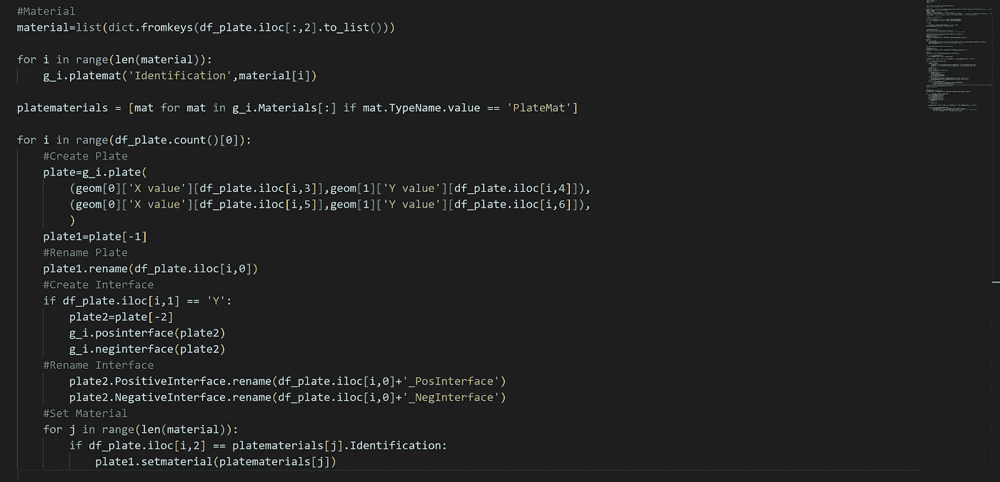
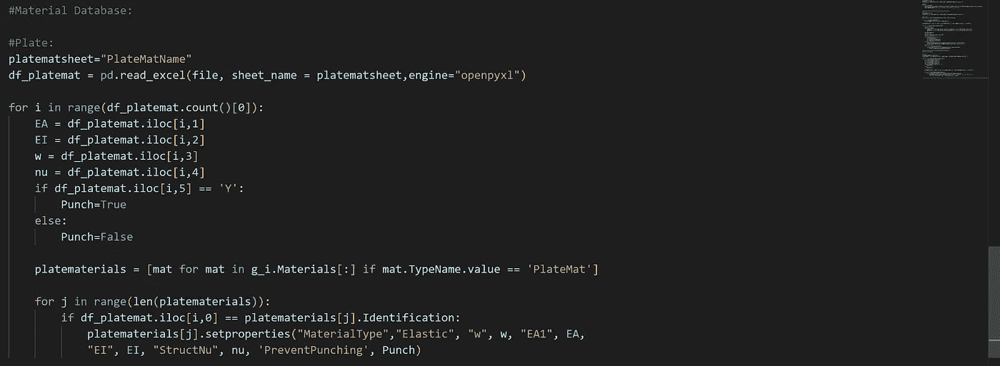
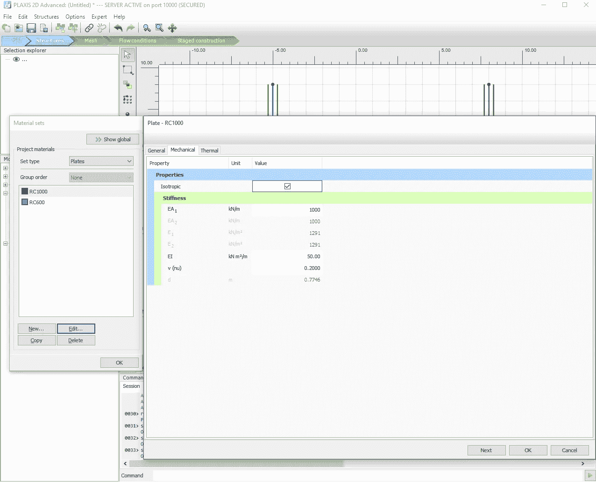

# 使用 Python 与 Excel 交互(PLAXIS 输入)

> 原文：<https://towardsdatascience.com/using-python-to-interact-with-excel-plaxis-input-a2124f6ebc72>

## PLAXIS 自动化系列

## 逐步走向自动化的指南


[Unsplash](https://unsplash.com/s/photos/python-programming?utm_source=unsplash&utm_medium=referral&utm_content=creditCopyText) 上 [AltumCode](https://unsplash.com/@altumcode?utm_source=unsplash&utm_medium=referral&utm_content=creditCopyText) 拍摄的照片

我们都喜欢用户友好的界面。PLAXIS Input app 当然是这样一个界面的好例子。经过很少的训练，初学者可以很容易地创建一个垫基脚模型。

但是，使用鼠标在 PLAXIS 输入中执行操作是非常常见的，如果我们正在处理一个复杂的模型，这可能是一个乏味的过程。当前输入接口有三个限制:

1.  批量几何图形输入非常耗时。虽然“阵列”选项可用，但它仅限于具有相同几何图形的元素。
2.  在对设计进行参数化研究时，我们经常需要重新绘制几何图形，这样效率很低。
3.  每个元素的命名需要手动完成。如果我们有复杂的模型，命名对于阶段来说非常有用。

本教程旨在扩展从**第一教程**中学到的课程。我们将使用 Excel 作为输入几何和材料属性的界面，并在 PLAXIS 中创建板元素。

1.  使用熊猫从 Excel 中读取值
2.  用 Excel 输入几何图形并创建板元素
3.  用 Excel 输入材料属性并分配材料

和以前一样，本教程要求读者已经安装了 VS 代码和 PLAXIS 环境。如果您不熟悉这个页面，请按照下面文章中的说明进行操作。

</start-using-python-to-automate-plaxis-35a5297321e7>  

此外，我们还需要在 PLAXIS 环境中安装 *pandas* 。如果您还没有安装外部模块，请按照下面的说明进行安装。

</plaxis-output-visualisation-using-python-a144d2367094>  

# Excel 输入界面

本教程的最终目标是从 Excel 输入模板中提取值，并使用它们在 PLAXIS 中创建结构元素。因此，定义输入接口非常重要。

我们将创建一个空的 excel 电子表格，将其命名为 **"Input_param"** 。该界面包含三个工作表:

*   几何学
*   盘子
*   PlateMatName


作者截图自 Excel

创建工作表时，请确保它们遵循如上所示的相同名称，因为命名区分大小写。

## 几何学

“几何”工作表的目的是定义结构元素的坐标。这些值将在下一节的“孔板”工作表中使用。它包括如下所示的四列:

1.  距离:定义特定结构元素的 x 坐标名称。例如，“LDWall”定义左侧地下连续墙的 x 坐标。
2.  x 值:将实际的 x 坐标赋给对应的“距离”。例如，我们将-5 m 指定给“LDWall ”,这意味着左侧地下连续墙将从 x = -5 m 开始。
3.  RL:为特定结构元素定义 y 坐标的名称。与“LDWall”类似，“DWallTop”定义了地下连续墙顶部的 y 坐标。

y 值:将实际的 y 坐标赋给对应的“RL”。类似于“X 值”的概念。


作者截图自 Excel

这些坐标定义将用于“板”工作表中。

## 盘子

此工作表的目的是设计多个板元素的属性，包括:

*   名称:如 PLAXIS 中所示(任何不带空格的名称，用下划线代替空格)
*   接口:决定是否应为该元素创建正接口和负接口(Y/N)
*   材料:决定应该将什么材料分配给特定的板(任何不带空格的名称，用下划线代替空格)

X1，Y1，X2 和 Y2:因为 PLAXIS 2D 的板是一条线，它需要两个点的坐标。最后四列使用前面章节中的定义来指定坐标。


作者截图自 Excel

创建此工作表后，我们可以转到最后一个工作表“PlateMatName”。

## PlateMatName

此工作表旨在定义我们在上一节中指定的材料属性。请注意，此处输入的名称需要与“孔板”工作表中给出的名称完全相同。

孔板属性有五个输入:

*   EA(千牛/米)
*   EI (kNm /m)
*   单位重量，w(千牛/米/米)
*   泊松比，v (nu) (-)
*   防止打孔(是/否)


作者截图自 Excel

这些是 PLAXIS 2D 公司的典型材料属性，只是为了确保所有输入属性都采用正确的单位。

本例中使用的值旨在创建一个挖掘模型。确保您已经创建了包含上述工作表和值的 excel 电子表格。

一旦创建了输入文件，我们就可以开始下一步了。

# 步骤 1:使用熊猫从 Excel 中读取值

步骤 1 的主要目标是从“几何”工作表中提取坐标定义，并将值存储为字典，以备后用。

首先，我们创建一个空的 python 文件，并将其命名为“excel_geometry.py”。

## 导入模块并启动服务器

与之前的教程类似，我们将从导入相关模块和启动服务器开始。

```
from plxscripting.easy import *
import subprocess, time
import pandas as pd
import openpyxl

###############################################
PLAXIS_PATH = r'C:\Program Files\Bentley\Geotechnical\PLAXIS 2D CONNECT Edition V22\\Plaxis2DXInput.exe'  # Specify PLAXIS path on server.
PORT_i = 10000  # Define a port number.
PORT_o = 10001
PASSWORD = 'SxDBR<TYKRAX834~'  # Define a password.
subprocess.Popen([PLAXIS_PATH, f'--AppServerPassword={PASSWORD}', f'--AppServerPort={PORT_i}'], shell=False)  # Start the PLAXIS remote scripting service.
time.sleep(5)  # Wait for PLAXIS to boot before sending commands to the scripting service.

# Start the scripting server.
s_i, g_i = new_server('localhost', PORT_i, password=PASSWORD)
s_o, g_o = new_server('localhost', PORT_o, password=PASSWORD)

s_i.new()

g_i.gotostructures()
```

## 读取 Excel 文件

文件位置:C:\ Users \ phtsang \ Desktop \ PLAXIS _ v 22 \ Python _ automation

文件名:我们之前创建的电子表格“Input_param.xlsx”

由于我们要从“Geometry”中提取值，所以我们将使用“pd.read_excel()”，并使用“sheet_name”指定我们要读取的工作表。

```
source=r"C:\Users\phtsang\Desktop\PLAXIS_V22\Python_automation"
file="Input_param"+".xlsx"
geomsheet="Geometry"
df_geom = pd.read_excel(file, sheet_name = geomsheet,engine="openpyxl")
```

字典和数据框架的详细解释可以在以下文章中找到:

</goodbye-boring-plaxis-output-with-python-fc5c8b26cdb2>  

## 读取坐标定义

在这里，我将演示从 dataframe 读取值的第一种方法(把它想象成一个 excel 表)。下面是“几何”工作表的表格。


作者截图自 Excel

假设我们希望提取列 A 和 B，并存储为以“X 值”为标题的字典。这可以通过以下步骤完成:

*   首先，我们需要使用命令' df_geom.columns[]'定位我们想要的列。例如，“df_geom.columns[0]”给出第一个列名“Dist”。对“X 值”列进行同样的操作。
*   下一步是提取指定列名下的所有行。这是在 pandas 中使用双方括号命令完成的:“df_geom[[df_geom.columns[0]，df_geom.columns[0]]”


作者截图自 VS 代码

*   由于我们只想在字典中包含“X 值”，所以我们将“Dist”设置为索引。

```
set_index(df_geom.columns[0])
```

*   最后，我们使用 pandas 命令' to_dict()'将数据帧转换为字典。

合并代码后，它应该看起来像这样:

```
geom=[]
for i in range(2):
    geom1=df_geom[[df_geom.columns[i*2],df_geom.columns[i*2+1]]].set_index(df_geom.columns[i*2]).to_dict()
    geom.append(geom1)
```

*geom* 列表的输出如下所示:

```
[{'X value': {'LDWall': -5.0, 'RDWall': 8.0, 'CentreWall': 1.0}}, {'Y value': {'DWallTop': 9.0, 'DWallBot': -6.0, 'Slab1': 6.5, 'BaseSlab': -1.0}}]
```

通过创建一个字典，我们可以很容易地通过名字来赋值。例如，我可以用下面的代码给一个点赋值-5。这在进行参数研究时特别有用，因为我们可以直观地知道要更改哪些坐标。

```
geom[0]['X value']['LDWall']
```

既然我们已经存储了坐标，那么我们可以使用这些值来创建结构元素。

# 步骤 2:用 Excel 输入几何图形并创建板元素

在步骤 2 中，我们将从“Plates”工作表中提取值，并相应地创建 plate 元素。

一般来说，步骤类似于第一个教程，除了这一次我们需要根据输入表中提供的信息创建元素。它涉及以下行动:

1.  查找唯一的材质名称并创建空材质
2.  遍历表中的元素数
3.  使用用户输入的名称和坐标定义创建板
4.  检查接口要求(是/否),并根据需要创建正接口和负接口。给它们取一个合适的名字。
5.  根据表格中的“材料”栏指定材料

输入表中涉及的信息如下所示。我们将需要它来引用我们的代码。


作者截图自 Excel

*   首先，我们需要从“Plates”工作表中提取值，并存储为“df_plate”。

```
#Plates:
platesheet="Plates"
df_plate = pd.read_excel(file, sheet_name = platesheet,engine="openpyxl")
```

*   然后，我们需要从“材料”列中读取值，并找到唯一的材料(即 RC1000 和 RC600)。要从特定单元格读取值，我们可以使用 pandas 命令' df_plate.iloc[row，column]'。它遵循同样的规则*列出*应该使用索引的数据类型。
*   例如，如果我们想从表中获取“RightDWall”和“BaseSlab”。我们可以使用“df_plate.iloc[1，0]”和“df_plate.iloc[2，0]”。需要注意的是，当使用 *iloc* 时，第一行(标题)被跳过。如果我们想得到所有的行，我们可以写' df_plate.iloc[:，0]'。
*   之后，可以使用' dict.fromkeys()'来查找唯一值。结合我们现有的代码。

```
material=list(dict.fromkeys(df_plate.iloc[:,2].to_list()))
```

*   然后我们可以用上面给定的材质名创建空材质。之后，我们将材质作为对象存储到“platematerials”中。

```
for i in range(len(material)):
    g_i.platemat('Identification',material[i])

platematerials = [mat for mat in g_i.Materials[:] if mat.TypeName.value == 'PlateMat']
```

*   下一步是遍历表中的所有输入元素。

```
for i in range(df_plate.count()[0])
```

*   我们需要使用“g_i.plate((X1，Y1)，(X2，Y2))”的用户输入值来创建板。请参见下面两个使用 iloc 提取特定单元格值的示例。

geom[0]['X 值'][df_plate.iloc[0，3]]从表中定位 D2，因此给出-5(我们对 LDWall 的定义)

geom[1]['X 值'][df_plate.iloc[0，4]]从表中定位 E2，因此给出 9(我们对 DWallTop 的定义)

使用此逻辑，我们可以创建板元素的两个点。

```
#Create Plate
plate=g_i.plate(
    (geom[0]['X value'][df_plate.iloc[i,3]],geom[1]['Y value'][df_plate.iloc[i,4]]),
    (geom[0]['X value'][df_plate.iloc[i,5]],geom[1]['Y value'][df_plate.iloc[i,6]]),
    )
```

*   然后，我们根据“名称”列更改该板的名称。

```
plate1=plate[-1]
plate1.rename(df_plate.iloc[i,0])
```

*   使用 *if* 语句检查是否需要接口。如果为' Y '，则使用' g _ I . po interface(plate)'和' g_i.neginterface(plate)'创建接口。

```
if df_plate.iloc[i,1] == 'Y':
    plate2=plate[-2]
    g_i.posinterface(plate2)
    g_i.neginterface(plate2)
```

*   然后，我使用 PLAXIS 命令' rename()'来命名接口，这样我就有了“LeftDWall_PosInterface”。为每个元素指定一个特定的名称对于登台特别有用。

```
plate2.PositiveInterface.rename(df_plate.iloc[i,0]+'_PosInterface')
        plate2.NegativeInterface.rename(df_plate.iloc[i,0]+'_NegInterface')
```

*   最后一步是根据“材料”栏将材料放置到板上。请记住，我们已经将空材料“RC1000”和“RC600”作为对象存储在“platematerials”中。我们将需要使用 if 来检查表中提供的材料名称。如果材质的名称与现有的材质对象匹配，则使用' plate.setmaterial()'将该材质指定给该板。

```
for j in range(len(material)):
     if df_plate.iloc[i,2] == platematerials[j].Identification:
            plate1.setmaterial(platematerials[j])
```

最终脚本应该如下所示:

```
#Plates:
platesheet="Plates"
df_plate = pd.read_excel(file, sheet_name = platesheet,engine="openpyxl")

#Material
material=list(dict.fromkeys(df_plate.iloc[:,2].to_list()))

for i in range(len(material)):
    g_i.platemat('Identification',material[i])

platematerials = [mat for mat in g_i.Materials[:] if mat.TypeName.value == 'PlateMat']

for i in range(df_plate.count()[0]):
    #Create Plate
    plate=g_i.plate(
        (geom[0]['X value'][df_plate.iloc[i,3]],geom[1]['Y value'][df_plate.iloc[i,4]]),
        (geom[0]['X value'][df_plate.iloc[i,5]],geom[1]['Y value'][df_plate.iloc[i,6]]),
        )
    plate1=plate[-1]
    #Rename Plate
    plate1.rename(df_plate.iloc[i,0])
    #Create Interface
    if df_plate.iloc[i,1] == 'Y':
        plate2=plate[-2]
        g_i.posinterface(plate2)
        g_i.neginterface(plate2)
    #Rename Interface
        plate2.PositiveInterface.rename(df_plate.iloc[i,0]+'_PosInterface')
        plate2.NegativeInterface.rename(df_plate.iloc[i,0]+'_NegInterface')
    #Set Material
    for j in range(len(material)):
        if df_plate.iloc[i,2] == platematerials[j].Identification:
            plate1.setmaterial(platematerials[j])
```



作者截图自 VS 代码

一旦创建了板元素，我们就可以定义我们的材料属性了。

# 步骤 3:用 Excel 输入材料属性并指定材料

在第 3 步中，我们的目标是从“PlateMatName”工作表中提取材质属性，并将这些属性分配给我们在上一节中创建的材质对象(即“RC1000”和“RC600”)。

输入表中涉及的信息如下所示。


作者截图自 Excel

*   与上一步类似，我们首先从“PlateMatName”中读取值，并将它们存储为 dataframe。

```
platematsheet="PlateMatName"
df_platemat = pd.read_excel(file, sheet_name = platematsheet,engine="openpyxl")
```

*   如“Excel 输入界面”下所述，板材属性有五个输入:EA (kN/m)、EI (kNm /m)、单位重量、w (kN/m/m)、泊松比、v (nu) (-)、防冲(Y/N)。
*   我们将遍历表中的行，并使用 iloc 找到每个值，并将它们分配给相应的变量。

```
for i in range(df_platemat.count()[0]):
   EA = df_platemat.iloc[i,1]
   EI = df_platemat.iloc[i,2]
   w = df_platemat.iloc[i,3]
   nu = df_platemat.iloc[i,4]
   if df_platemat.iloc[i,5] == 'Y':
       Punch=True
   else:
       Punch=False
```

*   然后，我们检查“名称”列。如果它与 PLAXIS 中的 material 对象的名称相匹配，我们将属性分配给该对象。

```
platematerials = [mat for mat in g_i.Materials[:] if mat.TypeName.value == 'PlateMat']

for j in range(len(platematerials)):
    if df_platemat.iloc[i,0] == platematerials[j].Identification:
        platematerials[j].setproperties("MaterialType","Elastic", "w", w, "EA1", EA, 
        "EI", EI, "StructNu", nu, 'PreventPunching', Punch)
```

*   最后，使用 PLAXIS 命令' setproperties()'来设置材料属性。

```
platematerials[j].setproperties("MaterialType","Elastic", "w", w, "EA1", EA, "EI", EI, "StructNu", nu, 'PreventPunching', Punch)
```

最终的脚本如下所示:

```
platematsheet="PlateMatName"
df_platemat = pd.read_excel(file, sheet_name = platematsheet,engine="openpyxl")

for i in range(df_platemat.count()[0]):
    EA = df_platemat.iloc[i,1]
    EI = df_platemat.iloc[i,2]
    w = df_platemat.iloc[i,3]
    nu = df_platemat.iloc[i,4]
    if df_platemat.iloc[i,5] == 'Y':
        Punch=True
    else:
        Punch=False

    platematerials = [mat for mat in g_i.Materials[:] if mat.TypeName.value == 'PlateMat']

    for j in range(len(platematerials)):
        if df_platemat.iloc[i,0] == platematerials[j].Identification:
            platematerials[j].setproperties("MaterialType","Elastic", "w", w, "EA1", EA, 
            "EI", EI, "StructNu", nu, 'PreventPunching', Punch)
```



作者截图自 VS 代码

使用以下命令运行脚本。

```
(PLAXIS) C:\Users\phtsang\Desktop\PLAXIS_V22\Python_automation>python excel_geometry.py
```

你应该看到以下是在 2D 普拉西斯创建的。正如您在 Model explorer 中看到的，我们创建的所有板都有我们在输入表中指定的名称。


作者截图自 PLAXIS

就材料而言，RC1000 和 RC600 具有我们在表中指定的特性。



作者截图自 PLAXIS

精彩！我们刚刚为 2D PLAXIS 创建了一个用户界面。

# 结论

以上是关于使用 Python 与 Excel 交互的第四篇教程。学完本教程后，您应该能够从 excel 获得输入，创建多个结构元素，并在 PLAXIS 中分配材料属性。

如果你喜欢阅读这类内容，请随时关注我的页面。我将继续发布这一系列关于用 Python 自动化 PLAXIS 的教程。除此之外，我还热衷于分享关于如何使用 Python 来自动化工程中的工作流的知识。

你可以在我的 [Github](https://github.com/philiptsangeic/PLAXIS_Python_Automation/blob/master/excel_geometry.py) 上找到这篇文章中演示的代码。