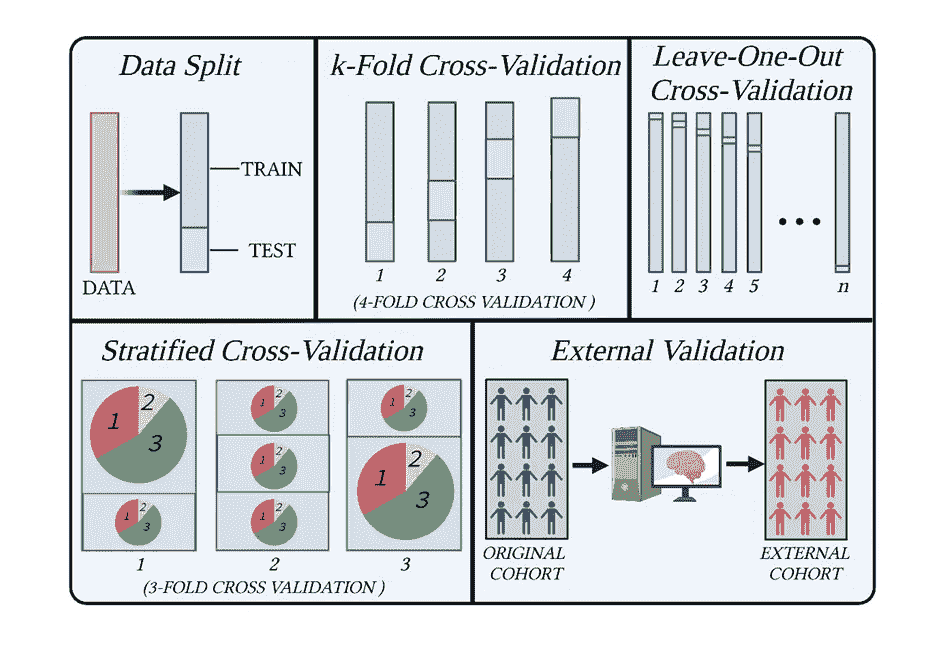
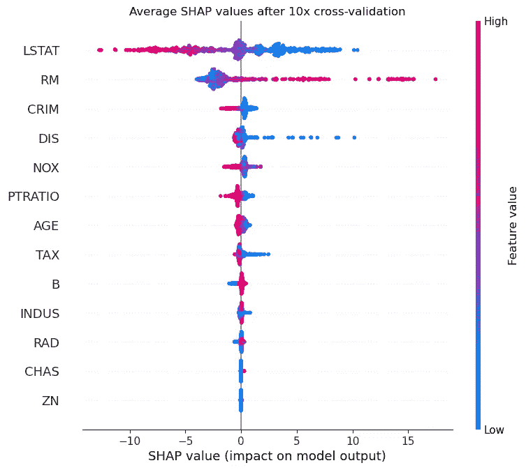
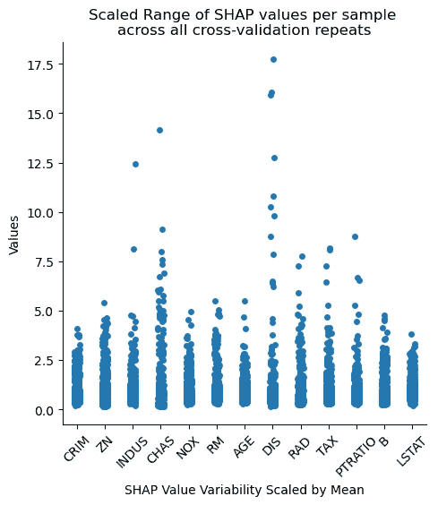

# 在 Python 中使用 SHAP 和交叉验证

> 原文：<https://towardsdatascience.com/using-shap-with-cross-validation-d24af548fadc>

## *让人工智能不仅可解释，而且更强大*

照片来自[的迈克尔·泽兹奇](https://unsplash.com/it/@lazycreekimages?utm_source=unsplash&utm_medium=referral&utm_content=creditCopyText)在 [Unsplash](https://unsplash.com/es/fotos/nbW-kaz2BlE?utm_source=unsplash&utm_medium=referral&utm_content=creditCopyText)

**简介**

在许多情况下，机器学习模型比传统的线性模型更受青睐，因为它们具有卓越的预测性能和处理复杂非线性数据的能力。然而，对机器学习模型的一个常见批评是它们缺乏可解释性。例如，XGBoost 和 Random Forest 等[集成方法](/ensemble-methods-in-machine-learning-what-are-they-and-why-use-them-68ec3f9fef5f)将许多个体学习者的结果组合起来，以生成他们的结果。虽然这通常会带来更好的性能，但却很难知道数据集中每个要素对输出的贡献。

为了解决这个问题，可解释的人工智能(xAI)已经被提出，并且越来越受欢迎。xAI 领域旨在解释这种无法解释的模型(所谓的黑盒模型)如何做出预测，从而实现两个世界的最佳效果:预测准确性和可解释性。这样做的动机是，机器学习的许多现实应用不仅需要良好的预测性能，还需要解释结果是如何产生的。例如，在医疗领域，根据模型做出的决策，可能会失去或挽救生命，了解决策的驱动因素非常重要。此外，能够识别重要的变量可以为识别机制或治疗途径提供信息。

最流行和最有效的 xAI 技术之一是 SHAP。SHAP 的概念是由[伦德伯格&李](https://arxiv.org/pdf/1705.07874.pdf)在 2017 年提出的，但实际上是建立在很久以前就存在的博弈论[沙普利价值观](https://www.rand.org/content/dam/rand/pubs/papers/2021/P295.pdf)的基础上。简而言之，SHAP 值的工作原理是通过查看具有和不具有该特征的许多模型中的预测(每个观测值)来计算每个特征的边际贡献，在每个缩减的特征集模型中对该贡献进行加权，然后对所有这些实例的加权贡献进行求和。那些希望得到更详细描述的人可以看到上面的链接，但是对于我们的目的来说，只需要说:观测的绝对 SHAP 值越大，对预测的影响就越大。因此，给定特征的所有观测值的绝对 SHAP 值的平均值越大，该特征就越重要。

使用 [SHAP 库](https://shap-lrjball.readthedocs.io/en/latest/index.html)在 Python 中实现 SHAP 值很容易，网上已经有很多讲解如何实现的演练。然而，在我遇到的所有将 SHAP 值融入 Python 代码的指南中，我发现了两个主要缺点。

首先，大多数指南在基本训练/测试分割中使用 SHAP 值，但在交叉验证中不使用(见图 1)。使用交叉验证可以更好地了解结果的可归纳性，而简单的训练/测试分割的结果很容易根据数据的划分方式发生剧烈变化。正如我在最近一篇关于“[营养学研究中的机器学习](https://academic.oup.com/advances/advance-article/doi/10.1093/advances/nmac103/6724380)”的文章中解释的那样，交叉验证应该*几乎总是*优先于训练/测试分割，除非你正在处理的数据集非常大。

图 1:机器学习中不同的评估程序，摘自我的文章《营养学研究中的机器学习》(Kirk et al .，2022)。

另一个缺点是，我遇到的所有指南都没有使用*多次重复*的交叉验证来得出他们的 SHAP 值。虽然交叉验证对简单的训练/测试分割是一个很大的改进，但理想情况下，每次应该使用不同的数据分割重复多次。这对于较小的数据集尤其重要，因为根据数据的分割方式，结果可能会有很大的变化。这就是为什么[经常提倡](https://www.fharrell.com/post/split-val/)重复交叉验证 100 次，以便对你的结果有信心。

为了解决这些缺点，我决定自己编写一些代码来实现它。本演练将向您展示如何在公司的[嵌套交叉验证方案](https://ploomber.io/blog/nested-cv/)中获得多次重复交叉验证的 SHAP 值。对于我们的模型数据集，我们将使用[波士顿住房数据集](https://www.cs.toronto.edu/~delve/data/boston/bostonDetail.html)，我们选择的算法将是强大但不可解释的[随机森林](/understanding-random-forest-58381e0602d2)。

**SHAP 值的实现**

每当你像我们一样用不同的循环构建代码时，从最里面的循环开始向外工作通常是有意义的。通过尝试从外部开始，并按照代码运行的顺序构建代码，当出现问题时，更容易混淆，也更难排除故障。

因此，我们从 SHAP 价值观的基本实现开始。我假设您熟悉 SHAP 的一般用法以及实现它的代码，所以我不会花太多时间来解释。我自始至终都留下了评论(这总是很好的做法)，这样你就可以检查那些评论，如果你仍然不确定，那么检查一下介绍中的链接或者库的[文档](https://shap-lrjball.readthedocs.io/en/latest/index.html)。我也在使用时导入库，而不是一开始就一次导入，只是为了帮助直觉。

图 2: SHAP 在一次简单的训练/测试中

**采用 SHAP 值进行交叉验证**

我们最常看到的是通过使用`sklearn`的`cross_val_score`或类似的东西以自动化的方式实现交叉验证。这样做的问题是一切都发生在幕后，我们无法访问每个文件夹中的数据。当然，如果我们想获得所有数据点的 SHAP 值，我们需要访问每个数据点(回想一下，每个数据点在测试集中只使用一次，在训练中使用`k-1`次)。为了解决这个问题，我们可以结合使用`KFold`和`.split`。

通过用`.split`循环遍历我们的`KFold`对象，我们可以得到每个折叠的训练和测试指数。这里，`fold`是一个元组，其中`fold[0]`是训练索引，`fold[1]`是每个折叠的测试索引。

现在，我们可以利用这一点从我们自己的原始数据框架中选择训练和测试数据，从而也提取我们想要的信息。我们通过建立一个新的`for`循环来实现这一点，并获得每个折叠的训练和测试指数，然后像往常一样简单地执行我们的回归和 SHAP 过程。然后，我们只需要在循环之外添加一个空列表来跟踪每个样本的 SHAP 值，然后在循环的末尾添加这些值。我使用`#-#-#`来表示这些新增内容:

现在，我们有了每个样本的 SHAP 值，而不仅仅是数据的一个测试分割中的样本，我们可以使用`SHAP`库轻松地绘制这些值。我们首先只需更新`X`的索引，以匹配它们在每个折叠的每个测试集中出现的顺序，否则，颜色编码的特征值将全部错误。请注意，我们在`summary_plot`函数中对`X`进行了重新排序，这样我们就不会保存对原始`X`数据帧的更改。

图 3:交叉验证的 SHAP，包括所有的数据点

从图中我们可以看到，与我们只使用训练/测试分割相比，现在有了更多的数据点(事实上是所有数据点)。这已经改进了我们的过程，因为我们可以利用整个数据集，而不仅仅是一部分。

但是我们仍然不知道稳定性——也就是说，如果数据被不同地分割，结果会如何变化。幸运的是，通过下面的代码我们可以解决这个问题。

**重复交叉验证**

使用交叉验证大大提高了工作的稳定性，尤其是对于较小的数据集。然而，如果我们真的想做好数据科学，交叉验证应该在许多不同的数据分割上重复进行。

首先，我们现在不仅需要考虑每个折叠的 SHAP 值，还需要考虑每个重复的每个折叠*的 SHAP 值，然后将它们组合起来绘制在一个图上。在 Python 中，字典是强大的工具，我们将使用它来跟踪每个折叠中每个样本的 SHAP 值。*

首先，我们决定要进行多少次交叉验证重复，然后建立一个字典，存储每个重复的每个样本的 SHAP 值。这是通过遍历数据集中的所有样本并在空字典中为它们创建一个键，然后在每个样本中创建另一个键来表示交叉验证重复来实现的。

然后，我们在现有代码中添加一些新行，允许我们重复交叉验证过程`CV_repeats` 次次，并将每次重复的 SHAP 值添加到我们的字典中。这很容易通过更新代码末尾的一些行来实现，因此我们现在更新字典，而不是将每个样本的 SHAP 值列表追加到列表中。(注意:收集每次折叠的测试分数可能也是相关的，虽然我们在这里没有这样做，因为重点是使用 SHAP 值，这可以通过添加另一个字典来轻松更新，用`CV repeats`作为`keys`，用测试分数作为`values`)。

代码如下所示，`#-#-#`表示现有代码的升级:

为了形象化，假设我们要检查索引号为`10`的样本的第五次交叉验证重复，我们只需写:

其中第一个方括号表示样品编号，第二个表示重复编号。输出是第五次交叉验证重复后，编号为 10 的样本的`X`中每一列的 SHAP 值。

要查看一个个体的所有交叉验证重复的 SHAP 值，我们只需在第一个方括号中键入数字:

然而，这对于我们来说并没有太大的用处(除了故障排除之外)。我们真正需要的是一个将此形象化的情节。

我们首先需要将每个交叉验证重复的每个样本的 SHAP 值平均为一个值，用于绘图(如果您愿意，也可以使用中值或其他统计数据)。取平均值很方便，但可能会隐藏数据中的可变性，而这些可变性可能也是需要了解的。因此，当我们取平均值时，我们还会得到其他统计数据，如最小值、最大值和标准差:

上面的代码说明:对于原始数据框中的每个样本索引，从每个 SHAP 值列表中创建一个数据框(即每个交叉验证重复)。该数据框将每个交叉验证重复作为一行，将每个`X`变量作为一列。现在，我们通过使用适当的函数并使用`axis = 1`来执行列方式的计算，来获取每列的平均值、标准偏差、最小值和最大值。然后，我们将这些转换成数据帧

现在，我们简单地绘制平均值，就像绘制通常值一样。我们也不需要在这里对索引重新排序，因为我们从字典中获取 SHAP 值，它与`X`的顺序相同。

图 4:多次重复交叉验证后的平均 SHAP 值

由于我们的结果是多次重复交叉验证的平均值，因此它们比仅执行一次的简单训练/测试分割更加稳健和可信。然而，如果您比较前后的图，发现除了额外的数据点之外，没有太多变化，您可能会感到失望。但是不要忘记，我们使用的是一个模型数据集，它漂亮整洁，具有与结果密切相关的良好特性。在不太理想化的情况下，像重复交叉验证这样的技术将暴露现实世界数据在结果和特征重要性方面的不稳定性。

如果我们想进一步增强我们的结果(我们当然会这样做)，我们可以添加一些图来了解我们提出的特征重要性的可变性。这是相关的，因为取每个样本的平均 SHAP 值可能会掩盖它们随着数据的不同分割而变化的程度。

为此，我们必须将我们的数据帧转换成长格式的数据帧，之后我们可以使用 T4 库创建一个数据帧

图 5:每个特征每次观察的最大和最小 SHAP 值的范围

在上面的`catplot`中，我们看到了每个样本在`CV repeats`的每次重复中的范围(最大值-最小值)。理想情况下，我们希望 Y 轴上的值尽可能小，因为这意味着更一致的特征重要性。

我们应该记住，这种可变性对绝对特征重要性也很敏感，也就是说，被认为更重要的特征自然会有范围更大的数据点。我们可以通过缩放数据来部分解释这一点。

图 6:和图 5 一样，但是现在每个观察值都是由每个特征的平均值来衡量的

请注意`LSTAT`和`RM`的不同之处，这是我们最重要的两个特征。现在，我们得到了一个更好的可变性反映，它是由特性的整体重要性来衡量的，根据我们的研究问题，它可能更相关，也可能不相关。

我们可以根据我们收集到的其他统计数据，比如标准差，想象出类似的图表。

**嵌套交叉验证**

所有这些都很棒，但是有一点还没做到:我们的随机森林处于默认模式。虽然它在使用默认参数的数据集上表现很好，但在其他情况下可能不是这样。除此之外，我们为什么不尝试最大化我们的结果呢？

我们应该小心不要陷入一个陷阱，这个陷阱似乎在这些天的机器学习示例中太常见了，即优化测试集中也存在的数据的模型超参数。通过简单的训练/测试分割，这很容易避免——只需优化训练数据的超参数。

但是一旦交叉验证进入等式，这个概念似乎就被遗忘了。事实上，人们经常使用交叉验证来优化超参数，然后使用交叉验证来对模型评分。在这种情况下，数据泄漏已经发生，我们的结果将(即使只是轻微地)过于乐观。

嵌套交叉验证是我们的解决方案。它包括从我们的正常交叉验证方案(这里称为“外环”)中取出每个训练折叠，并通过对每个折叠的训练数据使用另一个交叉验证(称为“内环”)来优化超参数。这意味着我们在训练数据上优化超参数，然后仍然可以获得关于优化的模型在看不见的数据上表现如何的较少偏差的想法。

这个概念可能有点难以理解，但对于那些希望了解更多细节的人，我解释一下[，我的文章链接在上面](https://academic.oup.com/advances/advance-article/doi/10.1093/advances/nmac103/6724380)。无论如何，代码并不困难，通读它可能有助于理解。事实上，我们已经在上面的过程中准备了很多代码，只需要做一些小的调整。让我们看看它的实际效果。

嵌套交叉验证的主要考虑——特别是我们使用的许多重复——是它需要大量的时间来运行。出于这个原因，我们将保持我们的参数空间很小，并使用随机搜索而不是网格搜索(尽管随机搜索通常[在大多数情况下足够](https://www.jmlr.org/papers/volume13/bergstra12a/bergstra12a.pdf)执行)。如果您确实想要更彻底，您可能需要在 HPC 上预留一些时间。无论如何，在我们最初的 for 循环之外，我们将建立参数空间:

然后，我们对原始代码进行以下更改:

*   `CV`现在将变成`cv_outer`,因为我们现在有两个交叉验证，我们需要适当地引用每一个
*   在我们的`for`循环中，我们遍历训练和测试 id，我们添加了内部交叉验证方案`cv_inner`
*   然后，我们使用`RandomizedSearchCV`在`inner_cv`优化我们的模型，选择我们的最佳模型，然后使用最佳模型从测试数据(这里的测试数据是外折测试)中导出 SHAP 值。

仅此而已。出于演示的目的，我们将`CV_repeats`减少到 2，否则我们可能会在这里停留一段时间。在实际情况下，您可能希望保持足够高的值，以保持稳健的结果和最佳的参数，对此您可能没有 HPC(或很大的耐心)。

查看下面的代码了解这些变化，再次用`#-#-#`表示新添加的内容。

**结论**

解释复杂人工智能模型的能力变得越来越重要。SHAP 值是一种很好的方法，但是，单个训练/测试分割的结果并不总是可信的，尤其是在较小的数据集中。通过多次重复诸如(嵌套)交叉验证之类的过程，您可以提高结果的稳健性，并且可以更好地衡量如果基础数据也发生了变化，您的结果会如何变化。

注:所有未经编辑的图片均为本人所有。