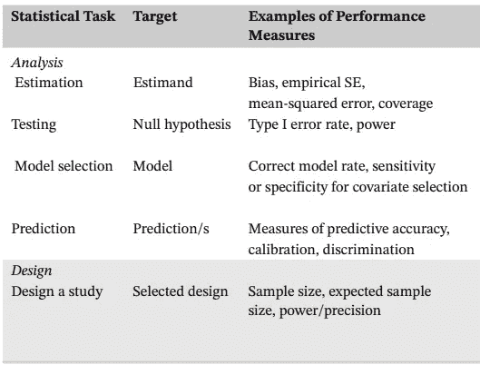

# 利用模拟研究推动建模决策

> 原文：<https://towardsdatascience.com/using-simulation-studies-to-motivate-modelling-decisions-be8bae2cd1c2>

## 模拟研究是计算机实验，涉及通过伪随机采样创建数据。使用模拟研究可以帮助您在选择统计模型时做出更好的决策。

马库斯·斯皮斯克在 [Unsplash](https://unsplash.com?utm_source=medium&utm_medium=referral) 上的照片

数据科学家和分析师不断决定使用哪些统计模型。无论是预测性的还是因果性的，选择比比皆是。这篇文章是关于**使用模拟研究来激励建模决策，特别是当重点是点估计**时，例如计算治疗效果。

当在预测模型中进行选择时，人们通常可以使用测试数据上的性能度量来激励最佳模型选择(例如，在测试集上偏好具有更高*精度*比率的模型)。预测模型中的性能指标通常使用观察到的数据进行计算(例如，测试集中定义为*真阳性*对*预测阳性*的精确率)。

在*估计需求*未知的因果设置中，这样的程序是不可行的。例如，假设我们的任务是评估一种新药在临床试验中的**效果。**

> 因为我们不知道真实的效果，我们不能对模型如何根据真实情况估计治疗效果进行基准测试，这与预测模型不同，在预测模型中，我们知道真实的标签，并可以根据它们评估我们的模型预测的性能。

这就是模拟研究发挥作用的地方。
**模拟研究是计算机实验，涉及通过伪随机采样创建数据**，对于评估新方法的性能或比较替代方法的表现至关重要。因此，模拟研究为统计方法在各种情况下的表现提供了经验证据。这里有几个简单的例子:

*   *我应该使用 t 检验还是非参数检验？*
*   *在给定的环境下，使用线性回归和广义线性模型会有什么影响？*
*   运行统计测试时，我没有完全满足模型假设。我还能用吗？我的估计会有多大偏差？

这种决定通常是基于文献知识或过去的经验做出的，但是决定使用哪种模型会对一个人试图做出的推断产生相当大的影响。例如，*第一类*和*第二类*误差很大程度上取决于使用的方法，和/或满足他们的假设。

在本文中，我将(I)介绍模拟研究的使用，并讨论如何基于莫里斯等人(2019)的框架设计和评估其结果。然后，我将(II)提供一个基于我个人经验的评估新方法的具体应用，和(III)讨论模拟研究的一些限制和陷阱。

# 模拟研究:什么是模拟研究，如何设计模拟研究，以及如何评估结果

模拟研究可用于许多场合。最常见的用途是:

*   评估新的或现有的统计方法
*   比较两种或多种统计方法
*   设计研究时计算样本量或统计功效
*   评估有限样本中大样本理论近似的相关性
*   数学推导统计方法时的双重检查代数

在这篇文章中，我将关注使用模拟研究评估方法的**。我将描述 ADEMP 结构，这是 Morris 等人 2019 年定义的模拟研究的系统框架。**

## ADEMP 框架:目标、数据生成、估算、方法、绩效衡量(Morris 等人，2019 年)

## 目的

在评估方法的性能时，我们通常对**统计偏差、方差估计和/或对错误设定的稳健性**感兴趣。在其他环境中，人们可能对寻找评估方法失败的场景感兴趣(例如，当一种方法正确时，其他方法失败的程度如何？或者，当所有都不正确时，哪个是最稳健的？).

为了说明这一点，让我们假设我们有一些计数数据，并且我们正在尝试估计一个治疗效果。我们可以选择:
-使用简单的线性回归(忽略结果数据的分布性质)，使用泊松回归(假设乘法效应和相等的均值和方差)，或者使用准泊松回归(进一步假设方差是均值的线性函数)

哪一种表现最好取决于许多因素，包括数据分布的性质(偏斜度、零膨胀的存在、稀疏度等。).因此，我们可能希望通过模拟来了解这些模型的行为。但是一般来说，当文献中缺乏指导，或者当方法新颖时，模拟研究是令人感兴趣的。有大量关于回归及其假设的文献，因此专家可能对上述模拟不感兴趣。

## 数据生成机制

数据生成机制是关于如何使用随机数来生成用于模拟的数据集。这是分析师在设计模拟研究时通常花费大部分时间的地方。可以使用已知分布中的参数绘制来生成数据，或者通过替换现有数据集进行采样来生成数据。通常会模拟一些场景，例如使用不同的样本大小和/或效果大小。

## ***预计***

大多数模拟研究比较估计人口数量的方法，人口数量通常是数据生成过程中的模拟参数。例如，*估计需求*可以是线性回归的参数*β*。其他模拟研究关注的是评估检验零假设或研究设计的方法。在给定的设置(“目标”)下，一些绩效指标比其他指标更合适，详见下表(**表 1** )。

表 1:模拟研究的可能目标和相关性能测量(Morris 等人，2019 年)

## 方法

在比较两种方法时，Morris 等人认为，利用该领域先前工作的知识，了解哪些方法是竞争者，哪些不是，这一点很重要。根据作者的观点，如果一些方法已经被证明是有缺陷的，它们应该被排除在模拟之外，因为这只会增加计算负担。

## **绩效评估**

性能度量是用于评估方法性能的数量。如前所述，它们取决于研究的目的和目标。当目标是一个*估计量*时，**统计偏差**通常是感兴趣的量(真实参数 *theta* 与模型估计参数*theta hat*之差)，以及**精度**和**置信区间**。当目标是零假设检验时，**功效**和**I 型误差**一般是主要关注点。
重要的是，模拟研究的一个基本方面是，因为它们本质上是经验性的，性能测量本身会有误差，这意味着分析师应该给出不确定性的估计值(蒙特卡罗标准误差)，并小心选择重复的次数。**下面的表 2** 提供了常用性能指标的定义、估计值和蒙特卡罗 SE 估计值。

表 2:业绩计量:定义、估计和蒙特卡罗标准误差(Morris 等人，2019 年)

# II-模拟研究的示例

对于这个特殊的模拟，我感兴趣的是评估在各种混杂和选择偏差情况下治疗效果评估模型的性能。我使用医疗索赔数据(结果通常是零膨胀和偏斜的)并使用治疗效果估计方法模拟治疗效果。我的目标是恢复模拟治疗效果。

我将使用 ADEMP 框架分解模拟研究步骤:

## 我的模拟研究的目的(A)

混杂、选择偏倚、小效应量和/或样本量使得测量治疗效果具有挑战性。这个模拟的想法是评估“*因果推理机器学习”*模型的性能，并将它们与更标准的倾向得分匹配和逆概率加权方法进行比较。

换句话说，**的目的**(见上文，ADEMP 中的 A)是评估统计偏差(和方差),这样我就可以知道倾向得分匹配、逆概率加权或 *grf* 因果森林算法(Athey et al .al，2019)很可能在我的数据集中表现最好。

## 我的模拟研究中的数据生成机制(D)

**生成数据(y，X)，使用有替换或无替换的采样** 在我的案例中，我从一个大型索赔数据集中进行了无替换采样。
**y** 表示住院人数
**X** 表示协变量矩阵，包括人口统计和健康风险信息。

**使用倾向得分函数** **p(T=1|X)** 生成治疗分配机制在我的情况下，该函数基于正态分布的 c.d.f，其映射到[0；1].
**T =1** 表示观察值在治疗组中
**X** 表示协变量矩阵，包括人口统计学和健康风险信息

到目前为止，我已经创建了一个虚拟的治疗组和对照组，它们的基线特征不同，因为治疗分配机制依赖于一个依赖于协变量 X 的函数。

**产生虚构的治疗效果。**
我模拟研究的最后一步是生成一个虚构的治疗效果。我使用负二项分布生成了治疗组较少的住院天数，该分布与住院数据吻合良好。

## 我的模拟研究中使用的方法(M)

目的是比较这三种方法的性能。

**方法 1:** 倾向评分匹配模型，以平衡治疗组和对照组之间的协变量，然后进行回归分析，以测量治疗组和对照组之间的 *y* =“住院人数”的差异。
**方法 2:** 一种倾向评分加权模型，用于平衡治疗组和对照组之间的协变量，使用具有重叠加权的回归来测量治疗组和对照组之间的 *y* =“住院人数”的差异。
**方法三:**Athey 等人的因果森林算法(R 包 *grf* )。al (2019)基于随机森林算法对异质处理效果估计的推广。

## 我的模拟研究中的绩效评估(P)

对于性能评估，我比较了偏倚、标准误差、MSE、覆盖率、统计功效和 1 型错误率。

## **结果**

我发现，在不同的样本量和效应量下，倾向得分匹配的表现更差。GRF 算法提供了最好的性能，其次是重叠加权回归。

# 模拟研究的局限性和陷阱

## 情境化模拟结果

模拟研究在模拟框架内有效，不能推广到不同的数据或人群。他们的结论也没有延伸到不同的场景或背景。例如，上述模拟假设治疗效果遵循负二项式分布。如果这是对事实的严重偏离，我的模拟就会有偏差。

## 不确定性的报告措施

当基于不同的随机数时，蒙特卡罗程序会给出不同的结果，并且其构造会受到不确定性的影响。在报告模拟结果时，不确定性的度量应该是不可避免的。

## 如何更好地进行模拟学习

莫里斯等人对检查数据估计值提出了一些建议。
对于针对*估计需求的模拟研究，*他们鼓励分析师绘制“*theta hat”*(经验估计量)及其标准误差的分布图，并特别关注异常值。

需要适当选择模拟数量“*N _ sim”*，因为它会影响蒙特卡洛误差，而蒙特卡洛误差会影响关键性能指标。这种选择通常是精度和计算时间之间的权衡。

呈现和可视化结果是模拟研究的一个非常重要的部分。结果通常以表格和图表的形式呈现。除了估计值及其标准误差的二元图之外，作者建议使用 zip 图表示置信区间，棒棒糖图表示性能测量。要了解更多的技术细节，我建议看看下面参考资料中提到的论文。

**资料来源:** *利用模拟研究评估统计方法，Tim P. Morris 等人，统计学在医学中，2018*