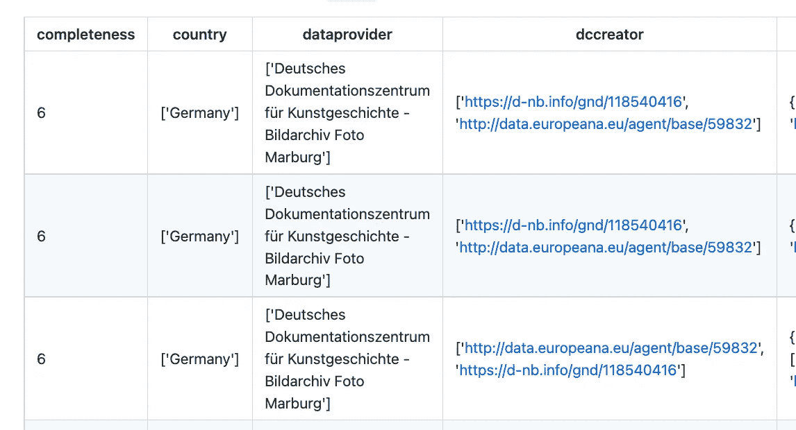

# 使用通用数据工具包从 REST API 获取和处理数据

> 原文：<https://towardsdatascience.com/using-versatile-data-kit-to-ingest-and-process-data-from-rest-api-6e3e0660b791>

## 数据库ˌ资料库

## 关于如何使用通用数据工具包(VDK)从 REST API 获取数据的教程，以及一些关于如何安装 VDK 服务器的提示。


凯文·Ku 在 [Unsplash](https://unsplash.com?utm_source=medium&utm_medium=referral) 上的照片

[多功能数据套件](https://github.com/vmware/versatile-data-kit) (VDK)是一个开源框架，最近由 VMware 发布。它与一个数据湖一起工作，您可以接收不同格式的数据，然后轻松地访问它们。在我上一篇题为[多功能数据工具包概述](/an-overview-of-versatile-data-kit-a812cfb26de7)的文章中，我描述了 VDK 背后的主要概念，包括安装它的分步指南。在我的下一篇文章中，名为[从原始数据到干净的数据库:深入了解多功能数据工具包](/from-raw-data-to-a-cleaned-database-a-deep-dive-into-versatile-data-kit-ab5fd992a02e)，我展示了如何连接 VDK 和 Trino DB，以及如何接收和处理 CSV 文件。

在本文中，我为您提供了 VDK 的另一个例子，从 REST API 中提取数据。因为访问 REST API 需要一个秘密密钥，所以我还描述了如何配置 VDK 服务器来存储这个秘密。

文章组织如下:

*   场景的定义
*   环境设置
*   VDK 的数据接收
*   VDK 的数据处理

# 1 情景的定义

这个场景的目标是在 VDK 摄取和处理文森特·梵高在著名的欧洲文化遗产平台 [Europeana](https://www.europeana.eu/) 上的画作。Europeana 通过其 public [REST API](https://pro.europeana.eu/page/intro#access) 提供所有文化遗产对象。Europeana 提供了 700 多幅作品，其作者是文森特·梵高。对于每个记录，REST API 提供了很多信息，包括完整性、国家、数据提供者、创建者、标题等等。

以下 JSON 显示了由 Europeana REST API 返回的记录摘录:

```
[{
    completeness: 10,
    country: ["Belgium"],
    dataProvider: ["Catholic University of Leuven"],
    dcCreator: ["http://data.europeana.eu/agent/base/59832",
    "Vincent van Gogh"],
    dcCreatorLangAware: {
        def: ["http://data.europeana.eu/agent/base/59832"],
        en:  ["Vincent van Gogh"]
    },
    dcDescription:
        ["KU Leuven. Glasdia’s kunstgeschiedenis. Université de Louvain, tussen 1839 en 1939\. Fotograaf onbekend. Toegevoegde informatie op dia. Stroming/Stijl: Postimpressionisme. Creatie/Bouw: 1889\. Techniek/Materiaal: Olieverf op doek. Huidige locatie: Nederland, Otterlo, Kröller-Müller Museum. EuroPhot. Kunstgeschiedenis. 19de eeuw. Schilderkunst. Portret. EuroPhot. Art history. 19th century. Paintings. Portrait."],
        ...
}]
```

REST API 的访问点可从以下链接获得:

```
[https://api.europeana.eu/record/v2/search.json](https://api.europeana.eu/record/v2/search.json)
```

需要[免费注册](https://pro.europeana.eu/pages/get-api)才能获得 API 密钥。

# 2 环境设置

要运行这个示例，我需要:

*   多功能数据工具包
*   Trino DB
*   Trino 的多功能数据工具包插件
*   多功能数据套件服务器
*   欧洲 API 密钥

在[我的上一篇文章](/from-raw-data-to-a-cleaned-database-a-deep-dive-into-versatile-data-kit-ab5fd992a02e)中，我已经介绍了如何配置 Trino DB 和 Trino 的通用数据工具包插件，如果需要安装可以参考一下。

## **2.1 多功能数据套件服务器**

在这个例子中，我在本地安装了通用数据工具包(VDK)服务器。我将使用 VDK 服务器来存储 Europeana API 密钥。VDK 服务器需要以下先决条件:

*   [舵](https://helm.sh/docs/intro/install)
*   [码头工人](https://docs.docker.com/get-docker)
*   [种类](https://kind.sigs.k8s.io/docs/user/quick-start/#installation)

我可以按照他们的官方指南安装它们。我可以通过以下命令安装通用数据工具包服务器:

```
vdk server — install
```

关于如何安装 VDK 服务器的更多信息，可以参考 [VDK 官方文档](https://github.com/vmware/versatile-data-kit/wiki/Installation#install-locally)。

安装完成后，我应该可以通过以下链接访问 VDK REST API:

```
http://localhost:8092/swagger-ui.html
```

此外，从 Docker 仪表板，我应该能够看到安装的 VDK 服务器，如下图所示:


作者图片

## **2.2 欧洲 API 密钥**

我可以通过注册到[这个链接](https://pro.europeana.eu/page/get-api)来获得一个 Europeana API 密钥。我应该填一份表格，要你的电子邮件。一旦我提交了表单，API 密匙就会通过电子邮件发送。

我可以添加 Europeana API 键作为 VDK 属性，如下所示:

```
vdk properties — set-secret api_key
```

VDK 将向您询问以下信息:

```
Job Name: online-exhibition
Job Team: my-team
api_key: YOUR_API_KEY
```

在这一步之后，Europeana API 密钥应该存储在您的 VDK 服务器中。我可以通过运行以下命令来控制它是否被正确存储:

```
vdk properties --list
```

我写下作业名称和作业团队，系统返回给我 Europeana API 键。

# 3 VDK 的数据接收

数据摄取在数据库输出中上传对 Europeana REST API 的调用。数据接收通过以下步骤执行:

*   删除现有的表(如果有)
*   创建新表格
*   直接从 REST API 获取表值。

为了访问 Europeana REST API，这个示例需要一个活动的 Internet 连接才能正常工作。

## 3.1 删除现有表格

我将这一步写成一个 SQL 命令，如果表存在的话，就删除它:

```
DROP TABLE IF EXISTS assets
```

REST API 的输出被导入到一个名为`assets`的表中。

## 3.2 创建新表

现在我定义了一个新的步骤，它创建了一个新的表，该表将包含 REST API 的所有输出。我将把输出作为原始值导入，其中可能包含一个 JSON:

```
CREATE TABLE assets (completeness int,
country varchar,
dataProvider varchar,
dcCreator varchar,
dcCreatorLangAware varchar,
dcTitleLangAware varchar,
edmDatasetName varchar,
edmIsShownBy varchar,
edmPreview varchar,
edmTimespanLabel varchar,
edmTimespanLabelLangAware varchar,
europeanaCollectionName varchar,
europeanaCompleteness int,
"guid" varchar,
id varchar,
index int,
language varchar,
link varchar,
previewNoDistribute boolean,
provider varchar,
rights varchar,
score double,
"timestamp" varchar,
timestamp_created varchar,
timestamp_created_epoch varchar,
timestamp_update varchar,
timestamp_update_epoch varchar,
title varchar,
"type" varchar,
ugc varchar
)
```

下表显示了`assets`表的一个示例:



作者图片

前面的表格只显示了一些字段，以便了解导入数据的原始程度。

## 3.3 直接从 REST API 获取表值

下一步是 Python 脚本，它直接从 REST API 导入值。我实现了`run()`函数，它将被 VDK 自动读取，如下所示。首先，我通过 job_input 的`get_property()`方法检索 api_key。然后我访问 Europeana REST API。因为 Europeana 通过分页返回信息，所以我应该遍历所有页面。最后，我使用`send_tabular_data_for_ingestion()`方法存储检索到的信息。运行代码的完整代码如下所示:

```
def run(job_input: IJobInput):
   api_key = job_input.get_property("key") start = 1
   rows = 100

   basic_url = f"https://api.europeana.eu/record/v2/search.json?wskey={api_key}&query=who:%22Vincent%20Van%20Gogh%22"
   url = f"{basic_url}&rows={rows}&start={start}" response = requests.get(url)
   response.raise_for_status()
   payload = response.json()
   n_items = int(payload["totalResults"])

   while start < n_items:
      if start > n_items - rows:
          rows = n_items - start + 1
          url = f"{basic_url}&rows={rows}&start={start}"
          response = requests.get(url)
          response.raise_for_status()
          payload = response.json()["items"]
          df = pd.DataFrame(payload)
          job_input.send_tabular_data_for_ingestion(
             df.itertuples(index=False),
             destination_table="assets",
             column_names=df.columns.tolist(),
          )
          start = start + rows
```

# 4 数据处理

进口的桌子挺脏的，要清洗一下。数据处理包括清理资产表，只提取一些有用的信息。提取的信息包括以下各列:

*   国家
*   EDM 预览
*   供应者
*   标题
*   权利

我将结果表存储到名为 cleaned_assets 的表中。我为数据处理定义了两个步骤:

*   删除`cleaned_assets table`(如果有的话)
*   创建并填充`cleaned_assets table`。

## 4.1 删除 cleaned _ assets 表

与资产表类似，这一步是一条 SQL 语句，如果表存在，它将删除该表:

```
DROP TABLE IF EXISTS cleaned_assets
```

## 4.2 创建并填充 cleaned_assets 表

这一步操作资产表，只提取有用的信息。我可以这样写:

```
CREATE TABLE cleaned_assets AS (SELECT
  SUBSTRING(country, 3, LENGTH(country)-4) AS country,
  SUBSTRING(edmPreview, 3, LENGTH(edmPreview)-4) AS edmPreview,
  SUBSTRING(provider, 3, LENGTH(provider)-4) AS provider,
  SUBSTRING(title, 3, LENGTH(title)-4) AS title,
  SUBSTRING(rights, 3, LENGTH(rights)-4) AS rightsFROM assets)
```

前面的代码通过`SUBSTRING()`函数清理了一些字段。

现在数据集已经准备好进行进一步的分析了！好好享受吧！

# 摘要

恭喜你！您刚刚学习了如何从 VDK 的 REST API 导入数据，以及如何配置 VDK 服务器来存储机密。你可以从 [VDK 官方知识库](https://github.com/vmware/versatile-data-kit)的“示例→在线展览”部分下载本文中描述的示例。

目前就这些。请继续关注 VDK 的最新消息！

# 相关文章

[](/an-overview-of-versatile-data-kit-a812cfb26de7)  [](/from-raw-data-to-a-cleaned-database-a-deep-dive-into-versatile-data-kit-ab5fd992a02e)  [](/is-a-small-dataset-risky-b664b8569a21)  [](/how-to-convert-a-shapefile-to-a-dataframe-in-python-a6ca9a893504) 