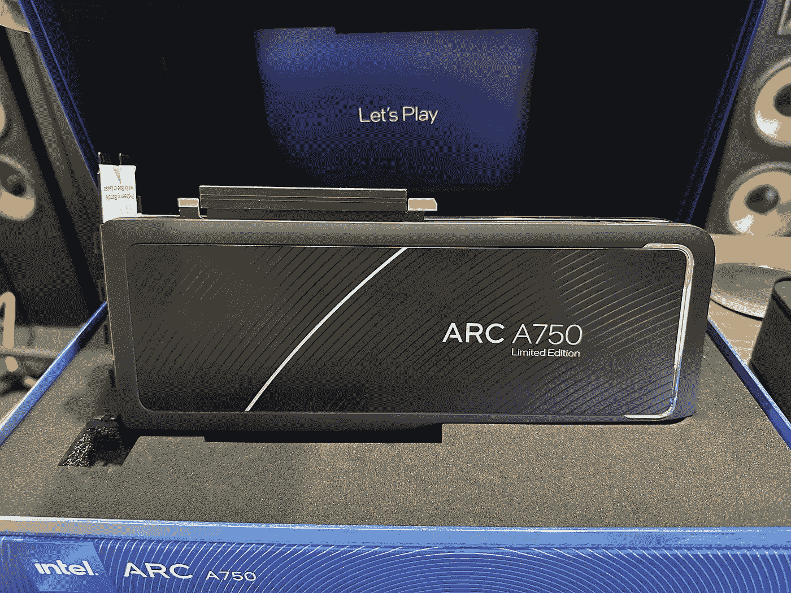
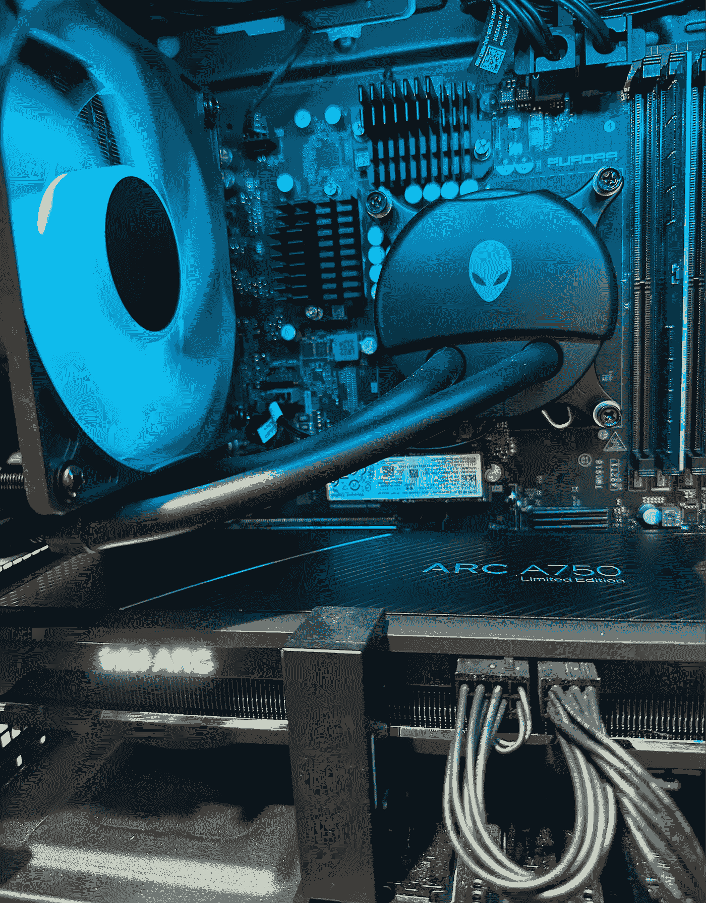

# 使用 oneAPI 对英特尔 Arc Xe 矩阵扩展(XMX)进行编程

> 原文：<https://towardsdatascience.com/utilizing-intel-arc-xe-matrix-extensions-xmx-using-oneapi-bd39479c9555>

## 使用 joint_matrix API 推动最新的英特尔加速技术



图片由作者提供

# 介绍

随着[英特尔 Arc 图形](https://www.intel.com/content/www/us/en/products/details/discrete-gpus/arc.html)桌面 GPU 的发布，开发人员有了一些新的硬件加速器选项。作为一名英特尔软件架构师和性能发烧友，我首先想到的总是如何使用新硬件更快地解决我的问题。对于 Arc，我首先想尝试的是英特尔 Xᵉ矩阵扩展(XMX)硬件及其专用矩阵引擎。

## 为什么这很重要？

[张量](https://www.tensorflow.org/guide/tensor)运算是深度学习工作负载的核心。英特尔 XMX 的基本加速功能之一是执行矩阵运算的专用硬件，更高级的张量运算分解成矩阵运算。对于大多数 AI 最终用户来说，Tensorflow 和 PyTorch 将是我们使用这种硬件的软件中的级别。然而，像我一样的另一类用户/开发人员也在考虑这个问题，并想，我如何能直接对这个新硬件进行编程，并将其用于其他目的？

# oneAPI 联合矩阵

和大多数硬件一样，有几种方法可以为 XMX 加速器编程。可以写 GPU 汇编，也可以用 GPU 内函数。对于你们这些勇敢的人，我建议你们参考 [oneAPI GPU 优化指南](https://www.intel.com/content/www/us/en/develop/documentation/oneapi-gpu-optimization-guide/top.html)作为起点。我想尝试更简单的方法。对我们来说幸运的是，有一个实验性的 [oneAPI](https://www.intel.com/content/www/us/en/developer/tools/oneapi/overview.html) 扩展 [joint_matrix](https://github.com/intel/llvm/blob/sycl/sycl/doc/extensions/experimental/sycl_ext_oneapi_matrix.asciidoc) ，它允许我们使用更高级别的 API 对硬件进行编程。

除了支持英特尔硬件，joint_matrix C++ API 还允许我们在各种硬件上执行矩阵运算。从[关节 _ 矩阵简介](https://github.com/intel/llvm/blob/sycl/sycl/doc/extensions/experimental/sycl_ext_oneapi_matrix.asciidoc#introduction):

> 这个接口意在统一不同的张量硬件:CPU 中的 Intel AMX，Habana Gaudi 和 Goya 张量和 gemm 内核，Nvidia TPUs，IBM Power MMA。所有这些硬件都提供了低级内部函数或汇编来访问和执行矩阵运算。我们的目标是提供一个统一的接口，这个接口是可移植的，但也能从这些不同硬件所能提供的最大性能中获益。

# 有趣的部分:测试英特尔 Arc A750

我有一个全新的英特尔 Arc A750 卡，我刚刚将它放入我的个人英特尔 Alder Lake Core i9–12900 KF 外星人 R13 系统。我碰巧也在使用 Windows，所以如果您使用 Linux 或 WSL，下面的说明可能会略有不同。



图片由作者提供

## 分解联合矩阵矩阵乘法的例子

我的目标只是用一些简单的矩阵运算来锻炼硬件。我从英特尔 llvm 测试套件中的[开始，它使用 bfloat16 运行硬件加速矩阵乘法，并确保输出与使用简单 CPU 矩阵乘法相同。](https://github.com/intel/llvm-test-suite/blob/intel/SYCL/Matrix/joint_matrix_bfloat16.cpp)

我稍微修改了一下测试，以输出矩阵乘法运行在哪个加速器硬件上。下面是用于执行启用了 joint_matrix 的矩阵乘法的代码片段:

以下是代码中需要注意的一些高级内容:

*   第 1–11 行:big_matrix 类允许我们表示任意大小的矩阵。
*   第 23–27 行:设备选择器显示了算法运行在哪个加速器上

由于大矩阵并不总是适合硬件，所以矩阵乘法操作是通过将要相乘的两个矩阵分解成子组，然后将这些子组相乘的结果累加成输出矩阵的适当部分来执行的。操作与我们做简单的矩阵乘法时相同，只是顺序略有不同，因为我们在移动到下一行之前不会遍历整个列空间。

矩阵乘法如何发生的核心分解如下:

*   第 36 行:parallel_for 基于二维 nd_range 分割工作——这就是我们如何在矩阵空间中行走。
*   第 49–56 行:sub_a、sub_b、sub_c 被初始化。由于硬件无法将整个矩阵保存在内存中，因此该算法使用 joint_matrix API 将部分矩阵加载到硬件加速器+寄存器中。sub_a 和 sub_b 是被相乘的矩阵的片段，sub_c 是我们的目标输出矩阵
*   第 58 行:使用 joint_matrix_fill API 不从内存加载值，而是直接将寄存器初始化为一个值。在这种情况下，我将寄存器初始化为 0。
*   第 64–71 行:载入矩阵的部分以相乘并累加到我们的输出矩阵中
*   第 72 行:使用 XMX 加速器，使用 sub_a 和 sub_b 作为输入，sub_c 作为目标，执行矩阵乘法和加法
*   第 74–77 行:将这部分矩阵计算的进行中的输出值存储回内存

作为参考，下面是我完整的[joint _ matrix _ bfloat 16 _ modified . CPP](https://gist.github.com/tonym97/783c8ba9cc29b67370648d9883f8de00)

## 测试加速器矩阵乘法

由于这是对 oneAPI 的实验性扩展，因此需要[英特尔 oneAPI DPC++/C++编译器](https://www.intel.com/content/www/us/en/developer/tools/oneapi/dpc-compiler.html)。我使用的是来自[英特尔 oneAPI 基础工具包 2022.3](https://intel.com/content/www/us/en/developer/articles/news/oneapi-2022-3-available.html) 版本的最新版本。

该功能自 2022.1 版本起就已启用，但一些命名空间已更新。例如，以下命名空间从前者更新为后者:

```
sycl::ext::intel::experimental::bfloat16
sycl::ext::oneapi::experimental::bfloat16
```

要编译此示例，请在安装[英特尔 oneAPI 基础工具包](https://www.intel.com/content/www/us/en/developer/tools/oneapi/base-toolkit.html)并遵循[环境配置步骤](https://www.intel.com/content/www/us/en/develop/documentation/oneapi-programming-guide/top/oneapi-development-environment-setup/use-the-setvars-script-with-windows.html)后运行以下命令:

```
> icx /EHsc /fsycl joint_matrix_bfloat16_modified.cpp
```

编译完代码后，我们只需运行可执行文件:

```
> joint_matrix_bfloat16_modified.exe
Running on device: Intel(R) Arc(TM) A750 Graphics
Elapsed time in milliseconds (accelerated): 142 ms
Elapsed time in milliseconds (reference): 2118 ms
passed
```

我们可以看到，使用英特尔 Arc GPU 在 142 毫秒内执行了矩阵乘法，非加速版本在 CPU 上运行了 2118 毫秒。请注意，如果您尝试在支持矩阵运算的硬件上运行加速版本，API 定义的当前行为是报告由于缺少支持的矩阵加速器硬件而导致的故障。这可以防止用户在不知不觉中使用较慢的回退矩阵实现，而不是硬件加速版本。

# 启用多个加速器

joint_matrix API 不仅仅是为了抽象的可移植性而设计的。最新的英特尔 DPC++编译器支持英特尔 XMX、英特尔高级矩阵扩展(AMX)和 NVIDIA Tensor 内核。对于那些不熟悉的人，AMX 是用于矩阵乘法加速的新 x86 指令集，它利用了内置于即将推出的第四代英特尔至强可扩展处理器中的硬件。如果你对张量核感兴趣，这里有一个例子你可以编译运行[这里](https://github.com/intel/llvm-test-suite/blob/intel/SYCL/Matrix/joint_matrix_tensorcore.cpp)。它确实需要开源的[英特尔 DPC++编译器和 NVIDIA 后端支持](https://intel.github.io/llvm-docs/GetStartedGuide.html)，以及安装 NVIDIA CUDA，所以我将把它留到一个单独的帖子中。

有关 joint_matrix API 启用的其他功能的更多详细信息，请参见 API 文档:

[](https://github.com/intel/llvm/blob/sycl/sycl/doc/extensions/experimental/sycl_ext_oneapi_matrix.asciidoc) [## llvm/sycl _ ext _ one API _ matrix . asciidoc 在这样的英特尔/llvm

### 版权所有(c) 2021-2021 英特尔公司保留所有权利。Khronos 是 SYCL 和 SPIR 的注册商标

github.com](https://github.com/intel/llvm/blob/sycl/sycl/doc/extensions/experimental/sycl_ext_oneapi_matrix.asciidoc) 

# 结论

新的硬件能力意味着新的编程抽象。这些抽象可能存在于许多层次。虽然 joint_matrix 是一种直接对硬件编程的方法，但在未来的帖子中，我将讨论 oneAPI 库和 TensorFlow 和 PyTorch 等流行 AI/ML 框架的英特尔实施如何利用 XMX 和 AMX 等矩阵加速器。

如果您已经做到这一步，您可能像我一样希望对硬件进行细粒度的控制，这就是为什么像 joint_matrix 这样的 API 令人兴奋的原因。joint_matrix API 是可用的，可以帮助您利用一些新的 matrix 硬件。我鼓励您下载工具链，尝试一下 API，并提供反馈来帮助构建这个令人兴奋的跨供应商 matrix API。

*如果你想看看我在看什么科技新闻，你可以在 Twitter 上关注我。*

*Tony 是英特尔的一名软件架构师和技术宣传员。他开发过多种软件开发工具，最近领导软件工程团队构建了数据中心平台，实现了 Habana 的可扩展 MLPerf 解决方案。*

*英特尔、英特尔标志和其他英特尔标志是英特尔公司或其子公司的商标。*