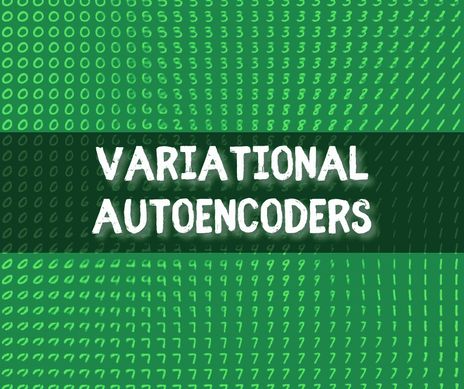
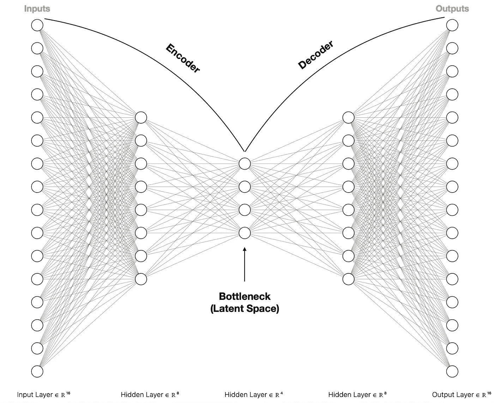
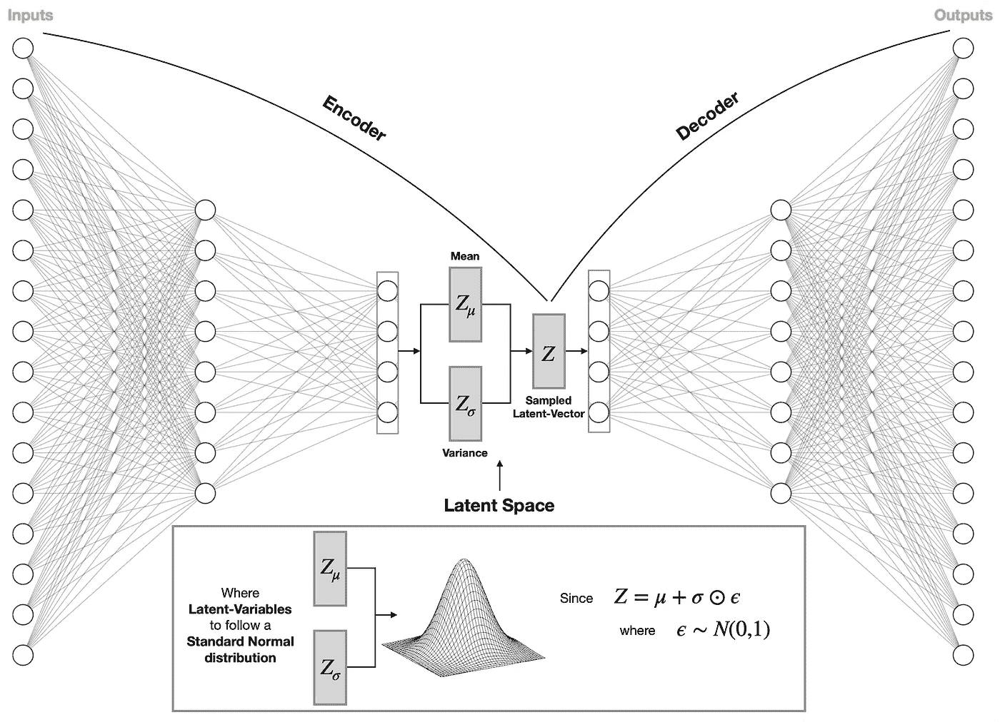
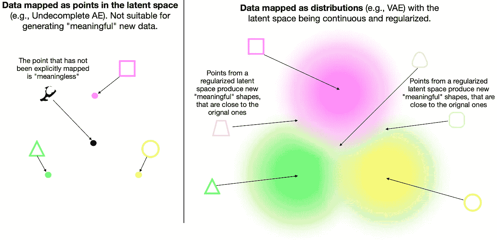
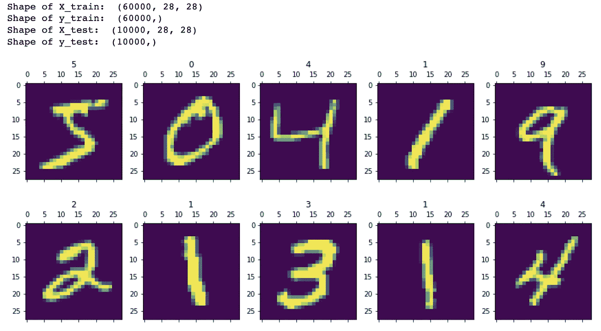
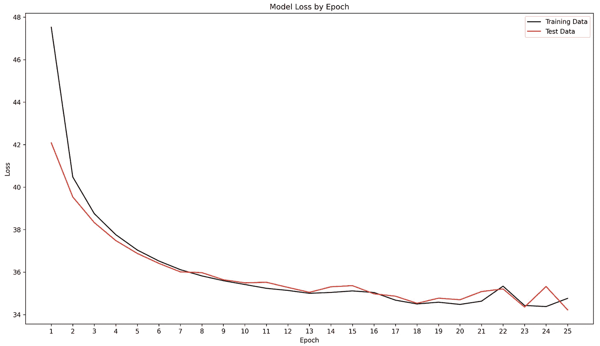
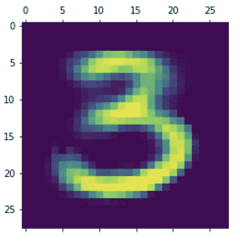

# VAE:可变自动编码器——如何利用神经网络生成新图像

> 原文：<https://towardsdatascience.com/vae-variational-autoencoders-how-to-employ-neural-networks-to-generate-new-images-bdeb216ed2c0>

## 神经网络

## VAEs 概述，并附有一个完整的 Python 示例，教您如何自己构建一个



可变自动编码器(VAE)。图片由[作者](https://solclover.com/)提供。

# 介绍

本文将带您了解**变型自动编码器(VAE)** ，它与著名的 **GANs(生成对抗网络)**一起，属于更广泛的一组**深度生成模型**。

与 GAN 不同，VAE 使用自动编码器架构，而不是一对发生器-鉴别器网络。因此，VAEs 中使用的思想应该相对容易理解，尤其是如果您过去使用过自动编码器的话。

如果你想了解我未来关于神经网络的文章，比如 GANs ，请随意[订阅](https://bit.ly/3sItbfx)电子邮件通知**。**

# **内容**

*   VAE 在机器学习算法领域的地位
*   VAEs 的结构及其工作原理的解释
*   一个完整的 Python 示例，展示了如何使用 Keras/Tensorflow 构建 VAE

# VAE 在机器学习算法领域的地位

下图是我整理最常见的机器学习算法的尝试。不过，这并不是一件容易的事情，因为我们可以根据算法的底层结构或它们旨在解决的问题，在多个维度上对它们进行分类。

我试图将这两个方面都考虑进去，这使我将神经网络归入它们自己的类别。虽然我们通常以**监督**的方式使用神经网络，但必须承认一些例子，如自动编码器，更像是**非监督/自我监督**算法。

尽管**变型自动编码器(VAE)** 与 GANs 有着相似的目标，但它们的架构更接近于其他类型的自动编码器，如[欠完整自动编码器](/autoencoders-ae-a-smart-way-to-process-your-data-using-unsupervised-neural-networks-9661f93a8509)。因此，您可以通过点击下方的**互动图表中的自动编码器组找到 VAEs👇。**

机器学习算法分类。由[作者](https://solclover.com/)创建的互动图表。

***如果你喜欢数据科学和机器学习*** *，请* [*订阅*](https://bit.ly/3sItbfx) *获取我的新文章的邮件。如果你不是中等会员，可以在这里* *加入* [*。*](https://bit.ly/36Mozgu)

# **VAEs 的结构及其工作原理的解释**

让我们先来分析一个标准的[欠完整自动编码器](/autoencoders-ae-a-smart-way-to-process-your-data-using-unsupervised-neural-networks-9661f93a8509) (AE)的架构，然后再深入研究使 VAEs 不同的元素。

## **未完成 AE**

下面是一个典型 AE 的图示。



欠完整自动编码器架构。图片由[作者、](https://solclover.com/)使用 [AlexNail 的 NN-SVG 工具](http://alexlenail.me/NN-SVG/index.html)创建。

欠完成 AE 的目标是有效地**将来自输入数据的信息**编码到**低维潜在空间(瓶颈)**。我们通过确保使用**解码器**以最小损失重建输入来实现这一目标。

请注意，在训练过程中，当我们试图发现“最佳”潜在空间的参数值时，我们将同一组数据传递到输入和输出层。

## **变分 AE**

现在，让我们通过分析其架构来看看 VAE 与不完整的 AE 有何不同:



VAE 建筑。图片由[作者](https://solclover.com/)提供。

我们注意到 VAE 的潜在空间不是由点向量(单个节点)组成的。相反，输入被映射到正态分布，其中 Zμ和 Zσ是均值和方差，即在模型训练期间学习的参数。

同时，从具有均值 Zμ和方差 Zσ的分布中采样潜在向量 Z，并将其传递给解码器以获得预测输出。

重要的是要理解，通过设计，VAE 的**潜在空间是连续的**，这使我们能够从它的任何部分取样以生成新的输出(例如，新的图像)，使 VAE 成为**生成模型**。

## **正规化的需要**

将输入编码到一个分布中，只让我们走了一半，就创建了一个适合生成“有意义的”输出的潜在空间。

然而，我们可以通过添加一个正则化项来实现所需的正则性，该正则化项表示为 **Kulback-Leibler 散度** (KL 散度)。我们将在稍后的 Python 部分详细讨论它。

## **关于潜在空间的直觉**

我们可以用下面的例子来想象信息是如何在潜在空间中传播的。



思考正则化连续潜在空间的直观方式。图片由[作者](https://solclover.com/)提供。

如您所见，将数据映射为单个点并不能训练模型理解这些点之间的相似性/差异。因此，我们不能使用这样的空间来生成新的“有意义的”数据。

在变分自动编码器的情况下，我们将数据映射为分布并正则化潜在空间，这给了我们分布之间的**“梯度”**或**“平滑过渡”**。因此，当我们从这样的潜在空间中采样一个点时，我们生成与训练数据非常相似的新数据**。**

[](https://solclover.com/membership)[](https://www.linkedin.com/in/saulius-dobilas/)

# **一个完整的 Python 例子，展示了如何用 Keras/Tensorflow 构建 VAE**

最后，是时候建立我们自己的 VAE 了！

## 设置

我们需要以下数据和库:

*   [MNIST 手写数字数据](https://www.tensorflow.org/api_docs/python/tf/keras/datasets/mnist/load_data)(版权由 Yann LeCun 和 Corinna Cortes 根据[知识共享署名-相同方式共享 3.0 许可证](https://creativecommons.org/licenses/by-sa/3.0/)持有；数据来源:[MNIST 数据库](http://yann.lecun.com/exdb/mnist/)
*   用于数据操作的 Numpy
*   用于可视化的 [Matplotlib](https://matplotlib.org/stable/api/index.html) 、 [Graphviz](https://graphviz.org/) 和 [Plotly](https://plotly.com/python/)
*   [用于神经网络的 Tensorflow/Keras](https://www.tensorflow.org/api_docs/python/tf)

让我们导入所有的库:

上面的代码打印了本例中使用的包版本:

```
Tensorflow/Keras: 2.7.0
numpy: 1.21.4
matplotlib: 3.5.1
graphviz: 0.19.1
plotly: 5.4.0
```

接下来，我们加载 MNIST 手写数字数据并显示前十位数字。请注意，我们将仅在可视化中使用数字标签(y_train，y_test ),而不用于模型训练。



MNIST 数据集的前十位数字。图片由[作者](https://solclover.com/)提供。

如您所见，我们在训练集中有 60，000 张图像，在测试集中有 10，000 张图像。请注意，它们的尺寸是 28 x 28 像素。

设置的最后一步是通过将图像从 28x28 调整为 784 来拼合图像。

通常，我们会使用 [**卷积层**](/convolutional-neural-networks-explained-how-to-successfully-classify-images-in-python-df829d4ba761) 而不是展平图像，尤其是在处理较大的图片时。然而，我想保持这个例子简单，因此使用**密集层**和平面数据，而不是**卷积层**。

```
New shape of X_train:  (60000, 784)
New shape of X_test:  (10000, 784)
```

## 建立变分自动编码器模型

我们将从定义一个函数开始，这个函数将帮助我们从潜在空间分布 *Z* 中取样。

这里我们采用了一个**重新参数化技巧**，它允许损失通过均值 *(z 均值)*和方差 *(z 对数西格玛)*节点反向传播，因为它们是确定性的。

同时，我们通过添加一个非确定性参数ε来分离采样节点，该参数是从标准正态分布中采样的。

现在，我们可以定义**编码器模型**的结构。

上面的代码创建了一个编码器模型，并打印了它的结构图。


VAE 模型编码器部分的示意图。图片由[作者](https://solclover.com/)提供。

请注意我们如何将来自*编码器-隐藏层-3* 的相同输出发送到*Z-均值*和*Z-对数-适马*中，然后在**自定义λ层***(Z-采样层)*中重新组合它们，用于从潜在空间进行采样。

接下来，我们创建**解码器模型**:

上面的代码创建了一个解码器模型并打印了它的结构图。


VAE 模型解码器部分的示意图。图片由[作者](https://solclover.com/)提供。

正如您所看到的，解码器是一个非常简单的模型，它从最新的空间获取输入，并在为 784 个输出节点生成值之前，将它们通过几个隐藏层。

接下来，我们**组合编码器和解码器**模型以形成**变型自动编码器模型(VAE)。**

如果您密切关注编码器模型中的潜在空间层，您会注意到编码器生成三组输出:Z 均值[0]、Z 对数西格玛[1]和 Z [2]。

上面的代码通过指定编码器接受名为“visible”的原始输入来链接模型。然后，在编码器[0]、[1]、[2]生成的三个输出中，我们取第三个输出(Z [2])并将其传递给解码器，解码器生成我们命名为“output”的输出。


连接编码器和解码器以构建 VAE 模型。图片由[作者](https://solclover.com/)提供。

## **自定义损失功能**

在训练 VAE 模型之前，最后一步是创建一个**自定义损失函数**并编译该模型。

正如本文前面提到的，我们将使用 **KL 散度**来衡量潜在空间分布和参考标准正态分布之间的损失。“ **KL 损失**是标准**重建损失**(在这种情况下，MSE)的补充，用于确保输入和输出图像保持接近。

## **VAE 模特培训**

装配了可变自动编码器模型后，让我们在 25 个时期内对其进行训练，并绘制损失图。



随时间变化的自动编码器模型损耗。图片由[作者](https://solclover.com/)提供。

## **显现潜在空间并生成新数字**

由于我们的潜在空间是二维的，我们可以在潜在的 2D 平面上想象不同数字的邻域:

编码在潜在空间中的 MNIST 数字的 2D 可视化。图表作者[作者](https://solclover.com/)。

绘制潜在空间中的数字分布给了我们视觉上将不同区域与不同数字相关联的好处。

假设我们想要生成一个数字 3 的新图像。我们知道 3 位于潜在空间的顶部中间。因此，让我们选择[0，2.5]的坐标，并生成与这些输入相关联的图像。



VAE 模型产生的新数字。图片来自[作者](https://solclover.com/)。

正如所料，我们得到了一个形状非常像数字 3 的图像，因为我们从 3 所占据的潜在空间中的一个区域采样了一个向量。

现在让我们从整个潜在空间中生成 900 个新数字。


使用我们的 VAE 模型生成 900 个新数字。图片由[作者](https://solclover.com/)提供。

从整个潜在空间生成许多图像的酷之处在于，它让我们看到不同形状之间的逐渐过渡。这证实了我们能够成功地调整我们的潜在空间。

# 结束语

值得注意的是，我们可以使用变分自动编码器来编码和生成比 MNIST 数字更复杂的数据。

因此，我鼓励您将我的简单教程应用到与您所在领域相关的真实世界数据中，从而更上一层楼。

为了您的方便，我在我的 [GitHub 库](https://github.com/SolClover/Art049_NN_VAE)中保存了一个 Jupyter 笔记本，其中包含了上述所有代码。

**如果你想在我发表一篇关于机器学习/神经网络(例如，生成对抗网络(GAN))的新文章时得到通知**，请[订阅以接收电子邮件](https://bit.ly/3sItbfx)。

如果你不是媒体会员，并且想继续阅读成千上万伟大作家的文章，你可以使用我下面的个性化链接加入:

<https://bit.ly/3J6StZI>  

如果您有任何问题或建议，请随时联系我们！

干杯！🤓
**索尔·多比拉斯**