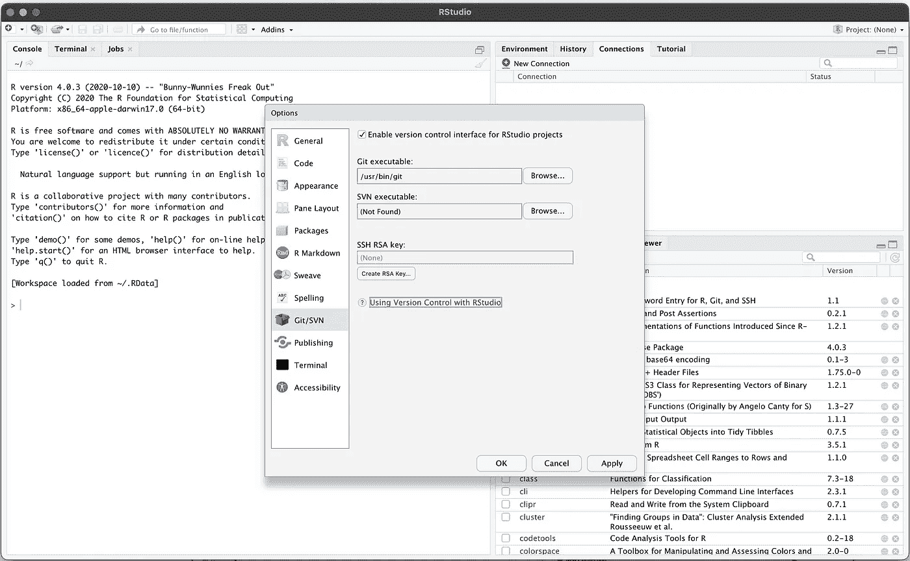
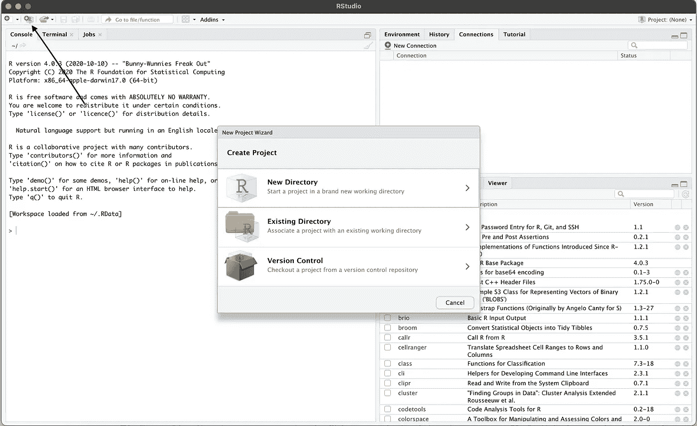
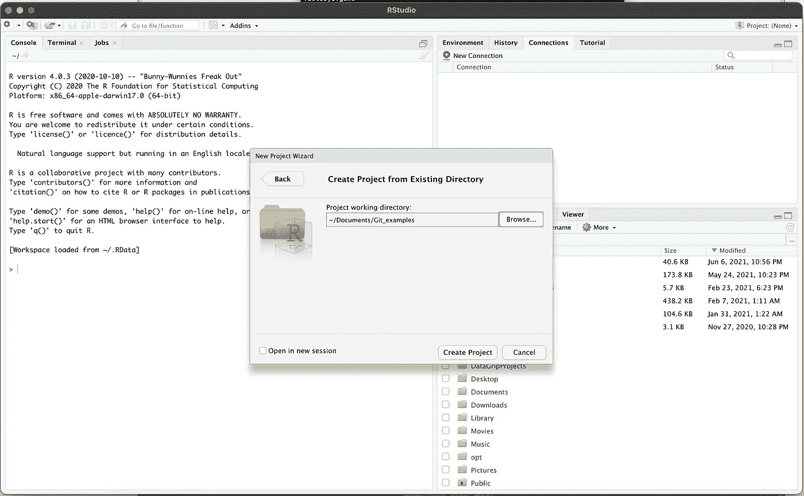
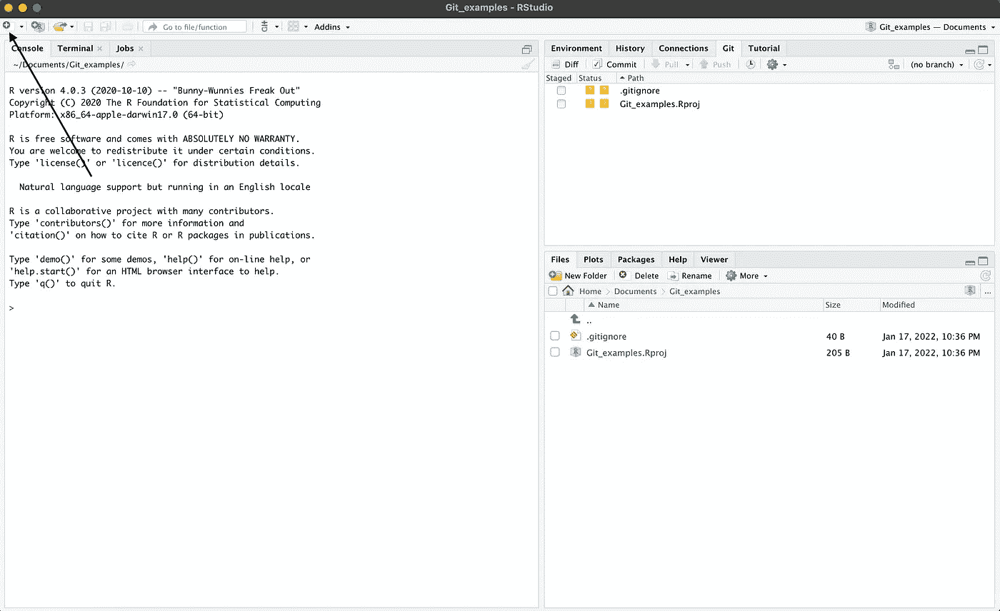
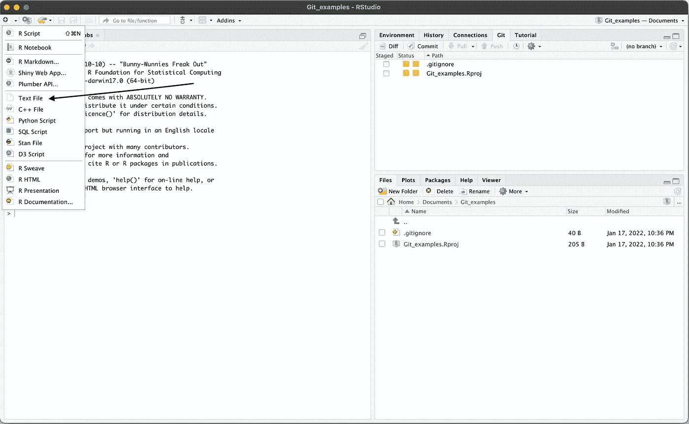
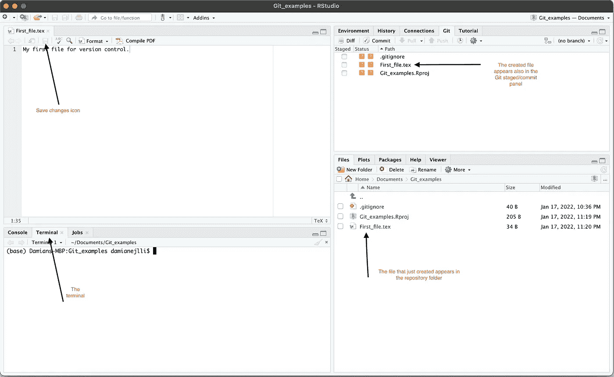
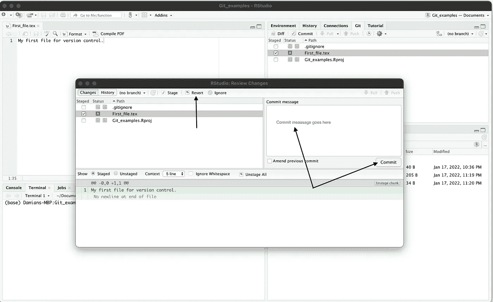

# 使用 RStudio 进行版本控制

> 原文：<https://towardsdatascience.com/version-control-with-rstudio-d20c54bd5b49>

# 使用 RStudio 进行版本控制

## 对于 Git 和 GitHub


RStudio 用于版本控制的典型界面。作者出于教育目的创建的图像

# 1.一般概念

科学最重要的一个方面是可重复性。每个实验都必须可以被其他人和团队复制。在计算机科学的背景下，科学计算、模拟和数据管理必须像任何其他实验一样是可复制的。为了确保结果是可重复的，必须能够将代码和分析分解为以前的版本，并复制图。这些过程和步骤是通过版本控制实现的。

版本控制是一个重要的过程，用于备份变更文件、存储和访问带注释的历史，以及管理不同变更集之间的变更合并。版本控制广泛应用于学术界、研究实验室和工业界。版本控制最重要的目标是简化和最大化软件开发人员的产出。

在过去的几年中，分布式版本控制如 Git、bazaar 等。，变得非常受欢迎。具体来说，Git 和 GitHub 几乎已经成为处理代码和文件的团队的默认选择，因为它们更加强大和用户友好。

Git 是一个跟踪变化的软件，GitHub 是一个使用 Git 进行操作的在线仓库。它们相互关联，但不是一回事。Git 用于本地版本控制(你的电脑)，GitHub 用于远程版本控制(互联网和云)。

在大多数情况下，Git 直接通过用户终端与命令行一起使用。然而，也有可能将 Git 和 GitHub 与不同的图形用户界面一起使用，以简化事情。Git 和 GitHub 最重要的 GUI 是 [GitHub 桌面](https://desktop.github.com)和 [RStudio](https://www.rstudio.com/products/rstudio/download/) 。

在本文中，我将讨论如何使用 RStudio 对 Git 和 GitHub 进行版本控制。这里我假设读者知道如何使用 Git 和 GitHub，也知道什么是 RStudio。我还假设读者已经在其计算机中安装了 Git、RStudio，并且还拥有一个 GitHub 帐户。

# 2.用于版本控制的 RStudio 配置

一旦您安装了 Git 和 RStudio，您必须在计算机上有一个本地 Git 存储库。要做到这一点，首先在您的计算机中的所需位置创建一个文件夹(例如“Git_examples”)。创建文件夹后，打开终端(在我的例子中是 MacBook pro)并运行以下代码:

```
$ **cd** .../Git_examples
$ **git init** 
```

在上面的代码中，我首先移动到空文件夹“Git_examples ”,然后初始化一个 Git 存储库。我假设读者熟悉这些简单的概念。当初始化 Git 储存库时，文件夹不一定需要为空。它可以是空的，也可以是包含多种不同类型文件的文件夹。 **git init** 命令在“Git_examples”目录中创建一个隐藏文件夹，目的是跟踪目录中的所有文件。如果您的计算机上已经有了一个初始化的 Git 存储库，那么就没有必要继续上面描述的步骤，原因将在下面解释。

现在打开 RStudio IDE。一旦你打开它，你将看到 RStudio 的默认外观。第一步是在 RStudio 中激活版本控制。进入:*工具* → *全局选项*，然后点击 *Git/SVN* ，如下图 1 所示。如果你已经安装了 Git，很有可能在 *Git 可执行文件*中会出现 Git 在你电脑中的安装路径。您可以保留默认路径，也可以用另一个路径来更改它。如果您的计算机中也安装了 SVN，那么 SVN 可执行文件字段也将被填充。在我的例子中，没有安装 SVN，因此默认情况下 RStudio 会写入(未找到)。也可以创建一个 SSH RSA 密钥，但是在本文中，我将使事情更简单。

完成这些步骤后，选择复选框:*启用 RStudio 项目的版本控制接口*，然后点击对话框底部的“应用”按钮。现在 RStudio 中启用了版本控制。此时，建议重启 RStudio。



图一。作者创造的形象。

重启 RStudio 后，点击按钮“创建一个项目”,如图 2 中箭头所示。一旦你点击了“创建一个项目”按钮，一个对话窗口“新项目向导”将出现在主窗口的顶部。在这个对话框中，“创建项目”下通常有三个默认选项:**新目录、现有目录**和**版本控制**。



图二。作者出于教育目的创建的图像。

项目向导中的每个目录都有特定的用途。第一个(**新目录**)与新的 R 项目目录相关，第二个(**现有目录**)使得将新项目与现有工作目录相关联成为可能，第三个(**版本控制**)本质上与现有 GitHub 目录相关。

在本文中，我将向您展示如何将一个项目与一个现有的工作目录相关联。正如您所记得的，我已经向您展示了如何在一个给定的目录中启动一个 Git 存储库，因此我将使用该目录继续进行。点击**现有目录**，你将看到如图 3 所示的窗口。然后点击“Browse”按钮，选择已经启动 Git 存储库的文件夹(在我的例子中是“Documents/Git_examples”)，然后点击“Create Project”。之后，项目被创建为 Git 存储库。



图 3。作者创造的形象

# 3.准备并提交 RStudio

使用 RStudio 创建项目后，您的默认窗口应该如图 4 所示。花点时间探索这个窗口，你通常会观察到许多不同的选项。在左侧窗口的一半，您将看到 R 控制台外壳、终端外壳和作业外壳。在右边的一半，在上面的面板中你会看到不同的面板，其中有一个“Git”面板。在下半部分，您将看到 Git 存储库所在的目录和文件。

你可以看到在文件区有*。gitignore* 和 *Git_examples。Rproj* 文件。当一个人像我上面所做的那样创建一个新的项目时，这些文件是自动创建的。我创建的目录没有其他文件，除了在我们开始项目时由 RStudio 自动创建的文件。有两种方法可以将文件添加到我们的目录中，要么直接使用 RStudio 创建文件，要么像处理其他文件夹一样将文件添加到我们的存储库文件夹中。

要创建一个包含 RStudio 的文件并将其添加到我们的存储库中，请单击绿色的加号按钮，如图 4 中的箭头所示。



图 4。作者创造的形象。

单击图 4 所示的绿色按钮后，您将看到一个类似于图 5 所示的窗口。正如你在对话窗口中看到的，RStudio 为用户提供了创建不同格式文件的可能性，如文本文件、Python 脚本、R 脚本等。让我们通过选择如图 5 中箭头所示的字段来创建一个文本文件。



图 5。作者创造的形象。

在文本文件字段中单击一次后，RStudio IDE 中将出现一个新的节窗口，其中文件窗口位于左侧的上部窗口中。可以向文本文件添加一些文本(例如:“我的第一个版本控制文件”)，并且在点击“另存为…”图标之后，如图 6 中的箭头所示。将出现一个提示窗口，询问保存文件的位置、名称等。

默认情况下，保存目录是存储库目录。例如，通过单击“另存为…”图标，以“First_file.tex”的名称保存文件。之后，已经创建并保存的文件将出现在右半部分窗口下面板的 Git 存储库“Git_examples”文件夹中。它还会出现在右半部分窗口上面板的“Staged/Commit”Git 面板中。还可以看到终端外壳，如果需要，可以方便地通过终端直接编写命令。



图 6。作者创造的形象。

Git 跟踪了我在存储库文件夹中创建的“First_file.tex ”,但是还没有提交。首先要做的是在 Git 窗口的左上角选择“Staged”框，如图 6 所示。之后，文件的状态将从"？到“A ”,其中后者意味着它已经被添加到登台区，并且该文件准备好被提交。对于其他 Git 操作，还可以注意到“Diff”、“Log”和“Revert”图标。


图 6。

为了提交文件，有两个选项，如图 6 中的箭头所示。无论哪种方式，选择提交更改，然后通过点击“提交”按钮，在主窗口的顶部将出现如图 7 所示的对话窗口。此后，用户在“提交消息”文本框中写入提交消息，然后单击“提交”按钮保存消息。然后关闭对话窗口。



图 7。

在您执行了图 7 之前的所有步骤之后，您将看到一个窗口，如下图 8 所示。您可能会注意到,“First_file.tex”现在已经从 Git 面板中消失了，因为我们已经提交了这个文件。在此面板中，仅显示暂存和未跟踪的文件。另一件需要注意的事情是，在 Git 面板中，在我们提交“First_file.tex”文件之后，RStudio 将分支的状态从“no branch”更改为“master”。


图 8。作者创造的形象。

# 4.的”。gitignore”文件

当我们第一次创建 RStudio 项目时，会自动创建两个文件，其中一个是“*”。gitignore"* 文件。这个文件非常有用，因为它允许用户忽略并因此不在 Git 面板中显示用户不想包含在项目中的所有文件。因此，你需要考虑什么类型的文件不希望包含在项目中，并且在点击*之后。gitignore* 文件来修改它。我假设读者知道此时该做什么。将不需要的文件包含在*中后。gitignore* 文件，保存，大功告成。

# 5.远程版本控制(拉/推)

到目前为止，我已经向您展示了如何处理本地版本控制，即通过使用 RStudio 进行标准的 Git 操作。正如您在上面的图 8 中看到的，在 Git 面板中，绿色的 push 和 pull 数组是灰色的。原因是我们没有告诉 RStudio 使用任何像 GitHub 中那样的远程存储库。

要激活拉/推按钮，首先需要使用终端通过 push 命令添加一个远程源，或者从 GitHub 拉一个存储库。这里我展示了如何将本地存储库推送到 GitHub。

进入 RStudio IDE 中的终端，如上图 8 所示。默认情况下，终端设置为项目存储库文件夹。在终端中键入以下命令行:

```
$ **git remote add origin** URL
```

这里的 URL 指的是 GitHub 上资源库的完整链接。这实质上意味着在编写上面的命令行之前，用户已经在 GitHub 上有了一个存储库！

在上面的命令行中按下 enter 键后，很可能会出现一个对话框，要求您输入一些 GitHub 凭证，如用户名和/或密码。从 2021 年 8 月 13 日起，GitHub 改变了 Git 操作的认证规则，现在人们需要一个[令牌](https://github.blog/2020-12-15-token-authentication-requirements-for-git-operations/)来代替密码。

将本地存储库推送到 GitHub 需要在终端中编写的下一个命令行如下:

```
$ **git push --set-upstream** **origin master**or$ **git push -u origin master**
```

在您输入上面的 push 命令之后，您的本地存储库已经被推送到 GitHub，您可以通过查看适当的 GitHub 帐户来直接检查它。如果你做了上述操作，RStudio 上的灰色推/拉按钮将被激活，然后你就可以直接使用这些按钮与 GitHub 进行交互，参见本文顶部的图。

# 6.结论

在本文中，我向您展示了如何使用 RStudio 进行 Git/GitHub 操作。正如我上面提到的，Git 有几个图形用户界面，比如 GitHub Desktop，但是在我看来，RStudio 优于这些图形用户界面中的大多数。

RStudio IDE 非常用户友好，在主窗口中，可以有终端、Git 面板、文件夹目录以及创建和修改文件的空间。事实上，使用 RStudio，您可以轻松创建不同类型的文件，如 Python 脚本、R 脚本、Tex 文件，甚至编译 LaTeX 文件。

RStudio 有许多选项可以简化存储库中的 Git 操作。事实上，我相信每个在终端中使用 Git 命令行的人很快就会意识到，对于非常大的项目来说，这些命令行会变得非常麻烦和难以使用。RStudio 大大简化了这些 Git 操作。如果您需要使用终端进行一些特定的 Git 操作，您可以在主 RStudio 窗口中使用终端 shell，如图 8 所示。

虽然在本文中，我试图涵盖 RStudio 版本控制最重要的方面，但读者也可以在这里寻找一些额外的信息[。](https://support.rstudio.com/hc/en-us/articles/200532077?version=1.3.1093&mode=desktop)

## 如果你喜欢我的文章，请与你可能对这个话题感兴趣的朋友分享，并在你的研究中引用/参考我的文章。不要忘记订阅将来会发布的其他相关主题。