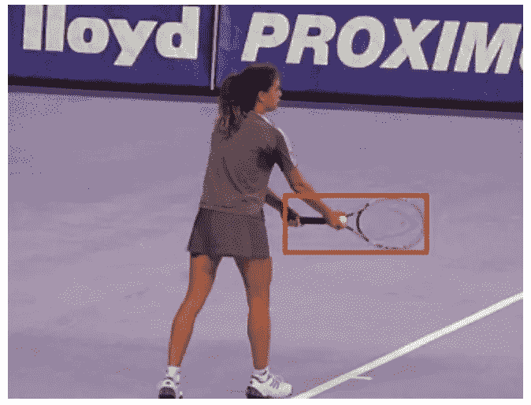
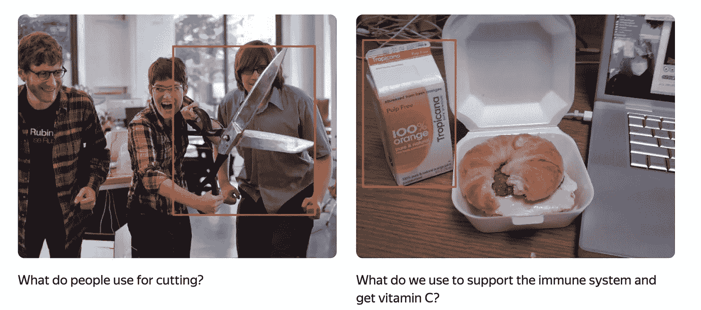

# 视觉问答挑战

> 原文：<https://towardsdatascience.com/visual-question-answering-challenge-51c4623ddfa5>

## 一个稍微不同的 ML 竞赛和你为什么应该参加

视觉问题:你用什么击球？—图片来自 COCO 女士数据集(*知识共享公共许可* ***)***

**简介**

这篇文章介绍了一个有趣的 ML 比赛，现在可以在 [CodaLab](https://codalab.lisn.upsaclay.fr/competitions/7434#learn_the_details-overview) 上看到，你可以参加到今年年底(2022)。

起初，它看起来像一个标准的“Kaggle”风格的比赛，但让我告诉你为什么我觉得它特别有趣。显然，除了赢得一些奖金，你还可以在一个著名的关于搜索和数据挖掘的国际会议上展示成果( [WSDM 2023](https://www.wsdm-conference.org/2023/) )。

**什么是视觉问答(VQA)挑战赛？**

这是一个结合了视觉图像和文字的挑战。对于每幅图像，给你一个自然语言问题，你的任务是检查图像的特征，并在物体周围画一个边界框，这是问题的答案。

看看下面的一些例子。第一张图片有一个自然语言问题*“人们用什么来切割”？*图片中这个问题的正确答案是*“剪刀”*。因此，带有剪刀的图像区域用边界框高亮显示。

图片来自可可女士数据集(*知识共享公共许可* ***)***

同样，在第二张图中，我们有一个问题*“我们用什么来支持免疫系统和获取维生素 C？”。*在这种情况下，通过粘合盒选择含有维生素 C 补充剂的包装。

**为什么这次比赛与众不同**

视觉问答挑战赛结合了视觉和自然语言输入数据，并要求理解和正确解释这两者。这种类型的任务对人类来说很容易，因为我们的大脑自然会这样做，但对于机器学习模型来说，这可能是一项非常具有挑战性的任务。

通常，这类任务的评估是通过使用[交集/并集(IoU)](https://medium.com/analytics-vidhya/iou-intersection-over-union-705a39e7acef) 来完成的。在这个数据集上，平均而言，机器学习方法的评估 IoU 得分为 0.20，而人类的表现得分为 0.87。这是一个巨大的差距，尤其是在过去几年涉及计算机视觉和自然语言的多模态深度学习模型取得巨大进展之后，这是一个有趣的现象。

**VQA 数据集**

视觉问答挑战的数据集有 45，199 个图像实例，分为三个子集:

*   训练(38，990 个图像实例)，
*   公开测试(1，705 个图像实例)，
*   和私有测试(4，504 个图像实例)。

VQA 数据集中包含的所有图像都来自经许可在 CC 下发布的 [MS COCO](https://cocodataset.org/) 数据集，额外的地面真相答案是使用 [Toloka](https://toloka.ai) 众包平台获得的。

**如何赢得视觉问答(VQA)挑战赛**

我可能无法完全回答这个问题，但至少让我提出一个你可以采取的方向。

查看与竞赛一同发布的这一视觉问答挑战的基准模型。它使用两个基本模型。第一个，YOLOR 是一个计算机视觉模型，它进行对象检测并在图像中生成候选矩形。第二个是 CLIP，它是一个多模态模型，结合了计算机视觉和自然语言特征，用于测量视觉问题和每个候选矩形所包围的图像部分之间的相似性。basline 的代码可以在这个 [GitHub 页面](https://github.com/Toloka/WSDMCup2023)上找到。

以上是一个很好的起点，但在评估指标中仅存档了 0.2 IoU 分数。如前所述，人类在这个数据集上取得了很高的精确度(0.87 IoU)，因此还有很大的改进空间。

**总结**

我希望这篇文章解释了为什么[视觉问答挑战](https://toloka.ai/challenges/wsdm2023/)是一个有趣的比赛，激励你参加它，并给你一个如何开始的想法。

可以直接在 [CodaLab 网站](https://codalab.lisn.upsaclay.fr/competitions/7434#learn_the_details-overview)参与。我还感兴趣的是，你将如何使用不同于基线建议的方法来解决这个计算机视觉和自然语言的挑战。欢迎在评论中分享你的想法。

*PS:我正在 Medium 和*<https://www.aboutdatablog.com/>**上撰写深入浅出地解释基本数据科学概念的文章。你可以订阅我的* [***邮件列表***](https://medium.com/subscribe/@konkiewicz.m) *每次我写新文章都会收到通知。如果你还不是中等会员，你可以在这里加入**[***。***](https://medium.com/@konkiewicz.m/membership)**

**下面是一些你可能会喜欢的帖子**

**</how-to-do-data-labeling-versioning-and-management-for-ml-ba0345e7988>  </adapting-a-sentiment-analysis-model-to-a-custom-domain-62ec386516bc>  </jupyter-notebook-autocompletion-f291008c66c> **