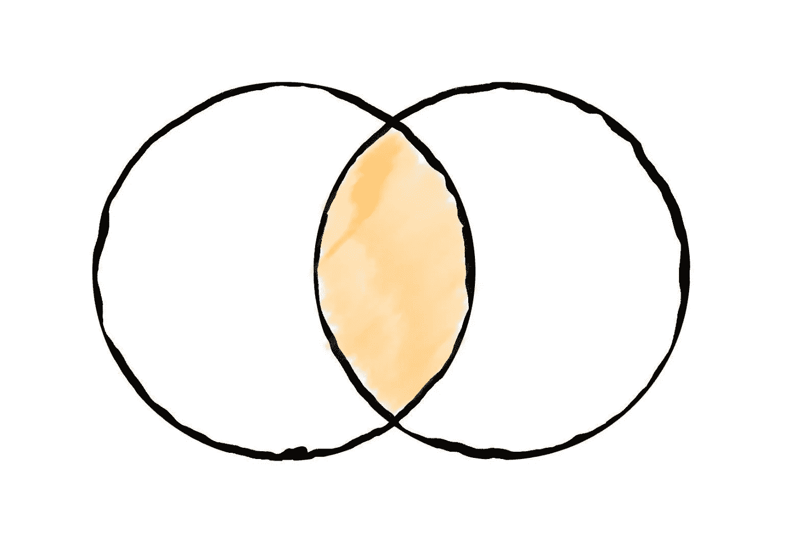
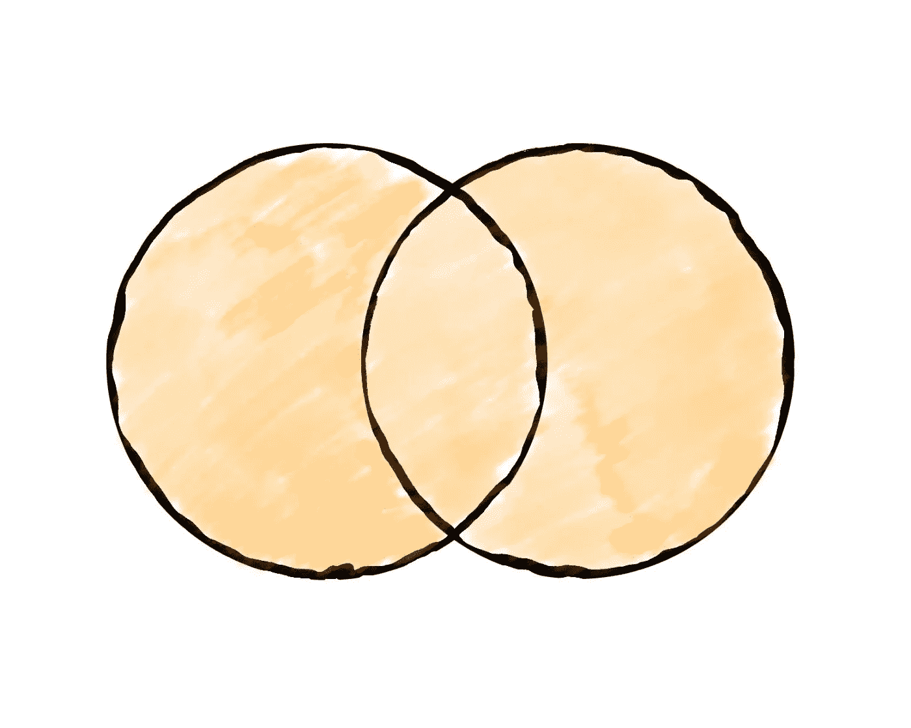
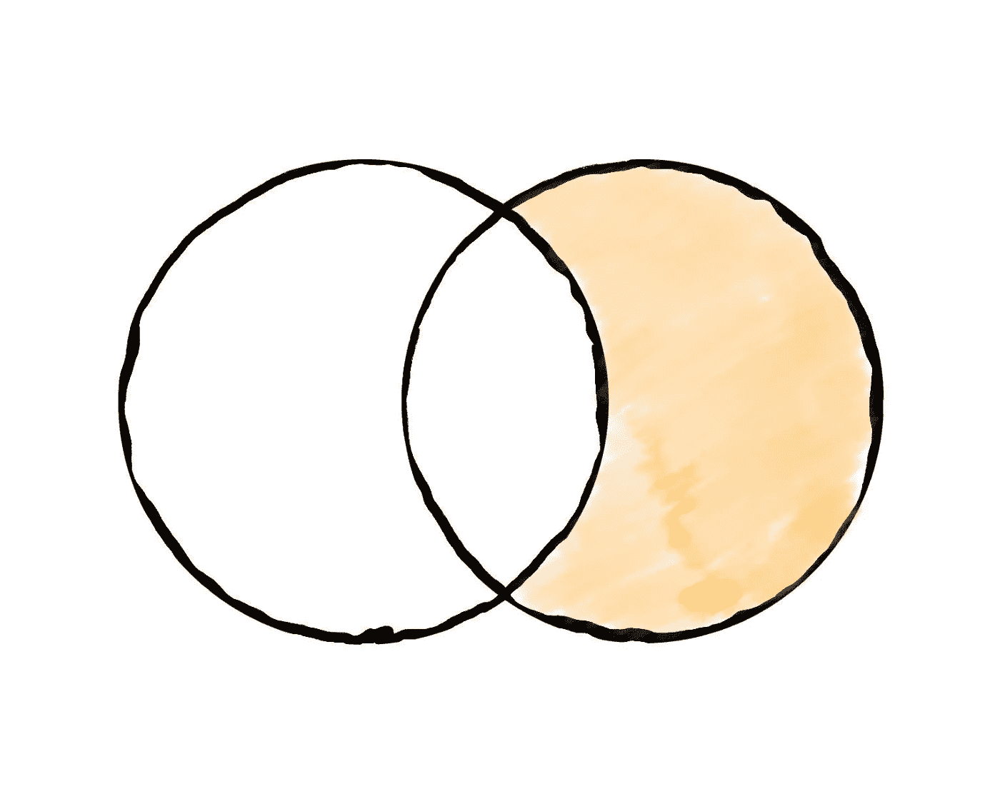

# SQL 连接的直观解释

> 原文：<https://towardsdatascience.com/visual-sql-joins-4e3899d9d46c>

## 用维恩图和实际例子理解 SQL 连接


由[凯利·西克玛](https://unsplash.com/@kellysikkema?utm_source=unsplash&utm_medium=referral&utm_content=creditCopyText)在 [Unsplash](https://unsplash.com/s/photos/venn-diagram?utm_source=unsplash&utm_medium=referral&utm_content=creditCopyText) 上拍摄的照片

考虑到单个表可以被视为一个集合，维恩图是可视化 SQL 连接如何工作的一个很好的方式。尽管可能有许多不同的方式来描述连接，但我坚信维恩图有助于读者以清晰一致的方式理解在两个表之间执行特定类型的连接时，哪些记录将包含在返回的结果行集中。

在本文中，我们将展示以下连接类型的可视化表示

*   左连接(也称为左外连接)
*   右联接(也称为右外联接)
*   内部连接
*   完全外部连接
*   左反连接(也称为左排除连接)
*   右反联接(也称为右排除联接)
*   完全反联接
*   交叉连接

此外，我们还将提供用于在 SQL 中执行上述连接的实际语法。我们开始吧！

首先，让我们创建两个表，我们将在随后的部分中引用这两个表，以便使用实际的例子来演示各种 SQL 连接类型。

我们第一个名为`users`的表有 3 列和 4 条记录:

```
+----+--------+-----+
| id |   name | age |
+----+--------+-----+
|  1 |   John |  21 |
|  2 |  Helen |  22 |
|  3 | Andrew |  31 |
|  4 |    Bob |  19 |
+----+--------+-----+
```

名为`orders`的第二个表有 3 列和 5 条记录:

```
+----+---------+--------+
| id | user_id | amount |
+----+---------+--------+
|  1 |       1 |   7.99 |
|  2 |       4 |  10.49 |
|  3 |       2 |  45.89 |
|  4 |       2 |  19.99 |
|  5 |       1 |  54.89 |
+----+------------------+
```

## 左连接(也称为左外连接)

我们将展示的第一种连接类型是左连接(或左外连接)。这种类型的联接将导致从左表中提取的所有记录，以及从右表中提取的那些在指定的联接列上与左表具有匹配值的记录。结果中包含的右表记录中的任何缺失值都将被替换为`null`。对于左表和右表之间的每个匹配值，都将返回一条新记录。例如，如果左边表中的一个键与右边表中的两个记录匹配，那么两个记录将作为结果的一部分返回。


维恩图，说明在 SQL 中的两个表之间执行左连接(或左外连接)时选择的记录—来源:作者

在 SQL 中，可以使用下面列出的语法启动左连接:

```
SELECT *
FROM users u
LEFT JOIN orders o
ON u.id = o.user_id;
```

结果记录将包括:

```
+----+--------+-----+----+---------+--------+
| id |   name | age | id | user_id | amount |
+----+--------+-----+----+---------+--------+
|  1 |   John |  21 | 1  |       1 |   7.99 |
|  4 |    Bob |  19 | 2  |       4 |  10.49 |
|  2 |  Helen |  22 | 3  |       2 |  45.89 |
|  2 |  Helen |  22 | 4  |       2 |  19.99 |
|  1 |   John |  21 | 5  |       1 |  54.89 |
|  3 | Andrew |  31 |null|    null |   null |
+----+--------+-----+----+---------+--------+
```

## 右连接(也称为右外连接)

我们将展示的第二种连接类型是右连接(或右外连接)。这种类型的联接将导致从右表中提取的所有记录，以及从左表中提取的那些在指定的联接列上与右表具有匹配值的记录。


维恩图，说明在 SQL 中的两个表之间执行右连接(或右外连接)时选择的记录—来源:作者

右连接的 SQL 语法概述如下:

```
SELECT *
FROM users u
RIGHT JOIN orders o
ON u.id = o.user_id;
```

在我们的示例表中，由上述查询推断出的记录共享如下:

```
+----+--------+-----+----+---------+--------+
| id |   name | age | id | user_id | amount |
+----+--------+-----+----+---------+--------+
|  1 |   John |  21 | 1  |       1 |   7.99 |
|  4 |    Bob |  19 | 2  |       4 |  10.49 |
|  2 |  Helen |  22 | 3  |       2 |  45.89 |
|  2 |  Helen |  22 | 4  |       2 |  19.99 |
|  1 |   John |  21 | 5  |       1 |  54.89 |
+----+--------+-----+----+---------+--------+
```

## 内部连接

两个表之间的内部联接将产生一组在指定联接列中具有共同值的记录。



维恩图说明了在 SQL 中的两个表之间执行内部连接时选择的记录—来源:作者

要执行内部联接，只需运行以下查询:

```
SELECT *
FROM users u
INNER JOIN orders o
ON u.id = o.user_id;
```

注意，您甚至可以省略`INNER`关键字，换句话说，上面的查询等价于下面列出的查询:

```
SELECT *
FROM users u
JOIN orders o
ON u.id = o.user_id;
```

对于我们的示例表，从上述查询返回的记录共享如下:

```
+----+--------+-----+----+---------+--------+
| id |   name | age | id | user_id | amount |
+----+--------+-----+----+---------+--------+
|  1 |   John |  21 | 1  |       1 |   7.99 |
|  4 |    Bob |  19 | 2  |       4 |  10.49 |
|  2 |  Helen |  22 | 3  |       2 |  45.89 |
|  2 |  Helen |  22 | 4  |       2 |  19.99 |
|  1 |   John |  21 | 5  |       1 |  54.89 |
+----+--------+-----+----+---------+--------+
```

## 完全外部连接

SQL 中的一个完整的外部连接基本上包括左表和右表中的所有记录。这种类型的连接将使用两个表中的键—对于任何缺失的行，将插入`null`值。



维恩图说明了在 SQL 中的两个表之间执行完全外部连接时选择的记录—来源:作者

完整外部联接的语法概述如下:

```
SELECT *
FROM users u
FULL OUTER JOIN orders o
ON u.id = o.user_id;
```

而结果记录将是

```
+----+--------+-----+----+---------+--------+
| id |   name | age | id | user_id | amount |
+----+--------+-----+----+---------+--------+
|  1 |   John |  21 | 1  |       1 |   7.99 |
|  4 |    Bob |  19 | 2  |       4 |  10.49 |
|  2 |  Helen |  22 | 3  |       2 |  45.89 |
|  2 |  Helen |  22 | 4  |       2 |  19.99 |
|  1 |   John |  21 | 5  |       1 |  54.89 |
|  3 | Andrew |  31 |null|    null |   null |
+----+--------+-----+----+---------+--------+
```

## 左反连接(又名左排除连接)

左反连接将包含左表中连接键没有出现在右表中的所有记录。


维恩图说明了在 SQL 中的两个表之间执行左反连接(或左排除连接)时选择的记录—来源:作者

换句话说，左反联接将返回所有(还)没有下单的客户。在 SQL 中，这被翻译为:

```
SELECT *
FROM users u
LEFT JOIN orders o
ON u.id = o.user_id
WHERE o.user_id is null;
```

结果记录概述如下:

```
+----+--------+-----+----+---------+--------+
| id |   name | age | id | user_id | amount |
+----+--------+-----+----+---------+--------+
|  3 | Andrew |  31 |null|    null |   null |
+----+--------+-----+----+---------+--------+
```

## 右反联接(又名右排除联接)

类似地，右反连接将包含右表中键不出现在左框架中的所有记录。



维恩图说明了在 SQL 中的两个表之间执行右反联接(或右排除联接)时选择的记录—来源:作者

```
SELECT *
FROM users u
RIGHT JOIN orders o
ON u.id = o.user_id
WHERE u.id is null;
```

注意，在我们的示例表中，这个查询不会产生任何记录，因为所有下订单的用户(即包含在`orders`表中的用户)都出现在左边的表中(即`users`)。

## 完全反联接

完整的反连接将包含左表和右表中没有任何公共键的所有记录。


维恩图说明了在 SQL 中的两个表之间执行完全反连接时选择的记录—来源:作者

```
SELECT *
FROM users u
JOIN orders o
ON u.id = o.user_id
WHERE u.id is null and o.user_id is null;
```

## 交叉连接

现在，交叉连接不能用维恩图来可视化，因为它本质上是要在所涉及的每个表的记录之间创建所有可能的组合。因此，甚至不需要提供连接键(即 SQL 中的`ON`关键字)。

```
SELECT *
FROM users u
CROSS JOIN orders o;
```

假设左边的表包含 4 条记录，而右边的表包含 5 条记录，上面的查询将返回 20 条结果记录。

## 最后的想法

维恩图是一种构造，当在两个不同的表之间执行特定的连接时，它通常用于可视化结果记录集。在今天的教程中，我们介绍了 SQL 中可用的大多数(如果不是全部)连接类型，用适当的图表显示了它们，并分享了相应的查询语法。

掌握 SQL 连接对于处理数据的专业人员来说非常重要，因为它使他们能够将来自许多不同来源的记录汇集在一起，从而带来商业价值并支持决策制定。

[**成为会员**](https://gmyrianthous.medium.com/membership) **阅读媒体上的每一个故事。你的会员费直接支持我和你看的其他作家。你也可以在媒体上看到所有的故事。**

[](https://gmyrianthous.medium.com/membership)  

**相关文章你可能也喜欢**

[](/2-rules-groupby-sql-6ff20b22fd2c)  [](/sql-select-distinct-277c61012800)  [](/ddl-dml-e802a25076c6) 