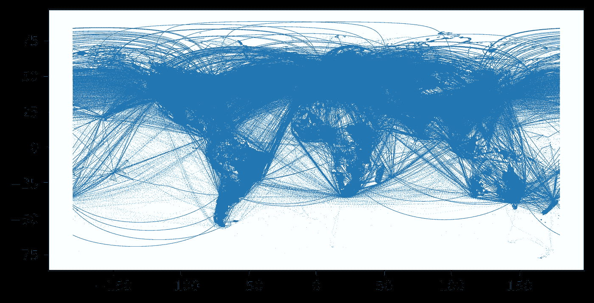
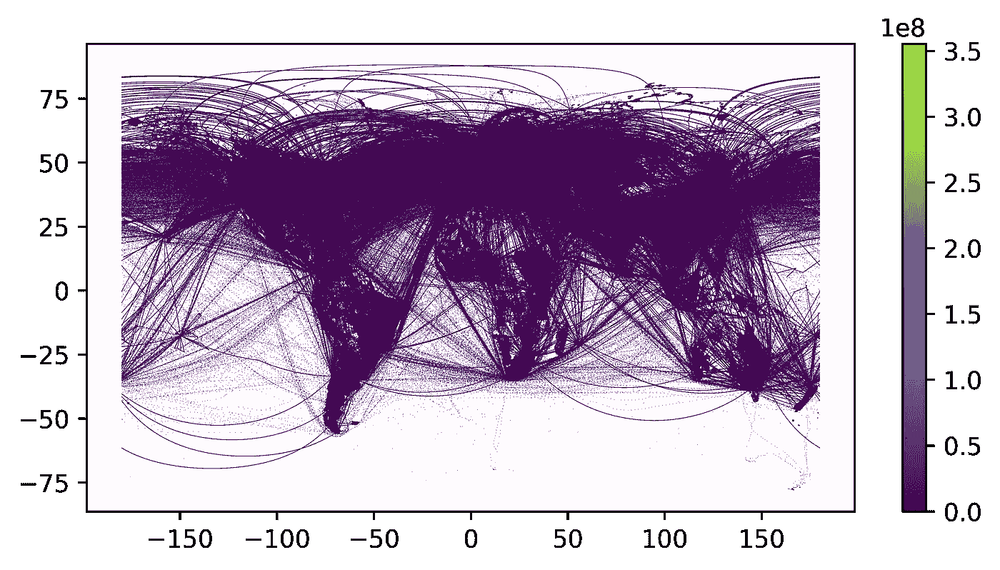
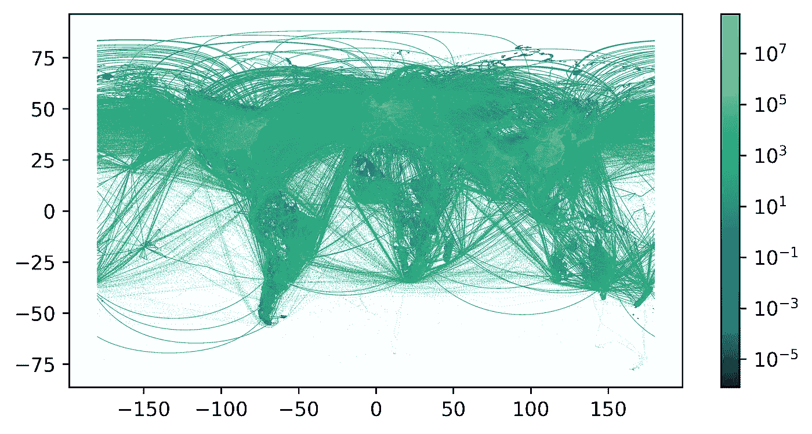
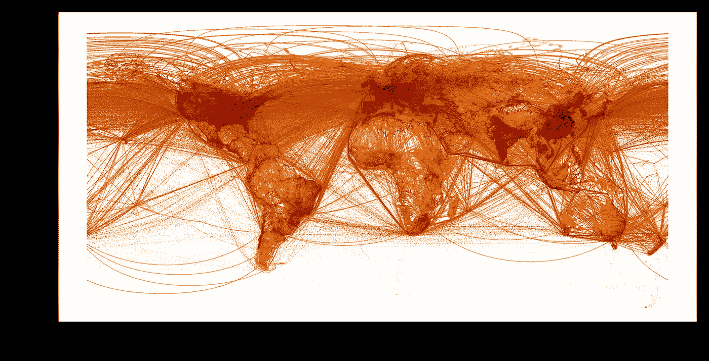
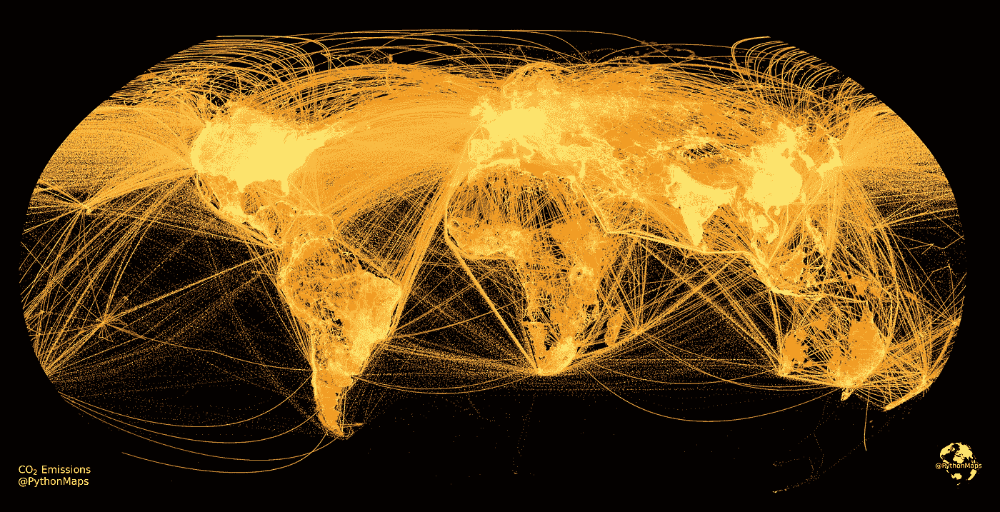
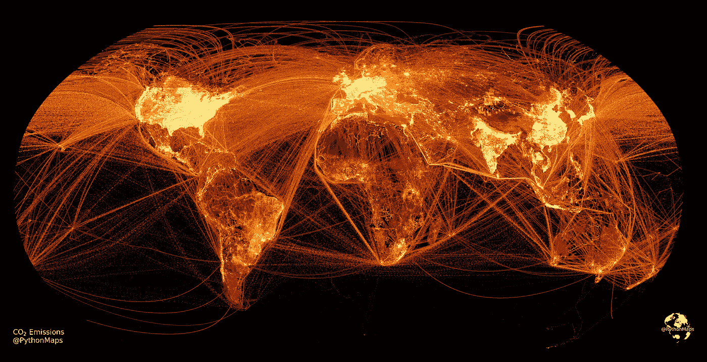
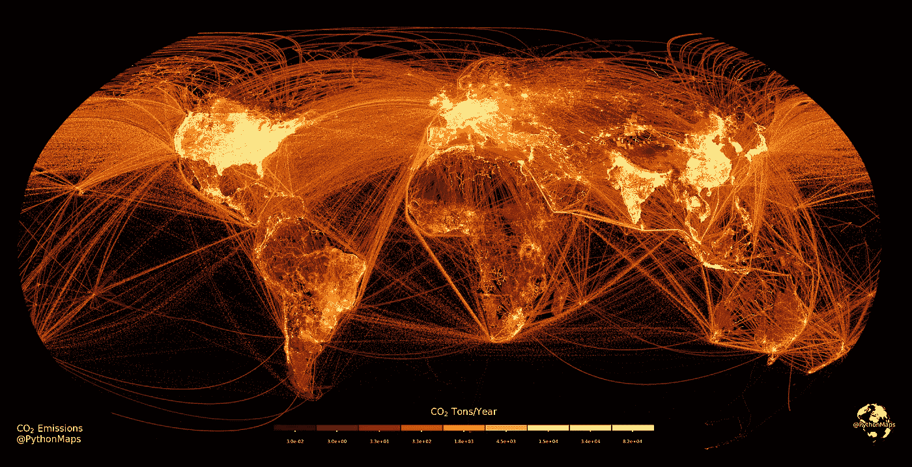

# 用 Python 可视化世界二氧化碳排放量

> 原文：<https://towardsdatascience.com/visualising-the-worlds-carbon-dioxide-emissions-with-python-e9149492e820>

## 用 Python 展示全球二氧化碳排放的严峻现实

作者图片

# 介绍

出于某种原因，气候变化最近经常出现在新闻中。特别是我们的汽车、工厂、船只、飞机(仅举几例)排放的二氧化碳与通过温室效应导致的地球变暖之间的联系。上图是 2018 年全球短周期二氧化碳排放量。除了看起来很棒，几乎是艺术化的，它还提供了有用的背景信息，让我们了解世界上的碳排放到底来自哪里。这张地图清楚地显示，北美、欧洲、中国和印度是全球主要的排放源。放大不同的区域会显示大量有趣的特征，在北美和欧洲，高亮显示主要城市的亮区，所有亮区都与对应于主要道路的亮区相关联。在海上，可以找到主要的航线，例如中国-新加坡-马六甲海峡-苏伊士运河是一条特别明亮的线。还有一系列与主要航线相对应的曲线，特别是在北美和欧洲之间。人口密度可以用来解释这张地图，但是也有一些明显的例外。例如，南美洲的部分地区比预期的要亮，而西非可能比预期的要暗一些。相比之下，居住着埃及 95%人口的尼罗河却像圣诞树一样被点亮。也就是说，需要注意的是，这些地图纯粹是定性的，而不是定量的，所以要小心从中得出什么结论。

那么我们如何着手绘制地图呢？第一步是获取数据。数据可从 EDGARv6.0 网站([链接](https://edgar.jrc.ec.europa.eu/index.php/dataset_ghg60))获得，引用克里帕等人(2021) ( [链接](https://data.jrc.ec.europa.eu/dataset/97a67d67-c62e-4826-b873-9d972c4f670b))，只要使用了适当的引用，就可以下载和使用。有许多数据集可供选择，我将在以后的文章中探讨其中的一些。在本文中，我们将研究 2018 年的短周期二氧化碳排放(遗憾的是，2018 年是最近的数据集)。值得注意的一点是，该数据集包括所有化石二氧化碳来源的排放，如化石燃料燃烧、非金属矿物加工(如水泥生产)、金属(黑色和有色金属)生产过程、尿素生产、农业石灰处理和溶剂使用。不包括大规模生物质燃烧，包括稀树草原燃烧、森林火灾以及土地利用、土地利用的变化和林业的源和汇。他们方法的完整描述可以在[这里](https://edgar.jrc.ec.europa.eu/methodology)找到。

所以下载数据，并把它存储在你想执行代码的任何地方。我已经将数据读入到一个`pandas.DataFrame`中，并打印出结果`DataFrame`来看看我们在处理什么。数据非常简单，包括一个特定纬度/经度对的排放值，单位为吨/年。

# 数据探索

调查污染最严重的地区也很有趣。

也许并不令人惊讶的是，虽然也有一些来自印度、俄罗斯和台湾的显著贡献，但大多数都在中国。

绘制数据显示，数据没有覆盖整个世界，太平洋和南大洋的部分数据缺失。这并不奇怪，因为这些海洋非常广阔，而且通常没有人类的影响。我刚刚在这里使用了一个散点图来表示纬度和经度值。关于接下来的剧情需要注意一些事情。这些点被设置为 0.05，因为如果保留默认值 1，它们会重叠。分散点的边缘独立于点本身，不能小于 1。所以这些必须关掉。同样需要注意的是，在绘制纬度和经度值时，纬度是 y，经度是 x。

数据中纬度和经度值的分布。作者图片

根据发射值给点着色是一种很好的方式来了解数据的实际情况。不幸的是，该图以低排放值为主。

由发射值着色的纬度和经度值。作者图片

研究数据(为简洁起见，我在很大程度上省略了这些数据)显示，主要是每年 0-1000 吨二氧化碳的数值，还有一小部分数值高出几个数量级。

考虑到这一点，我们将绘制对数标度的值。如果可能的话，我尽量避免使用对数图，因为由此产生的图可能很难解释，而且数据通常没有意义。但是，当一小部分值的数量级大于大多数值时，以及在试图显示乘法因子的图中，对数图是很好的选择。我们的数据符合这两个类别，因此在这种情况下是合适的。对数图还有一个上下文原因。我们想知道二氧化碳的排放来自哪里，如果我们使用上面的图表，我们会得出这样的结论:排放量在世界范围内是均匀分布的。我们知道伦敦的排放量可能高于大西洋中部，所以我们需要一种方法来区分少量的高值和大量的低值。

# 绘制数据

`Matplotlib`有一个内置的对数标尺，用于下面的区块。

以对数标度绘制的排放数据。作者图片

我们所知的世界现在开始展现自己，所以现在是时候让它看起来更漂亮了。虽然绿色在科学上是完美的色彩图(【https://www.youtube.com/watch?v=xAoljeRJ3lU】)，但我想要一些火热的东西来展示二氧化碳的排放，因为它们导致了全球变暖，这是潜在的火热。因此，我们将它切换到 AFM hot _ r(r 表示颜色映射反转，将低值映射到浅色，将大值映射到深色)。我把它反过来了，因为背景是白色的，我们想突出大的排放值。

使用 afmhot_r 颜色图以对数标度绘制的排放数据。作者图片

地图开始成形了，现在开始投影。有许多地理投影，在开幕图像中显示的一个被称为罗宾逊投影，虽然有争议，但它通常被认为是最现实的。到目前为止，我们一直依赖于用标准散点图(模糊地对应于墨卡托投影)来绘制值。这在技术上是好的，但是如果我们想要将排放数据正确地映射到地理投影上，这就不合适了。因此，纬度/经度值需要转换成`shapely`点，然后可以转换成我们想要的投影。

然后可以用`subplots`函数中的一个名为`cartopy`的库重新投影数据。随意应用你想要的任何样式改变，例如我喜欢黑暗模式，所以我把背景改为黑色，并翻转颜色图，这样大的值会更亮。

黑暗模式下的二氧化碳排放！作者图片

# 与原始研究相比如何？

最初绘制这张地图时，我对上面显示的地图非常满意，但我认为最好通过查看原始出版商的地图来检查它应该是什么样子。下图是由原始出版商制作的。出于我无法确定的原因，他们选择了一个奇怪的色阶值系列，即 0.0、0.06、6、60、600、3000、6000、24000、45000、120000。除了缺乏解释，我认为复制这个图会很有趣，因为这些是气候专家，可能比我知道得更多，因此可能有一个很好的理由。

EDGARv6.0 网站([链接](https://edgar.jrc.ec.europa.eu/index.php/dataset_ghg60))到克里帕等人(2021) ( [链接](https://data.jrc.ec.europa.eu/dataset/97a67d67-c62e-4826-b873-9d972c4f670b))。作者图片

像以前一样，我们将使用 afmhot 作为我们的颜色图，但这次我们将它映射到 10 种颜色，并将这 10 种颜色归一化为上图中的 10 个值(0.0，0.06，6，60，600，3000，6000，24000，45000，120000)。默认情况下，在`matplotlib`中使用色图的对象将色图中的颜色从数据集中的最小值线性映射到数据集中的最大值，间隔由色图中的颜色数量决定。`BoundaryNorm`类允许你将颜色图中的颜色映射到一组自定义值。在下面的代码中，我们创建了一个有 10 种颜色的颜色图和一个`BoundaryNorm`对象，它将根据预定义的级别把数据中的值映射到颜色图。

图解说明如何将发射映射到颜色。图片作者。

上面的图像给出了正在发生的事情的大致形象。颜色图由 10 种颜色生成，我们的排放数据集中的值将根据上图中的值进行着色。例如，等于或大于每年 120000 吨二氧化碳的数值将被涂成白色。

现在，有了新的色图和标准化的边界，我们可以重新绘制地图，这次以一种更能让人想起原作者所做的方式将值映射到颜色。

世界二氧化碳排放量！作者图片

最后要做的是提供一个 colourbar，这样我们的读者就可以理解他们实际上在看什么。我有时并不担心这一步，但思考一下还是很有用的。

瞧啊。作者图片

# 结论

我们看到了，一张漂亮的地图显示了世界二氧化碳排放的来源。这是计划展示如何使地理空间数据看起来很棒的许多文章中的第一篇，请订阅以便您不会错过它们。我也喜欢反馈，所以请让我知道你会如何做不同或建议改变，使它看起来更棒。我每周都会在我的推特账户上发布数据可视化，看看地理空间数据可视化是不是你的菜[https://twitter.com/PythonMaps](https://twitter.com/PythonMaps)

**参考文献**

m .克里帕、d .吉扎尔迪、Schaaf、e .索拉索、e .芒特恩、m .蒙弗蒂-费拉里奥、f .奥利维尔、J.G.J .、维尼亚蒂:世界所有国家的化石二氧化碳和 GHG 排放量——2021 年报告，编写中。

m .、Solazzo、e .、Huang、Guizzardi、d .、Koffi、e .、Muntean、m .、Schieberle、c .、Friedrich、r .和-Maenhout、g .:全球大气研究排放数据库中的高分辨率时间廓线。Sci 数据 7，121 (2020)。[doi:10.1038/s 41597–020–0462–2](https://doi.org/10.1038/s41597-020-0462-2)。

国际能源机构(2019)世界能源平衡，www.iea.org/data-and-statistics，版权所有，由欧盟委员会联合研究中心修改。

Jalkanen，J. P .，Johansson，l .，Kukkonen，j .，Brink，a .，Kalli，j .，& Stipa，T. (2012 年)。颗粒物和一氧化碳船舶交通废气排放评估模式的扩展。大气化学和物理学，12(5)，2641–2659。[doi:10.5194/ACP-12–2641–2012](https://doi.org/10.5194/acp-12-2641-2012)

Johansson，l .，Jalkanen，J.-P .，& Kukkonen，J. (2017)。基于高时空分辨率的 2015 年全球航运排放评估。大气环境，167，403–415。[doi:10.1016/j . Atmos env . 2017 . 08 . 042](https://doi.org/10.1016/j.atmosenv.2017.08.042)