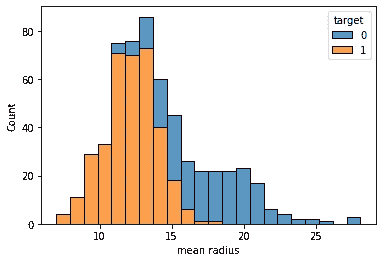

# 在分类问题中可视化数字特征的预测能力

> 原文：<https://towardsdatascience.com/visualize-the-predictive-power-of-a-numerical-feature-in-a-classification-problem-a37bedc87d3b>

## 如何可视化数字特征的预测能力



作者图片

在有监督的机器学习问题中，测量某些特征的预测能力总是一项难以完成的任务。在使用任何相关性度量标准之前，可视化一个特性是否能提供信息是很重要的。在本文中，我们将把数据可视化应用于分类问题。

# 数字特征如何影响分类目标？

有几种方法可以预测数字特征与分类目标之间的关系。例如，在血液分析中，如果某个值超过了某个阈值，生物学家可以假设存在某种疾病或健康状况。这是一个简单的例子，但它让我们清楚地了解了这个问题。在数字特征域中，我们必须找到一些子区间，在这些子区间中，分类目标显示一个比其他值更频繁的值。这是数字特征对分类目标的预测能力的定义。

这可能发生在我们想要的任意多个子区间上(实际上，这就是决策树实际上对我们的数据集建模的方式)。

# 数据可视化

在深入研究这种相关性的数值估计之前，以某种不偏不倚的方式将其可视化总是有用的。

在我关于 Python 中的[探索性数据分析的免费课程中，我谈到了一种特殊的可视化，即堆叠直方图。](https://www.yourdatateacher.com/exploratory-data-analysis-in-python-free-online-course/)

实际上，我们执行一个变量的直方图，并且根据与直方图的那个柱相关的目标变量的值，将每个柱分割成堆叠的子柱。这里有一个例子:


作者图片

正如我们所看到的，在 0.3 之前，多数类是 1(条形几乎是黄色的)，而对于更高的值，条形变得更蓝。这在数字特征和分类变量之间有很强的相关性，因为我们已经能够发现两个区间，在这两个区间中，目标变量的一个值明显比其他值更频繁。

这个直方图的想法是，寻找一种颜色比其他颜色出现得更频繁的范围。使用这种方法，我们可以说有一个阈值根据特征值决定我们的目标变量的行为。这正是模特需要的学习能力。

通过逻辑回归和二元决策树可以很容易地发现这种相关性，因此这种分析可以为我们提供关于实际可行的模型类型的信息。

现在让我们看一个 Python 中的例子。

# Python 中的一个例子

对于这个例子，我将使用 scikit-learn 库中包含的乳腺癌数据集。

首先，让我们导入一些库。

```
import seaborn as sns 
import matplotlib.pyplot as plt 
from sklearn.datasets import load_breast_cancer
```

然后，让我们导入数据集。

```
dat = load_breast_cancer(as_frame=True) 
df = dat['data'] 
df['target'] = dat['target']
```

让我们假设我们想要可视化“平均半径”特征的预测能力。我们可以只用一行代码来绘制堆积直方图:

```
sns.histplot(df,x="mean radius", hue="target", multiple="stack")
```

这是结果。


作者图片

正如我们所看到的，在 16 左右有一个阈值，低于这个阈值，目标变量的多数值为 1，高于这个阈值，目标变量的多数值为 0。所以，我们可以说这个变量是有预测性和信息性的。

我们现在可以对每个数值变量进行探索性分析，以显示它们的预测能力。

# 结论

在本文中，我展示了我最喜欢的一种方法，即可视化数字特征对分类目标的预测能力。这可能不是唯一可能的方法。例如，100%堆积直方图可能更具可读性。总的想法是，在计算任何数字之前，我们总是需要可视化信息，使用这种类型的图表可以提高我们项目的质量，同时产生良好的可交付成果。

*原载于 2022 年 3 月 30 日*[*【https://www.yourdatateacher.com】*](https://www.yourdatateacher.com/2022/03/30/visualize-the-predictive-power-of-a-numerical-feature-in-a-classification-problem/)*。*