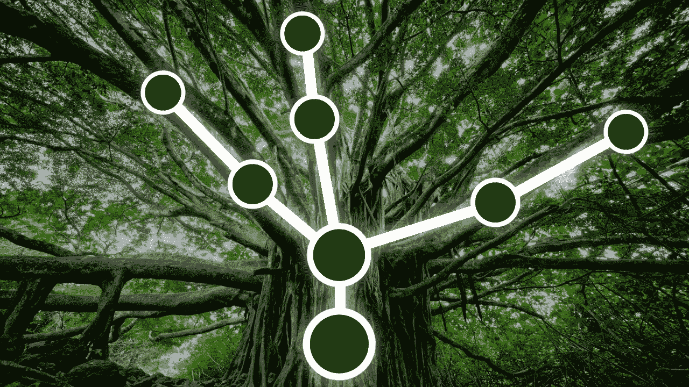
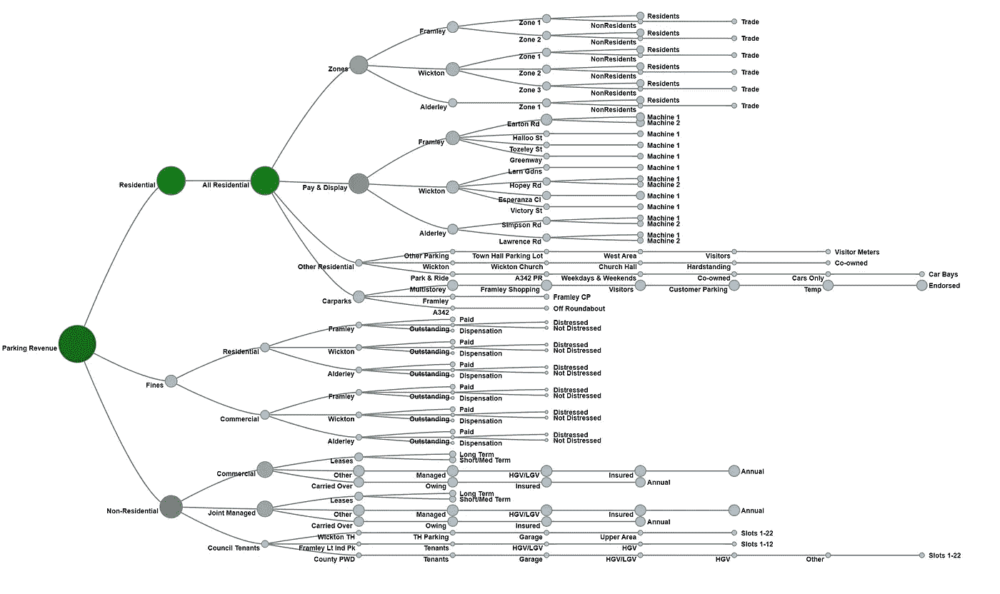
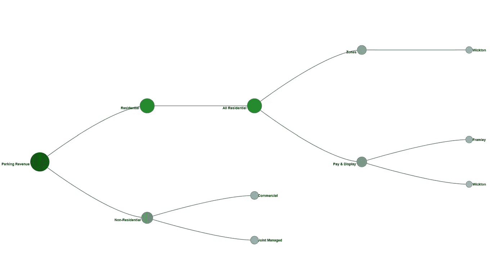
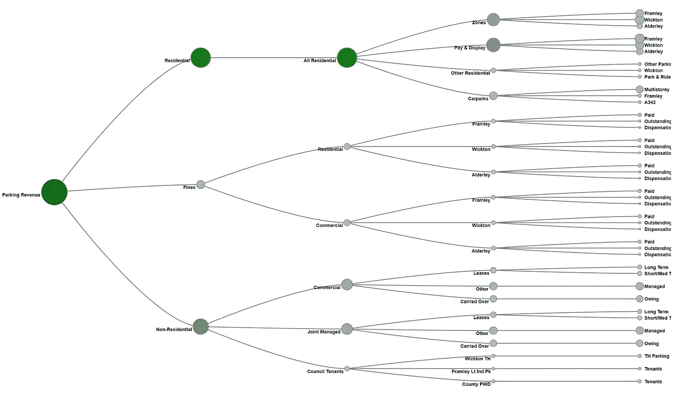
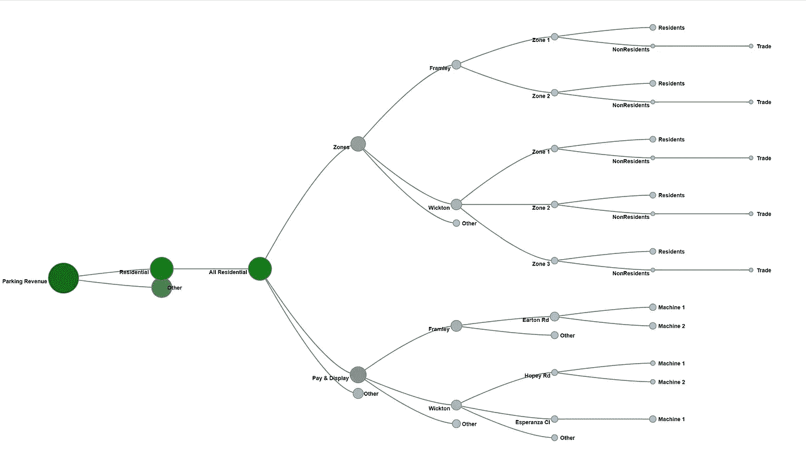
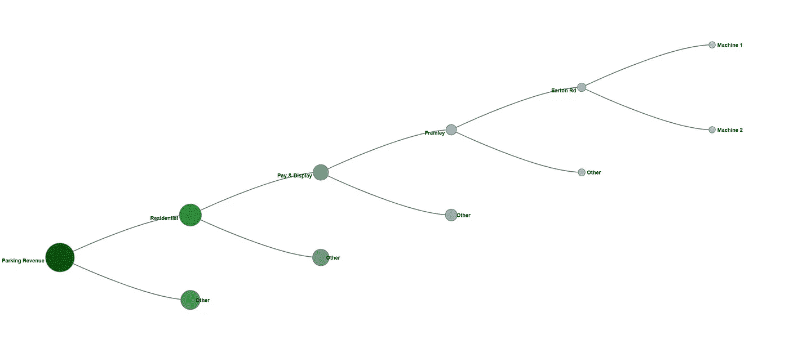
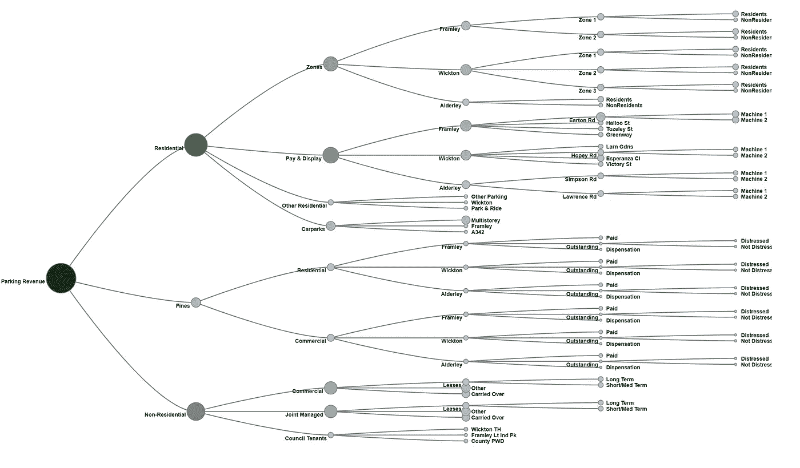
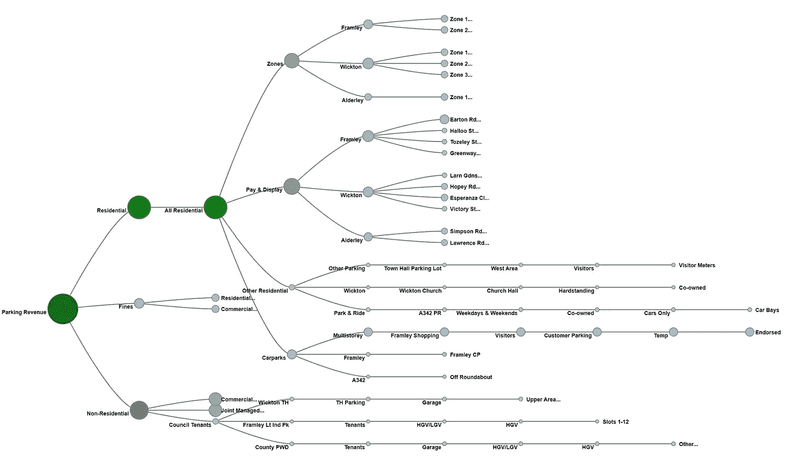
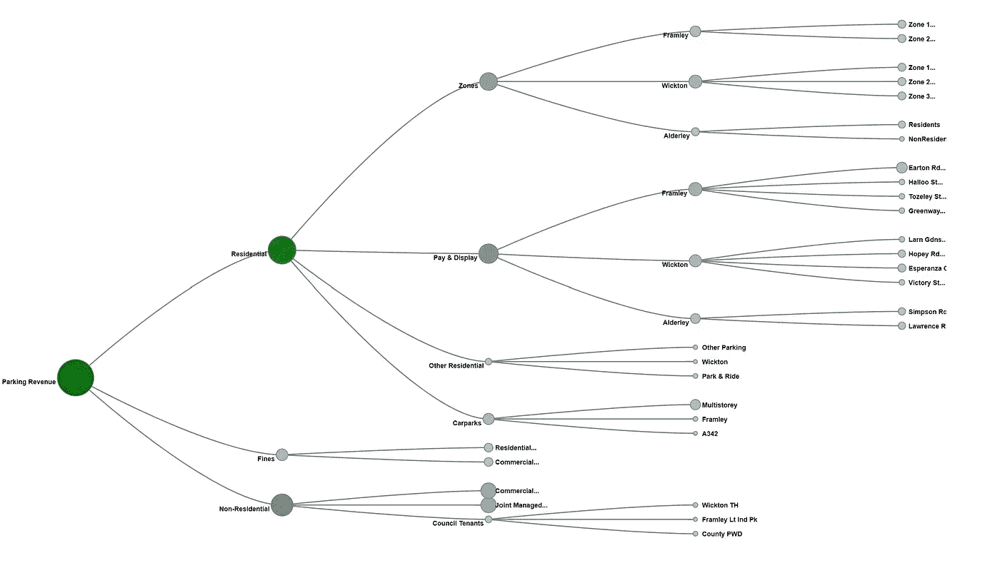
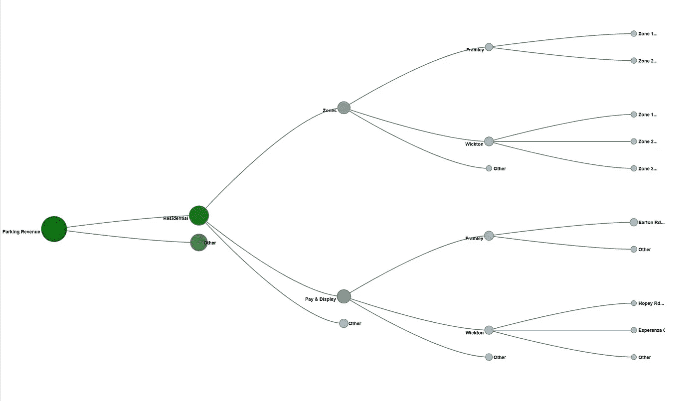

# 可视化复杂数据:使用语法归纳法简化树结构

> 原文：<https://towardsdatascience.com/visualizing-complex-data-simplifying-tree-structures-using-grammar-induction-b4843b5daaf4>

## 一组将复杂的树总结成更容易呈现和阅读的形式的方法

复杂的数据树通常可以简化而不失去其本质意义(布兰登·格林拍摄的[树，经许可使用，所有其他图片由作者提供)](https://unsplash.com/photos/GEyXGTY2e9w)

你有一些重要的数据，你渴望与思想家和决策者分享。像许多重要数据一样，您的数据是分层的，像树一样结构化——可能是嵌套的投资组合或供应链信息。

如果这些数据可以很容易地呈现在幻灯片上就好了，但是树往往太大、太笨拙，节点太多；很少有人能从可能有数百个微小节点的树形图中获得有用的信息。因此，您需要简化树数据，以便产生良好的可视化效果。

这是一个非常常见的场景。

当然，你可以创建一个手工制作的信息图，但是这会引入偏见和意见，而且它不能扩展。因此，挑战在于从算法上降低树的复杂性，这样就可以把它放在幻灯片上，很快被理解，同时尽可能地保留它的结构。

这是一个困难的开放式数据可视化问题，它位于艺术和科学的边界，这总是一个有趣的工作场所。令人高兴的是，有几种非常有效的算法方法可供我们考虑。我发现特别有趣的是，通常与数据压缩相关的[语法归纳算法](https://en.wikipedia.org/wiki/Grammar_induction)，在数据可视化领域非常有用。

在本文中，我将:

*   展示一个合适的数据集示例
*   探索相对简单的树简化算法
*   引入语法归纳作为算法家族
*   展示对示例数据应用语法归纳如何产生有用的结果。

与以往一样，代码可应要求提供。

# 示例数据

本文的示例数据需要来自真实世界的一些树状数据，即:

*   足够复杂和丑陋，以至于不容易被形象化
*   足够小，以使生成的树很好地适合文章
*   乏味的

例子数据为什么要枯燥？嗯，如果数据是有趣的，我们会试图使用我们对数据的*含义*的了解来简化树——而对于纯算法的方法，我们不能这样做。

那么，我们的示例树将会又丑又无聊；这是英国当地政府部门停车收入的一个匿名子集。每个节点代表一些停车收入来源的分组，总收入的一些数量(由节点大小表示)。完整的树是这样的:

图 1:原始树数据

照目前的情况来看，这种树太复杂了，无法用幻灯片展示给决策者。我们现在将看看简化它的算法方法。

# 简单的算法

首先，我想看看我们可以采用的一些更简单但仍然有用的算法。

## 节点过滤算法

也许简化树的最天真的方法是根据规则简单地过滤掉一些节点。让我们看看当我们过滤掉收入低于特定阈值的所有节点时，我们的停车收入树是什么样子的。

图 2:应用的节点过滤

这一点用处都没有。它失去了许多重要的结构；事实上，停车场显然被划分到了弗雷姆利、威克顿和奥尔德利这三个城镇，更糟糕的是，整个收入类别消失了，没有警告决策者他们曾经在那里。也许如果我们设置一个更宽松的阈值，只删除非常小的节点，结果会更好。

图 3:具有较低阈值的节点过滤

这是一个非常糟糕的结果，证明了算法数据简化的一个常见问题——保留的并不总是重要的。简化的树与我们的第一次尝试有相同的问题，但现在它保留了原始树的奇怪方面——例如那些单个子节点的长字符串——这可能会进一步模糊信息内容。

当简化非常大的图时，节点过滤算法是有用的(参见[本文](https://www.cs.drexel.edu/~david/Papers/IV08.pdf)中的一个例子)，但是它们不一定适合直观地总结一个(相对)小的树。

## 深度限制算法

简化树的另一个基本方法是减少树的深度，这样从根开始没有节点可以超过 *n* 个节点。理论上，我们希望这通常会产生相当好的结果，因为它应该保留代表大量数据聚合的节点，并删除它们不太重要的后代。让我们尝试将深度限制为 5 个节点。

图 4:最大深度 5

这并不像简单的节点过滤算法那么糟糕，但是它有很大的缺陷。首先，它压缩了树形结构，使得它的所有方面看起来都具有相同的深度——隐藏了这样一个事实，即某些类型的停车收入显然比其他类型的更复杂。另一个问题是，通过将它们都表示为叶节点，它给人一种错觉，即‘fram ley’在某种程度上是与‘outstanding’相同的节点。它还保留了“Fines”下的许多细节，只是因为“Fines”碰巧在深度 5 已经有了许多节点。

注意，有几种不太幼稚的方法来限制树的深度；两个流行的是:

*   **叶子修剪**:去除所有叶子节点。重复操作，直到达到所需的最大深度。这更好地保留了树的一些形状。
*   **自底向上深度限制**:通过从靠近根的位置移除节点来限制深度，而不是移除远离根的节点。这种方法非常复杂，但是对于某些用例来说会产生很好的结果。

## 宽度限制算法

现在，我们尝试一组更具计算挑战性的方法。有各种宽度限制算法，通常依赖于两个步骤:

1.  计算在特定深度可以存在的最大节点数
2.  在每个深度，移除、移动或组合同级节点，直到不再超过最大值

例如，让我们尝试一种宽度限制方法，其中代表较少收入的兄弟节点被组合到一个“其他”节点中，直到没有节点具有两个以上的兄弟节点。

图 5:宽度限制算法限制了一个节点可以拥有的孩子的最大数量

这比过滤和深度限制方法要好得多！第一次，树的形状被保留了下来(不要介意视觉间距不是很好——那只是布局问题)。如果我们设置更苛刻的参数，迫使更多的节点组合成“其他”，结果可能会更好。

图 6:宽度限制算法，每个父母只有 2 个孩子

好吧，没关系。但是适度设置的宽度限制算法肯定是有效的。

## 拓扑保持算法

在简化任何图时，可以通过删除任何 2 阶节点(即恰好有 2 个连接的节点)来保留图的整体拓扑。这只是一种拓扑保持简化算法，但它是一种强大的算法。当应用于树时，它归结为删除所有只有一个子节点的节点，保留子节点并将其连接到其祖父节点。

这被称为“单例删除”，这是一个非常简单且广泛有用的算法，在我们的例子中，结果是这样的:

图 7:单例移除

这并没有影响到树的大部分，但它确实对原始树中的那些长“字符串”有所帮助，这些字符串似乎传达了很少的有用信息。它本身并没有产生一棵有用的树，但也许它会在与其他算法的结合中发光。

## 堆叠算法

所有的树简化算法都可以堆叠起来——按顺序应用，希望每次都能提高可视化效果。它们的应用顺序极其重要。对一棵树应用连续的简化就像对一幅图像应用连续的有损压缩算法；如何做到这一点的细节可以决定有用的信息是否被保留，噪音是否被丢弃…或者反之亦然。

在这个例子中，首先在每个节点上对树进行最小量过滤，然后进行深度限制步骤:

图 8:在深度限制之后应用节点过滤

这并不完美，但比这两种方法本身产生的效果要好得多。一些算法(如单例删除)通常最好在最后一步执行；有些作为第一步效果更好。

# 复杂的算法

我们已经研究了各种相当简单和直观的树简化方法，并了解了如何将它们结合起来。这些方法是有用的，但是它们有一个共同点，这限制了它们的能力，那就是它们没有考虑到整个树。每一个都查看特定的节点或一组兄弟节点，并决定是执行节点移除操作还是节点组合操作。通过使用考虑树的整体结构的算法，我们可以取得更好的结果，即使是在我们枯燥的停车收入树上。

[语法归纳算法](https://en.wikipedia.org/wiki/Grammar_induction)是可以实现这一点的算法家族之一。

## 什么是语法归纳法？

语法归纳是从一组观察结果中推导出一种语法的过程，这种语法可以反过来产生观察结果。

如果这听起来没什么用，考虑一下这就是你在压缩文件时所做的事情；您的压缩程序中的算法正在生成一个语法(在某种意义上)，然后可以应用于一些少量的起始数据来重新创建原始文件。

语法归纳法还有很多其他用途。语法可以被解释为输入的重要(即频繁出现的)部分是什么的目录；这可以让我们区分大型非结构化数据集中更随机或更重复的数据区域，这在法医、电信和军事领域有很多用途。

## 顺序数据的语法归纳:LZW

也许最著名和最广泛使用的语法归纳算法是[伦佩尔-齐夫-韦尔奇](https://en.wikipedia.org/wiki/Lempel%E2%80%93Ziv%E2%80%93Welch)，又名 LZW，在。gif 文件。LZW 通过顺序处理一系列输入符号来提高速度，在此过程中建立一个常见符号序列的字典。这是一种非常快速的压缩文件的方法，但是对于数据可视化来说并不相关，因为对于外部树数据来说没有什么特别的顺序性。

## 随机存取数据的语法归纳:推论

sequitu 是一个简单而聪明的算法，它对一系列不需要顺序访问的输入符号进行操作。因此，Sequitur 及其衍生工具能够建立一个树状语法，而不是一个字典；这个树中的节点代表输入中经常出现的模式。推论对于解释一无所知的符号列表非常有用。

## 树上的语法归纳

然而，在我们的例子中，我们从一棵树开始，所以 Sequitur 做的很多工作对我们来说是没有用的。事实上，从一棵树开始，我们得到了一个盘子里的语法；这不是一个非常有用的语法，因为语法树对于原始树中的每个节点都有一个节点。但是我们可以用几种方法来处理语法，以缩短语法，从而产生一个更简单的树，它具有原始树的许多属性。我们可以做的一件事是识别该语法中的重要节点，如果我们实际上使用该语法来复制原始树，这些节点将被应用得最多。为此，我们将使用以下形式的算法:

1.  定义一个“子树摘要”函数，它的输入是一个子树，输出是一个摘要—一个可以比较的数据项，它表示子树的结构。
2.  将该函数应用于树中的每个节点。
3.  检查树并使用“子树匹配”功能比较子树摘要。确定汇总匹配的节点。
4.  将这些节点替换为占位符节点，表示找到了循环结构。
5.  回到步骤 2，根据需要重复多次。

这里大量的参数化是可能的。

> (懒惰和好奇的读者请注意——是的，也可以将树序列化为字符串，对其运行 Sequitur，然后进一步处理 Sequitur 生成的树，对于大型的真实用例，这通常比原始树小得多。然而，这种方法在许多现实世界的用例中存在问题，因为 Sequitur 不能很容易地进行“模糊匹配”，而在现实生活中，我们经常想要识别接近但不完全相似的子树。)

## 将语法归纳应用于我们的示例树

对于我们的简单示例，我们将使用这些函数和参数:

*   子树摘要函数:“摘要”是一个字符串，通过序列化子树创建，包括子树节点的名称。在真实的用例中，通常最好不要将节点名称合并到摘要中。
*   子树匹配函数:我们比较字符串，看它们是否相等。
*   其他参数:我们只遍历树一次，所有匹配其他节点的节点都被替换为汇总节点。

汇总节点的名称以'…'结尾，因此您可以看到它们是哪一个。如果我们为适当的布局而烦恼，我们会做一些更复杂的事情。

结果如下:

图 9:简单语法归纳步骤后的树

它没有对那些单个节点的长字符串做任何事情，但这不是问题，因为我们已经有了解决方案。

语法功能*成功地实现了*认识到各种道路和区域都是“同类事物”,并用占位符替换它们，忽略了频繁重复的关于居民、贸易、机器等等的细节。因此，树的节点减少了，但重要的结构大多被保留了下来。

本质上，我们已经对树应用了基于语法归纳的压缩级别，但是随后(因为我们的目的是可视化简化的树，而不是重新创建原始的树)我们已经抛弃了语法本身，即子树摘要的树。

# 简化示例树

现在让我们把所有的技术放在一起，把我们简单的语法归纳算法和我们讨论过的一些其他算法放在一起。我认为这是一个非常好的树的简化，使用了语法归纳和单例移除:

图 11:语法归纳加上单例移除很好地简化了树

这是另一种解释，通过结合语法归纳、单例移除和宽度缩减，极大地减少了节点数，从而产生了一个大大简化的树，它仍然具有原始树的大部分形状:

图 12:添加节点过滤进一步简化了树

它并不完美——视觉效果当然还需要改进——但它比我们原来的树更适合在幻灯片上展示。

# 后续步骤

我希望你喜欢这些算法。当然，算法不是一切；除了纯粹的地形算法之外，还有许多重要的技术可以使用，但本文并未涉及:

*   **视觉效果和布局**。在实际显示阶段，可以做大量的工作来使树更加清晰。
*   **树的语义处理**。在现实生活中，领域知识或者仅仅是树所代表的常识非常重要。
*   **数据整形和数据质量**。像许多真实世界的数据集一样，我们的停车收入数据集很难看，有很长的单线字符串，不必要的细节，有些地方还有无法理解的节点标签。在可能的情况下，修复上游的实际数据是为下游提供更好的决策支持的强大工具！

然而，在本文中，我介绍了一个树简化方法的目录，所有这些方法都是完全自动的，可以一起使用来减少树的节点数，同时保持其形状，从而帮助可视化数据和做出决策。

我还试图展示压缩算法是如何帮助汇总和可视化复杂数据的众多强大技术之一。在过去的十年中，人类已经收集了一个又一个复杂的图形数据，然而我们对可视化和理解这些数据的技术的探索才刚刚开始。

感谢您的阅读。