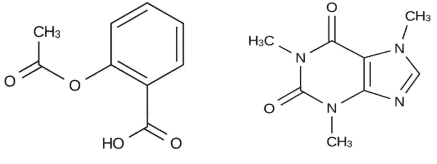
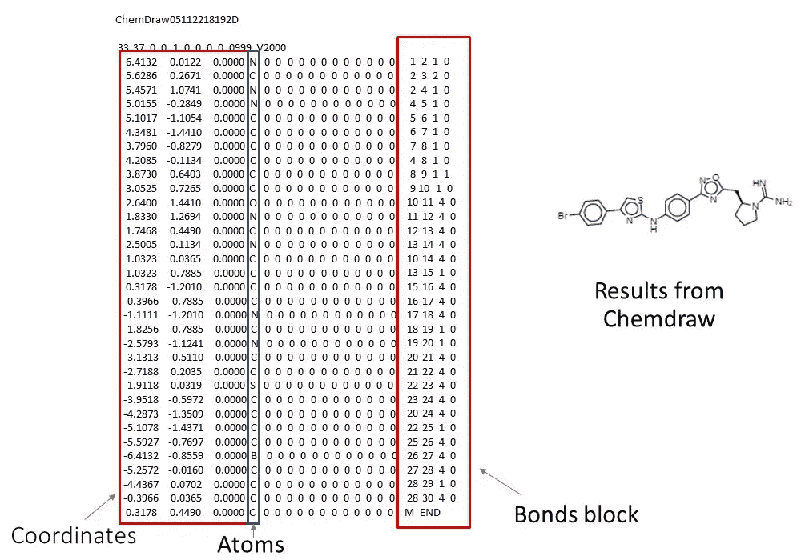
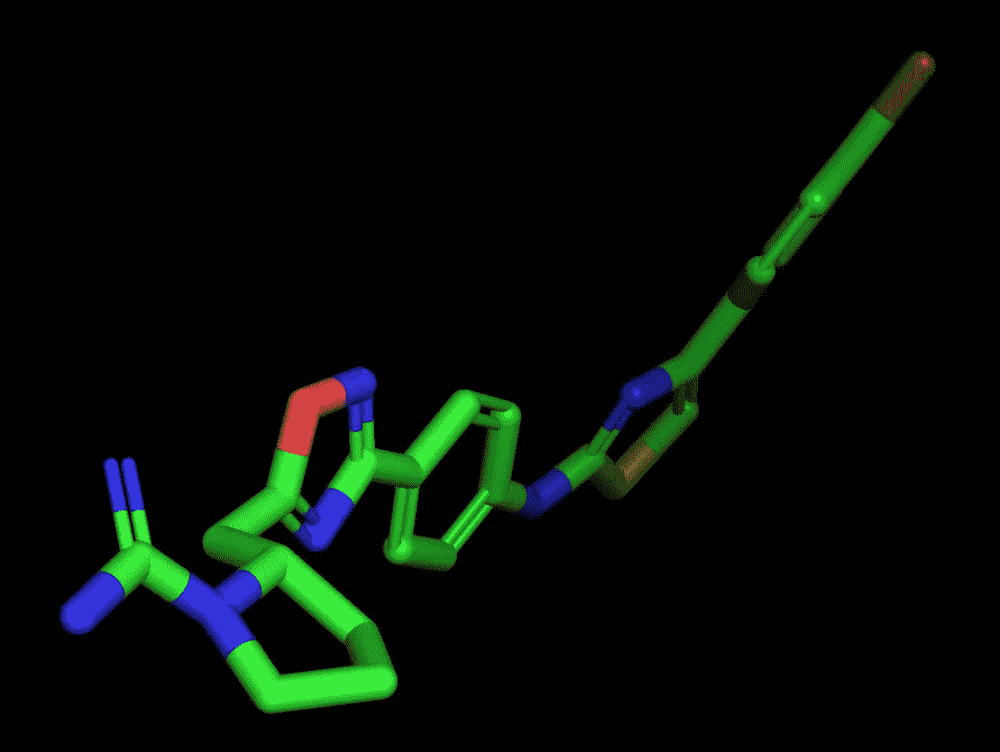

# 用 Python 管理计算化学的分子

> 原文：<https://towardsdatascience.com/visualizing-molecules-for-computational-chemistry-fdffe7075cad>

## 从“微笑”到 3D


演职员表:[玛利亚·古利亚耶娃](https://www.pexels.com/@maria-gulyaeva-1259102/)，免 pexels.com 版税

化学中的微笑…不，我们不会谈论上面图片中的那个。由于失败的实验，这些微笑通常很少在实验室或计算机模拟中出现。我们要讲一些和计算化学相关的东西。简而言之，计算化学是化学的一个分支，它使用计算机工具来辅助复杂的化学研究，如药物设计。自从阿尔法折叠和量子计算的出现，这个领域开始了新的复兴。

[](/quantum-landscape-for-protein-discovery-62c0c86fc27e) [## 蛋白质折叠的量子景观

### 量子计算如何有希望开发治疗神经退行性疾病的药物等等

towardsdatascience.com](/quantum-landscape-for-protein-discovery-62c0c86fc27e) 

**SMILES** (简化分子输入行输入系统)是一种基于行符号中字符的符号，使用短 ASCII 字符串描述化合物的结构。大多数分子编辑器可以导入微笑字符串，并将其转换回二维图形(尽管分子在现实中是 3D 的)。这种方法非常有用，因为它允许你利用基于**字符串操作和自然语言处理**的最新**机器学习**工具。下面的图片展示了几个从化学结构到微笑表达的编码例子(例如 CC(=)…。):



CC(=O)OC1=CC=CC=C1C(=O)O 和 CNC[C@@H](C1=CC(=C(C=C1)O)O)O(作者图片)

*   乙醇 CCO
*   乙酸 CC(=O)O

如前所述，大多数编辑器——如 ChemDraw——将 SMILES 符号转换成 2D 图，即使分子实际上是 3D 的。幸运的是，角色中的信息允许在更先进的工具中重建完整的 3D 表示，这是本文的主题。

在大多数 3D 文件格式中，有。pdb(蛋白质数据库文件)或更简单的。摩尔。鉴于它与 Python 库如 [RDKit](https://www.rdkit.org/) 和免费工具如 [PyMol](https://pymol.org/2/) 的通用性，我们在这里描述。mol 文件格式。让我们首先探索如何将 SMILES 符号转换成. mol 文件格式，然后研究. mol 文件中的内容，最后用 [PyMol](https://pymol.org/2/) 可视化结果。

下面的代码片段从 [RDKIT 包](https://www.rdkit.org/)中导入一些库，在上图的 2D a 中绘制，最终将分子保存到一个. mol 文件中。运行这段代码的 CoLab 笔记本在[这里](https://colab.research.google.com/drive/1Wv5LoVmwjV2qtVBMCkbWB-1NQzc_OEBw?usp=sharing)可以找到。

*关键是功能化学。molfromselles()*”这是在读一个 Smiles 符号。

```
from rdkit import Chemfrom rdkit.Chem import AllChemfrom rdkit.Chem import Drawfrom rdkit.Chem.Draw import IPythonConsole
# Convert SMILE into .molmy_mol=Chem.MolFromSmiles('NC(=N)N1CCC[C@H]1Cc2onc(n2)c3ccc(Nc4nc(cs4)c5ccc(Br)cc5)cc3')my_mol_with_H=Chem.AddHs(my_mol)AllChem.EmbedMolecule(my_mol_with_H)AllChem.MMFFOptimizeMolecule(my_mol_with_H)my_embedded_mol = Chem.RemoveHs(my_mol_with_H) #Save the molecule into an imageDraw.MolToFile(my_mol,'molecule.png')#Save molecular rapresentation in mol filesfout = Chem.SDWriter('./charged_test.mol')fout.write(my_embedded_mol)fout.close()
```

作为一个 Python 库，你可以想象这可以很容易地与 Python 中的机器学习、自然语言处理和其他 AI 库相结合。

答。mol 文件格式是一个文本 ASCII 文件，以空格分隔的方式包含以下几个元素:

*   原子列表，每个原子都有其特定的元素标识。
*   一个键的列表，指定它们连接的原子以及键的多重性(单键、双键、三键)
*   每个原子的 2D 或 3D 空间坐标
*   计算分子中的原子和键的数量。
*   与原子或键相关的属性
*   与整个结构相关的属性。

这些通常以列或块的形式表示，如下图所示。第一列是原子的 3D 坐标，然后是原子符号，然后是属性，最后是键值。如果你想知道更多关于这种结构的细节，请查看罗伯特·贝尔福德的“MOL 文件剖析”。



Mol 文件格式结构，图片作者

产生的。使用 RDKIT 通过代码获得的 mol 可以用 PyMol 可视化为:



截图来自作者 PyMol。

总之，我们在这里介绍了一些简单的方法，既可以在 Python 脚本中使用，也可以使用可视化工具从 SMILES 符号中恢复 3D 分子结构。这是为了证明使用 SMILES 符号仍然很方便，即使它看起来不那么可读。药物的图形表示也可以用于机器学习的环境中，尽管在如何在 3D 空间中定向分子方面出现了许多问题。尽管对人类来说准备起来很麻烦，但它可以利用我们已经从机器学习中的自然语言处理中获得的所有进步，包括如[所示的许多最近的作品](https://www.frontiersin.org/articles/10.3389/fchem.2019.00895/full)。

**参考文献**

皮摩尔| pymol.org

[快速工具包](https://www.rdkit.org/docs/Overview.html)

[化学绘图](https://perkinelmerinformatics.com/products/research/chemdraw/)

[解剖一个 MOL 文件](https://chem.libretexts.org/Courses/University_of_Arkansas_Little_Rock/ChemInformatics_(2017):_Chem_4399_5399/2.2:_Chemical_Representations_on_Computer:_Part_II/2.2.2:_Anatomy_of_a_MOL_file)

【张等.化学前沿 2020“sp vec:一种基于 Word2vec 的药物-靶标相互作用预测特征表示方法”

[解剖 PDB 文件](https://www.cgl.ucsf.edu/chimera/docs/UsersGuide/tutorials/pdbintro.html)

# 想连接就连接


[@ Dr _ Alex _ 克里米](https://twitter.com/Dr_Alex_Crimi)


[@ Alec rimi 博士](https://www.instagram.com/dr.alecrimi/)


[亚历山德罗·克里米——YouTube](https://www.youtube.com/alecrimi)


亚历克斯·亚乌·克里米|脸书