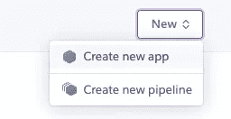
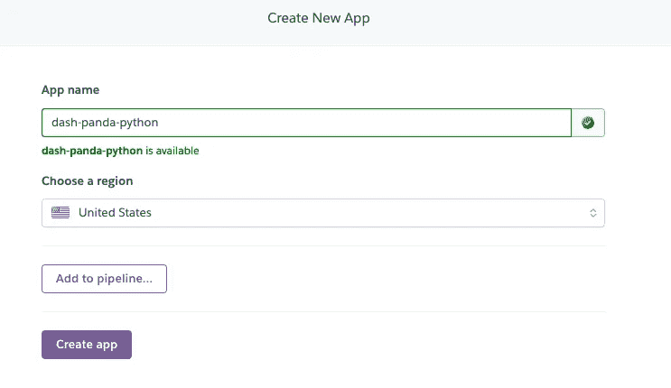

# 用 Python 可视化网飞数据

> 原文：<https://towardsdatascience.com/visualizing-netflix-data-with-python-bca60a2632d9>

## 使用熊猫、Plotly Express、Dash 和 Heroku


[Reddgio](https://unsplash.com/@reddgio?utm_source=medium&utm_medium=referral) 在 [Unsplash](https://unsplash.com?utm_source=medium&utm_medium=referral) 上拍摄的照片

为了更好地理解数据，几乎每个行业都在使用数据可视化。另一方面，由于解释 CSV 文件中的数据可能具有挑战性，因此当数据以图表或地图的形式呈现时，理解数据会变得容易得多。然后基于这些见解，我们可以做出关键的决定。这就是为什么作为数据分析师、数据科学家或开发人员，了解如何使用数据可视化工具至关重要。你可以使用编程语言如 [Python](https://www.python.org/) 或者使用分析服务如[微软 Power BI](https://powerbi.microsoft.com/) 来构建图表。

在这里，我们将通过使用[熊猫](https://pandas.pydata.org/)、[情节表达](https://plotly.com/python/plotly-express/)和[破折号](https://dash.plotly.com/)来使用前一种技术。Pandas 是一个数据分析和处理工具。 [Plotly](https://plotly.com/graphing-libraries/) 是一款开源数据可视化工具，用于创建交互式图表和地图。对于这篇文章，我们将使用 Plotly Express，这是一个 Python 可视化库。它是 Plotly 的 [Python](https://plotly.com/python/) 库的包装器。最后，我们将使用 Dash 通过 Heroku 在 Web 上部署我们的数据可视化应用程序。

# 设置

首先，确保你的机器上安装了 Python [和](https://www.python.org/downloads/)。另外，您需要安装三个 Python 包。您可以通过在您的终端(我使用的是 macOS)中运行下面的[pip](https://pip.pypa.io/en/latest/)(Python 的包安装程序)命令来做到这一点。

```
pip install pandas
pip install plotly
pip install dash
```

## 资料组

让我们从 [GitHub](https://github.com/lifeparticle/dash-panda-python) 下载 Python 项目，它也包含一个数据集。对于任何数据可视化，我们都需要数据集。在这里，我使用的数据集包括网飞上市的电视节目和电影。**你可以从**[**ka ggle**](https://www.kaggle.com/shivamb/netflix-shows)**下载数据集(CC0:公共领域授权)。**数据的结构如下。

网飞 _titles.csv

## 熊猫

如果您不熟悉 pandas，那么可以查看 Jupyter 笔记本文件，其中包含 pandas 代码示例。可以从我的 [GitHub](https://github.com/lifeparticle/Python-Cheatsheet/tree/master/pandas) 下载。要运行该文件，您可以安装 [Anaconda](https://www.anaconda.com/products/individual) 。

## Plotly Express

Plotly Express 提供了一系列数据可视化选项。对于这篇文章，我们将使用下面的。

*   [饼状图](https://plotly.com/python-api-reference/generated/plotly.express.pie.html#plotly.express.pie)
*   [条形图](https://plotly.com/python-api-reference/generated/plotly.express.bar.html#plotly.express.bar)

你可以在 [Plotly 的网站](https://plotly.com/python-api-reference/plotly.express.html)上找到其余的文档。

# 履行

让我们来分解一下`main.py`文件的各个组成部分。

main.py

首先，我已经导入了所有需要的库。然后我使用方法`read_csv`读取 CSV 文件，通过修改实际数据删除重复记录。之后，我创建了一个饼图和一个条形图。对于饼图，设置很简单。我需要设置一些参数来构建饼图。对于`data_frame`参数，我正在传递数据集。对于`names`参数，我将传递`type`列。

此外，我们还需要为条形图设置一些参数。这里，对于`data_fram`参数，我通过使用`type`列(`as_index=False`表示`type`列不会用作索引)进行分组后传递数据集，并且使用`agg`函数选择`type`列并执行`count`操作。最后，将输出重命名为`count`列。

现在，通过在本地机器上运行以下命令，您可以使用 Dash 在 Web 上发布我们的图表。

```
python main.py
```

# 部署

我要把这个项目部署在 Heroku 上。为此，我们需要另外两个文件。首先，一个 **requirements.txt** 文件，这样 Heroku 就可以安装所有必要的库。第二，一个 [**Procfile**](https://devcenter.heroku.com/articles/getting-started-with-python#define-a-procfile) ，这样 Heroku 就可以启动我们的 app 了。现在，按照以下步骤操作:

1.  首先，进入[仪表盘](https://dashboard.heroku.com/apps)。然后，从右上角点击**新建**按钮。



**创建新应用**

2.现在，给它起一个名字并点击**创建应用**按钮。



**创建应用**

3.它现在会将您重定向到应用程序的**部署**选项卡。


**部署**

4.选择 **GitHub** 作为部署方法并搜索您的存储库。


**GitHub**

现在点击**连接**按钮。


**连接**

5.最后，点击手动部署部分下的**部署分支**按钮。


**部署分支**

现在，URL 将会是 **appname** ，后跟 **.herokuapp.com** 。因此，在我的例子中，URL 是:

```
https://dash-panda-python.herokuapp.com/
```

它应该看起来像这样:


[https://dash-panda-python.herokuapp.com/](https://dash-panda-python.herokuapp.com/)

你也可以查看官方[文档](https://dash.plotly.com/deployment)来部署你的应用。

恭喜你！您已经成功地在 Heroku 上部署了数据可视化应用程序。您可以使用这种方法通过展示您的数据项目来构建投资组合。现在添加代表不同数据集的不同类型的图表。编码快乐！

# **参考文献**

kaggle.com(未标明)。*网飞电影和电视剧*。[在线]可从[https://www.kaggle.com/shivamb/netflix-shows.](https://www.kaggle.com/shivamb/netflix-shows.)获得

# 相关帖子

</how-to-use-plotly-js-for-data-visualization-46933e1bbd29> 