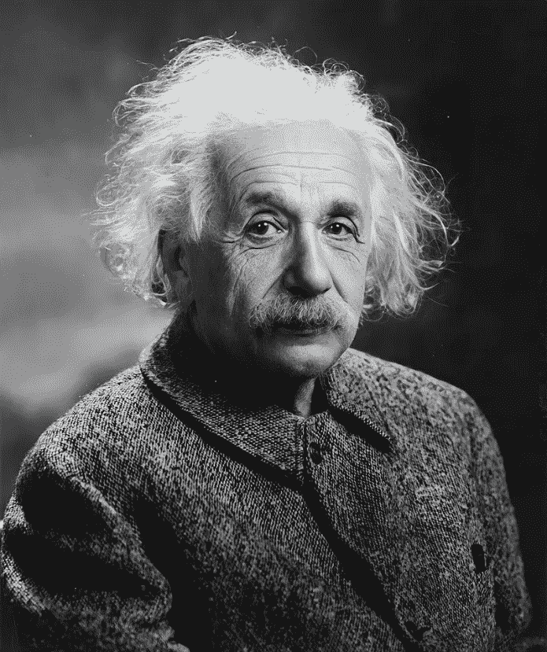
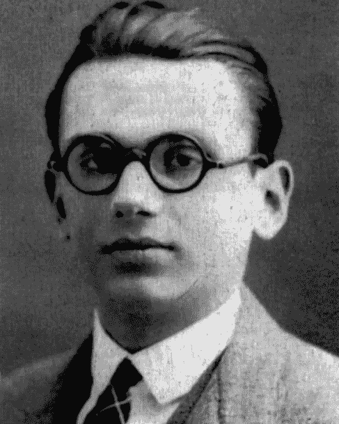

# 和爱因斯坦、哥德尔一起等火车

> 原文：<https://towardsdatascience.com/waiting-for-a-train-with-einstein-and-g%C3%B6del-3ecffb1c596a>

## 哥德尔数、算法和时间

安德里克·朗菲尔德在 [Unsplash](https://unsplash.com/?utm_source=medium&utm_medium=referral) 上拍摄的照片

人类体验时间的方式是迷人而神秘的。时间在一个方向上是线性和连续的。我们不能回到某个特定的时间点，改变我们已经经历过的时刻。

一位名叫尼亚尔·费格森的著名历史学家说过一些我觉得很有趣的话。他说，世界各地的人们可以梦想不同的未来。每个人都为自己设想了不同的未来，然而所有人的未来总是自我崩塌成一个单一的线性范式，称为历史。

这篇短文与历史无关，但弗格森提出了一个有趣的观点。他让人们注意到来自世界各地的人们似乎有着不同的未来，然而奇怪的是，他们似乎都有着共同的过去。

阿尔伯特·爱因斯坦的肖像拍摄于 1947 年——图片来自[维基共享资源](https://commons.wikimedia.org/wiki/File:Albert_Einstein_1947_(Remini_enhanced).jpg)

在接下来的文章中，我想把你的注意力引向时间的本质和算法的本质。人们对时间的感知可能相当机械。他们的感知是由逻辑构成的——时间是基于一个事实系统。爱因斯坦因将时间的机械性质与现实进行对比而备受推崇。

在一篇通常被称为“论运动物体的电动力学”的论文中，爱因斯坦说当人们谈论火车到达站台时，他们通常会说，“火车到达的时间是 7 点”，但爱因斯坦说这样说是不合适的。他说，更恰当的说法是，火车在时钟的长指针指向 12 点，短指针指向 7 点的同时到达。

这是因为爱因斯坦希望我们理解时钟指针和火车都在运动。它们同时相对移动，最终在一点达到顶点。当火车到达站台时，他们达到高潮，这恰好是时钟的长指针指向 12，短指针指向 7 的同一点。

本质上，时钟和火车的顶点仅仅是一个事件，其基于时钟的机械运动和功能，并且这对应于火车的机械运动和功能。因此，用一个简单的例子，爱因斯坦成功地取代了我们对时间系统的感知，这是一个由人类构建的系统，并用运动物体的动力学来取代它。然而，我们作为人类构建的时间系统可能非常有用。

例如，假设我正在从卡车上卸下一堆沉重的箱子，我的朋友走过来问我，“嘿，伙计，你什么时候能完成？”我往卡车里看了看，大约有 50 个箱子，我注意到卸下一个箱子大约需要 2 分钟，所以我可以用卸下一个箱子的时间乘以箱子的数量，这样就可以了，大约 100 分钟。所以我回答，“大约一个半小时后”。

我的朋友低头看了看手表，心想，现在是下午 5 点，所以肖恩可能会在日落后完成。尽管这个例子可能很简单，但我们在这里看到了人类子系统如何让宇宙的展开变得可预测。我的朋友对人类的时间子系统有一个基本的了解，他预见到我可能会在太阳落山后卸完箱子。这在几千年前是不可能的。

大约拍摄于 1924 年的库尔特·哥德尔肖像。—图片来自[维基共享资源](https://commons.wikimedia.org/wiki/File:1925_kurt_g%C3%B6del_(cropped).png)

这些子系统非常适合预测我们周围的世界，但它们的逻辑与宇宙的运作方式不同。在他的不完全性定理中，哥德尔证明了人类逻辑和宇宙的组成部分之间存在脱节。

然而，人类子系统可以告诉我们关于宇宙的事情。让我们稍微跑题一下:假设我创建了一个火箭视频游戏，并假设重力常数为 9.8 米每秒平方，我肯定可以让游戏运行并观看火箭飞来飞去。

但如果 Space X 或 NASA 仅仅以此为前提，他们的火箭很可能会失败。空气的摩擦、温度、压力等。—变数无穷，很难全部预测。然而，我们可以在我们的小火箭游戏中创建更小的游戏。如果我们继续制作越来越小的游戏，我们将最终阐明最小可行游戏的逻辑。

而这个逻辑可以用一个哥德尔数来表示，它可以告诉我们，我们的博弈是否完整。哥德尔数不一定对人类有意义，但是让我们写一个关于登上火车的小算法。这个算法会吐出一个哥德尔数，这个哥德尔数会代表底层逻辑的一个等级。所以一般来说，每个数字都会对以下逻辑进行分级:火车到达(T) →肖恩登上火车(S)。

悉尼白天熙熙攘攘，尤其是早上 7 点到 10 点之间。可以肯定地说，早上通勤上班一点也不好玩。所以让我们创建哥德尔数，它代表了我必须在站台等多久的底层逻辑的一个等级。哥德尔数越高，我的到达时间越好。

比方说，在火车到达前 10 分钟左右到达，价值是 100 左右的分数/哥德尔数。我通常喜欢在火车到达前 10 分钟到达，这给我留有余地，以防火车提前几分钟到达。所以我们的算法应该是这样的—

作者图片

因此，如果我在火车出发前 60 分钟到达，这是最坏的情况，而如果我在火车出发前 10 分钟到达任何地方，这是最好的情况。尝试使用以下代码查找您的哥德尔号码:

<https://replit.com/@seanjudelyons/WaitingForTheTrain>  

借助哥德尔数，我们可以在数字、思想和逻辑之间建立联系。如果你仔细想想，电脑是活的逻辑。由于其潜在的电路，计算机屏幕上的每个像素照亮一种色调、阴影、颜色等。，已经用形式逻辑公式化了。比方说，我们提取像素的关键特征来训练 CNN，我们实际上只是挑选出一个合适的哥德尔数来训练我们的模型。

模型的权重仅仅是代表卷积神经网络逻辑的向量。换句话说，神经网络的哥德尔数代表了神经网络的思维方式。这是因为数字是神经网络逻辑的表示。它们是单个感知器之间的链，就像突触一样在模型中传递信息，使模型能够做出最终预测。

在这个小故事中，我们已经简要地谈到了最大似然、哥德尔数、算法子系统和时间。我觉得有趣的是，爱因斯坦和哥德尔都强调了从只能被描述为系统的和机械的感知世界的方式的转变。

我喜欢认为他们不是告诉我们该想什么，而是告诉我们如何思考我们周围的世界。爱因斯坦和哥德尔一起在普林斯顿高等研究院工作。据说爱因斯坦会来研究所只是为了和库尔特·哥德尔一起散步。我认为恩斯特·g·施特劳斯的这句话推测了他们的友谊:

> 在最后几年里，有一个人无疑是爱因斯坦最好的朋友，而且在某些方面与爱因斯坦极其相似，那就是伟大的逻辑学家库尔特·哥德尔。他们几乎在每个个人方面都非常不同——爱因斯坦合群、快乐、充满笑声和常识，而哥德尔极其严肃、非常严肃、相当孤独，并且不相信常识是获得真理的手段。但他们有一个共同的基本特质:都直接地、全心全意地触及事物的核心问题。