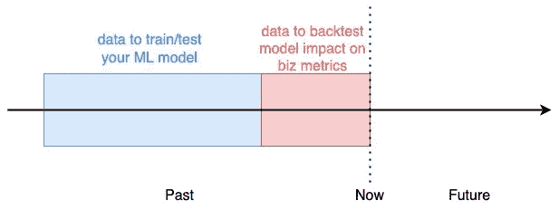
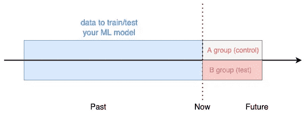

# 想在现实世界中成功做 ML？

> 原文：<https://towardsdatascience.com/want-to-succeed-doing-ml-in-the-real-world-d2db790612f1>

## 让你的生活更轻松的三个建议

罗伯特·卢克曼在 [Unsplash](https://unsplash.com/wallpapers/nature/waterfall?utm_source=unsplash&utm_medium=referral&utm_content=creditCopyText) 上的照片

所以，你已经完成了一些 ML 课程，并准备好在行业中寻找你的第一份工作，但仍然想知道:在现实世界中做 ML 的主要技能是什么？

在新创公司工作，节奏快，收益高(包括智力和财务)，听起来是个好主意？

继续读下去，学习一些小技巧，让你的生活更轻松，增加你在现实世界中成功做 ML 的机会。

# 语境

机器学习是一门很难的学科。你可能从你参加的在线课程或者你参加的 Kaggle 比赛中知道这些。

然而，现实世界中的 ML 更难。尤其是在创业公司。

## *为什么会这样？*

因为与在线课程或纸牌比赛相比，在现实世界中做 ML 会有更多的事情出错。

我来解释一下这些隐藏的漏洞是什么，并给你一些帮助避免它们的建议。

# 1.机器学习是手段，不是目的

ML 项目失败的首要原因是令人尴尬的愚蠢:首先你不需要 ML。

> 机器学习只是你拥有的一个(相当复杂的)工具，用来移动业务指标。而且通常情况下，是**而不是**合适的工具。

在大多数创业公司中，ML 不是核心产品或服务，而是改善业务的工具。

根据我的经验，初创公司的大多数职位描述都错误地寻找“机器学习工程师”，而实际上应该寻找“数据分析师”。数据分析师擅长分析中/大型数据集，提取模式，并快速生成数据驱动的见解，从而调整业务流程和影响指标。这个想法很简单:在任何一家新的创业公司中，都有大量的“唾手可得的果实”项目可以解决，只需要一点点数据。

即使你的职位是“ML 工程师”，也不要认为你需要为每个问题训练一个 ML 模型。您需要改进业务度量，并且您可能需要为此使用数据。这并不意味着你每次都需要拿出一个新的 ML 模型。你会浪费你的精力和时间。相反，你可以通过装扮成“数据分析师”来获得立竿见影的效果。通过这种方式，你获得了一些时间，直到初创公司成长起来，真正的 ML 工作进入画面。

例如，您可以离线分析数据，以调整业务逻辑中的几个参数，从而提高指标。

避免机器学习所有复杂性的最好方法是不做机器学习。听起来很愚蠢，也没有吸引力，但是它可以让你从压力中解脱出来，并且为另一个真正需要 ML 的项目赢得一些时间。

# 2.训练数据在哪里？

如果你之前没有在现实世界中做过 ML，你可能从来没有问过自己:*训练数据在哪里？*

答案是:*无处可去。*

初创公司通常有一个最小的数据堆栈，由 3 个元素组成:

*   **数据来源很多。**这些都是产生原始数据的生产服务。例如，假设创业公司是一个电子商务网站。一个数据源是谷歌分析服务，它跟踪网站上的所有用户行为。另一个来源是网站上的 PayPal 支付服务，它会发送支付事件。
*   **数据总线**是一个软件，它将来自所有数据源的数据传送到数据仓库/湖中。初创公司倾向于与 Segment 或 Google Pub-sub 等付费服务合作，有些公司甚至冒险自己运行 Kafka。
*   **数据仓库/湖**是所有数据结束的地方，或者是组织良好的数据库(即数据仓库)，或者是简单的存储(即数据湖)。

一旦数据进入仓库/湖泊，你作为 ML 工程师的工作就开始了。

您经常需要花费大量的时间来编写正确的查询(通常用 SQL ),以获取训练模型所需的数据。

编写 SQL 查询不是你在在线课程中学到的最性感的东西，但它是成为一名高效的 ML 工程师需要掌握的顶级技能之一。

这些年来，我开发了一些模式和最佳实践来跟上项目的这个阶段。你可以在我之前的文章中读到它们，关于 [***如何更快更好的生成训练数据。***](/how-to-generate-training-data-faster-and-better-e84d05884dc0)

  

# 3.我如何向其他人展示我的模型有效？

好了，我的模型看起来不错，现在呢？

在像初创公司这样的商业环境中，只要机器学习模型被限制在您的开发环境中，它就没有任何价值。

除非您部署模型并将其暴露给技术堆栈的其余部分，例如，通过微服务和 REST API，否则您将不会对业务指标产生影响。

然而，要实现这一目标，您首先需要向团队的其他成员证明:

1.  你的模型确实有效。
2.  你的模式比现状要好。

例如，假设您开发了一个二元分类器，它能够预测客户在未来几天内是否会流失。营销团队可以使用这样的模型来瞄准潜在的顾客，并保持他们的参与。

当您处于开发阶段时，您使用标准的评估标准来解决分类问题，例如

*   精确召回
*   f1-分数
*   精确度，
*   和混淆矩阵。

有了这些指标，您就能感觉到您的模型是否有任何预测能力，以及它是否值得在生产中部署和使用。然而，这些指标并不是故事的结尾，因为:

1.  非技术利益相关者很难理解它们**，例如将使用该模型的营销团队。**
2.  从业务角度来看，它们**不容易解释**，例如*如果我们使用这种客户流失预测模型，我们会将客户保留率提高多少？*

正因为如此，如果你想对创业产生真正的影响，你需要多走两步，它们是:

1.  回溯测试您的模型，和/或
2.  A/B 测试您的模型。

## 回溯测试您的模型

为了对模型进行回溯测试，您使用到给定日期 *X* 为止的历史数据来训练模型，然后根据业务指标来估计如果从日期 *X* 开始使用该模型会发生什么。

回溯测试您的模型影响(图片由作者提供)

例如，在我们的客户流失预测系统中，我们可以使用 2 周前的历史数据，然后估计如果我们使用该模型，在最后 2 周我们会保留多少客户。

模型回溯测试是金融行业使用的标准策略，用于评估交易策略绩效和风险管理。它实现起来很快，而且成本低廉，因为您已经拥有了所需的所有数据。

然而，在 ML 模型和模型运行的环境之间存在反馈回路的情况下，很难甚至不可能实现。例如，在我们的流失预测模型中，不可能知道如果不同的客户被我们的模型标记为流失者并被营销团队锁定，他们会有什么反应。

在这些情况下，您需要更进一步，在您的模型上运行 A/B 测试。

## A/B 测试您的模型

为了 A/B 测试我们的客户流失预测系统，您可以**随机**将用户分成两组:

*   **A 组**(又名**对照组)**。这部分用户将被营销团队像往常一样对待，这意味着没有由流失预测模型触发的特殊重新定位工作。
*   **B 组**(又名**试验组)**。这些用户将被我们的模型标记为搅动者/非搅动者，并被营销团队相应地锁定。

A/B 测试你的 ML 模型(图片由作者提供)

这种分离是随机的，以保证两组之间没有明显的行为差异，这种差异会使测试结果产生偏差。

测试运行了 *N* 天，最后，我们比较了两组之间的整体流失率。

如果你观察到与 A 组相比，B 组的流失率显著降低，你就有确凿的证据证明你的模型是有效的，可以部署到整个用户群。

否则，你需要要么改进模型，要么转向另一个问题。

尽管这会降低你的速度，但是 A/B 测试仍然是说服你的同事你的模型应该被部署的最有效的方法。

所以，坚持下去，你会看到结果。

贾哥达和凯(图片由作者提供)

# 包装它

所以，下次当你发现自己面临一个具有挑战性的现实世界的问题时，问问自己:

1.  我需要 ML 吗？
2.  我的数据在哪里？
3.  我如何证明我的解决方案有效？

相信我，会有所不同的。

# 想成为机器学习和数据科学的专家吗？

🚀 [**加入 Datamachines 时事通讯，了解 ML 和数据科学的真实世界。**](https://datamachines.xyz/subscribe/)

➡️接上 [**碎碎念**](https://twitter.com/paulabartabajo_) 🐦，[**LinkedIn**](https://www.linkedin.com/in/pau-labarta-bajo-4432074b/)**👔**

**💎 [**今天使用我的推荐链接**](https://pau-labarta-bajo.medium.com/membership) 成为会员，可以无限制地访问我在媒体上发布的所有内容并支持我的写作。**

**  

快乐学习🤗

避寒胜地**