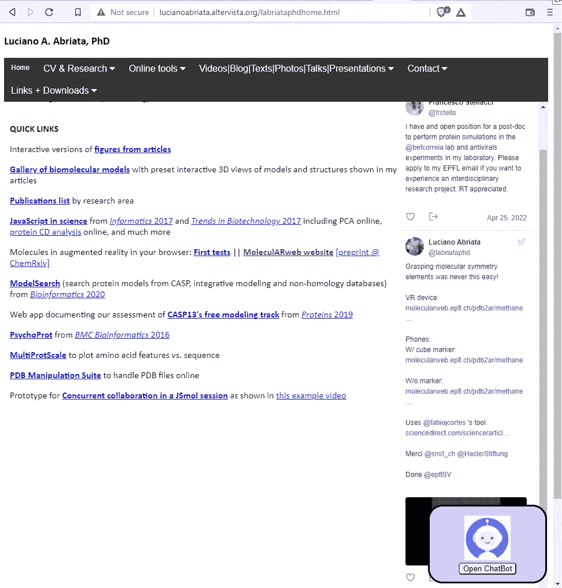
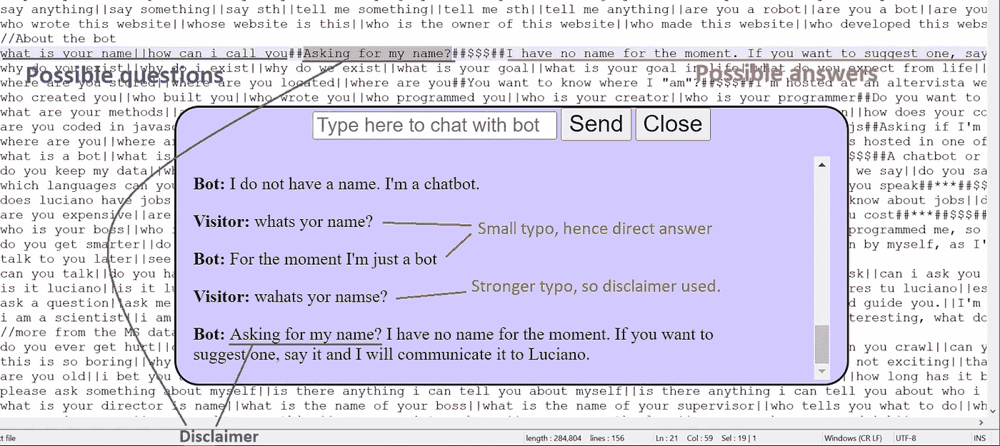
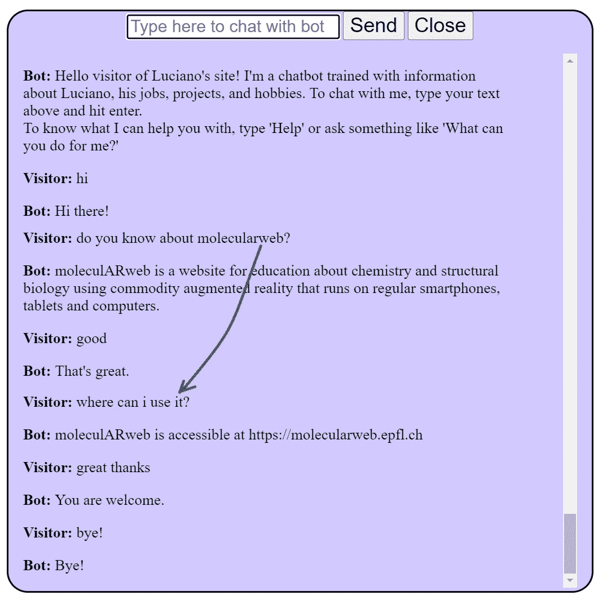
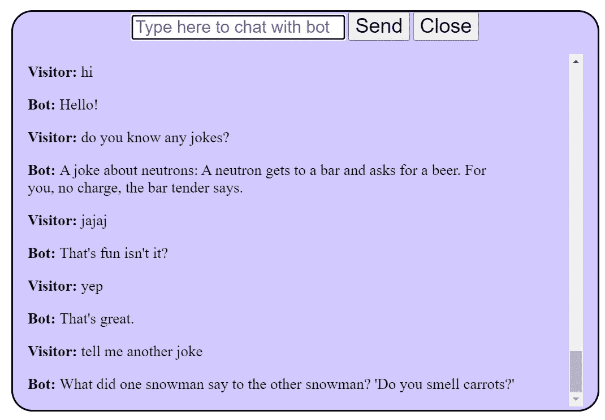

# 基于网络的数据库聊天机器人项目—模块 1:近似字符串匹配

> 原文：<https://towardsdatascience.com/web-based-database-powered-chatbot-project-module-1-approximate-string-matching-65df0d8c999d>

## 一个跨越 web 编程、数学、人工智能等的项目。

我一直对聊天机器人很着迷，从十几岁开始，我就在学习编程的同时创建了数十个聊天机器人。然而，我从来没有让我的聊天机器人实现任何目标，所以我唯一的动机是好奇，我的机器人仅限于参与非常有限的聊天。当然，我会迅速放下每个项目。

但是现在，随着我的主要工作、副业和业余爱好在网上的专业存在，我有机会创建一个有目的的聊天机器人:回答我网站访问者的问题，并引导他们浏览网站。JavaScript 编程的强大功能让我可以很容易地做到这一点。此外，我可以给我的聊天机器人提供两种回复机制:一种是基于问答对的大型数据集，由近似的字符串匹配函数辅助；另一个基于 GPT-3 的基于问题的微调。在本文中，我将讨论第一种途径，它利用问答对和停用词的开放数据集，以及量化一对字符串的相似性的过程。GPT-3 轨道将在未来的文章中出现，对于摆脱封闭问答数据库的限制非常重要，所以请保持关注！



当访问者访问我的网站时，他们可以打开聊天机器人，从它那里获得关于网站内容、我的工作、我的爱好等方面的帮助。(检查文本和其他图形，查看聊天机器人的运行情况)。该机器人的核心包含两个部分:一个基于对问答对数据库的直接查询，从一个开放的数据库中构建；另一个基于 GPT3 驱动的答案生成，由特定问题的少量学习指导。在本文中，我将介绍前者，它通过字符串比较函数对查询使用精确或部分问题匹配。在以后的文章中，我将展示基于 GPT-3 的模块。这个和所有其他的数字都是作者卢西亚诺·阿布利亚塔制作的。

## 介绍

正如你在上面的总结中看到的，我一直对聊天机器人很感兴趣。原来，我现在刚刚建立了(实际上我每天都在扩展)一个完整的聊天机器人，全部基于网络，在我网站的不同页面弹出，引导访问者并回答他们的问题。我将这个聊天机器人作为一个 HTML/JS 组件编写，所以只需一个脚本标签，我就可以轻松地将它集成到任何页面中。通过使用浏览器的本地存储功能，我的聊天机器人可以在用户打开我网站的多个页面时保持流畅的对话，即使在不同的标签页或窗口中。通过使用 CSS，聊天机器人可以很容易地适应智能手机或电脑屏幕。我让聊天机器人将对话写入我网站上的一个文件，然后我可以检查这个文件，了解访问者通常会问什么，他们通常会从核心知识数据库中产生什么偏差，这样我就可以相应地改进聊天机器人。

但是我会在以后的文章中讨论它的设计和特性。在这里，我想描述它的主要模块的第一部分，该模块允许机器人直接回答我的访问者的问题，并通过近似的字符串匹配从数据库中提取一些基本的聊天。在接下来的一篇文章中，我将描述聊天机器人的第二条轨道，它通过将知识库与 GPT-3 的文本生成相结合，极大地扩展了它的功能。

# 回答知识库中的问题，允许输入错误和可变措辞——这要归功于字符串比较算法

有许多方法可以对聊天机器人进行分类，但一个非常重要的区别是它们是否只提供从数据库中逐字逐句提取的答案，或者它们实际上可以编造文本作为对问题的合理回答。后者从编程的角度来看更具挑战性，需要某种形式的高端自然语言处理协议来将问题转化为合理的答案。这种基于人工智能的方法的主要优点是，如果做得好，它是非常通用的，可以为许多不同方式提出的问题提供正确的答案；此外，它将天生容忍打字错误和语法错误。但是建立这样的人工智能程序并不容易；最重要的是，您总是冒着风险，机器人可能会编写包含不正确信息甚至不适当内容、敏感信息或不可读文本的文本。高端自然语言处理程序，如 GPT-3 可以是一个很好的解决方案，但即使这些程序也可能会产生错误或不适当的内容。

我将很快进入我的聊天机器人的 GPT-3 模块，而在这里我将开发通过问题/答案匹配工作的模块。如果你非常好奇，迫不及待地想看我描述该机器人的 GPT-3 模块的文章，让我在这里与你分享我写的一些关于 GPT-3 的文章，你会发现一些消极和积极的观点，加上相当多的代码和说明，让你用这项技术进行自己的测试:

[](/custom-informed-gpt-3-models-for-your-website-with-very-simple-code-47134b25620b)  [](/devising-tests-to-measure-gpt-3s-knowledge-of-the-basic-sciences-4bbfcde8286b)  [](/testing-gpt-3-on-elementary-physics-unveils-some-important-problems-9d2a2e120280)  [](/gpt-3-like-models-with-extended-training-could-be-the-future-24-7-tutors-for-biology-students-904d2ae7986a)  

请相信，我会很快回到 GPT 3 号，因为它为我网站的聊天机器人大脑的第二个轨道供电。

## 我网站聊天机器人的问答模块

这里有一张我的聊天机器人的截图，它使用它的问题/答案匹配轨道与一个碰巧想听笑话的人类用户聊天:


聊天机器人从它的知识库中讲笑话。

让我们看看这个问题/答案匹配模块是如何工作的，它可以替代复杂的人工智能模型，因为它只回答数据库中的编码，所以更安全。本质上，这包括“简单地”在问题和答案的数据库中搜索人类的输入，然后提供相应的预编译答案。如果数据库足够大，并且人类被警告机器人的代码仅限于某些主题，则总体体验可能足够好，至少在其预期用途内。

不过，有几个要点需要处理:

*   一个“足够大”的问答配对数据库并不容易获得，至少你不能确定它的内容。
*   人类可能会出现错别字和书写错误，所以聊天机器人应该能够容忍它们。
*   即使没有任何错误，人类也可以(并且很可能)以不同于数据集中编码的方式提问。聊天机器人也应该考虑到这一点。

数据库问题的解决并不容易。正如我在下面详述的，对于我的聊天机器人，我从微软的 GitHub 账户中获取了一个开源(麻省理工学院许可)的问答对数据库，并用关于我和我工作的项目的具体内容对其进行了扩展——因为这就是聊天机器人应该回答的问题。同时，由打字错误、错误和输入可变性引入的困难可以通过搜索数据库而不是精确的问题，而是类似于数据库中每个条目的问题来解决。这需要使用字符串比较标准，而不是完全匹配，并且在进行搜索之前要对输入进行一些清理。

这几点我们一个一个来看。

## 1.清理人类输入

我在我的聊天机器人中编写了一个功能，可以清理人类输入的不同方面。根据参数的不同，该函数将扩展缩写、删除符号、删除多种形式的数字或删除停用词。请注意，这意味着数据库最好不要有任何符号、数字信息或缩写，因为它们会降低搜索的匹配分数。例如，数据库中“网站”的所有实例都扩展为“网站是”。

清理中涉及的操作看起来微不足道，但同样受到数据库可用性的限制，例如停用词。我从一些资源中编译了一个相当长的列表，你现在可以借用一下——但是请承认我，就像我的代码承认我的来源一样！

这是完整的函数，包括停用词、符号等列表。:[http://Lucia noabriata . alter vista . org/chatbotallweb/cleaning function . txt](http://lucianoabriata.altervista.org/chatbotallweb/cleaningfunction.txt)

请注意，在调用该函数时，可以选择要清理的内容。我的代码的某些部分要求完全清除，而其他部分要求清除符号和数字，但不清除停用词。此外，我的代码还在为知识库创建搜索查询之前清除了其他潜在的问题来源。例如，它将“他”、“他”和“他的”替换为“卢西亚诺”——因为我假设任何人向我网站的机器人询问第三人是指我，它在数据库中是这样编码的。当然，如果访问者实际上是在询问另一个人，这将无法正常工作…无论如何，数据库在它的答案中到处都有“Luciano ”,所以很明显答案指的是我自己，即使这个人可能在想别人。同样，清理过程的一部分是将所有输入转换成小写，并将数据库的所有问题也转换成小写(同时所有答案都正确地大写)。此外，所有的输入和问题都被完全删除了。

## 2.问答配对数据库

对于我的聊天机器人，我采用了微软聊天机器人的个性聊天数据库的英文版本，并开始添加关于我和我所从事的项目的具体内容。为什么？嗯，因为我的机器人的全部目的是引导我的网站的访问者，并回答他们关于我和我的项目的问题——当然，微软对我和我的项目一无所知！。事实上，当访问者登陆我的网站时，聊天机器人已经解释说，它的知识非常有限，只能谈论某些话题(我手动输入到数据库中)和基本的聊天(来自微软的数据库加上一些自定义的添加和编辑)。

这是我用的微软的数据库。如您所见，支持不同的语言和个性风格:

[](https://github.com/microsoft/botframework-cli/tree/main/packages/qnamaker/docs/qnaFormat)  

我实际上改变了这个文件的形状，在同一行中有问答对，这使得添加更多条目更加容易。对于许多问题，我会给出多个可能的答案，这样当访问者重复一个问题或问两个非常相似的问题时，机器人不会总是重复自己。

这是知识库中的一个示例条目:

```
hello||good morning||good evening||good night||whats up||wasup||whasup##***##***##Hello, all good?||Hi there, how are doing?
```

该行由#分隔符分隔成 4 个字段:第一个字段包含所有可能的提问方式(这里只是一些问好方式，另一行还有更多)，由||。最后一个字段是可能答案的列表，也是用||，这里是两个不同的选项。

第二个字段包含一种“免责声明”,如果聊天机器人在给出可能的答案之前只找到其中一个问题的部分匹配，它将使用这种声明来产生更自然的对话。比如用户问“*你叫什么名字？*“带点错别字，然后机器人会回答“*问我名字？*”后面跟着一个预设的答案。请注意，我对我的机器人编码的方式，如果打字错误非常小，这将不会触发。例如，在这里我先问了一个错别字(结果是一个直接的答案)，然后问了多个错别字(答案前面有一个小小的否认句子):



当与数据库中的问题不匹配时使用的“免责声明”句子的示例(但不为空，在这种情况下，机器人只会说它没有得到所要求的内容)。

第三个字段保留代表问答对的主要主题的关键字，有助于在对话中至少保持一些最小的上下文。例如，在这里，人类询问关于 moleculARweb(我和一个同事一起开发的网站)的问题，然后询问关于用“它”指代它的另一个问题……聊天机器人明白了:



聊天机器人记住了谈话的主题。

## 3.搜索数据库

当然，搜索问题的最快选择是简单地将人工输入的文本与每一行中列出的每一个可能的输入进行匹配。聊天机器人做的第一件事就是这个。如果找到匹配，代码会随机选择一个列出的答案并显示出来。试着问我的聊天机器人一些笑话:



我网站上的聊天机器人在讲笑话。通过使用随机数并保存其最后的输出，它不会重复自己太多。

聊天机器人还通过从所有停用词中清除人类的输入和所有可能的输入来进行这种完美匹配搜索。同样，如果有一个完美的匹配，它会显示列表中的一个答案。但在此之前，聊天机器人试图在数据库中找到人类键入的问题，这一次允许打字错误、语法错误，甚至交换单词。为此，它使用了两个测量字符串相似性的函数:

**Jaro-Wrinkler 距离**，测量两个序列之间的编辑距离，即从一个序列转换到另一个序列所需的最少操作次数。范围从 0 到 1，1 表示完全匹配。参见[这里的维基百科条目](https://en.wikipedia.org/wiki/Jaro%E2%80%93Winkler_distance)。这里是 Jaro 和 Wrinker 的[原创论文。](https://files.eric.ed.gov/fulltext/ED325505.pdf)

**文本余弦相似度**，它测量两个字符串之间每个单词出现的次数，作为由来自两个字符串的所有 *n* 单词的所有频率组成的 *n* 维向量形成的角度的余弦。它的范围也是从 0 到 1，1 表示完全匹配。这是更一般的[余弦相似性](https://en.wikipedia.org/wiki/Cosine_similarity)的一个具体应用，关于这一点，你可以在 [Ben Chamblee](https://medium.com/u/87650d73243c?source=post_page-----65df0d8c999d--------------------------------) 在 TDS 的这篇非常好的文章中读到[。](/what-is-cosine-similarity-how-to-compare-text-and-images-in-python-d2bb6e411ef0)

请注意，通过构造，Jaro-Wrinkler 距离将对拼写错误和不同拼写高度相似的字符串对进行评分。比如说*超*和*苏特*或*造型*和*造型*。另一方面，文本余弦相似度会给有拼写错误的单词打分，因为每个单词在计算频率时都会被计为不同的单词。但相反，与 Jaro-Wrinkler 距离不同，文本余弦相似性度量将对由不同顺序的相同单词组成的句子对评分为完全匹配。因此，显然这两种类型的字符串相似性度量是非常互补的。这就是为什么我在我的聊天机器人中整合了两者，并假设当两个分数中的任何一个超过阈值时匹配。

> Jaro-Wrinkler 和文本余弦相似性度量是完全互补的，所以我让我的聊天机器人选择同时使用这两种度量。如果它们中的任何一个高于相似性阈值，则它被视为用户键入的(或者可能想要键入的)实际输入。

阈值实际上有两个级别:当用户的文本和知识库中的一个问题之间的相似度高于 0.95 时，它被视为完全匹配，因此知识库中的答案会立即给出。如果分数在 0.88 和 0.95 之间，程序给出相同的答案，但前面有一个类似“*的可变句子，你是指这个吗？*”。如果分数在 0.8 到 0.88 之间，聊天机器人会澄清它对该问题不确定，然后是来自该基地的候选问题及其相应的答案。

**但是如何准确地计算出 Jaro-Wrinkler 和文本余弦的相似性呢？**

我从[苏曼·库瓦尔](https://medium.com/u/441ad3d43398?source=post_page-----65df0d8c999d--------------------------------)的这篇优秀文章中提取了这些函数，这篇文章已经用 JavaScript 提供了它们:

[](https://sumn2u.medium.com/string-similarity-comparision-in-js-with-examples-4bae35f13968)  

事实上，本文描述了 4 个字符串比较函数(并给出了代码)。但是由于上面给出的原因，我只选择了 Jaro-Wrinkler 和文本余弦。事实证明，它们对我来说效果很好——尽管不，它们不是绝对正确的。

最后一点，重要的是输入和所有可能的问题都是小写的，修剪，并清除所有符号和数字。但不包括停用词，停用词通常有助于确定句子的整体意思。

# 想和我的聊天机器人聊天吗？

你可以试试我的聊天机器人:

[**http://lucianabriata . alter vista . org/chatbotallweb/chatbottest . html**](http://lucianoabriata.altervista.org/chatbotallweb/chatbottest.html)


如果你提供一个 GPT3 API 密匙(你可以[在这里](https://beta.openai.com/account/api-keys)免费获得)你就可以使用机器人更高级的模块；但这仍在开发中(当它完全可用时，我会发表一篇文章)。

```
Would you like to order a personalized chatbot? Or have a job for me about protein modeling, bioinformatics, protein design, molecular modeling, or protein biotechnology? [Contact me here](https://lucianoabriata.altervista.org/office/contact.html) *I write and photoshoot about everything that lies in my broad sphere of interests: nature, science, technology, programming, etc.* [***Become a Medium member***](https://lucianosphere.medium.com/membership) *to access all its stories (affiliate links of the platform for which I get small revenues without cost to you) and* [***subscribe to get my new stories***](https://lucianosphere.medium.com/subscribe) ***by email****. To* ***consult about small jobs*** *check my* [***services page here***](https://lucianoabriata.altervista.org/services/index.html)*. You can* [***contact me here***](https://lucianoabriata.altervista.org/office/contact.html)***.***
```