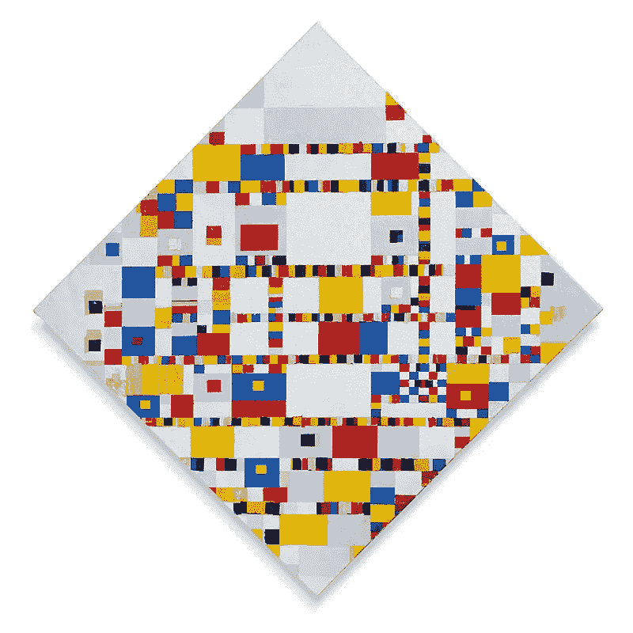
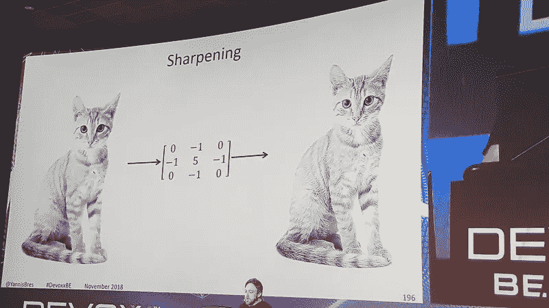
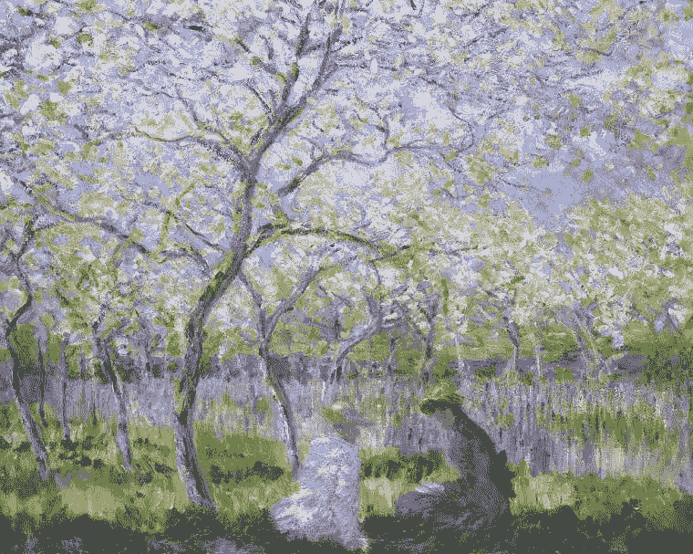
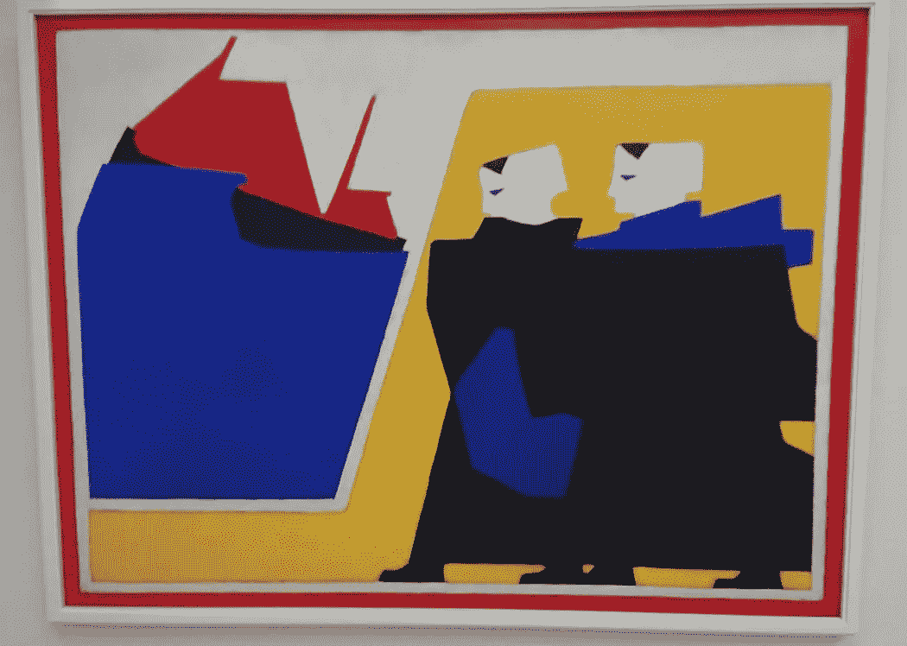
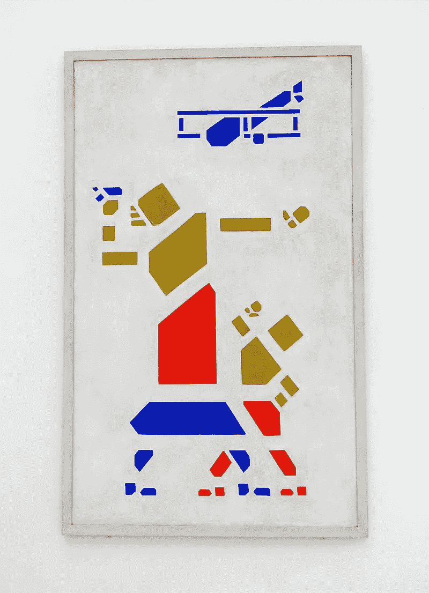
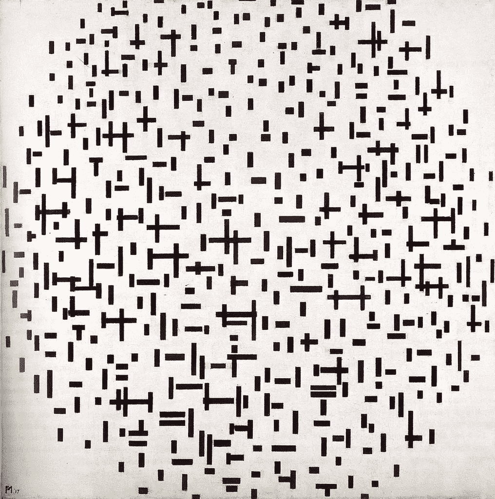
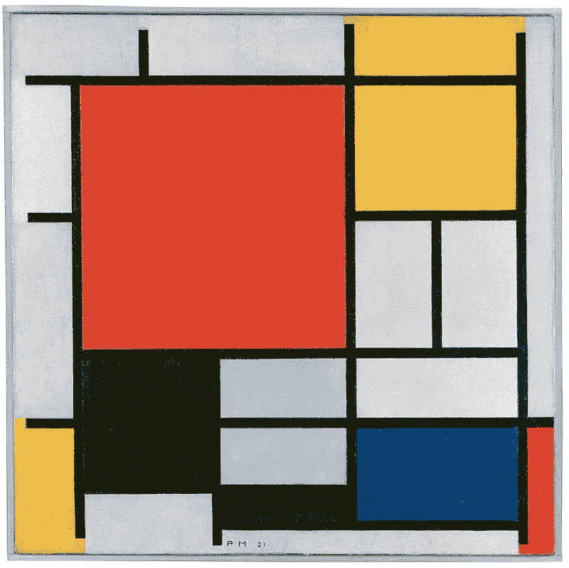

# 抽象画家是第一个编码器吗？

> 原文：<https://towardsdatascience.com/were-abstract-painters-the-first-encoders-49aa1e04ffd5>

## 用最少的形状和颜色捕捉现实的旅程

宇宙的抽象？[Victory Boogie Woogie，**1942–1944，Piet Mondriaan，图片来自[维基百科](https://nl.wikipedia.org/wiki/Victory_Boogie_Woogie#/media/Bestand:Piet_Mondriaan_Victory_Boogie_Woogie.jpg)**

**编码可以被看作是**从现实中抽象出最显著模式的艺术**。这样的抽象对于一般化是不可或缺的。例如，考虑一下教科书中的例子，在图片中识别猫。一个训练有素的神经网络应该能够在以前看不到的图像中发现猫。这只有在网络能够推断其训练观察值的情况下才是可能的。**

**在头罩下，网络提取诸如耳朵的形状、身体的长度等特征。它将猫简化为一系列形状和属性，这也可以用来在新照片中识别毛茸茸的猫科动物。换句话说，网络保存了足够的信息来概括猫的概念，而忽略了所有模糊的细节和变化。**

****

**机器学习通常需要将现实世界的观察结果编码成抽象的表示，随后可能被人类或算法解码[图片来自 [Miguel Discart](https://www.flickr.com/photos/miguel_discart_vrac_3/) 来自 [Flickr](https://www.flickr.com/photos/miguel_discart_vrac_3/31276604567)**

**虽然艺术和机器学习在表面上几乎没有什么共同点——至少在 Dall E 2 和其他[艺术生成器](https://medium.com/p/1e8695d9f3b6)进入人工智能领域之前——但当代数据科学家和古代抽象艺术家似乎有着非常相似的雄心！**

# **介绍**

**那么这篇文章的主旨是什么呢？坦率地说，这种雄心是相当适度的:**

*   **有助于直观地了解人工智能算法的功能**
*   **举例说明人类和机器试图抽象和重建现实之间的一些联系**
*   **也许会在 ML 从业者中引发一些思考？**

> **免责声明:有很多人比我更了解艺术，所以我不会假装提供对艺术史的全面理解。此外，这篇文章是轶事，而不是任何正式研究的产物，并且只关注 ML 和艺术重叠的地方。为了完整起见，我应该提一下这篇文章关注的是欧洲艺术，回顾了不超过几百年的历史，并强调了两个有点武断的运动。同样，我也不想在解码器和聚类算法的精确描述中陷入太多，因此“机器学习”将被相当松散地解释。**

**免责声明够多了，我们开始吧。**

# **印象派——放松与现实的联系**

**许多年来，艺术家们努力实现对世界的真实而准确的再现，将每一个倒影、水滴和皱纹都精确到最小的细节。最终，艺术家们开始偏离这一教条，如印象派运动(由克洛德·莫内和皮埃尔·奥古斯特·雷诺阿等画家领导)所示。**

**印象派画家的目的不是完美地反映观察结果，而是再现他们对现场观察到的现实的*解释。他们用快速而相对粗糙的笔触捕捉这一瞬间，尤其是变幻无常的光线。下面的室外场景仍然很容易识别，但使用了更少的**信息来传输真实世界的图像**。***

****

**莫奈的《巴黎春天百货》(1886)。虽然主题仍然清晰可见，但使用了相对粗糙的笔触，并省略了许多细节。[图片来自[维基媒体](https://upload.wikimedia.org/wikipedia/commons/c/c3/Monet_-_Le_Printemps%2C_1886.jpg?20190529013302)作者]**

**用机器学习的术语来说——艺术家使用少得多的信息/数据点/特征来表现场景。例如，参见图像分割的链接，这里使用 **k-means 算法**对相邻像素进行聚类。它创建了由单一颜色表示的更大的形状(即数据点)。用少得多的数据，我们表现了同样的场景，尽管不可避免地损失了粒度。**

****

**图像分割示例，通过 k-means 算法进行聚类。尽管大量的细节丢失了，我们可以用更少的数据表现同样的场景**

# **对抽象的追求**

**让我们继续我们的抽象之旅。 **De Stijl** (荷兰语为*‘风格’*)是一个主要由荷兰画家组成的团体，其中皮耶·蒙德里安(Piet Mondriaan)和格里特·里特维尔德(Gerrit Rietveld)可以说是最广为人知的。他们以推动艺术的绝对抽象而闻名。**

**虽然对一些人来说，他们的艺术可能会引发类似于*“我五岁的女儿也能做到这一点”*的说法，但每件作品都反映了关于如何用最少的视觉手段来表现世界的深刻批判性思考。颜色——如果有任何关联的话——仅仅是原色的组合，是动态张力的正交线的体现。例如，看看蒙德里安如何思考他的一幅画:**

> **“如果马斯。[阳性]是垂直的。【竖】线，那么一个男人会在一片森林的上升线中认出这个元素；在地平线上。他将看到他的补充。横向的女人。线条作为元素，在大海的横卧线条中看到自己，在垂直线条中看到自己的补充。森林的线条。”— *皮特·蒙德里安，1912 年【蒙德里安，毁灭的艺术】***

**在我们达到那个抽象层次之前，让我们花一点时间来考虑下面巴特·范德莱克的作品《风暴》。与它可能描绘的真实世界场景相比，它包含的细节非常少。只有最少的信息被传输——一个大的黄色飞机代表海滩，一个蓝色飞机代表大海，一个可以被解释为大浪的形状。由此，我们可以推断出场景——两个女人走在沙滩上，看着外面汹涌的大海。**

**如果没有描述，你会得到所有的吗？你会认为这是一个海滩吗？你会注意到狂风吗？或者这幅画——在其所有的抽象中——已经失去了太多的信息？**

****

**德·斯托姆》(1916)。只有原色和大的形状被用来表现暴风雨的海滩场景。[巴特·范德莱克绘画，克勒勒-米勒博物馆收藏，作者提供图片]**

**再举个例子？**

**下面这幅画(也是范德莱克的作品)使用了相当少量的信息。尽管如此，我们仍然可以识别出一个女人、一个孩子和一架飞机，尽管只能识别几何图形。似乎我们只需要很少的信息就能捕捉到世界的本质，尽管你可能会认为场景的意义已经丧失。**

****

**《弗鲁遇见弗列格图伊》(1957)。简单的几何形状和原色足以表现一个场景，但留给观众更多的解释。[绘画由巴特·范德莱克绘制，图片由[埃丝特·韦斯特维德](https://www.flickr.com/photos/westher/)通过[维基媒体](https://commons.wikimedia.org/wiki/File:Schilderij_van_der_Lech.jpg)**

**是时候深入抽象了。像机器学习中的许多图像识别器一样，特奥·凡·杜斯堡在工作中完全忽略了颜色，只专注于形状和图案。**

**下面的研究表明，德·斯蒂格尔并没有盲目地在画布上画一些线条——在最终作品中仍然可以看到最初城市景观的痕迹。如果没有描述标签，我怀疑是否有人能得出这幅画代表了乌得勒支的城市！**

****

**合成十二在 zwart en wit (1918)。左:前期研究，代表乌得勒支的观点。右图:最终的抽象[特奥·凡·杜斯堡绘画，图片来自维基百科]**

**当我们的模型不足以捕捉所有相关模式时，我们会看到这种情况，例如，**神经网络的层数或节点数**不足，或者线性模型试图捕捉非线性模式。该模型可能捕获*输入的一些*特征，但是编码的质量不足以正确地重建原始观察。**

**我们现在来看看蒙德里安的画。没有附随符号，你能推断出它代表什么吗？一个解码器能重建出这部作品的原始灵感吗？**

****

**在莱茵作曲(1916-1917)。在这幅蒙德里安画作中，水平线代表海浪，垂直线描绘码头。[皮耶·蒙德里安绘画，图片来自[维基媒体](https://nl.m.wikipedia.org/wiki/Compositie_in_lijn#/media/Bestand%3AMondriaan_Compositie_in_lijn.jpg)**

**尽管很难被理解为对现实的再现，但“风格派”的成员们仍然追求更多——一种不再代表自然本身的抽象。让我们看看最后一幅画。**

****

**Compositie met groot rood vlak，geel，zwart，grijs en blauw (1921 年)Piet Mondriaan 绘画，图片来自[维基百科](https://nl.wikipedia.org/wiki/Compositie_met_groot_rood_vlak,_geel,_zwart,_grijs_en_blauw) ]**

**事情变得越来越模糊，因为艺术家甚至不试图表现自然观察。取而代之的是，这幅画试图代表宇宙的基本组成部分，仅仅依靠头脑。矩形是无中心的、不对称的和动态的，但在某种和谐中共存。原色足以再现我们肉眼可见的全部光谱。无边界的边缘意味着作品无限延伸到画外。整个宇宙的本质，被编码在一张长方形的画布上。**

**试着解码*那个*。**

# **结束语**

**机器学习寻求从现实中减去可概括的模式，去除细节和噪音，直到只保留本质。同样，本文中讨论的抽象艺术家试图剥离自然，直到只剩下核心的真理。**

**在这两种情况下，问题是我们——无论是人类还是解码算法——是否能够从编码表示中重建原始观察结果。编码在减少维数或所需数据方面非常有效。然而，如果编码被推得太远，**重要信息会丢失**，并且不再能够被检索。**

****

**诸如自动编码器和 PCA 之类的机器学习技术试图通过仅保留其本质来对观察进行编码。问题是我们能在多大程度上重建基于编码的原始观察[图片由 Michela Massi 通过[维基百科](https://en.wikipedia.org/wiki/Autoencoder#/media/File:Reconstruction_autoencoders_vs_PCA.png) ]**

**由于机器学习算法通常被视为一个黑盒，本文中的视觉抽象可能有助于理解这种算法试图做什么，至少在直觉层面上是如此。艺术家们展示了大量的信息可以从观察中移除，而不会丢失关键的模式。同时，正确的解释越来越依赖于解码器的能力。**

**下一次你的 ML 算法努力学习任何有用的东西时，你可能会想记住 De Stijl 的艺术家和他们对超越自然世界的追求。也许，你的算法只是在抽象的道路上走得太远了。**

***喜欢这篇文章吗？你可能也会喜欢以下几个:***

** [## “小数据”是数据科学的下一个大事件吗？

### 人工智能先驱吴恩达预测，未来十年将围绕以数据为中心的人工智能。我们可能不会…

towardsdatascience.com](/is-small-data-the-next-big-thing-in-data-science-9acc7f24907f)  [## 禅宗和数据科学的艺术——如何避免冒险陷阱

### 即使是最优秀的数据科学家也会在他们的项目中面临挫折和失去动力。哲学家罗伯特会怎么想…

towardsdatascience.com](/zen-and-the-art-of-data-science-how-to-avoid-gumption-traps-a3590deef870) 

# 参考

 [## 红、新、黑、灰、蓝的宏伟计划

### 维基百科的一篇文章，自由的百科全书。红、新、黑、灰、蓝是一种宏大的构图…

fr.wikipedia.org](https://fr.wikipedia.org/wiki/Composition_avec_grand_plan_rouge,_jaune,_noir,_gris_et_bleu)  [## 艺术-维基百科

### de Stijl(；荷兰语发音: )，荷兰语意为“风格”，也称为新塑料主义，是荷兰的艺术运动…

en.wikipedia.org](https://en.wikipedia.org/wiki/De_Stijl)  [## 印象派-维基百科

### 印象主义是 19 世纪的一场艺术运动，其特点是相对较小、较薄但可见的笔触，开放…

en.wikipedia.org](https://en.wikipedia.org/wiki/Impressionism)  [## 图像分割-维基百科

### 在数字图像处理和计算机视觉中，图像分割是将一幅数字图像分割成几个部分的过程

en.wikipedia.org](https://en.wikipedia.org/wiki/Image_segmentation)**