# 什么是 PCA 加载，如何有效地使用双标图？

> 原文：<https://towardsdatascience.com/what-are-pca-loadings-and-biplots-9a7897f2e559>

## 充分利用主成分分析的实用指南。

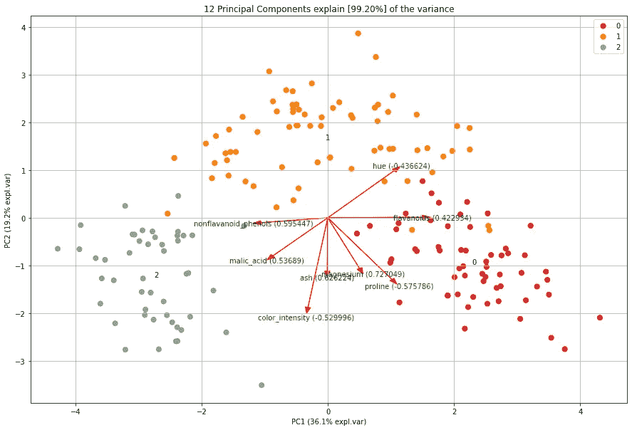

(图片由作者提供)

主成分分析是最著名的(大)数据分析技术。然而，解释低维空间中的差异仍然具有挑战性。理解*载荷*和解释*双标图*是任何使用 PCA 的人必须知道的部分。*在这里，我将解释 I)如何解释深入洞察的负载，以(直观地)解释数据中的差异，ii)如何选择最具信息性的特征，iii)如何创建有洞察力的图，以及最后如何检测异常值。*理论背景将由实际操作指南支持，帮助您利用 [pca](https://erdogant.github.io/pca/) 充分利用数据。

*如果你觉得这篇文章很有帮助，可以使用我的* [*推荐链接*](https://medium.com/@erdogant/membership) *继续无限制学习，并注册成为中级会员。另外，* [*关注我*](http://erdogant.medium.com) *关注我的最新内容！*

# 介绍

在本博客的最后，你可以(直观地)解释数据中的差异，选择最有信息的特征，并创建有洞察力的图表。我们将讨论以下主题:

*   特征**选择**对**提取**。
*   **使用 PCA 进行尺寸缩减**。
*   **解释了** *、*和**小块图**。
*   **加载**和**双标图**。
*   提取**最具信息性的特征**。
*   **离群点检测**。

# PCA 的温和介绍。

主成分分析的主要目的是通过最小化信息损失来降低数据集中的维数。一般来说，降维有两种方式: ***特征选择*** 和 ***特征提取*** 。其中，后者用于 *PCA，其中基于原始特征的(线性)组合构建一组新的维度或潜在变量。*在 ***特征选择*** 的情况下，选择一个特征子集，该子集将为前面的任务提供信息。无论您选择哪种技术，降维都是重要的一步，原因有几个，例如*降低复杂性、提高运行时间、确定特性重要性、可视化类信息，以及最后但同样重要的是防止* ***降维的灾难。*** 这意味着，对于给定的样本大小，超过一定数量的特征，分类器的性能将会下降，而不是提高(图 1)。在大多数情况下，低维空间会导致更精确的映射，并补偿信息的“损失”。

在下一节中，我将解释如何在特征选择和特征提取技术之间进行选择，因为有理由在这两者之间进行选择。

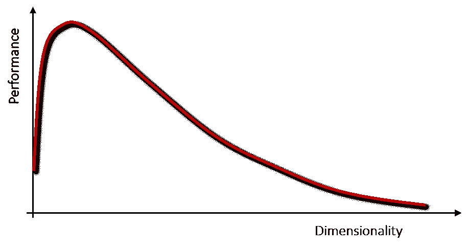

图一。作为维度函数的(分类)模型的性能。(图片由作者提供)

## 特征选择。

**特征选择在许多情况下是必要的**；**1****。*** 如果特征不是数字(如字符串)。2.以防需要提取有意义的特征。3.保持测量值不变(转换会将测量值和要丢失的单位进行线性组合)。**的缺点**是特征选择过程确实需要*搜索策略和/或* *目标函数*来评估和选择潜在的候选者。例如，它可能需要一种使用类别信息的监督方法来执行统计测试，或者需要一种交叉验证方法来选择信息最丰富的特征。然而，特征选择也可以在没有类别信息的情况下完成，例如通过选择方差上的前 *N* 个特征(越高越好)。*

**

*图二。特性选择程序的示意图。(图片由作者提供)*

## *特征提取。*

*特征提取方法可以减少维数，同时最大限度地减少信息损失。为此，我们需要一个转换*函数*； **y=f(x)** *。*在 PCA 的情况下，变换限于线性函数，我们可以将其重写为一组权重*，组成变换步骤；* ***y=Wx，*** *其中 W 为权重，x 为输入特征，y 为最终变换后的特征空间*。请参见下面的示意图，演示转换步骤和数学步骤。*

*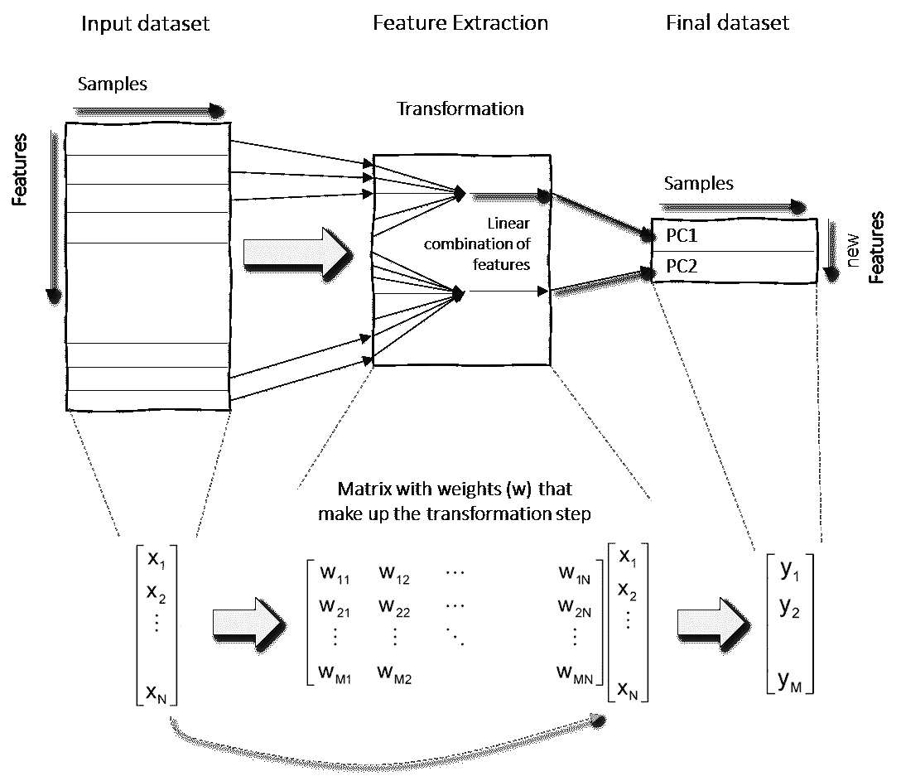*

*图 3。将输入数据线性转换为 y=Wx 形式的特征提取过程的示意图。(图片由作者提供)*

*PCA 的线性变换也有一些缺点**。这将使特性更难解释，有时甚至对某些用例的后续工作毫无用处。例如，如果使用特征提取技术发现了潜在的癌症相关基因，则可以描述该基因与其他基因一起部分参与。实验室中的后续研究没有意义，例如，部分敲除/激活基因。***

# ***PCA 是如何降维的？***

***我们可以将 PCA 分解成大致四个部分，我将举例说明。***

## ***第一部分。将数据围绕原点居中。***

***第一部分是计算数据的平均值(如图 4 所示)，这可以通过四个较小的步骤来完成。首先通过计算每个特征的平均值 **(1 和 2)** ，然后计算中心( **3** )。我们现在可以移动数据，使其以原点为中心( **4** )。请注意，此变换步骤不会改变点之间的相对距离，而只是将数据集中在原点周围。***

***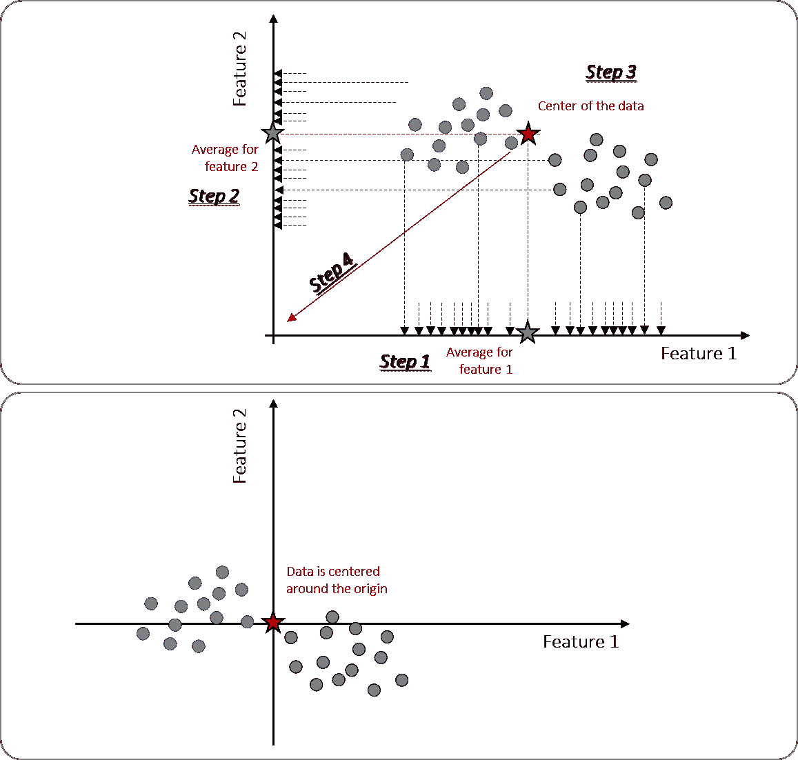***

***图 4:以零为中心的数据。(图片由作者提供)***

## ***第二部分。通过原点和数据点拟合直线。***

***下一步是拟合一条穿过原点和数据点(或样本)的线。这可以通过 1。通过原点画一条随机线，2。将样本正交投影到直线上，然后 3 .旋转直到通过最小化距离找到最佳匹配。*然而，最大化投影数据点到原点*的距离更实际，这将导致相同的结果。使用距离平方和(SS)计算拟合，因为它将消除线周围数据点的方向。在这一点上(图 5)，我们在方差最大的方向上拟合了一条线。***

******

***图 5:找到最合适的。从一条随机线(顶部)开始，通过最小化从数据点到线(底部)的距离，旋转直到它最适合数据。(图片由作者提供)***

## ***第三部分。计算主成分和载荷。***

***我们在变化最大的方向上确定了最佳拟合线，现在是第**个主成分**或 **PC1** 。下一步是计算 PC1 的斜率，该斜率描述了每个特征对 PC1 的贡献。在这个例子中，我们可以*直观地*观察到数据点在特征 1 上比在特征 2 上分散得更多(图 6)。红线的斜率代表我们的视觉观察；我们每穿过特征 1(向右)2 个单位，它就在特征 2 的轴上向下移动 1 个单位。换句话说，要制作 PC1(红线)，我们需要特征 1 的 2 部分和特征 2 的-1 部分。我们可以将这些"*部分"*描述为*向量 b* 和 *c* ，然后我们可以用它们来计算*向量 a*向量 *a* 将得到值 2.23(见图 6)。这就是我们所说的这台特殊电脑的**特征向量。*****

***但是，我们需要向所谓的“*单位向量*标准化，这是通过将所有向量除以 *a* =2.23 得到的。这样向量 *b* =2/2.23=0.85，向量 *c* =1/2.23=0.44，向量 a=1 ( *又名单位向量*)。因此，换句话说，这些向量的范围在-1 和 1 之间。例如，如果*向量 b* 非常大，比如值趋向于 1，则意味着特征 1 几乎全部贡献给 PC1。***

******

***图 6:计算 PC1 和 PC2 并确定负载。(图片由作者提供)***

***下一步是确定 PC2，它是一条穿过原点并垂直于第一个 PC 的线。在本例中，只有两个特征，但如果有更多特征，第三条 PC 将成为通过原点并垂直于 PC1 和 PC2 的最佳拟合线。如前所述:*新的潜在变量，又名 PCs，是初始特征的线性组合。PC 中使用的每个特征的比例称为系数。****

# ***装货***

****重要的是要认识到主成分的可解释性较差，并且没有任何实际意义，因为它们是由初始变量的线性组合构成的。但是我们可以分析描述独立变量重要性的载荷。载荷是从数值的角度来看的，等于变量的系数，并提供了哪些变量对构件的贡献最大的信息。****

*   ***负载范围从-1 到 1。***
*   ***高绝对值(接近 1 或-1)表示变量强烈影响组件。接近 0 的值表示变量对组件的影响很小。***
*   ***负荷的符号(+或-)表示变量和主成分是正相关还是负相关。***

## ***第四部分。转换和解释方差。***

***我们计算了 PCs，现在可以旋转(或变换)整个数据集，使 x 轴是方差最大的方向(也称为 PC1)。注意，转换步骤将导致原始特征的值将丢失。相反，每个 PC 将包含总变化的一部分，但是用 ***解释的方差*** 我们可以描述每个 PC 包含多少方差。为了计算*解释的方差*，我们可以将每台电脑的距离平方和(SS)除以数据点数减 1。***

***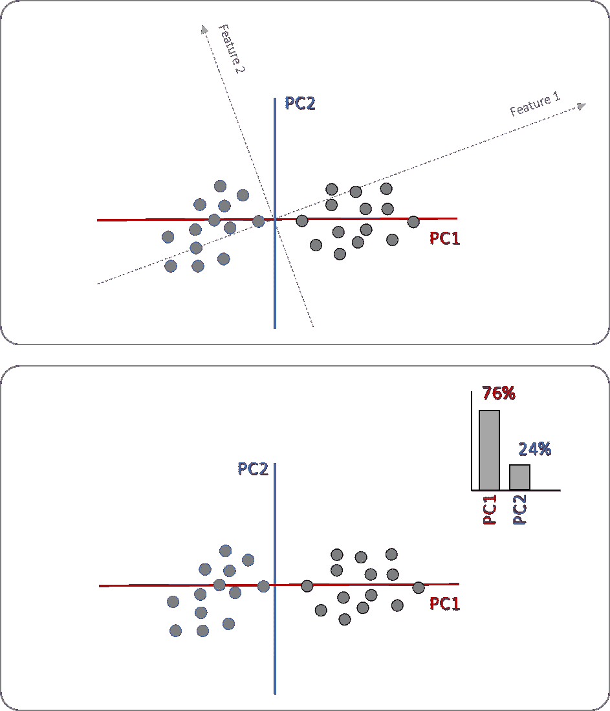***

***图 7。整个数据集的转换和确定计算解释的方差。(图片由作者提供)。***

## ***第 0 部分。标准化***

***在我们做第 1 到第 4 部分之前，通过标准化获得正确的数据是至关重要的，因此这应该是第一部分。因为我们搜索具有最大方差的方向，所以 PCA 对具有不同值范围的变量或异常值的存在非常敏感。*如果初始变量的范围差异较大，则范围较大的变量将优于范围较小的变量。我将在下一节演示这一点。*为了防止这种情况，我们需要将初始变量的范围标准化，以便每个变量对分析的贡献相等。我们可以通过减去平均值并除以每个变量的每个值的标准偏差来实现。标准化包括重新缩放要素，使其具有均值为零、标准差为一的标准正态分布的属性。这也称为 z 分数标准化，Scikit-learn 为此使用了 StandardScaler()。一旦标准化完成，所有的变量都应该在同一尺度上。***

# ***PCA 库。***

***关于用于即将到来的分析的 [*p* ca](https://erdogant.github.io/pca) 库的一些话。 [*p* ca](https://erdogant.github.io/pca) 库旨在应对一些挑战，例如:***

*   ******分析不同类型的数据。*** 除了常规 ***PCA*** 之外，该库还包括 ***稀疏 PCA*** ，其稀疏度可以通过 L1 惩罚系数来控制。还有一种 ***截断 SVD*** 可以有效地处理稀疏矩阵，因为它在计算奇异值分解之前不将数据居中。***
*   ******计算并绘制被解释的方差。*** 拟合数据后，可以绘制出被解释的方差:***scree******plot***。***
*   ******提取性能最好的特征。*** 模型返回性能最好的特征。***
*   ******洞察双标图的加载情况。*** 检索与 PCs 相关的类的特征和可分性的变化的更多见解。***
*   ******离群点检测*。**可以使用两种众所周知的方法来检测异常值: ***【霍特林-***和 ***SPE-Dmodx。******
*   *****去除**不需要的(技术)**偏差**。数据可以通过从原始数据集中去除(技术)偏差的方式进行标准化。***

****[*PCA*](https://erdogant.github.io/pca)*相比其他实现有什么好处？*****

*   ****在 *PCA* 库的核心， *sklearn* 库用于最大化兼容性及其在管道中的集成。****
*   ****标准化是内置的功能。****
*   ****包含最需要的输出和绘图。****
*   ****简单直观。****
*   ****[开源](https://erdogant.github.io/pca/)。****
*   ****[文档页面有很多例子](https://erdogant.github.io/pca/)。****

# ****理解载荷的实际例子。****

****让我们从一个简单直观的例子开始，演示负载、解释的方差和最重要特征的提取。****

****首先，我们需要安装[*p*ca](https://erdogant.github.io/pca/)*库。*****

```
*****pip install pca*****
```

## *****创建合成数据集。*****

*****出于演示目的，我将创建一个包含 8 个要素和 250 个样本的合成数据集。每个要素将包含随机整数，但方差不断增加。所有功能都是相互独立的。特性 1 将包含[0，100]范围内的整数(因此方差最大)，特性 2 将包含[0，50]范围内的整数，特性 3 包含[0，25]范围内的整数，依此类推(参见下面的代码块)。*为了举例，我将* ***而不是*** *将数据归一化来演示原理。* ***这个数据集现在理想为 1。演示 PCA 的原理，2。演示负载和解释的差异，以及 3。标准化的重要性(或缺乏标准化)。*** 在我们继续之前，我想再重复一遍:在处理真实世界的数据集时，建议仔细查看您的数据并进行相应的归一化，以使每个要素达到相同的比例。*****

****如果我们绘制 8 个特征的直方图，我们可以看到特征 1(灰色)的方差最大，其次是粉红色(特征 2)，然后是褐色(特征 3)，等等。最小的方差出现在红色条中(特征 8)。****

****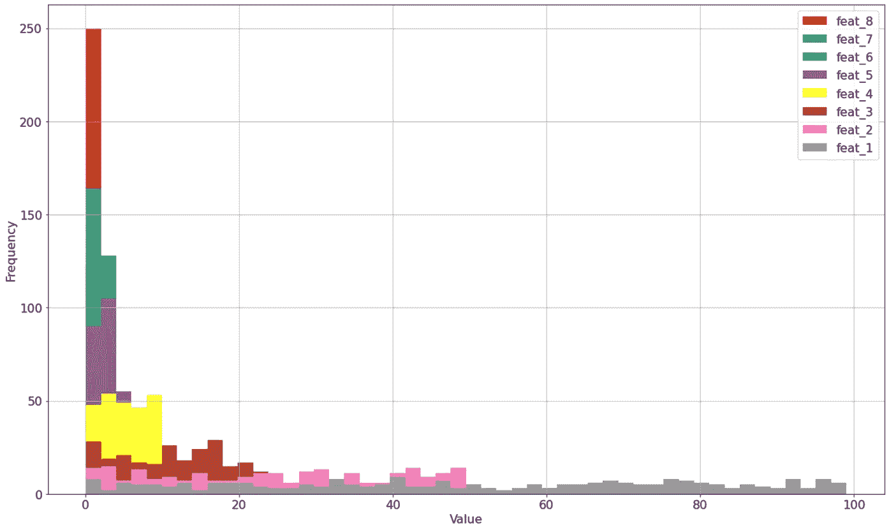****

****图 8。8 个独立特征的直方图(图片由作者提供)。****

## ****我们应该期待发现什么？****

*****在我们对这个受控示例数据集进行 PCA 分析之前，让我们想一想我们应该期望发现什么。*首先，通过 PCA 分析，我们旨在以这样一种方式转换空间，即具有最大方差的特征将显示在第一分量中。在这个数据集中，我们很容易知道*哪些*特征包含最大的方差。我们期望如下:****

*   ****高维空间的旋转将以这样的方式进行，即特征 1 将是第一主分量(PC1)的主要贡献者。****
*   ****根据 PCA 方法，第二主成分(PC2)应该垂直于 PC1，穿过原点，并且在具有第二大方差的方向上移动。最大的贡献来自特征 2。****
*   ****第三个主成分(PC3)应垂直于 PC1 和 PC2，并且方向的方差第三大。在我们的例子中，我们知道特性 3 将是主要的贡献者。****

****总而言之，我们预计功能 1、2 和 3 将分别成为 PC1、PC2 和 PC3 的主要贡献者。*我们应该能够通过使用载荷和双标图来确认我们的预期。*****

## ****我们如何将负载可视化？****

*******载荷用有一定角度和长度的箭头来表示。*** *该角度代表特定特征在 PCs 贡献方向上的贡献。箭头的长度描述了该特征在该方向上的贡献强度。*在 2D 图中，**(近)水平箭头**(沿 x 轴)描述了该特征对 PC1 的贡献。另一方面，**垂直箭头**描述了一个特征对 y 轴的贡献最大，并且朝向 PC2。**某个角度下的箭头**描述了特定特征在该方向上对各种 PCs 的贡献。**箭头的长度**描绘了特定 PC 中特征的*或*。在我们的示例中，我们预计*特征 1* 对 *PC1、*的贡献最大，并且几乎是水平的，因此将获得接近绝对值 1 的值。*特征 2* 对 *PC2* 的贡献最大，并且几乎垂直，其值接近绝对值 1。*特征 3* 对 *PC3* 的贡献最大，并将位于 z 轴方向。，并得到一个接近绝对 1 的值。******

## ****PCA 结果。****

****我们从理论上解释了我们应该期待什么，现在我们可以计算主成分及其载荷和解释的方差。对于这个例子，我将用`n_components=None`初始化 pca，因此不会删除任何 PC。请注意，默认值为:`n_components=0.95`，它表示 PCs 的减少量高达解释方差的 95%。****

****拟合和转换数据后，我们可以开始研究数据的特征和变化。首先，我们可以用所谓的 ***scree plot*** (图 9)来检验被解释的(累积的)方差。我们可以看到，PC1 和 PC2 覆盖了超过 95%的变化，前 3 台 PC 覆盖了总变化的 99.64%。pca 库中的默认设置是只有 PC 保持高达 95%的解释方差(因此在这种情况下是前 3 个)。*如果我们一开始就将数据标准化(我们使用的是随机数据)，就会出现这种情况。*****

****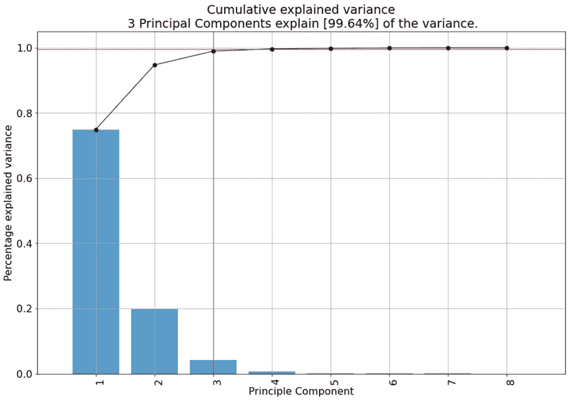****

****图 9。带有(累积)解释方差的 Scree 图(图片由作者提供)。****

****样品的二维图如图 10 所示。这里我们看到样本是均匀分布的。请注意，这些值在 x 轴和 y 轴之间变化很大。****

********

****图 10。PC1 和 PC2 的随机数据的二维图。左图:每个样品都有不同的标签和颜色，因为没有给出类别信息。右图:我们可以删除图例和标签，并设置最大装载数量(红色箭头)。(图片由作者提供)****

****让我们只关注载荷，并从图中移除散布(图 11，通过设置参数`cmap=None`)。我们可以清楚地看到，第一主成分的最大贡献者是特征 1，因为箭头几乎是水平的，并且具有几乎-1 (-0.99)的负载。我们在 PC2 的功能 2 和 PC3 的功能 3 中看到了类似的行为，但对于 PC3，我们需要绘制一个 3D 图来查看前 3 个功能。****

****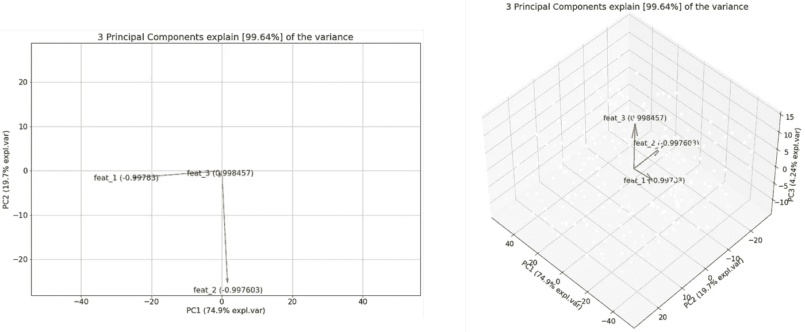****

****图 11。负荷的二维和三维图。(图片由作者提供)。****

****注意，所有这些结果也存储在模型的输出中，如上面的代码块所示。此时，我们现在可以用箭头、角度、长度和相关特征来解释载荷。你应该意识到我们使用了随机整数，并且仍然可以找到潜在的“有趣的”PCs 贡献者。*如果不进行归一化，范围最大的特征将具有最大的方差，并且是最重要的特征。通过归一化，在随机数据的情况下，所有要素都将具有或多或少相似的贡献。* ***分析数据的时候一定要深思熟虑。*******

****在下一节中，我们将分析一个真实的数据集，看看载荷是如何表现的以及如何解释的。****

## ****葡萄酒数据集。****

****到目前为止，我们已经使用了一个合成数据集来理解在一个受控的数据集中载荷是如何表现的。在这一节中，我们将分析一个更现实的数据集，并描述特征在高维空间中的行为和贡献。我们将导入 ***葡萄酒数据集*** ，并创建一个包含 178 个样本的数据框，包含 13 个特征和 3 个葡萄酒类别*。*****

****特征的范围差别很大，因此标准化步骤很重要。标准化步骤是 [*pca 库*](https://erdogant.github.io/pca/) 中的内置功能，可以由`normalize=True.`轻松设置。出于演示目的，我将设置`n_components=None`以将所有 PC 保留在模型中。****

****在拟合和转换之后，我们可以输出存储在关键字“ *topfeat* ”中的最佳性能特征。这里我们可以看到哪些变量对哪些 PCs 的贡献最大。使用 *scree 图，*我们可以检查在 PCs 中捕获的方差。在图 12 中，我们可以看到 PC1 和 PC2 一起覆盖了数据集中几乎 60%的变化。那很好！我们还看到，我们需要 10 台电脑来捕捉> 95%的变化。****

****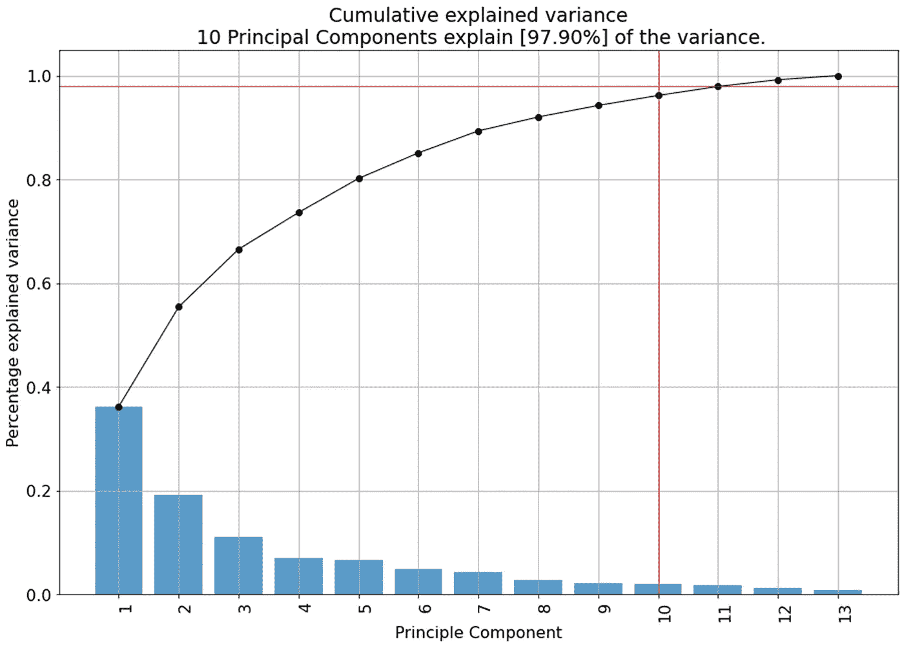****

****图 12。Scree plot 葡萄酒数据集(图片由作者提供)。****

****如果我们制作双绘图并给三个类着色，我们可以直接注意到前两个 PC 很好地将三个类分开。第一台 PC 捕获了 36.1%的变化，第二台 PC 捕获了 19.2%。加载现在将帮助我们更深入地检查变量是如何对 PCs 起作用的，以及类是如何被分开的。对 x 轴贡献最大的特征，因此对于 PC1 是 ***类黄酮*** ，而对于 PC2(y 轴)，最大的贡献来自变量 ***颜色 _ 强度*** 。角度较宽的特征，如 ***色相*** 和 ***苹果酸*** 对 PC1 和 PC2 有部分贡献。****

****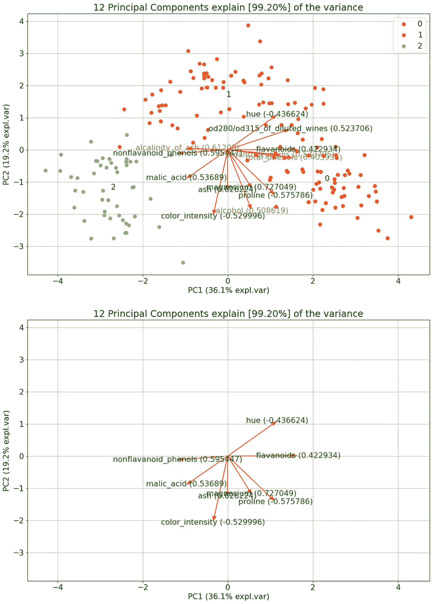****

****图 13。葡萄酒数据集的双标图。样本根据类别信息进行着色。(图片由作者提供)。****

****让我们开始更深入地研究促成 PC1 的*类黄酮*变量。*类黄酮的*箭头角度为正，几乎水平，得分为 0.422。这表明 x 轴上的一些差异应该来自于*类黄酮*变量。或者换句话说，如果我们使用*黄酮类化合物*值给样品着色，我们应该会发现左边的值较低，右边的值较高。我们可以很容易地对此进行如下研究:****

****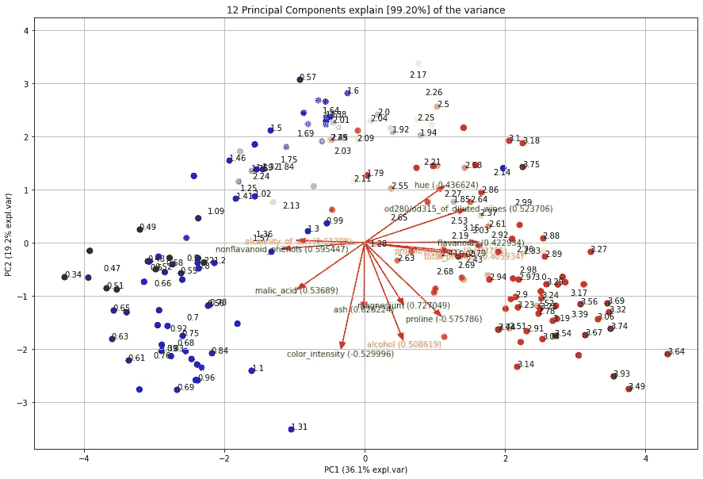****

****图 14。葡萄酒数据集的双标图。样品上有颜色*类黄酮值*(图片由作者提供)。****

****事实上，很高兴看到样本的左边是蓝色(低值)，右边是红色(高值)。因此，加载准确地描述了沿 x 轴贡献最大的特征以及取值范围。****

> ****正负荷表示变量和主成分正相关，而负负荷表示负相关。当载荷很大时，(+或-)，它表明一个变量对主分量有很大的影响。****

****我们再拍一张。对 PC2 贡献最大的是 *color_intensity。*这个箭头是向下的，我们应该预料到这些值与 PC2 是负相关的。或者换句话说，具有高*颜色强度*值的样本被期望在底部，而低值在顶部。如果我们现在使用 *color_intensity* 给样本着色(图 15)，很明显变化确实是沿着 y 轴的。****

********

****图 14。葡萄酒数据集的双标图。样本根据 color_intensity *值*着色(图片由作者提供)。****

****我们也来看看*镁*装。该变量的加载角度更大，并且方向向下，这意味着它对 PC1 和 PC2 有部分贡献。创建 3D 图并根据镁值对样本进行着色，可以清楚地看出 PC3 沿线也捕捉到了一些变化。****

********

****图 14。葡萄酒数据集的双标图。样品在镁*值*上着色(图片由作者提供)。****

****除了给样品着色之外，还可以在其他维度上进一步研究样品，例如第 4、第 5 等 PCs 及其负载。通过这些分析，我们对变量的变化有了更多的直觉，我们甚至可以假设这些类是如何分开的。所有这些见解都是讨论可能的后续步骤和设定一些期望的极好起点。****

# ****异常值检测。****

****[pca 库](https://erdogant.github.io/pca/pages/html/Outlier%20detection.html)包含两种检测离群点的方法: [**霍特林的 T2**](https://erdogant.github.io/pca/pages/html/Outlier%20detection.html#) 和 [**SPE/DmodX**](https://erdogant.github.io/pca/pages/html/Outlier%20detection.html#spe-dmodx) 。霍特林的 T2 通过计算**卡方检验**来工作，而 **SPE/DmodX 方法**基于前 2 个样本的平均值和协方差。这两种方法在方法上是互补的，因此计算重叠可以指出最不正常的观察结果。当我们分析葡萄酒数据集时，我们检测到方法之间有三个重叠的异常值。如果您需要调查异常值，这将是一个很好的开始。或者，对于霍特林 T2 法，离群值可以排列为`y_proba`(越低越好)，对于 SPE/DmodX 法，可以排列为`y_score_spe`(越大越好)。****

****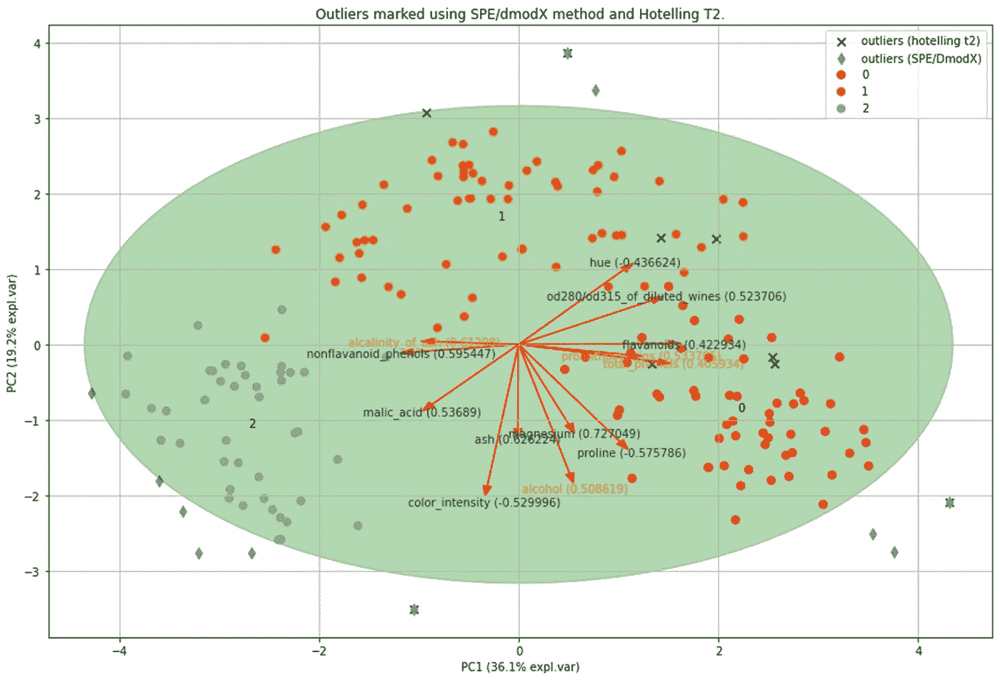****

****图 15。使用 SPE/DmodX 方法检测到的异常值用菱形表示。使用霍特林 T2 方法检测到的异常值用十字表示。(图片由作者提供)****

# ****结束了。****

****每个 PC 是一个线性向量，包含原始特征的贡献比例。每个变量对主成分的贡献的解释可以使用加载进行检索，并用双标图进行可视化。这种分析将给出关于变量变化和类可分性的直觉。这将有助于形成良好的理解，并可以为讨论后续步骤提供一个极好的起点。例如，您可以质疑是否需要使用高级机器学习技术来预测特定类别，或者我们是否可以对特定变量设置单个阈值来进行类别预测。****

****此外， [pca 库](https://erdogant.github.io/pca/)提供了使用霍特林 T2 测试和 SPE/Dmodx 方法移除[异常值](https://erdogant.github.io/pca/pages/html/Outlier%20detection.html)的功能。我没有去去除不需要的(技术)差异(或偏差)，但这可以通过使用[标准化策略](https://erdogant.github.io/pca/pages/html/Examples.html#normalizing-out-pcs)来完成。****

****这就是了。如果有不清楚的地方或者有进一步完善 [*pca*](https://erdogant.github.io/pca/) 库的建议请告诉我！****

*****注意安全。保持冷静。*****

*******欢呼，E.*******

*****如果你觉得这篇文章很有帮助，可以使用我的* [*推荐链接*](https://medium.com/@erdogant/membership) *继续无限制学习，并注册成为中级会员。另外，* [*关注我*](http://erdogant.medium.com) *关注我的最新内容！*****

## ****软件****

*   ****[pca github](https://erdogant.github.io/pca/)****
*   ****[Colab 笔记本](https://erdogant.github.io/pca/pages/html/Documentation.html#colab-notebook)****

## ****我们连线吧！****

*   ****[我们在 LinkedIn 上连线](https://www.linkedin.com/in/erdogant/)****
*   ****[在 Github 上关注我](https://github.com/erdogant)****
*   ****[跟着我上媒](https://erdogant.medium.com/)****