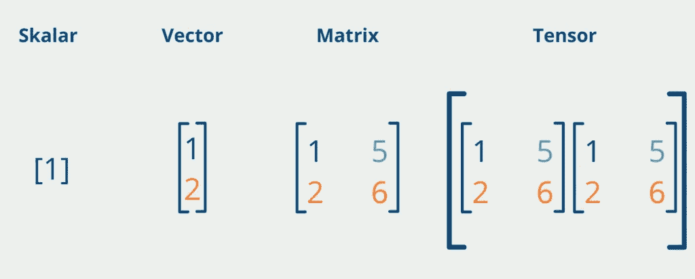

# 机器学习中的张量是什么？

> 原文：<https://towardsdatascience.com/what-are-tensors-in-machine-learning-5671814646ff>

## 了解机器学习的主要数据对象

约书亚·索蒂诺在 [Unsplash](https://unsplash.com?utm_source=medium&utm_medium=referral) 上拍摄的照片

张量是线性代数中的一个数学函数，它将选择的向量映射为一个数值。这个概念起源于物理学，随后被用于数学。可能使用张量概念的最突出的例子是广义相对论。

在[机器学习](https://databasecamp.de/en/machine-learning)领域，张量被用作许多应用的表示，例如图像或视频。它们构成了 TensorFlow 的机器学习框架的基础，该框架也由此得名。

# 什么是秩和轴？

如果要更精确的描述张量，就需要所谓的秩和维数。这些可以决定物体的大小。为此，我们从一个矩阵开始，我们要找出它的秩。为此，我们形成一个简单的 Numpy 数组，它表示一个三行三列的矩阵。

张量的**秩现在提供了需要多少个索引来引用元素中的单个数字的信息。它也经常被称为维数。**

在矩阵的情况下，这意味着它的秩为 2(矩阵是二维的)，因为我们需要两个索引来输出一个特定的数。假设我们想将对象“矩阵”转换为第一行第二列中的数字 5，那么我们需要两步才能实现。

首先，必须引用索引为 0 的第一行:

在我们得到的数组中，我们可以选择索引为 1 的第二个元素(注意:对于 Numpy，计数从 0 开始！):

所以矩阵的秩为 2(是二维的)，因为需要两个指数来得到一个数。然而，存在许多不同大小的矩阵，例如三行四列或五行两列。

为了区分不同的矩阵并精确定义它们，我们使用所谓的轴及其长度。张量的轴是特定维度上的值。在我们的例子中，具有第一个索引的 Numpy 数组是第一维的轴。

轴的长度反过来告诉我们沿着轴有多少个有效索引。在我们的例子中，长度是三，因为在第一个轴上总共有三个索引(=矩阵有三行)。以下调用会导致错误，因为第四个索引不存在:

# 张量的大小是多少？

张量的大小给出了每个维度的轴的长度。这意味着我们可以如下指定对象“矩阵”的大小:

我们得到从 [TensorFlow](https://databasecamp.de/en/python-coding/tensorflow-en) 反馈回来的各种信息，可以相对容易的解读。张量具有“形状”2，即秩 2 或二维。我们已经预料到了这一点，因为我们知道矩阵是二维张量。“dtype”描述了存储了哪些[数据类型](https://databasecamp.de/en/data/data-types)，在我们的例子中是整数。最后，我们用“([3，3])”得到张量的大小，因为在两个维度的每一个维度上都有三个不同的指数。我们已经预料到了这个结果，因为它是一个三行三列的矩阵。

# 张量有哪些不同的类型？

张量是向量和矩阵的总称，包括机器学习领域中的多维数组。根据数组的维数，不同类型之间有所区别:

## 数量

标量，即单个数字，是一个 0 维张量。不需要单个索引来引用一个数字。因此，标量没有轴，因此秩也为 0。

## 矢量

向量是一维张量，秩为 1。根据向量有多少个元素，轴的长度会相应地改变。

## [数]矩阵

正如我们已经详细描述过的，矩阵是一个二维张量。

## 张量

从三维或更多维来看，人们实际上也在谈论张量。三维张量可以看作是矩阵的集合。

Python 编程中的不同对象|来源:作者

张量是对线性代数中已知的对象的推广。它们被用于编程，主要是因为它们提供了表示多维数据结构的可能性。

# 用它们可以做什么算术运算？

允许的算术运算与矩阵的算术运算非常相似，但命名可能不同:

*   **加法**:如果两个对象具有相同的维度，可以简单地通过将它们逐个元素相加来进行加法运算，从而创建一个具有相同维度的新对象。
*   **减法**:如果两个对象有相同的维度，那么可以很容易地通过一个元素一个元素地减去它们，从而产生一个具有相同维度的新对象。
*   **Hadamard 乘积**:这个特殊的乘积是通过一个元素接一个元素的相乘得到的。这个特殊的名字来源于这样一个事实，即仍然存在乘法的“正常”方式，即基于矩阵乘法。
*   **分割**:如果两个对象有相同的维度，那么只需将它们一个元素一个元素的分割，就可以将它们分割开来，这样就创建了一个相同维度的新对象。

# 它们在机器学习中的作用是什么？

为了训练一个机器学习模型，需要大量的数据。然而，我们所知道的来自真实世界的数据并不是模型可以使用的数学形式。因此，我们必须首先将图像、视频或文本等转换成多维数据结构，以便可以用数学方法解释它们。

同时，由于其结构，[神经网络](https://databasecamp.de/en/ml/artificial-neural-networks)可以容纳和输出各种维度，远远超过传统的向量和矩阵。因此，随着神经网络的激增，张量的使用也变得更加普遍。

以下应用程序在机器学习中使用这些对象来提高模型性能:

*   **协同过滤**:这种模式用于电子商务，例如，根据顾客以前的购买行为，在网站上向顾客推荐最合适的产品。对于培训，通常使用矩阵，其中以前的客户显示为行，产品显示为列。如果第一行中的客户已经购买了第二列中的产品，此时将显示 1，如果没有，则显示 0。虽然这种设置已经能够提供良好的结果，但通过向矩阵中添加维度，可以进一步改进这些结果，例如，矩阵还可以包括客户环境。
*   **计算机视觉**:图像和视频不能用一个纯矩阵来表示。它们不仅包含大量的像素，而且是通过将不同的颜色叠加在一起而形成的，从而形成了图像。在所谓的 RGB 格式的简单图像中，红色、绿色和蓝色叠加在一起。

图像的张量表示|来源:作者

# 这是你应该带走的东西

*   张量是线性代数中的数学对象，用于表示多维对象。
*   例如，它们可以用来执行已经熟悉的向量或矩阵的算术运算。
*   在机器学习中，它们被用于，例如，实现更好的推荐或者在数据结构中映射图像和视频。

*如果你喜欢我的作品，请在这里订阅***或者查看我的网站* [*数据大本营*](http://www.databasecamp.de/en/homepage) *！还有，medium 允许你每月免费阅读* ***3 篇*** *。如果你希望有****无限制的*** *访问我的文章和数以千计的精彩文章，不要犹豫，点击我的推荐链接:*[【https://medium.com/@niklas_lang/membership】](https://medium.com/@niklas_lang/membership)每月花$***5****获得会员资格**

* [## 梯度下降初学者指南

### 关于梯度下降法你需要知道的一切

towardsdatascience.com](/beginners-guide-to-gradient-descent-47f8d0f4ce3b)  [## 初学者指南:提取、转换、加载(ETL)

### 了解数据分析中的大数据原理

towardsdatascience.com](/beginners-guide-extract-transform-load-etl-49104a8f9294)  [## 使用 MongoDB 介绍 NoSQL 数据库

### NoSQL 数据库实用指南

towardsdatascience.com](/introducing-nosql-databases-with-mongodb-d46c976da5bf)*