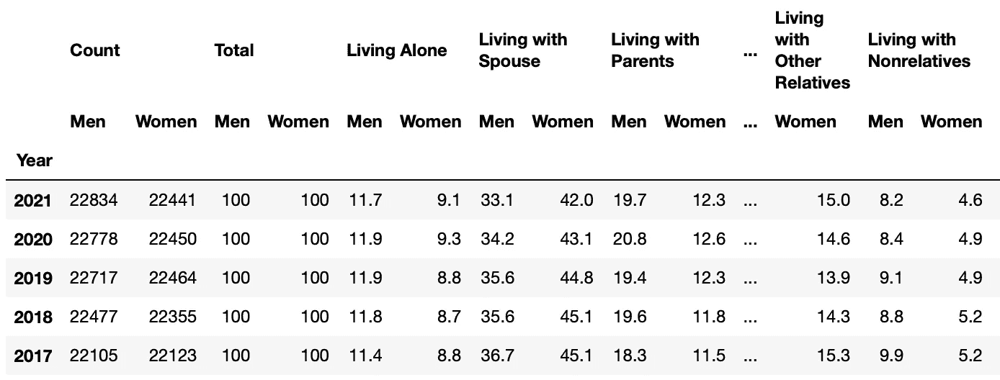
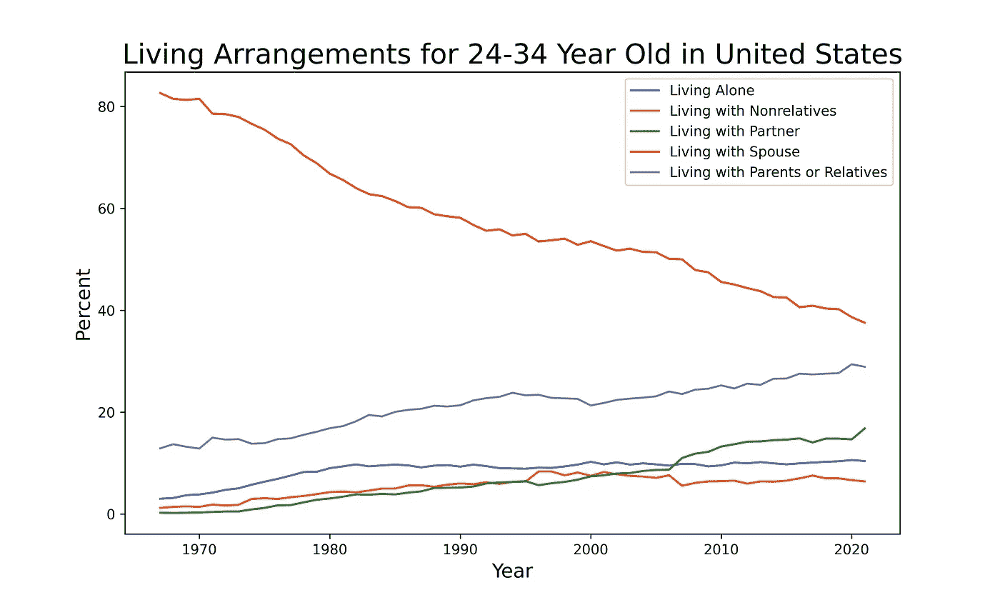
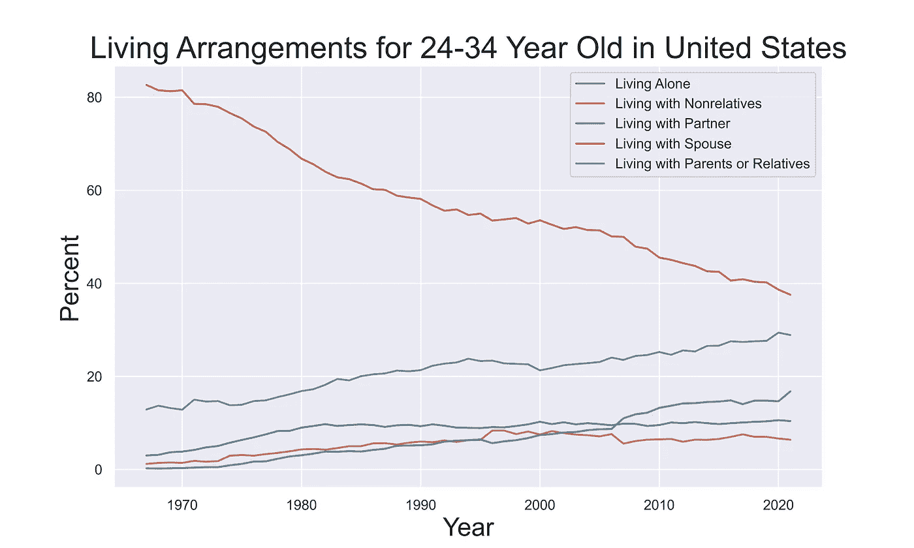
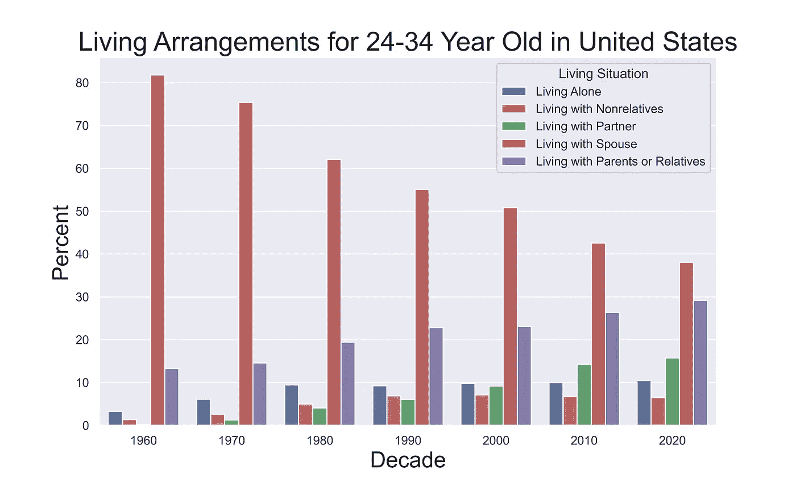

# 最好的 Python 绘图库有哪些？

> 原文：<https://towardsdatascience.com/what-are-the-best-python-plotting-libraries-df234a356aec>

## 让我们深入了解 Python 程序员可以用来可视化数据的各种工具

由[卡洛斯·穆扎](https://unsplash.com/@kmuza?utm_source=unsplash&utm_medium=referral&utm_content=creditCopyText)在 [Unsplash](https://unsplash.com/s/photos/data?utm_source=unsplash&utm_medium=referral&utm_content=creditCopyText) 上拍摄的照片

Python 是处理数据的绝佳语言。像 Numpy、Pandas 和 Scikit-Learn 这样的库使它成为数据科学领域最有能力的选择之一。处理数据最重要的一个方面是能够将数据可视化。无论是探索性分析还是与公众分享发现，创建有效的可视化都是 Python 程序员经常做的事情。

在真正的 Python 风格中，当选择用于绘图的库时，有过多的选项。有相对简单的选项，如 Matplotlib，也有更复杂的库，如 Folium，它们利用 JavaScript 的力量来创建真正令人惊叹的交互式地图。选择库最终取决于数据类型和绘图目标。无论您是分析实验数据的工程师，还是在会议上展示您的发现的研究人员，Python 都有工具为您创建正确的可视化。在这篇文章中，我将讨论一些适用于各种环境的最好的绘图库。

# 数据

通过使用绘图库来探索真实数据来比较绘图库要有趣得多，所以在本帖中，我们将关注 1967 年至 2021 年期间美国 25 至 34 岁人群的生活安排是如何变化的。这个年龄组特别有趣，因为它涵盖了年轻人通常完成大学学业并进入人生下一阶段的时期。

这些数据可以从美国人口普查局获得，我们可以很容易地下载一个包含我们想要分析的年龄组的 excel 文件。一旦我们下载了正确的文件，我们就可以把它读入 pandas 并稍微清理一下。

来源:作者创作

当谈到阅读 Excel 文件而不是。csv 文件通常还需要做一些工作才能得到一个可以使用的漂亮的熊猫数据帧。当我读取文件时，我可以告诉 pandas 哪些行将用作我的标题，以及这些标题后面有多少行实际数据。这让我们可以丢弃不属于实际表格的额外信息。

重命名列现在允许我们清除任何“未命名”的单元格，同时在以后创建传奇时使我们的生活更容易。最后，我们可以将`Year`设置为数据帧的索引，我们得到:

作者创作(来源:美国人口普查局)

默认情况下，这些数据是按性别划分的，不过在这篇文章中，我们真的只想看看 25 岁至 34 岁人群的总体生活安排。

由作者创建

虽然我们可以在原始数据框架中创建这些组合列，但创建一个仅包含我们所需信息的新数据框架可以使绘图变得简单得多。

作者创作(来源:美国人口普查局)

我还把“和父母住在一起”和“和亲戚住在一起”这两栏合并在一起，因为他们的居住环境非常相似，这使得我们的数据框架更容易管理。现在我们已经将数据加载到 Python 中，让我们开始绘制一些图表吧！

# 原生 Python

我们将讨论的第一个库是 Matplotlib 和 Seaborn。两者都非常强大，并为人们提供了大量的定制，以微调可视化来适应他们的视觉。虽然 Seaborn 和 Matplotlib 在许多方面很相似，但我发现我在非常不同的情况下使用它们。让我们讨论一下不同之处，并开始研究我们的数据集。

## Matplotlib

Matplotlib 基于 Matlab 的`plot()`函数，让过去用过 Matlab 的工程师感觉很熟悉。除了语法差异之外，Matplotlib 基本上可以创建任何可以在 Matlab 中创建的绘图。虽然 Matplotlib 的核心功能是为创建二维图而设计的，但也有像 mplot3d 和 cartopy 这样的库可用于向 Matplotlib 的功能添加三维图，甚至地理可视化。

说到探索性数据分析，我发现 Matplotlib 是我最常用的库。一旦掌握了基本语法，它就简单易用了。

作者创建(来源:美国人口普查[1])

Matlab 擅长用最少的努力创建简单有效的图。它也恰好是非常可定制的，通过不同程度的努力，你可以用你的情节做各种事情。这就是为什么我经常使用 Matplotlib 来创建演示文稿的情节。在演示过程中，你希望观众能够在没有你太多帮助的情况下快速理解一个情节。这可以让你专注于数据推动的讨论。我们将在接下来的 Seaborn 部分看到如何进一步定制 Matplotlib 图的例子。

## 海生的

Seaborn 是我最喜欢的 Python 库之一。这是一个基于 Matplotlib 的绘图库，具有许多易于使用的样式，有助于使您的绘图看起来更好。然而，Seaborn 不仅仅是时尚；Seaborn 的真正强大之处在于它可以用最少的代码创建更复杂的统计图表，我们很快就会看到这一点。

由于 Seaborn 构建在 Matplotlib 之上，我们可以利用两个库中的功能，如下所示:

由作者创建

作者创建(来源:美国人口普查[1])

**融化**数据

Seaborn 适合绘制来自 pandas 数据帧的数据，有一些巧妙的技巧可以使绘制数据帧更加容易。为了避免必须为数据集的每一列显式创建一行，我们可以用一个称为“熔化”的过程来重新组织我们的数据帧。熔化是整理数据框架的一种方式，这样我们就有一个列来表示每个值的类别，如下所示:

由作者创建

由作者创建

现在，我们的数据以一种更容易传递到绘图函数的方式进行组织，因为我们有一个用于 x、y 和类别值的列。这使我们能够更容易地访问图形对象，为我们的绘图添加更多的定制。

由作者创建

作者创建(来源:美国人口普查[1])

Seaborn 的观点非常有用。它可以在许多情况下用于按分类列对数字列进行分组，这使得浏览数据集变得更加容易。使用`hue`参数允许我们用一行代码创建图表，Seaborn 使用`hue`类别为我们分离数据。

能够在一行中创建我们的情节并将对象存储在`ax`中使得处理情节变得更加简单。现在我可以找到每条线的末端，并在图上标注最终的百分比。在为演示文稿和其他需要快速收集信息的情况创建情节时，像这样的小触摸会很有用。它们还可以帮助将该图与使用每个人都可以使用的默认工具制作的其他可视化图区分开来。

**换上**

当我们有组来相互比较时,`hue`论点使各种各样的情节更容易制作。让我们试着用这些数据做一个柱状图，展示每十年生活安排的分布是如何变化的。我们不得不稍微争论一下数据，以获得每个十年的平均值。

由作者创建

从我们的非熔化数据帧开始，我们可以将指数转换为`datetime`，然后使用`groupby()`对每十年进行平均。然后我们可以像以前一样完全融化它，现在我们准备好创建我们的情节了！

由作者创建

作者创建(来源:美国人口普查[1])

我一般不像这样对时间序列数据使用条形图，但这是一个很好的例子，说明 Seaborn 在处理分类数据时是多么容易使用。

# Javascript 包装器

虽然 Python 绝对能够使用 Seaborn 或 Matplotlib 等原生库创建奇妙的情节，但它不能像 JavaScript 那样生成交互式和易于共享的情节。当我们在线共享可视化时，交互式绘图特别有用，因为它们允许浏览者探索数据并收集比静态绘图所能提供的更多的信息。在一个网页上，用户有足够的时间来探索你的作品，一个交互式的可视化会比它的静态对应物更吸引人，更令人印象深刻。

## Plotly

Plotly 是一个库，它为 Python 和 r 等语言带来了使用 JavaScript 进行交互式绘图的能力。它是用 JavaScript 构建的，并利用了强大的 D3.js 库。使用 Plotly，我们可以只用几行代码在 Python 中创建交互式绘图。你会注意到我仍然在使用我们为 Seaborn 地块创建的熔化数据帧；JavaScript 中的许多绘图库也更喜欢这种整洁的数据格式，因为它允许数据很容易地进行分类。

由作者创建

作者创建(来源:美国人口普查[1])

使用 Plotly Express 库，我们可以快速重建我们的生活安排图。Medium 不支持直接嵌入 JavaScript，所以我不得不把它上传到一个叫 DataPane 的服务上。通常情况下，您不需要与这个中间人服务打交道，因为 Plotly 可以托管您使用其 Chart Studio 服务创建的图表。

我非常喜欢 Plotly 线形图的一个功能是能够单击图例中的一条线来打开和关闭它。对于具有多条线的更复杂的图，这可能是一个非常有用的功能，允许您创建更复杂的图，并鼓励读者与数据进行交互。

## 薄层

follow 是一个优秀的 Python 库，它将 Python 的数据角力能力与 fleet . js 结合在一起，创建了一个强大的映射工具。虽然在这篇文章中我们不涉及空间数据，但我想在利用 JavaScript 的 Python 库中提及它。

# 只使用 JavaScript 怎么样？

JavaScript 是创建交互式数据可视化最有效的编程语言之一。像 D3 和 fleet 这样的库允许极端的定制，可以用来创建非常独特的情节。然而，这种灵活性是以需要更多代码和时间为代价的。即使使用 D3.js 创建一个简单的交互式线图，也比使用 Plotly 的 Python 库花费更多的时间。

由于使用 JavaScript 创建绘图需要更陡峭的学习曲线和时间投入，我只推荐它用于三种情况:当您想要有创造性时，您正在处理大型地理空间数据集，或者您正在创建一个独特的数据仪表板。

如果你要发表像研究论文这样的东西，并且你真的希望你的情节突出，JavaScript 是目前最好的工具。对于那些想要创建独特的数据可视化的 web 开发人员来说尤其如此，这些数据可视化不受大多数绘图所在的传统矩形的限制。使用 D3，web 开发者可以将一页信息转化为交互体验，数据和设计可以共存。

地理可视化是我最初学习 JavaScript 的原因。我处理大量地理空间数据集，在地图上可视化数据对于向他人展示我的发现至关重要。Python 有一些工具可以创建这种类型的图，但是，它们都非常有限，最终需要 JavaScript 包装器来实现任何令人满意的结果。JavaScript 有一些不可思议的库，比如用于创建地理可视化的 Mapbox 和 Leaflet，如果您经常使用地理数据，我强烈建议您学习如何使用它们。

> **注意:**如果你喜欢在 Medium 上阅读我和其他人的内容，考虑使用下面的链接订阅，以支持这样的内容创作，并解锁无限的故事！

<https://medium.com/@willmnorris/membership>  

# 资源

*   [Seaborn 提示和技巧](/a-major-seaborn-plotting-tip-i-wish-i-had-learned-earlier-d8209ad0a20e)
*   [上传和嵌入互动情节可视化](/how-to-upload-and-embed-interactive-plotly-visualizations-f819d4ffecfb)
*   [2000 酷派 D3.js 剧情](http://techslides.com/over-2000-d3-js-examples-and-demos)

## 证明文件

*   [Matplotlib 文档](https://matplotlib.org/stable/users/index)
*   [Seaborn Docs](https://seaborn.pydata.org)
*   [Plotly Python 文档](https://plotly.com/python/)
*   [数据面板文件](https://docs.datapane.com)

## 数据源

[1]美国人口普查局，当前人口调查，年度社会和经济增刊，1967 年至今，成年人的历史生活安排(2021 年)

*   [链接到数据下载网页](https://www.census.gov/data/tables/time-series/demo/families/adults.html)
*   所有美国人口普查局的数据都是公共领域，[许可证可以在这里查看](https://www.census.gov/data/software/x13as/disclaimer.html)