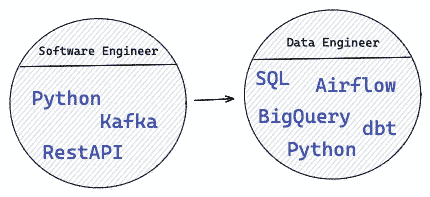
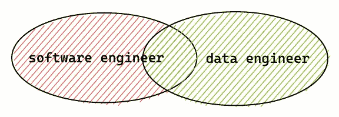

# 数据工程师能从软件工程师那里学到什么，反之亦然

> 原文：<https://towardsdatascience.com/what-data-engineers-can-learn-from-software-engineers-and-vice-versa-643cade3ef23>

## 不要被你的工作描述所限制

照片由[上的](https://unsplash.com/)[面](https://unsplash.com/@surface)拍下

在过去五年的职业生涯中，我成为了一名全职软件工程师和一名全职数据工程师。我注意到这两个角色有很多相似之处，帮助我顺利地从一个角色转换到另一个角色，但也有明显的差异，促使我学习新的技能。

分享它们的不同之处，更重要的是，从我的角度来看，一个角色可以从另一个角色身上学到什么，这将是一件有趣的事情。如果你正在考虑换工作，我希望这篇文章能给你一些启发。即使你不是，这篇文章仍然会帮助你离开你的舒适区，向别人学习。

## 我的情况

由于这篇文章会很主观，是否真的适合你*要看*了，我就简单说明一下我的情况。

软件工程->数据工程师(由[高](https://medium.com/u/2adc5a07e772?source=post_page-----643cade3ef23--------------------------------)创立)

我最初在一家国际银行做软件工程师。我的工作是**几乎从零开始构建软件**来集成不同的内部银行应用程序，如数据仓库和报告工具。我主要使用的技术是 Python 作为主要编程语言，Apache Kafka 作为流媒体平台，RestAPI 框架如 Connexion 和 FastAPI，以及一点 SQL。

后来我跳槽到了一家创业公司，成为了一名数据工程师。我花了大部分时间**使用诸如 Airflow 和 dbt** 之类的工具构建数据管道和数据模型。整个堆栈在 GCP 上运行，所以我也可以学习云服务，如 BigQuery、Pubsub、云存储等。

正如你所看到的，虽然我有两个不同的职位，但他们在技术和工作类型上确实有共同点，那就是将数据从一个地方移动到另一个地方。这就是为什么我更容易做出改变。如果你是一个专注于 web 应用的软件工程师，那么这个转变对你来说可能更有意义。

## 软件工程师与数据工程师

> 维基百科将软件工程师定义为应用软件工程原理来设计、开发、维护、测试和评估计算机软件的人。

创作人:高

软件工程师是一个非常广泛的工作范畴。每个软件工程师的职责可能完全不同。总体而言，他们的任务包括:

1.  从涉众、开发人员和其他利益相关方收集需求。软件需求包括功能性需求(如业务规则)和非功能性需求(如可靠性、可伸缩性、性能)。
2.  **设计**系统的架构、组件、接口和其他特征。它涉及到与其他工程团队的合作，以确保解决方案能够融入大局。它还包括详细的实现设计，如算法、数据结构等。
3.  **使用一种或多种编程语言开发软件。**
4.  **测试**软件使用单元测试、集成测试、用户验收测试、冒烟测试等。这是一个实验性的，技术性的调查，为涉众提供关于软件质量的信息。
5.  **一旦软件投入使用，就对其进行维护**。它指的是在发现错误时更新软件和监控服务的健康状况等活动。

[软件工程师*这个术语从 20 世纪 60 年代开始正式使用。*](https://en.wikipedia.org/wiki/History_of_software_engineering)随着领域变得越来越大越来越复杂，术语*软件工程师*不再足够清晰地描述这个人在做什么。因此，出现了许多新的工作角色，它们是软件工程师的分支:

*   全栈工程师—专注于 web 应用。
*   IOS/Android 开发者——专注于移动应用。
*   DevOps 工程师—开发和维护软件的发布、部署和运行流程。

同样，数据工程师也被认为是软件工程师的一个分支，重点是大数据。直到 2010 年代，数据工程师这个术语才被广泛采用。

> 维基百科将数据工程师定义为构建系统以收集和使用数据的人。

没错。数据工程师不是像构建 web 应用程序那样构建软件，而是构建一个系统。但是，让我们看看数据工程师的任务:

1.  收集所有相关方的需求。这和软件工程师是一样的。
2.  **建立**数据管道，从源系统收集原始数据，并将它们转换成数据用户可以理解的信息。数据工程师通常使用现有工具(如 Airflow 和 dbt)构建数据管道和数据模型。
3.  **上线后维护**管道。与软件一样，监控数据管道的健康状况以确保数据的可靠性非常重要。

一般来说，数据工程师是软件工程领域的专家。下表显示了这两种角色之间的一些差异。

创作人:高

## 数据工程师能从软件工程师身上学到什么？

了解了他们的异同之后，再来看看他们是如何互相学习的。

*   **测试，测试，测试**

测试是软件工程生命周期中必不可少的单元。它帮助工程团队评估软件的质量，并确保它满足涉众的需求。

开发了一套软件测试策略，如单元测试、集成测试和用户验收测试，以减轻产品风险。一种常见的做法是将这些测试编码到 CI/CD 管道中，这样如果没有通过测试，软件将无法部署。

编写测试是每个软件工程师的 DNA，有许多测试框架，如 TDD(测试驱动开发)和 BDD(行为驱动开发)来帮助工程师编写测试。然而，对于数据工程师来说，测试仍然被视为*必须拥有的东西。几个原因可能是:*

*   数据管道正在处理许多未知因素。不像常规应用程序那样需要更多的输入，数据管道从许多来源接收各种格式的数据。除非我们有严格的数据契约，否则很难预测所有类型的数据并涵盖所有场景。(数据契约是现在的热门话题，你可以在[查德·桑德森的博客文章](https://dataproducts.substack.com/p/an-engineers-guide-to-data-contracts)中读到更多。)
*   [**甲骨文问题**](https://www.yld.io/blog/the-oracle-problem/) **。** Oracle 问题是指难以确定预期产出的情况。由于许多未知因素，有许多情况我们不知道如何处理，这也增加了难度。
*   SQL 天生难以执行单元测试。SQL 是数据工程师的主流编程语言。但是执行单元测试并不容易，因为代码通常是一个很大的块，很难取出一部分来只测试那一部分。此外，像 BigQuery 这样的云服务没有本地环境(例如在本地运行 Postgres docker)，因此测试期间的远程连接可能会造成麻烦。目前，大多数测试都是数据测试，不测试业务逻辑，而是测试数据质量，包括数据的新鲜度、完整性和唯一性。

> 关于 dbt 中的测试主题，你可以阅读我的[如何在 dbt](/how-to-do-unit-testing-in-dbt-cb5fb660fbd8) 中进行单元测试的文章。

近年来，随着数据工程领域越来越成熟，自动化测试终于比以往更多地被提及。像[远大前程](https://greatexpectations.io/)、 [dbt](https://github.com/dbt-labs/dbt-utils) 和 [Dagster](https://docs.dagster.io/concepts/testing) 这样的框架开发了简化测试的特性，从而提高了数据管道和数据模型的质量。

*   **编码技巧**

大多数数据工程团队使用数据工具，如 Airflow、Dagster 和 dbt。相比于作为软件工程师写底层代码，他们更抽象，更容易管理。但是核心数据处理仍然需要在整个管道中编写。

除了 SQL 之外，精通至少一种编程语言是很重要的。熟悉编程语言也使得为开源项目做贡献成为可能，例如，Airflow。

最近出现的基础设施代码(IaC)和管道代码(PaC)在数据工程领域越来越流行。它们减轻了基础设施管理和发布周期管理的负担。熟悉 terraform、bash 和 Github 动作肯定会提高数据工程师的工作效率。

*   **监测数据产品的可靠性**

在软件工程中，通常是在服务上线后才进行监控。监控使开发人员能够在问题还很小的时候就迅速发现问题。

数据产品监测，或者换句话说，数据可观测性还是一个新概念。数据可观察性允许组织完全了解他们的数据系统，并在早期阶段修复数据问题。数据管道是由许多步骤组成的复杂系统。考虑到流程中的许多步骤，在一个仪表板中找到错误指标的根本原因是令人沮丧的。

数据工程师应该更愿意在设计阶段的开始就有一个监控的心态，以避免潜在的挫折。

## 软件工程师能从数据工程师那里学到什么？

好吧，让我们看看另一边。虽然软件工程师是一般角色，但他们还是可以学习数据工程师的专业知识。

*   **更愿意学习新技术**

数据工程是一个基于工具的领域，并且这个领域还在不断发展。谷歌“数据工程景观”会返回带有数百种数据工具的图片。要跟上每一个工具是不可能的，但是偶尔跟上绝对是值得的。

> 网站[现代数据栈](https://www.moderndatastack.xyz/)为每个类别收集了很多数据工具。

成为数据工程师后，我花了更多的时间阅读数据博客和产品发布说明，并比以往更频繁地参加会议。我发现这是所有软件工程师的好习惯。无论你做什么类型的工作，浏览你的 LinkedIn 帖子和媒体，看看你所在的领域是否有新的东西可以吸收，这总是好的。

如果你发现你所在领域的前景已经相当稳定，你可能需要重新考虑这份工作对你来说是否仍然有趣或具有挑战性。

*   **更负责端到端系统**

如前所述，数据工程师负责端到端系统。它要求工程师有能力同时处理多个组件。当我还是一名软件工程师时，我主要关注我自己的组件。

关注多个组件是成为架构师的先决条件。软件架构师是负责与整个系统行为相关的高级设计选择的人。如果你的目标是成为一名软件架构师，你应该更加关注系统设计。

*   **想想成本**

这是我作为软件工程师从未想过的一个有趣的视角。数据工程师处理大数据，因此拥有一种经济高效的方法来存储和转换数据变得极其重要，尤其是对初创公司而言。

尽管成本不是软件工程师首先要考虑的事情，但无论从财务角度还是流程角度，始终考虑效率和效果都是一个好习惯。例如，如何改进软件以使用更少的内存、CPU 和存储。

## 结论

在这篇文章中，我谈到了数据工程师和软件工程师可以互相学习的东西。他们有相似但互补的专业知识。如今的科技市场已经衍生出许多新的职位，未来还会更多。根据公司的不同，工作之间的界限可以是清晰的，也可以是模糊的，但是不要被你的工作描述要求你做的事情所限制。保持开放的心态，不断学习。干杯！