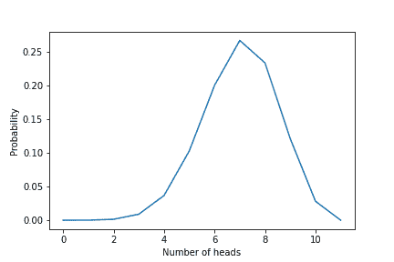
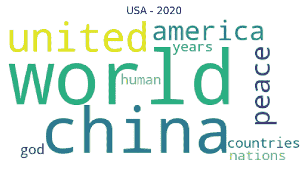
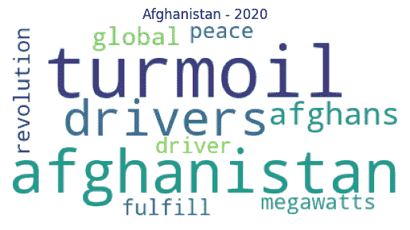
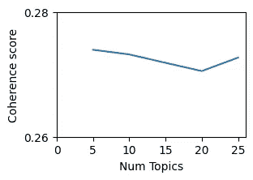

# 各国在联合国一般性辩论上谈些什么？使用 LDA 的主题建模

> 原文：<https://towardsdatascience.com/what-do-countries-talk-about-at-the-un-general-debate-topic-modelings-using-lda-19873cf00fe0>

## LDA 背后的直觉及其局限性，以及使用 Gensim 的 python 实现

由[兰楚](https://www.linkedin.com/in/lan-chu-b319a289/)和[罗伯特·扬·索科列维奇](https://www.linkedin.com/in/rsokolewicz/)拍摄。在这里找到这篇文章[的代码](https://github.com/lanchuhuong/LDA-Topic-modelling)。


照片由 [Siora 摄影](https://unsplash.com/@siora18)在 [Unsplash](https://unsplash.com/photos/VtNSaArmb-o) 上拍摄

## 1.什么是潜在狄利克雷分配？

在分析大量文本时，潜在狄利克雷分配(LDA)是一种流行的模型。它是一个生成概率模型，使用户能够从一组文档中发现隐藏的(“潜在的”)主题。LDA 将每个文档建模为通过从统计分布中重复采样单词和主题的过程而生成的。通过应用巧妙的算法，LDA 能够恢复在这个生成过程中使用的最可能的分布(Blei，2003)。这些分布告诉我们存在哪些主题，以及它们是如何在每个文档中分布的。

让我们首先考虑一个简单的例子来说明 LDA 的一些关键特性。假设我们有以下 5 个文档的集合

*   🍕🍕🍕🍕🍕🦞🦞🦞🐍🐍🐋🐋🐢🐌🍅
*   🐌🐌🐌🐌🐍🐍🐍🐋🐋🐋🦜🦜🐬🐢🐊
*   🐋🐋🐋🐋🐋🐋🐢🐢🐢🐌🐌🐌🐍🐊🍕
*   🍭🍭🍭🍭🍭🍭🍕🍕🍕🍕🍅🍅🦞🐍🐋
*   🐋🐋🐋🐋🐋🐋🐋🐌🐌🐌🐌🐌🐍🐍🐢

并且希望了解存在哪种主题以及它们如何在文档之间分布。快速观察显示，我们有很多与食物和动物相关的表情符号

*   **食物:** {🍕,🍅,🍭,🦞}
*   动物: {🦞🐍🐋🐬🐌🦜}

并且这些主题在每个文件中出现的比例不同。文档 4 主要是关于食物的，文档 5 主要是关于动物的，前三个文档是这些主题的混合。这就是我们在谈论*主题分布*时所指的，主题的比例在每个文档中的分布是不同的。此外，我们看到表情符号🐋和🍭比其他表情符号出现得更频繁。这就是我们在讲每个题目的*单词分布*时所指的。

这些主题和每个主题中的单词的分布正是 LDA 返回给我们的。在上面的例子中，我们将每个主题分别标记为*食物*和*动物*，不幸的是，LDA 没有为我们做这件事。它只是返回给我们每个主题的单词分布，作为用户，我们必须从中推断出主题的实际含义。

那么 LDA 是如何实现每个话题的词分布的呢？如前所述，它假设每个文档都是通过从各种分布中抽取主题和单词的随机过程产生的，并使用一种聪明的算法来寻找最有可能产生数据的参数。

得到💬任何数据科学或编程问题的 GPT 式答案。为成千上万的人生成摘要和学习笔记📚只需一次点击即可获得学习资源。👉

<https://aigents.co/learn>  

# **2。LDA 背后的直觉**

LDA 是一个概率模型，它利用了*狄利克雷分布和多项分布*。在我们继续讨论 LDA 如何使用这些分布的细节之前，让我们稍微休息一下，回顾一下这些分布的含义。*狄利克雷和多项式分布是贝塔和二项式分布的推广*。Beta 和二项式分布可以理解为涉及投掷硬币(返回离散值)的随机过程，而 Dirichlet 和多项式分布处理随机过程，例如投掷骰子。所以，让我们后退一步，考虑稍微简单一点的分布:贝塔分布和二项式分布。

**2.1 贝塔和二项式分布**

为了简单起见，我们将用一个抛硬币的例子来说明 LDA 是如何工作的。想象一下，我们有一个完全用两个词写成的文档:🍕和🍅，并且该文档是通过重复投掷硬币而生成的。每次硬币正面朝上，我们就写🍕，每次硬币落下时，我们写下🍅。如果我们事先知道硬币的偏向是什么，换句话说，它产生的可能性有多大🍕，我们可以使用二项式分布来模拟生成文档的过程。生产的可能性🍕🍕🍕🍕🍕🍕🍕🍅🍅🍅(以任何顺序)例如由 P = 120P(🍕)⁷P(🍅)，其中 120 是排列 7 个披萨和 3 个番茄的组合数。

但是我们如何知道概率 P(🍕)和 P(🍅)?给定上面的文档，我们可以估计 P(🍕)= 7/10 和 P(🍅)= 3/10，但是我们在分配这些概率时有多大把握呢？将硬币翻转 100 次，甚至 1000 次，将会进一步缩小这些概率。


掷硬币。作者图片

在上面的实验中，每个实验都会给我们相同的概率 P(🍕)=7/10 = 0.7.然而，随后的每一次实验都会加强我们的信念，即 P(🍕)=7/10.在看到更多证据后，贝塔分布给了我们一种量化这种信念强化的方法。贝塔分布采用两个参数𝛼和𝛽，并产生概率的概率分布。参数𝛼和𝛽可以被视为“伪计数”,代表了我们对硬币有多少先验知识。𝛼和𝛽值越低，分布越广，代表不确定性和缺乏先验知识。另一方面，𝛼和𝛽的较大值产生在某个值(例如，第三个实验中的 0.7)附近急剧达到峰值的分布。这意味着我们可以支持我们的说法，P(🍕)=0.7.我们在下图中展示了与上述三个实验相对应的 beta 分布。


具有不同α和β值的β分布。大量的实验意味着较窄的分布。作者图片。

现在这样想，我们有一个先验的信念，着陆头的概率是 0.7。这是我们的假设。你继续另一个实验——把硬币抛 100 次，得到 74 个正面和 26 个反面，先验概率等于 0.7 是正确的概率是多少？*发现你可以描述一个[事件](https://en.wikipedia.org/wiki/Event_(probability_theory))的[概率](https://en.wikipedia.org/wiki/Probability)，基于可能与事件相关的先验知识，通过[贝叶斯定理](https://en.wikipedia.org/wiki/Bayes%27_theorem)，它显示了如何给定一些可能性，以及一个假设和证据，我们可以获得后验概率:*

**

*这里有 4 个组件:*

*   ***先验概率**:假设或先验概率。它定义了我们对一个事件的先验信念。这个想法是我们*假设*某种先验分布，这是我们已知的最合理的分布。先验概率是每个硬币的 P(头),通过使用 beta 分布生成，在我们的例子中是 0.7*
*   ***后验概率**:给定证据的先验概率**的概率。这是一个概率的概率。给定 100 次 74 头 26 尾的翻转，先验概率等于 0.7 是正确的概率是多少？换句话说，有了证据/观测数据，先验信念正确的概率是多少？***
*   ***似然性**:似然性可以描述为假设我们的假设为真，观察到数据/证据的概率。比如说，我把一枚硬币抛 100 次，得到 70 个正面和 30 个反面。假设我们之前认为 P(头)是 0.7，那么在 100 次翻转中观察到 70 个头和 30 个尾的可能性有多大？我们将使用二项式分布来量化可能性。二项式分布使用贝塔分布的先验概率(0.7)和实验次数作为输入，并从二项式分布中抽取正面/反面的数量。*
*   ***证据的概率**:证据是观察到的数据/实验结果。在不知道假设是什么的情况下，观察到数据的可能性有多大？量化这一项的一种方法是为每个可能的假设计算 P(H)*P(E|H)并求和。因为证据项在分母中，所以我们看到证据和后验概率之间的反比关系。换句话说，证据的概率高，后验概率小，反之亦然。证据的高概率反映了替代假设和当前假设一样与数据兼容，所以我们不能更新我们先前的信念。*

**

*先验概率等于 0.7 的 10 次试验的二项式分布的概率密度曲线。可以看出，10 次翻转中有 7 次头部落地的概率最高。作者图片。*

***2.2 文档和主题建模***

*可以这样想:我想使用一些数学框架生成一个新文档。这有什么意义吗？如果是的话，我该怎么做？LDA 背后的思想是，每个文档都是由主题混合生成的，每个主题都是单词的分布(Blei，2003)。您可以做的是随机选取一个主题，从该主题中抽取一个单词，然后将该单词放入文档中。你重复这个过程，挑选下一个单词的主题，下一个单词的样本，把它放在文档中…等等。该过程重复进行，直到完成。*

*遵循贝叶斯定理，LDA 学习如何以下列形式表示主题和文档:*

**

*Blei 等人(2003 年)。潜在狄利克雷分配。*

*这里有两件事值得一提:*

*   *首先，一个文档由多个主题组成，每个主题 z 取自一个多项式分布 z~Mult(θ) (Blei et al .，2003)*

*我们称 Theta (θ)为给定文档的主题分布，即每个主题出现在文档中的概率。为了确定θ的值，我们从狄利克雷分布中抽取一个主题分布样本。如果你还记得我们从 beta 分布中学到的东西，每枚硬币都有不同的正面着地概率。同样，每个文档都有不同的主题分布，这就是为什么我们要从狄利克雷分布中得出每个文档的主题分布θ。狄利克雷分布使用α/α—适当的知识/假设作为输入参数生成话题分布θ，即θ∞Dir(α)。Dirichlet 中的α值是我们关于该文档的主题混合的先验信息。接下来，我们使用由狄利克雷分布生成的θ作为多项式分布 z∞Mult(θ)的参数来生成文档中下一个单词的主题。*

*   *第二，每个主题 z 由词的混合物组成，其中每个词从多项式分布 w~Mult(ϕ中抽取)(Blei 等人，2003)*

*让我们称之为**φ**(ϕ)每个主题的词分布，即词汇表中每个词出现在给定主题 z 中的概率。为了确定ϕ的值，我们使用β作为输入参数β——关于主题中词频的先验信息，从狄利克雷分布φz∞dir(β)中采样给定主题的词分布。例如，我可以使用给定主题中每个单词被分配的次数作为β值。接下来，我们使用从 Dir(β)生成的 **phi** (ϕ)作为多项式分布的参数来采样文档中的下一个单词——假设我们已经知道下一个单词的主题。*

*每个文档的整个 LDA 生成过程如下:*

> *p(w,z,θ,ϕ | α，β ) = p(θ| α)* p(z| θ) * p(ϕ| β) *p(w| ϕ)*

*总的来说，第一步是获得文档的主题混合物— θ，它是由带有参数α的狄利克雷分布生成的。这给了我们第一项。下一个单词的题目 *z* 是从一个参数为θ的多项式分布中抽取出来的，这个分布给了我们第二项。接下来，从具有参数β的狄利克雷分布中得出每个单词在文档ϕ中出现的概率，这给出了第三项 p(ϕ|β).一旦我们知道了下一个词 z 的主题，我们就使用以ϕ为参数的多项式分布来确定这个词，这就给出了最后一个词。*

## *3.用 Gensim 实现 Python*

## *3.1 数据集*

*本文中的 LDA python 实现使用了一个数据集，该数据集由联合国一般性辩论的文本组成。它包含了从 1970 年到 2020 年每个国家的代表在联合国一般性辩论中的所有发言。数据集是开放数据，可在[在线](https://dataverse.harvard.edu/file.xhtml?fileId=4590189&version=6.0)获得。你可以通过阅读[这篇论文](https://journals.sagepub.com/doi/full/10.1177/2053168017712821)来获得对其内容的额外洞察。*

## *3.2 数据预处理*

*作为预处理的一部分，我们将使用以下配置:*

*   *小写字母盘*
*   *令牌化(使用 NLTK 令牌化将文档分割成令牌)。*
*   *对令牌进行符号化(来自 NLTK 的 WordNetLemmatizer()*
*   *删除停用词*

*文本预处理功能。*

**

*数据集中某些属性的示例*

****

*2020 年美国和阿富汗使用 TF-IDF 演讲中最重要的 10 个词的例子。单词的大小代表了重要性的大小。*

***3.3 使用 Gensim 训练 LDA 模型***

*Gensim 是一个免费的开源 Python 库，用于处理原始的非结构化文本，并将文档表示为语义向量。Gensim 使用各种算法，如 Word2Vec、FastText、潜在语义索引 LSI、潜在狄利克雷分配 LDA 等。它将通过检查训练文档语料库中的统计共现模式来发现文档的语义结构。*

*关于训练参数，首先我们来讨论一下房间里的大象:文档里有多少个主题？这个问题没有简单的答案，取决于你的数据和你对数据的了解，以及你实际需要多少题目。我随机使用了 10 个主题，因为我希望能够解释和标记这些主题。*

*LDA 模型训练参数*

**Chunksize* 参数控制在训练算法中一次处理多少个文档。只要文档块适合内存，增加*块大小*将加速训练。*通道*控制我们在整个语料库上训练模型的频率，这被称为*时期*。 *Alpha* 和 *eta* 是在第 2.1 和 2.2 节中解释的参数。这里的形状参数*η*对应于*β。**

*在下面的 LDA 模型的结果中，让我们看看主题 0，作为一个例子。它说 0.015 是单词“nation”在文档中产生/出现的概率。这意味着如果你无限次抽取样本，那么单词“nation”将被抽取 0.015%的时间。*

```
*topic #0 (0.022): 0.015*"nation" + 0.013*"united" + 0.010*"country" + 0.010*"ha" + 0.008*"people" + 0.008*"international" + 0.007*"world" + 0.007*"peace" + 0.007*"development" + 0.006*"problem" topic #1 (0.151): 0.014*"country" + 0.014*"nation" + 0.012*"ha" + 0.011*"united" + 0.010*"people" + 0.010*"world" + 0.009*"africa" + 0.008*"international" + 0.008*"organization" + 0.007*"peace" topic #2 (0.028): 0.012*"security" + 0.011*"nation" + 0.009*"united" + 0.008*"country" + 0.008*"world" + 0.008*"international" + 0.007*"government" + 0.006*"state" + 0.005*"year" + 0.005*"assembly" topic #3 (0.010): 0.012*"austria" + 0.009*"united" + 0.008*"nation" + 0.008*"italy" + 0.007*"year" + 0.006*"international" + 0.006*"ha" + 0.005*"austrian" + 0.005*"two" + 0.005*"solution" topic #4 (0.006): 0.000*"united" + 0.000*"nation" + 0.000*"ha" + 0.000*"international" + 0.000*"people" + 0.000*"country" + 0.000*"world" + 0.000*"state" + 0.000*"peace" + 0.000*"organization" topic #5 (0.037): 0.037*"people" + 0.015*"state" + 0.012*"united" + 0.010*"imperialist" + 0.010*"struggle" + 0.009*"aggression" + 0.009*"ha" + 0.008*"american" + 0.008*"imperialism" + 0.008*"country" topic #6 (0.336): 0.017*"nation" + 0.016*"united" + 0.012*"ha" + 0.010*"international" + 0.009*"state" + 0.009*"world" + 0.008*"country" + 0.006*"organization" + 0.006*"peace" + 0.006*"development" topic #7 (0.010): 0.020*"israel" + 0.012*"security" + 0.012*"resolution" + 0.012*"state" + 0.011*"united" + 0.010*"territory" + 0.010*"peace" + 0.010*"council" + 0.007*"arab" + 0.007*"egypt" topic #8 (0.048): 0.016*"united" + 0.014*"state" + 0.011*"people" + 0.011*"nation" + 0.011*"country" + 0.009*"peace" + 0.008*"ha" + 0.008*"international" + 0.007*"republic" + 0.007*"arab" topic #9 (0.006): 0.000*"united" + 0.000*"nation" + 0.000*"country" + 0.000*"people" + 0.000*"ha" + 0.000*"international" + 0.000*"state" + 0.000*"peace" + 0.000*"problem" + 0.000*"organization"*
```

***3.4 题目质量***

*生成的主题通常用于讲述一个故事。高质量的主题是那些容易被人类理解的。评估主题质量的一个流行指标是连贯性，连贯性值越大，通常对应的主题越容易理解。这意味着我们可以使用主题一致性分数来确定主题的最佳数量。两个流行的一致性度量是 UMass 和 word2vec 一致性分数。UMass 计算一个主题中的两个单词在同一文档中出现的频率，相对于它们单独出现的频率。具有诸如 *United、Nations 和 States* 的主题将具有较低的一致性分数，因为即使 United 经常与 Nations 和州在同一文档中共同出现， *Nations* 和 *States* 则不会。另一方面，基于 word2vec 的一致性分数采用不同的方法。对于主题中的每一对单词，word2vec 都会对每个单词进行矢量化，并计算余弦相似度。余弦相似性得分告诉我们两个单词是否在语义上彼此相似。*

**

*对应于 LDA 模型的相干值具有相应的主题数量。看起来选择 5 个主题可能会产生最好的一致性分数/质量，即使在这种情况下不同数量的主题的分数差异是微不足道的。作者图片。*

## *4.限制*

*   *顺序无关紧要:LDA 将文档作为“单词包”来处理。单词包意味着您查看文档中单词的频率，而不考虑单词出现的顺序。显然，在这个过程中会丢失一些信息，但是我们的主题建模的目标是能够从大量的文档中查看“大画面”。另一种思考方式是:我有 10 万个单词的词汇表，在 100 万个文档中使用，然后我使用 LDA 查看 500 个主题。*
*   *主题的数量是一个需要由用户设置的超参数。在实践中，用户使用不同数量的主题运行几次 LDA，并比较每个模型的一致性分数。更高的一致性分数通常意味着主题更容易被人类理解。*
*   *LDA 并不总是能很好地处理诸如推文和评论之类的小文档。*
*   *LDA 生成的主题并不总是可解释的。事实上，研究表明，具有最低困惑或对数似然的模型通常具有较少的可解释的潜在空间(Chang 等人，2009)。*
*   *常用词往往主导每个话题。实际上，这意味着从每个文档中删除停用词。这些停用词可能特定于每个文档集合，因此需要手工构建。*
*   *为先验分布选择正确的结构。实际上，像 Gensim 这样的包默认选择对称的 Dirichlet。这是一种常见的选择，在大多数情况下不会导致更差的主题提取(Wallach 等人 2009 年，Syed 等人 2018 年)。*
*   *LDA 不考虑主题之间的相关性。例如,“烹饪”和“饮食”更有可能在同一文档中共存，而“烹饪”和“合法”则不会(Blei 等人，2005 年)。在 LDA 中，由于选择使用狄利克雷分布作为先验，主题被假设为彼此独立。克服这个问题的一种方法是使用相关主题模型而不是 LDA，LDA 使用逻辑正态分布而不是狄利克雷分布来绘制主题分布。*

**感谢您的阅读。如果你觉得我的帖子有用，并且正在考虑成为中级会员，你可以考虑通过这个* [*推荐会员链接*](https://medium.com/@huonglanchu0712/membership) *:)来支持我，我将收取你的一部分会员费，不需要你额外付费。如果你决定这样做，非常感谢！**

## ***参考文献:***

1.  *布雷，大卫 m，安德鲁 Y. Ng，迈克尔乔丹。"潜在的狄利克雷分配."*机器学习研究杂志* 3。一月(2003):993–1022。*
2.  *艾达的小册子。LDA 和 Gibs 采样概述。克里斯塔夫斯。*
3.  *Chang，Jonathan，Sean Gerrish，，Jordan Boyd-Graber 和 David Blei。"阅读茶叶:人类如何解读主题模型."*神经信息处理系统进展* 22 (2009)。*
4.  *拉弗蒂、约翰和大卫·布雷。"相关主题模型."神经信息处理系统进展 18 (2005)。*
5.  *沃勒克、汉娜、大卫·米米诺和安德鲁·麦卡勒姆。"反思 LDA:为什么先验很重要."神经信息处理系统进展 22 (2009)。*
6.  *托马斯·霍夫曼。"概率潜在语义分析."arXiv 预印本 arXiv:1301.6705 (2013)。*
7.  *赛义德、沙欣和马可·斯普雷特。"为潜在的狄利克雷分配选择先验."2018 年 IEEE 第 12 届语义计算国际会议(ICSC)，第 194–202 页。IEEE，2018。*
8.  *[https://dataverse.harvard.edu/file.xhtml?fileId=4590189&版本=6.0](https://dataverse.harvard.edu/file.xhtml?fileId=4590189&version=6.0)*
9.  *贝塔分布*

*<https://en.wikipedia.org/wiki/Beta_distribution> *