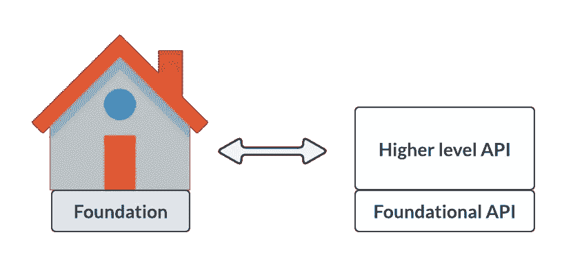

# 我在 Stitch Fix 学到的搭建平台

> 原文：<https://towardsdatascience.com/what-i-learned-building-platforms-at-stitch-fix-fc5e0ec72c86>

## 为数据科学家搭建平台的五个经验教训。

平台的蓝图。图片来自 [pixabay](https://pixabay.com/photos/blueprint-floor-plan-draft-drawing-354233/) 。*注:本帖原文出现在我的* [*子帖*](https://stefankrawczyk.substack.com/p/what-i-learned-building-platforms?r=17gs0j&s=w&utm_campaign=post&utm_medium=medium-web) *上。*

# 为什么要搭建平台？

想象一下。你是一个个体贡献者，在某个要求你写“代码”来完成工作的公司工作。我在这里试着广撒网，例如，你可以是 Stitch Fix 的全栈数据科学家，创建模型，然后插入业务中，或者你可以是一家初创公司的软件工程师，编写产品功能，基本上是任何你必须开发一些“软件”的人，通过你的工作，业务以某种方式向前发展。总的来说，由于事情相对简单，开始并向业务交付价值是很容易的。但是持续不断地交付价值并坚持下去是很难的。你可以很容易地达到极限速度，最终把所有的时间都花在保持之前的努力上，或者与它们的细节斗争，以扩大和做更多的事情，而不是推动你的业务向前发展。那么如何预防这种情况呢？在某种程度上，你需要开始构建抽象，以减少维护成本并提高开发速度，毕竟，这是所有大型科技公司的内部工作。这些抽象构建出的是一个**平台**，也就是你在其上构建的东西。现在，构建 ***良好的*** 平台并不是那么简单，尤其是随着企业的发展壮大。

我很幸运地在过去的六年里专注于“数据科学工程”，并学习为 Stitch Fix 的世界级数据科学团队构建 ***伟大的*** 平台。在此期间，我亲眼目睹了许多平台的成功和失败。现在，有很多关于已经建立了什么类型的平台(见任何大型科技公司的博客)以及如何考虑建立一个软件产品(例如建立一个 [MVP](https://www.jussipasanen.com/minimum-viable-product-build-a-slice-across-instead-of-one-layer-at-a-time/) )的资料，但是关于**如何**启动一个平台**和**建立一个平台的资料很少。在这篇文章中，我将把我关于如何构建平台的主要经验总结成五个教训。我希望这五堂课对任何试图构建平台的人都有用，尤其是在数据/ML 领域。

# 背景上下文

当我在 2016 年加入数据平台团队时，[杰夫·马格努松](https://www.linkedin.com/in/jmagnuss)刚刚写了[工程师不应该写 ETL](https://multithreaded.stitchfix.com/blog/2016/03/16/engineers-shouldnt-write-etl/) 。我很高兴能够为在[无手模型](https://multithreaded.stitchfix.com/blog/2019/03/11/FullStackDS-Generalists/)中工作的数据科学家构建功能。在当时，这是管理数据科学部门的一种前卫方式(如果你没有读过这两篇文章，那么它值得一读)。在高层次上，平台团队在没有产品经理的情况下运营，必须拿出平台能力来推动数据科学家前进，而数据科学家反过来推动 Stitch Fix 业务前进。听起来很俗气，杰夫·马格努松写道*“工程师应该把自己视为‘托尼·斯塔克的裁缝’，打造盔甲，防止数据科学家陷入陷阱，产生不可扩展或不可靠的解决方案。”*是真的，我们确实用我们制造的工具实现了梦想。现在，事情在实践中是如何进行的？一些人的想法和努力失败了，而另一些人获得了巨大的成功，这就是这篇文章的动机。

在我们继续之前，先快速了解一下术语。我将在一个松散的隐喻意义上使用术语“平台”——它是在之上构建的*任何东西。因此，如果你是一个提供 web 服务 API、库、UI 等的人。，其他人用来在上面构建，那么你正在构建一个平台。除非另有说明，否则我还自由地使用术语“API”来涵盖您平台上的所有 UX。*

# 经验教训

在这里，我将提出五个教训。虽然这些课程可以独立阅读，但我强烈建议按顺序阅读。

## 第一课:关注采用，而不是完整性

每个人都想为他们的利益相关者建立一个完美的平台，附带所有的附加功能。虽然这是善意的，但他们通常会陷入一个陷阱——在没有早期采用者的情况下构建太多。对于那些熟悉 MVP 和 PMF 这些术语的人来说，这基本上就是这节课的内容。

让我把这个放在上下文中。Stitch Fix 数据平台团队在没有产品经理的情况下运营。因此，每个平台团队都必须弄清楚要构建什么以及为谁构建。这里一个简单的解决方案可能是“只雇佣一个项目经理”，但是(1)很难找到技术人员(尤其是在 2016 年),( 2)这与我们想要的运营方式背道而驰。许多工程师不得不艰难地认识到，他们不能孤立地建造东西；离开一个季度，然后去“塔达”🎊我不保证会有人使用你的产品。事实上，那是让你被解雇的原因！

为什么会发生这种情况？好吧，如果你有一个实现各种用例的平台的愿景，那么从一开始就为所有用例构建是很诱人的。这是一个艰苦的过程，需要很长时间才能得到有用的东西。我的比喻是:如果你想建造一所房子(代表你的平台)，你通常从所有的基础开始，然后向上建造，添加墙壁，天花板，然后一旦外部完成，内部——房子在一切完成之前是不适合居住或使用的。如果你以这种方式建立一个平台，很容易离开很长一段时间而没有任何东西可以展示。更糟糕的是，你浪费了很多精力去建造一栋没人想要的房子，比如只有一间浴室，却发现你的最终用户每个房间都需要一间浴室。

帮助理解我的比喻的图像。左边是“垂直向上建筑”。右边的“一下子”。图片作者。

因此，相反，人们应该设法一次为一个房间“垂直”建造一个房间，这样它就可以居住，有人可以在整个“房子”完工之前使用它。是的，继续，试着想象一所房子，其中只有一个房间的结构存在，那个房间是功能性的——这就是我想要的图像。虽然在现实世界中我们可能不会建造这样的房子，但是我们可以**总是**建造这样的软件，所以请原谅我。也就是说，[模块化建筑](https://www.modular.org/what-is-modular-construction/)最近风靡一时，所以也许我**正在用这个比喻做某事……通过一次建造一个房间，当你填写房子的其余部分时，你会得到更快的确认/有时间旋转/纠正。现在，这并没有解决先建什么房间的问题，因此也没有解决先为谁建房间的问题。请记住，搭建平台也有人性化的一面。确定**谁**并获得他们的**承诺**可以说是决定你的项目成败的关键。这里有两种我认为很有效的模式:**

1.  采用现有的用户工具
2.  与团队和特定用例紧密合作

**采用现有的用户工具** Stitch Fix 雇佣的数据科学家是一批有能力的人。如果在平台的某些方面有差距，你可以肯定数据科学家自己填补了这个空白，并建立了一些东西。作为一个确定自己产品路线图的团队，我们在寻找构建和扩展的能力。继承自主开发的工具/框架/软件是非常有意义的。为什么？*采用*几乎是有保证的——平台团队只需要润色和概括。如果他们建了一个为他们工作的窝棚，那么进来做一次改造会给你一套非常具体的参数。这种方法的一个警告是，你需要看到一个比他们的解决方案目前提供的更大的愿景，例如，更多的功能，或支持更多的用户，否则你将做一个几乎没有好处的改造。

例如，有一个自行开发的工具，是其中一个团队为他们自己的特定业务环境开发的。这是一种配置驱动的方法，用于标准化他们团队的模型培训管道。他们构建它是因为他们需要它来解决一些非常具体的痛点。我们没有合作建造它，因为我们当时没有能力支持这样的努力(我们甚至对此表示怀疑)。一年后，突然有更多的数据科学团队听说了它，并想开始使用它。问题是它与原始团队的环境紧密相关，原始团队没有动力去支持其他使用它的团队。平台团队介入并拥有的完美问题！重要的是，我们可以看到一个更宏伟的愿景，以及它如何服务于更多的用例。请看[这篇文章](https://multithreaded.stitchfix.com/blog/2022/08/02/configuration-driven-ml-pipelines/)了解我们添加的结果和扩展。

我特别喜欢这种方法，因为:

1.  你没有花时间迭代自己来决定构建什么来让人们采用它 [1](https://stefankrawczyk.substack.com/p/what-i-learned-building-platforms#footnote-1) 。赢了。
2.  你让别人来证明它的价值。赢了。
3.  然后你就可以有很好的理由继承它并改进它。赢了。

注意:继承有时会带有政治色彩，尤其是当创建它的人不想放弃它的时候。如果有明确的平台责任界限，这不是一个难以下咽的药丸，但如果对创作者来说是一个惊喜，那么选项是让他们转移到平台，或者只是进行一次艰难的对话…然而，一般来说，这应该是对所有参与者的双赢:

*   对于开发工具的团队来说，这是一个胜利，因为他们现在不再需要维护工具了。
*   这对您来说是一个胜利，因为您可以接管该工具，并比其他方式更进一步地采用和增强功能。
*   这是企业的胜利，因为它没有在投机活动上浪费资源。

**与团队和特定用例紧密合作** 我记得与一位平台工程师的一次对话。他们回避反馈，即他们应该能够更快地交付一些东西，让人们得到它们。“不，那不可能，那要花两个月的时间”(或类似的话)。我同意，是的，这是一个挑战，但是如果你考虑得足够久，通常有很多方法可以让任何平台项目以一种可以显示增量价值的方式被分块**到**带来一个利益相关者。

展示增值很重要；这有助于您与您的目标利益相关者/用户保持一致。这也是降低项目风险的好方法。当构建平台时，你需要*减轻技术风险*,即证明“如何”将实际工作，以及*采用风险* k，即是否会有人实际使用我构建的东西。用我们造房子的比喻来说，这就是我所说的弄清楚如何在不完成整个房子的情况下建造一个可居住的房间。你想让你的涉众从架构图开始，到展示样本材料，再到构建一些对他们的用例最少起作用的东西。

实际上，构建交付增量价值的一种方法是做时间框原型，并根据结果做出去/不去的决定。在这里付出很小的代价，并学会尽早终止一个项目，要比在没有减轻成功的关键风险的情况下获得大量投资好得多。通过瞄准一个*特定的、狭窄的*用例来做到这一点，然后确定如何通过“水平地”扩展平台以支持更广泛的用例来扩大吸引力。例如，当我们开始构建我们捕获机器学习模型的能力，并且不需要数据科学家来部署模型时，我们与一个正在着手构建新计划的团队进行了非常密切的合作。你可以把他们视为“设计伙伴”。他们有一个狭窄的用例，他们想用它来跟踪构建了什么模型，然后有选择地批量部署他们的模型。这使我们能够将注意力集中在两个部分:保存他们的模型，并拥有一个批处理作业操作符，他们可以将该操作符插入到他们的离线工作流中进行模型预测。将它约束到一个有截止日期的团队中，给了我们一些明确的约束来增量交付。首先是保存模型的 API，然后是编排批量预测的作业。因为我们有一个用这些能力支持其他团队的愿景，所以我们知道不要过度关注这一个团队的工程设计。通过与他们的密切合作，我们确保了我们的早期采用，这有助于提供关于我们预期的 API 和批量预测功能的宝贵反馈。反过来，他们得到了一个支持和倾听他们的担忧的合作伙伴，并与他们保持一致以确保他们的成功。

作为一个敏锐的读者，你可能会认为这听起来像是敏捷项目管理应用于构建平台。我的回答是，你基本上是对的，但许多平台工程师可能没有这种框架或指导来看到这种联系，尤其是在产品经理会为你做这种事情的世界里。

## 第二课:你的用户并不都是平等的

作为工程师，我们热爱创造可能性。对我们来说，想要确保任何人都可以利用我们提供的平台做任何事情是非常容易的。这是为什么呢？好吧，我在这里是刻板印象，但我们通常希望平等，在提供支持和功能方面平等地对待我们为之构建的每一个用户。

这是一个错误。

两个事实:

*   你为之建立的用户会落在一个能力谱上(如果你愿意，可以称之为钟形曲线)。有普通用户，也有离群用户。离群用户是你最老练的用户。
*   您添加到平台中的特性对开发成本和维护的贡献并不相等。

根据我的经验，外部用户希望您的平台支持更复杂的功能/需求，因为他们希望您支持他们更复杂的需求。这通常意味着实现这样一个特性需要更高的开发成本和维护成本。所以你真的要问问自己，我是不是应该:
(1)完全为这个特性设计？

(2)然后实际花时间构建和维护它？

或者(3)推回去，告诉用户他们应该自己构建。

你可能会认为我所说的只是一个过度工程化的例子。虽然，是的，这确实有那种味道，但过度工程与解决方案是什么有更多的关系，而不是实际决定你是否应该支持平台中的某些功能。使用我们建造房子的比喻，你应该建造一些复杂的定制家庭自动化系统，因为有人想要声控灯，还是应该告诉用户自己想办法提供这种功能？

除非你想建立一个全新的平台并寻找客户，或者有令人信服的商业理由这样做，否则，作为一个平台建设者，你应该学会说**不**(当然是以一种好的方式)。以我的经验来看，这些特征最终往往与投机行为有关。我发现在决定是否应该支持之前，最好是等待，并确保这项工作首先被证明是有价值的。请记住，这些问题来自经验丰富的最终用户，因此他们很可能通过自己提供支持来解决问题。请注意，如果您采用这个策略，那么它可以融入到第 1 课中的“采用自主开发的工具”策略中。

## 第三课:抽象出系统的内部结构

随着时间的推移，随着您所在领域的技术提供商的成熟，在一个组织内构建的基础设施/工具越来越少。作为一个平台构建者，你总是会与一些第三方供应商整合，例如 AWS、GCP、MLOps 供应商等。这是非常诱人的，尤其是如果供应商解决了您想要解决的确切问题，直接向您正在构建平台的用户公开他们的 API，因为这是交付一些价值的快速方法。

向最终用户公开这样的 API 是一个很好的方法:

*   供应商锁定。
*   痛苦的迁徙。

为什么？你已经放弃了控制用户 API 的能力。

相反，提供你版本的 API[2](https://stefankrawczyk.substack.com/p/what-i-learned-building-platforms#footnote-2)。这应该采用封装该供应商 API 的轻量级包装的形式。现在很容易做得很差，把你的 API 和底层 API 结合起来，例如使用相同的措辞，相同的数据结构等等。

你的*设计目标*应该是确保你的 API *不会* *泄露*你正在使用的底层内容。这样，您保留了在不强迫用户迁移的情况下更改供应商的能力，因为您保留了在不要求用户更改代码的情况下进行迁移所需的自由度。这也是简化使用供应商 API 的体验的好方法，因为你可以通过代表用户做出共同的决定来减轻用户的认知负担，例如，事物如何命名、结构化或存储。

例如，我们在 Stitch Fix 的系统中集成了一个可观察性供应商。直接公开他们的 python 客户端 API 意味着，如果我们想要改变/迁移，将很难做到。相反，我们将他们的 API 包装在我们自己的客户端库中，确保使用内部术语和 API 数据结构。这样，如果我们将来需要，就可以很容易地替换掉该供应商。

请注意，如果您使用姐妹平台团队的 API，这也不是一种不合理的方法。一些要思考的反问，要不要掌握自己的命运？或者，与他们的目标和系统设计相结合？

## 第 4 课:体验用户的生命周期

如果你和产品经理一起工作，那么他们表面上应该知道并意识到你的用户的生命周期，在你构建平台时帮助指导你。由于我们在 Stitch Fix 没有产品经理，我们被迫自己做这件事，因此有了这一课。现在，即使你有产品经理，我猜他们仍然会感谢你承担一点这个负担。

随着时间的推移，您为最终用户提供的功能和体验会产生下游效应。虽然掩盖用户工作流的复杂性可能很容易，特别是如果它们延伸到您的平台之外，但这样做将不可避免地导致租户和社区问题(用我们的住房比喻来说)。

租户问题通常是小问题，比如同时使用水龙头会降低每个人的水压。这些问题只需要一些小的调整就可以解决/缓解。例如，你让启动参数化作业变得非常容易，人们用工作堵塞了你的集群，除此之外，你的云费用也在飙升。这里有什么快速解决办法？也许您可以确保作业始终标记有用户和 SLA，这样您就可以快速确定谁在利用您的所有云资源/使用它来根据优先级决定将任务路由到哪里。或者，只要确定你需要跟谁谈，就能干掉他们的工作。

“社区问题”是更大的问题。比如说你建了一个很牛逼的房子(平台)，可以支撑很多租户(用户)，但是它周围的街边停车位却微乎其微；你没有说明这一点。每当有人(即潜在用户)想要参观房子时，他们都很难停车，并且不得不走很长的路。如果不尽快修复，这些问题真的会损害您的平台。为了说明这一点，假设你专注于让用户工作流程的一个方面在你的平台上变得非常简单，但是你忽略了它是如何融入他们的大环境的。例如，您可能已经增加了某人需要完成以投入生产的工作总量，因为他们的开发工作不能直接翻译到您的生产平台系统中。在这种情况下，最初热情高涨的平台解决方案会变成恐惧，因为最终用户会一次又一次地碰到一个特殊的症结。当最终用户想出自己的工具来解决这个问题时，这种情况就出现了。

那么你应该怎么做呢？站在最终用户的立场上，从宏观的角度来看，你所提供的东西是如何适应他们需要完成的工作的。以下是一些缓解问题的方法:

*   做一个最终用户:实际使用你的平台，并在上面进行生产。
*   假设建模:画出用户工作流程图，然后考虑你所提供的任何平台特性的分支(适用于任何情况)。
*   引入最终用户:引入用户进行内部轮换——他们应该能够理解并向您和您的团队解释这一点(引入某人来帮助您的用户更好地发声)。
*   建立关系:与你的同事建立足够深的信任和关系，这样你就可以问一些直截了当的问题，比如“你讨厌你的工作流程的什么？”“如果有什么事情是你在生产 X 时不需要做的，那会是什么？”。有时候，你的用户只是被固定下来，接受他们不能改变世界的事实，而事实上他们可以通过给你反馈来改变世界。其他时候，他们没有足够的安全感来给你真正需要的反馈，所以你需要建立信任来实现这一点。

如果你做上述事情的时间足够长，你可以开始更容易地直觉到将要发生什么，从而确定你可能需要什么额外的功能，或者预期和计划的潜在问题。

## 第 5 课:两层 API 技巧

在这一课中，我提出了我在着手构建平台时的高层次思考框架。这基本上是我想出的帮助在 Stitch Fix 交付成功平台的剧本。我承认，由于严格的要求/您的平台的性质，可能并不总是有可能实现这种方法。但是当你构建更高层次的抽象时，你应该能够应用这种思维方式。否则，当你读这一课时，你会希望看到与前四课的联系。但首先，要有动力。

**动机** (1)还记得你平台上要求复杂特性的老练用户吗？既然你说“*不，你自己去建吧*”，他们很可能会去做。但是，如果他们成功了，你会想要继承他们的代码，对吗？如果可以的话，你不想让这个过程变得更简单吗？

(2)当提供平台功能时，很容易编写非常耦合的、不可概括的代码，即很难拆分和扩展/重用。如果您刚刚起步并需要获得一些东西，这并不是一件坏事，但是当您想要扩展您的平台时，这就成了一个问题。根据我的经验，特别是如果你没有时间做“技术债务”项目，这种耦合的代码很容易滚雪球，从而严重影响你的团队的工作交付。

(3)在第三课中，重点是不要泄露供应商 API 细节。我认为这是一个很好的方法，实际上你创建了两层 API，但是它非常关注供应商 API 封装的微观问题。我们如何进一步扩展这种想法，并为我们的整个平台提供一些框架？

**两层 API** 为了帮助维护和发展平台，您应该考虑构建两层 API:

1.  底层允许一个人构建“任何东西”,但是是以一种受限的方式。
2.  第二个更高层次提供了一种认知上不太费力、固执己见的做事方式。

用我们这里的房屋建筑类比，下层代表房子的地基、管道和电气；它限制了房子的形状和表面积。更高层的 API 对应的是一个房间是什么；它的功能和布局，例如，对于你的用户来说，你已经放置了冰箱、炉子和水槽，形成了一个[厨房三角形](https://en.wikipedia.org/wiki/Kitchen_work_triangle)，因为对于任何做饭的人来说，这都是一个很好的设置。如果有人想要更复杂的房间，我们可以轻松拆除墙壁，找到水管和电线，这样他们就可以随心所欲地重新布置房间。

让我们更具体地展开这两层。

与房屋隐喻相关的两层 API。图片作者。

**这个底层 API 层是什么？** 这个“低级 API”的目的是你可以表达任何你想让你的平台做的事情，也就是说，这个 API 捕获基本级别的原语。也就是说，这是你的基本能力层，使用它意味着你可以控制所有的细节。

这一层的目标不是向您的最终用户公开它。相反，目标是让你给自己定义一个清晰的基础(双关语，我们的房屋建筑比喻)，以此为基础进行建设。因此，你应该把自己视为这一层的主要目标。例如，这一层可以具有用于以各种格式读写数据的 API，在哪里使用它需要决定文件名、位置、哪种格式使用哪种函数等等。

**这第二个 API 层是什么？** 这个“高级 API”的目的是为普通用户提供一个简单的体验，这个体验完全建立在你的低级 API 之上。您实际上是在这个 API 中定义了一个约定来简化用户的平台体验，因为您已经为他们做出了一些较低级别的 API 决策。例如，基于较低层的示例，该层可以公开用于保存机器学习模型对象的简单 API。这是一个更简单的 API，因为您已经决定了文件名约定、位置、格式等。来保存模型，这样您的平台最终用户就不必这样做了。

这一层的目标是成为平台最终用户的主要 API 接口。理想情况下，他们可以用它完成所有需要的事情。但是如果他们需要做一些更复杂的事情，而这个更高级别的 API 中没有，他们可以下降到你提供的更低级别的 API 来构建他们自己需要的东西。

**为什么两层应该起作用** 强迫自己思考两层你:

1.  让你和你的团队更难将关注点结合在一起。因为，从设计上来说，你是在强迫自己决定如何将你的平台上一个更有主见的能力(更高级别的 API)分解成基本级别的原语(更低级别的 API)。
2.  因为您定义了基础层，所以您可以更容易地限制平台的形成方式。这有助于为您支持的更复杂的用户提供支持，他们可以剥离固执己见的层并做更复杂的事情，而无需您明确支持。通过以这种方式支持更复杂的用户，您有时间考虑是否应该以一流的方式支持他们更复杂的用例(参见第 1 课的“采用现有用户工具”部分)。

现在你们中的一些人可能会反对支持两个 API 的想法，因为这听起来像是 API 开发、维护和版本控制的一大堆工作。对此我说，是的，但是如果你遵循良好的文档和 API 版本实践，你无论如何都要付出代价。无论是你团队的内部还是外部，都不应该有太大的改变，除了你沟通的方式和地点。如果您采用构建单一 API 层的替代方法，您的初始成本可能会更低，但未来的维护和开发成本将会高得多；你应该预料到你的平台需要随着时间而改变。例如，与安全相关的更新、主要库版本、新功能等。我在这里的论点是，使用两个 API 层比使用一个 API 层更容易做到这一点。

**两个简单的例子** 为了帮助阐明这一点，我们来看两个两层 API 思想的例子。

**示例 1** 例如，当我们引入我们的[基于配置的方法](https://multithreaded.stitchfix.com/blog/2022/08/02/configuration-driven-ml-pipelines/)来训练模型时，它是建立在我们的[模型包络方法](https://multithreaded.stitchfix.com/blog/2022/07/14/deployment-for-free/)之上的，用于捕获模型，然后启用部署。因此，如果有人不想使用我们的配置方法来创建模型，他们仍然可以通过使用 API 来利用模型信封的好处。

例 2
在 Stitch Fix 上，我们让构建 [FastAPI](https://fastapi.tiangolo.com/) web 服务变得很容易，但是用户实际上并不需要知道或者关心他们正在使用 FastAPI。这是因为他们使用了更高级的自以为是的 API，使他们能够专注于编写 python 函数，然后将这些函数转化为运行在 web 服务器上的 web 服务端点；他们不需要通过自己编写代码来配置 FastAPI web 服务，因为已经为他们处理好了。该功能构建在 FastAPI 之上，作为基础层。如果用户想要比上层固执己见层所能提供的更多的功能，可以直接调用下层的 FastAPI API。

# 摘要

感谢阅读！以防你一直在偷东西，这是我想让你带回家的东西。要构建平台:

1.  首先为特定的垂直/用例构建，并交付增量价值，在这种情况下，您要么继承一些有用的东西，要么瞄准一个特定的团队，该团队将在您的工作准备就绪时采用您的工作。
2.  不要平等地为每个用户构建。让老练的用户自己保护自己，直到证明你应该为他们投入时间。
3.  如果可能的话，不要泄露底层供应商/实现细节。为底层 API 提供您自己的瘦包装器，以确保当您必须对平台进行更改时，您有更多的选项可以控制。
4.  活出用户的生命周期。记住，你提供并塑造了用户使用你平台的体验，所以不要忘记宏观背景和你的 UX 的含义；喝你自己的香槟/吃你自己的狗粮，这样你就能确保你能预见/理解你所提供的东西的共鸣影响。
5.  考虑提供两层 API 来保持平台开发的灵活性:
    **(i)** 考虑一个有界的基础 API 层。也就是说，你希望你的平台提供什么样的基本级别的原语/功能，从而为你自己在*之上构建什么样的基础。* **(二)**想想一个自以为是的更高级别的 API 层。对于普通用户来说，这一层应该比基础 API 层简单得多。为了处理更复杂的情况，对于更高级的用户来说，仍然有可能使用你的低级基础 API。

如果你不同意，有问题或意见，我很乐意听到他们在下面。

# 关闭

我很高兴能与你分享我在 Stitch Fix 工作期间获得的见解(希望它们有用！).然而，自从我离开后，我不仅仅是在编辑这篇博客。我一直在盘算着自己搭建一个平台。敬请期待！

此外，特别感谢 Elijah、Chip 和 Indy，他们对本文的一些草稿给出了宝贵的反馈；错误和遗漏都是我的。

# 出发前:你可能感兴趣的链接

📣跟我来:

*   [LinkedIn](https://www.linkedin.com/in/skrawczyk/)
*   [推特](https://twitter.com/stefkrawczyk)

⭐结账[github—stitch fix/Hamilton](https://github.com/DAGWorks-Inc/hamilton):

*   用于定义数据流的可扩展通用微框架。你可以用它来构建数据框架、数字矩阵、python 对象、ML 模型等等

🤓阅读一些博客:

*   [配置驱动的机器学习管道|缝合修复技术—多线程](https://multithreaded.stitchfix.com/blog/2022/08/02/configuration-driven-ml-pipelines/)
*   [免费部署 Stitch Fix 的数据科学家的机器学习平台](https://multithreaded.stitchfix.com/blog/2022/07/14/deployment-for-free/)
*   [函数和 Dag:Hamilton，用于熊猫数据帧生成的通用微框架](/functions-dags-introducing-hamilton-a-microframework-for-dataframe-generation-more-8e34b84efc1d)
*   [非常有用的平台团队| Stitch Fix 技术——多线程](https://multithreaded.stitchfix.com/blog/2021/02/09/aggressively-helpful-platform-teams/)(不是我写的)