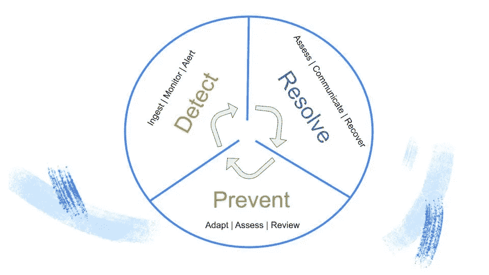
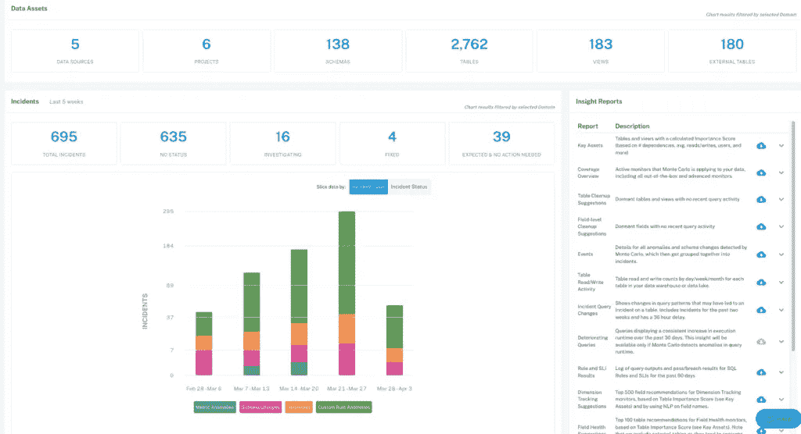

# 什么是数据可靠性工程师——你需要吗？

> 原文：<https://towardsdatascience.com/what-is-a-data-reliability-engineer-and-do-you-need-one-4db24d7505a7>

## 随着数据团队继续专业化，一个新的角色出现了:数据可靠性工程师。

数据可靠性工程师确保高质量的数据在整个组织中随时可用，并且始终值得信赖。图片由 Shutterstock.com[的 Tamas Gabor 提供](http://www.shutterstock.com)

随着软件系统在 21 世纪后期变得越来越复杂，合并开发和运营(DevOps)是显而易见的。

一半是软件工程师，一半是操作管理员，DevOps professional 的任务是在构建高性能系统和使它们安全、可伸缩和可访问之间架起一座桥梁。这不是一件容易的工作，但总得有人去做。

随着 DevOps 变得越来越流行和广泛，这个曾经新生的领域开始再次专门化。很快，站点可靠性工程师、基础设施工程师和安全工程师出现了，为软件开发带来了额外的专业知识层，允许公司快速移动，打破(许多)东西，并仍然构建更可靠和可伸缩的应用程序。

数据和分析正处于类似的十字路口:曾经的新兴职业，数据分析，以及最近的**数据工程**，现在是大多数认真使用数据的技术组织的重要组成部分。

“数据十年”让位于另一个专业领域:**分析工程师**。一部分是分析师，一部分是数据工程师，分析工程师负责将流程、框架和技术与业务利益相关者的数据需求保持一致。

这些趋势表明了一个在技术专业人士中普遍认可的真理:**当一个领域的子集开始消耗如此多的时间、精力和资源时，组织和个人进行专业化就变得更加高效和有效。**

那么，预计下一个主要的数据专业化是什么？**数据可靠性工程师**。以下是你的团队投资一个项目的原因和是否有意义。

让我们开始吧。

# 什么是数据可靠性工程师？

在过去几年中，随着雪花、红移和数据块等云数据仓库和湖泊的兴起，数据管道变得越来越分散和复杂，公司吸收的运营数据和第三方数据比以往任何时候都多。随着越来越多的利益相关者在数据的整个生命周期中与数据进行交互，确保高质量的数据已经成为数据团队的首要基本需求。

尽管如此，数据可靠性是更容易渴望比实现。毕竟，数据可能因为数百万个原因而损坏，从操作问题到不可预见的代码更改。Gartner 指出，仅在 2021 年，数据质量差的成本就高达每年 1290 万美元。这还没有考虑到机会成本的损失。

在过去几年与数百个团队交谈后，我们发现数据工程师和数据科学家至少花了 **30%的时间**处理数据质量问题。

这种对信任的高度需求导致了跨数据团队的数据工程子类的出现，称为**数据可靠性工程**。

数据可靠性工程师负责帮助组织在从接收到最终产品的整个数据生命周期中提供高数据可用性和质量:仪表板、机器学习模型和生产数据集。

因此，数据可靠性工程师通常会应用 DevOps 和现场可靠性工程的最佳实践，例如持续监控、设置**SLA**、事件管理以及对数据系统的**可观察性**。

# 数据可靠性工程师是做什么的？

这个新兴领域仍处于早期阶段，但像 [DoorDash](https://www.linkedin.com/posts/activity-6843314325373943808-f7I6?utm_source=linkedin_share&utm_medium=member_desktop_web) 、[迪士尼流媒体服务](https://lensa.com/data-reliability-engineer-jobs/santa-monica/jd/160fbbba8fc84eba91afcd3f91c930a0)和 [Equifax](https://careers.equifax.com/es/trabajos/job/j00125626-senior-data-reliability-engineer/) 这样的公司已经开始雇佣数据可靠性工程师。

数据可靠性工程师最重要的工作是确保高质量的数据在整个组织中随时可用，并且在任何时候都值得信赖。

当损坏的数据管道出现时(因为它们总会在某一点出现)，数据可靠性工程师应该是第一个发现数据质量问题的人，尽管情况并不总是如此。很多时候，坏数据首先是在仪表板和报告的下游被发现的，而不是在管道中——甚至在此之前。由于数据很少处于理想的、完全可靠的状态，数据可靠性工程师更经常的任务是将工具(如数据可观察性平台和测试)和流程(如 CI/CD)放在适当的位置，以确保当问题发生时，它们得到快速解决，并将影响传递给需要知道的人。

就像站点可靠性工程师是软件工程团队的自然延伸一样，数据可靠性工程师是数据和分析团队的延伸。

许多数据可靠性工程师在数据工程、数据科学甚至数据分析方面都有很强的背景。该角色需要对复杂的数据系统、计算机编程语言和框架(如 dbt、Airflow、Java、Python 和 SQL)有深刻的理解。

数据可靠性工程师还应该有使用流行云系统的经验，如 [AWS](https://aws.amazon.com/) 、 [GCP](https://cloud.google.com/) 、雪花或 Databricks，并了解**扩展数据平台**的行业最佳实践。

# 数据可靠性工程师职位描述示例

有三种常见的数据可靠性工程职称，表示不同级别的资历。

通常，**数据可靠性工程师**拥有 3 年以上的数据工程经验，并且对整个数据生态系统有着大致的了解。

高级数据可靠性工程师通常有 5-7 年以上的经验，对数据工程最佳实践有丰富的知识，可以负责从构思到完成的任务。**高级数据可靠性工程师**通常负责围绕分布式数据团队和相关利益相关方的构建系统、流程和工作流制定策略。

**数据可靠性工程经理**往往拥有超过十年的经验，并且担任数据工程师至少 3-5 年以上。经理负责增加、扩展和雇佣数据可靠性工程时间，同时保持设计和构建更安全和可扩展的数据系统的高标准。

(当然，对这些任期建议要有所保留。我们曾与[伟大的数据工程领导者](/5-non-obvious-ways-to-make-data-engineers-love-working-for-you-1a2d28f5b502)共事过，他们在相关领域的经验要少得多。

虽然数据可靠性工程师的主要职责是确保您的组织拥有高质量的数据并最大限度地减少数据停机时间，但他们还有其他职责。这里有三个**数据可靠性工程师职位描述**我们发现它们有效地描述了这个职位。

在拥有 6000 名员工的食品配送公司 [DoorDash](https://www.doordash.com/) ，一名数据可靠性工程师负责:

*   开发和实施新技术，以确保不断提高数据可靠性和数据可观察性。
*   定义决定数据质量的业务规则，协助编写验证业务规则的测试，并执行严格的测试以确保数据质量。
*   与应用程序、数据平台和数据工程团队紧密合作，重新配置数据接收管道，使其更加可靠并受到持续监控。
*   与跨职能团队一起管理数据事件并推动无过失事后分析。

对于拥有 2，600 名员工的娱乐巨头迪士尼流媒体服务公司，一名数据可靠性工程经理负责:

*   领导一个专注于解决端到端可靠性改进的数据可靠性工程师团队。
*   拥有事故管理流程，以确保事故得到快速解决，并执行和理解根本原因分析，以防止重复发生。
*   帮助团队向用户提供出色的服务，使公司更加以数据为导向。

对于全球上市信用风险评估公司 Equifax，高级数据可靠性工程师负责:

*   监控数据存储和数据分析系统的性能和可靠性，提出改进性能和可靠性的建议。
*   维护数据管道和其他大数据处理系统的基础设施可靠性。
*   主要致力于维护数据库、数据管道、部署和这些系统的可用性。

# 顶级数据可靠性工程师面试问题

如今，大多数工程面试都是通过视频会议进行的。图片由 Shutterstock.com[*菲兹克斯*](https://www.shutterstock.com/g/fizkes) *提供。*

雇佣一名数据可靠性工程师并不是一件容易的事情。尤其是如果这是你第一次招聘和/或申请这个职位，你可能不知道该问什么问题或期望回答什么问题。

以下是数据可靠性工程师在面试该职位时经常要回答的一些常见问题:

*   你最喜欢使用哪种编程语言？
*   数据可靠性工程师最重要的职责是什么？
*   你如何与组织中的跨职能团队沟通？
*   服务水平协议(SLA)和服务水平目标(SLO)之间有什么区别？
*   组织如何提高可观察性？
*   你能给我举个例子，说明你什么时候发现了一个以前没有发现的数据质量问题，以及你是如何传达这个影响的吗？
*   您将如何建立事故管理工作流程？
*   您如何使用您的工具来沟通和衡量数据质量的影响？

作为面试过程的一部分，也要考虑一些 leet 编码或应用程序设计的问题。你甚至可能会被要求在一个虚拟的环境中工作，这个环境包含了你未来雇主的数据堆栈中的工具，比如 [Airflow](https://airflow.apache.org/) 或者 [dbt](https://www.getdbt.com/) 。

# 您如何应用数据可靠性生命周期？

如前所述，数据可靠性工程师负责管理有助于提高数据平台可扩展性和可操作性的流程、技术和工作流。

事实上，许多数据团队正在从 DevOps 生命周期转向数据，并利用一个名为数据可靠性生命周期的适应流程来管理可靠数据的可用性。

**数据可靠性生命周期**是一种全组织范围的方法，通过将 DevOps 的最佳实践应用于数据管道，持续主动地改善数据健康状况并消除数据质量问题。

数据可靠性生命周期由三个阶段组成:检测、解决和预防。图片由巴尔·摩西提供。

通过将该框架应用于数据管道，数据可靠性工程师可以率先发现数据质量问题，充分了解影响，确切了解管道中的数据中断位置，采取行动，并收集经验教训以防止未来出现类似问题。

这种关键方法有三个主要阶段:

**检测**:数据可靠性工程师依靠自动监控和警报来发现新鲜度、容量、模式、沿袭和分发数据问题。借助自动化警报，当数据事件发生时，您的团队将能够更快地行动和高效地工作。

**解决**:在此步骤中，数据可靠性工程师应与下游利益相关方沟通，告知数据存在潜在问题，他们正在努力解决该问题。理想情况下，在 Slack、微软团队或者甚至是一个专门的网页中可能会有一个中心频道，用户可以跟随它来获取更新。

**预防:**在这一阶段，数据可靠性工程师处理他们的学习成果，并依靠来自其数据管道的历史数据，将它们转化为可操作的步骤以向前推进。从本质上讲，数据可靠性工程师给出了发生的变化的适当背景，以及它们是否是有意的。

例如，一家电子商务公司可能会在节日期间看到销售额的增长；因此，数据仓库中包含每日销售额的表每 12 小时更新一次。但与此同时，意外的模式更改确实会发生，当工程师将更新推送到生产环境时，原本是 *daily_sales* 的表意外地变成了 *daily_sale* 的表应该被标记出来。

随着时间的推移，随着您的[数据可靠性](/what-is-data-reliability-66ec88578950)团队的成长和数据堆栈的发展，您的测试和监控应该会自动调整和更新，以满足业务需求并最终减少中断的数据管道。像数据观察平台这样的机器学习工具会有所帮助。

# 数据可靠性工程师如何衡量成功？

在我们的 SRE 同行中流传着这样一句话:“如果你不能衡量它，你就不能管理它。”而且，随着数据系统的复杂性不断发展，对组织的重要性不断增加，我们可以将同样的说法应用于数据可靠性工程师。

众所周知，企业始终拥有可靠的数据是多么重要。为了衡量您的数据可靠性工程工作的成功，我们建议您衡量以下 KPI:数据信任、数据采用，以及针对数据质量问题的**检测时间(TTD)、**和**解决时间(TTR)** 。

# 数据信任和采用

对于数据可靠性工程师来说，最好的迹象之一是看到数据采用的全面增加。如果利益相关者使用数据进行决策，他们很可能会信任他们随时可以获得的数据的质量。

*数据可靠性工程师需要了解关键数据计划的运营分析，如数据治理、数据质量、性能和成本。图片由蒙特卡洛提供。*

尽早与利益相关方保持一致并就衡量整个公司数据质量的基准指标达成一致至关重要，因为这通常是主观的衡量，并且会因使用数据的团队而异。

一旦您定义了跨不同部门的高质量数据，您将更好地理解如何测量它，并可以定期与利益相关者进行核对，以与您团队的数据质量计划保持一致。过去，我见过数据团队向业务利益相关方发送季度调查，要求他们对可用数据的质量进行评级，或者利用运营分析平台来监控使用了哪些数据集、哪些团队使用了最多的数据，以及数据存储是否经过优化以最佳管理平台成本。一些数据工程师甚至使用数据质量测试的数量、最“活跃”的数据质量监视器，以及其他关注可观察性的统计数据，这些统计数据告知治理和数据质量过程是否实际工作。

# 数据停机时间

对于数据可靠性工程师来说，数据信任是另一个关键的“KPI ”,但实际上如何衡量呢？对于任何努力实现数据驱动的公司来说，测量数据停机时间是必不可少的。

**数据停机时间**是指数据损坏、丢失或出现其他错误的时间段，消耗了数据工程师 40%以上的时间，从许多方面来说，这是对数据可靠性工程师影响的最准确的衡量。

数据停机时间由三部分组成:

*   **数据事件的数量(N)** —鉴于您依赖于团队“外部”的数据源，这一点总是不在您的控制之下；然而，它无疑是数据正常运行时间的驱动因素。数据事件是指数据产品(例如，查看者仪表板)不准确的情况，这可能是由各种原因造成的。
*   **检测时间(TTD)** —当事故发生时，您的团队能多快意识到？如果没有适当的检测方法，不良数据结果中的隐性错误会导致贵公司和客户做出代价高昂的决策。
*   **解决时间(TTR)** —当事故发生时，您的团队解决问题的速度有多快？理想情况下，这个数字应该尽可能的低，并且沿袭的自动化工具使得追踪上游和下游的依赖关系更加容易。

为了衡量数据停机时间，我们推荐以下 KPI:

**数据停机时间=数据事故数量**

**X**

**(检测时间+解析时间)**

通过测量数据停机时间，您的团队可以确定数据的可靠性，看看他们是否可以将数据用于分析、ML 和其他生产用例，或者数据是否需要进一步处理和清理。

# 数据服务级别协议

通过制定数据质量服务水平协议(SLA ),数据可靠性工程师可以更好地定义(最重要的是，衡量)他们为企业其他部门提供的服务水平。

SLA 将有助于数据可靠性工程师与组织的其他部门就数据中最重要的内容达成一致，并有助于对传入的请求进行优先级排序。它们还应该包括服务级别指标(sli)和商定的服务级别目标(SLO)。

以 [Red Ventures](https://www.montecarlodata.com/blog-one-sla-at-a-time-our-data-quality-journey-at-red-digital/) 为例——他们的子公司之一 Red Digital 依靠人工智能驱动的数字营销、顶级分析和来自其内容网络的数据来帮助他们的客户吸引和获得最有价值的客户。因此，广告公司需要及时准确的数据，以免影响收入。

Red Ventures 的高级数据科学家 Brandon Beidel 每周与每个业务团队会面，讨论团队如何使用数据以及数据质量如何影响他们的工作。

Beidel 发现，最好用简单的商业术语来组织对话，并关注数据的“谁、什么、哪里、何时、为什么和如何”。

他发现自己创建的以下模板在与业务利益相关方进行 SLA 对话时很有帮助。

以上是一个数据 SLA 模板，由 Red Ventures 的 Brandon Beidel 创建并经其许可使用。

为数据 SLA 准备一个简单的结构允许他的团队在满足不同团队对数据的需求方面不断发展，而不会被请求淹没。

# 数据可靠性工程的未来是什么样的？

LinkedIn 今年早些时候报道称，网站可靠性工程师是过去五年中增长最快的职位之一；同样，[商业内幕](https://www.businessinsider.com/10-jobs-that-will-be-growing-in-2022-have-openings-2021-12)报道称，数据科学家是 2022 年第二受欢迎的工作。显然，对洞察力和可靠性的需求从未如此之高。

数据工程师和分析师越来越多地承担起确保数据系统可靠性和质量的任务。随着堆栈变得越来越复杂，数据需求增加，公司将开始采用新的(经过战斗考验的)技术、流程和文化来跟上步伐。

数据可靠性工程师会跟进吗？只有时间能证明一切。

但是我们知道我们在哪里下注。

***有兴趣了解更多关于数据可靠性工程的知识吗？伸出手去*** [***格伦***](https://www.linkedin.com/in/glencwillis)*[***利奥***](https://www.linkedin.com/in/lgavish) ***，其余的*** [***蒙特卡洛团队***](https://www.montecarlodata.com/request-a-demo/) ***了解更多信息。****

*本文由[格伦·威利斯](https://www.linkedin.com/in/glencwillis/)合著。*