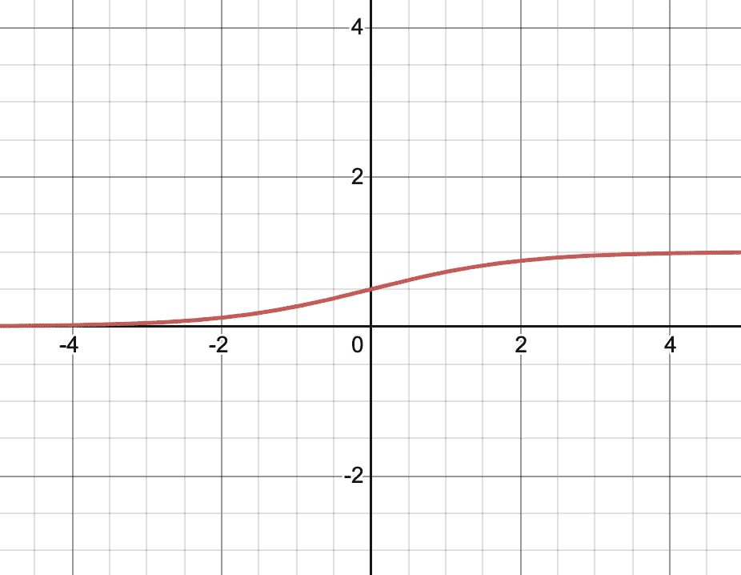
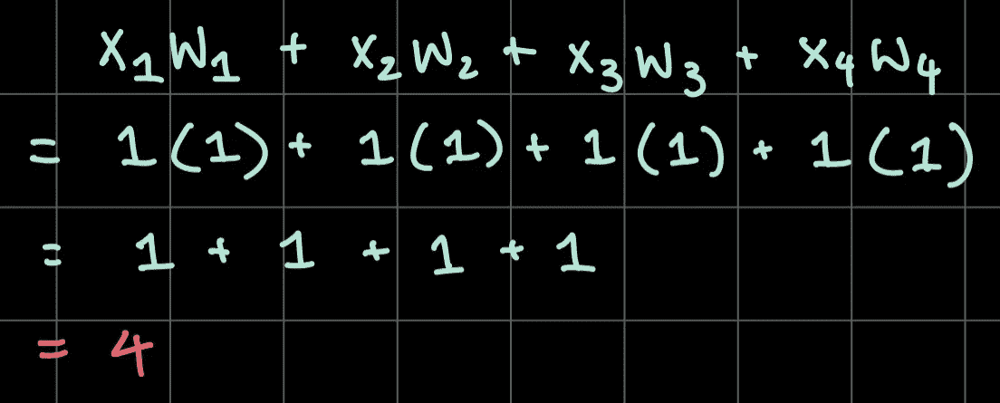
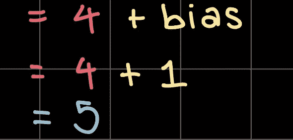
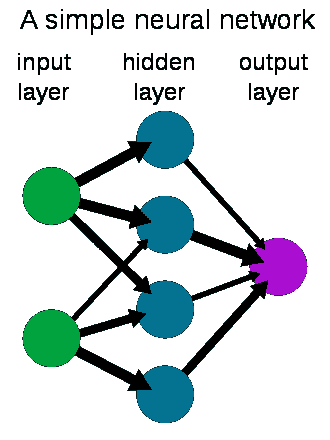

# 什么是 MLP，你为什么要关心？

> 原文：<https://towardsdatascience.com/what-is-an-mlp-and-why-should-you-care-bfa06741a183>

## 检查基本神经网络算法的内部工作方式

阿诺·弗朗西斯卡在 [Unsplash](https://unsplash.com/s/photos/coding?utm_source=unsplash&utm_medium=referral&utm_content=creditCopyText) 上的照片

想象一下:你正坐在办公桌前，将你的数字文件分类到文件夹中……再一次。一点一点，你把它们放入桌面上不同的文件夹，突然两个小时过去了。对我们大多数人来说，这可能很有关系，但不一定是这样。如果有一个电脑程序可以帮你整理这些文件会怎么样？几乎可以独立思考？并且有完美的准确性？遇见…请击鼓…神经网络！🎉

神经网络是一种可以确定数据集模式的计算机程序，通过这种方式，可以训练它以比普通计算机程序更快的速度完成某些任务。它通过观察你提供给它的成千上万个不同的例子来学习预测某个数据的结果。

MLP 或多层感知器是一种由许多不同的互连感知器或数学方程组成的神经网络。每个感知器都与其他感知器相连，它们之间的连接有强度或权重，会影响神经网络的输出。你可能听说过 MLPs 以前作为前馈人工神经网络。

# 神经网络🧠

神经网络是一种人工智能，简称 AI。人工智能现在就在你的周围——在你的亚马逊 Alexa 设备中，在 Waymo 的自动驾驶汽车中，在交通灯中，在网上购物推荐中，在药物发现中，在面部识别中，在 Roomba 吸尘器中，等等。神经网络使用一系列数学算法来识别一组数据中的潜在模式，并使用这些模式来预测新数据的结果。人工神经网络试图模仿人脑的运作方式。神经网络由 ***神经元—*** 组成，每个神经元都是一个简单的等式，它接受输入，将这些输入乘以一组权重，然后将输出传递给下一个神经元。现在，这可能听起来像一堆胡言乱语，但我会进一步解释这些概念。

# 神经元？重量？这是什么魔法？🧙‍♂️

你可能想知道所有这些花哨的单词到底是什么。相信我，我也有同感！首先，理解人类大脑如何工作的基础很重要，因为这是人工智能程序员建模他们的神经网络的目的。人类大脑由大约 860 亿个 ***神经元*** 组成，当面对不同的刺激时，神经元之间会发出电⚡️。大脑的不同部分负责不同的事情，如情绪、推理和记忆。所有这些部分都由神经元组成。

信用:[昆生](https://www.health.qld.gov.au/abios/asp/brain)

一个人工神经网络试图复制人脑的工作方式，尽管不是完全相同的方式。由于人脑如此复杂，程序员不得不大幅简化思维过程，将其归结为一组数学方程，数据通过这些方程产生输出。

# MLPs

MLPs 是人工神经网络的最基本形式。他们使用一系列的 ***感知器*** ，或者带有输入、输出和权重的方程，将一系列的输入变成 0 到 1 之间的单一输出。该输出然后被馈送到另一层感知器，并且该过程继续，直到它到达单个输出(或一组输出，取决于 MLP 的功能)。MLP 至少有三个图层-输入图层、至少一个隐藏图层和输出图层。隐藏层使您更容易区分无法线性分类的数据，例如，如下所示:

信用:塔拉普罗尔

划分蓝色和红色数据点的线不会是线性的，它们必须是弯曲的，以便最好地对数据进行分类。这是 MLP 非常适合的数据集类型。

信用:塔拉普罗尔

MLP 最重要的部分是重量。神经网络的每个输入都经过“层”，其中输入乘以不同的**权重**(用字母 W 表示)。权重表示两条数据之间的联系强度。

我喜欢把重量想象成一个家庭。在家谱上，你的兄弟比你的堂兄弟更接近你。你的母亲在树上比你的远房表亲离你更近。家谱上这些“相关度”的数量对应于感知器的权重——较高的权重表示兄弟姐妹，较低的权重表示类似于第三代表亲的东西。权重对应于连接的强度。

下图显示了这在神经网络中的工作原理:

信用:塔拉普罗尔

权重真正决定了神经网络的输出是什么，因为它们提供了数据点和想法之间的每个连接的强度。这里有另一个类比:MLP 的重量就像绳子，一些绳子比另一些更结实。如果重量很轻，绳子可能是一根极细的细线。但是如果重量真的很大，绳子可能有 3 英尺粗！

上图中还有一个你可能已经注意到的重要因素，那就是**偏差**。偏差仅仅是带有权重的等式的最终结果的偏移。根据具体情况，有时您需要这个偏移量来获得正确的输出。例如，如果偏差为 1，则每个输入的最终输出及其权重将增加 1 以中和输出。

回到上一张图片，如果您的输入全部为 1，权重全部为 1，偏差为 1，您的网络将如下所示。

信用:塔拉普罗尔

最后，我们需要了解每个神经元的输出是如何计算的。

首先，神经元计算输入的加权和，并在最后加上偏差。

信用:塔拉普罗尔

例如，如果输入是:

信用:塔拉普罗尔

权重为:

信用:塔拉普罗尔

然后像这样计算加权和，将每个输入乘以其各自的权重，然后将所有的乘积相加。

信用:塔拉普罗尔

然后我们把偏差加到加权和上…

信用:塔拉普罗尔

…最后，该值被输入激活函数，然后准备输出。激活函数只是一个数学方程，它将输入标准化，将其转换为 0 到 1 之间的值，以便计算机读取。您可以使用 sigmoid 函数、ReLU 函数或 Tanh 函数。通常，sigmoid 函数是最佳选择，因为它提供了零和一之间的平滑过渡以及感知器输出之间的更多可变性。

乙状结肠函数。信用:塔拉普罗尔

如果你对其他类型的激活功能感兴趣，可以随意查找或者[阅读这篇文章](https://machinelearningmastery.com/choose-an-activation-function-for-deep-learning/)。

回到我们之前的例子，看起来像这样:

每个输入(为了简单起见，让我们把它们都设为 1)将乘以各自的权重，在本例中为 1。

信用:塔拉普罗尔

然后，加权输入被加在一起以产生加权和。

信用:塔拉普罗尔

然后我们把偏差加到加权和上…

信用:塔拉普罗尔

…并计算最终产品。

一旦你把它传递给激活函数，你会得到一个介于 0 和 1 之间的数字，这取决于你使用哪个函数。我通过 sigmoid 函数传递数字 5，得到数字 0.993307149076——这个数字然后四舍五入到两位小数，得到 0.99。

这个介于 0 和 1 之间的数字就是神经元的“亮度”——越接近 0 越暗，越接近 1 越亮。这个“亮度”表示神经元的强度。

如果你对这些概念有困难(我知道这很难理解)，我推荐你看一下这个 Youtube 视频！

这就是每个单个神经元(也称为感知器)的工作方式——它是如何与整个网络联系起来的？

# MLPs——一个复杂的感知器系统

神经网络可以像这样简单:

鸣谢:Wiso，公共领域，通过[维基共享资源](https://commons.wikimedia.org/wiki/File:Neural_network_example.svg)

或者像这样复杂:

Zufzzi，公共领域，通过[维基共享](https://commons.wikimedia.org/wiki/File:Neural_network_bottleneck_achitecture2.svg)

这完全取决于你在网络中使用了多少这样的神经元或感知器。MLP 的主要思想是感知器的输出成为下一层感知器的输入之一。通过这样做，输出的可能性被缩小，直到输出的选择是最小的和简洁的。

# 训练 MLP

当然，神经网络第一次不会完美地工作。我们从随机权重开始，很明显这不是很好。所以我们必须用一系列的练习输入来“训练”网络，这样它就可以调整它的权重以达到最佳的准确度。为此，我们用它应该给出的输出来标记一大组 ***训练数据*** 。(这被称为监督学习——也有无监督学习，没有标签，这是一个完全不同的话题。)我们通过我们的 MLP 运行这些训练数据，如果答案是错误的，就调整权重和偏差。这个过程一遍又一遍地重复，直到 MLP 能够正确地分类所有的训练数据。在这之后，我们运行一些新的数据，叫做 ***测试数据*** ，通过它从未见过的神经网络。

把这想象成一次数学考试。在考前的学习期间，你的老师会给你很多练习题。你学会掌握这些问题，并很快知道如何解决所有这些问题。当你进行期末考试时，你会看到一些你从未见过的新问题，你会尽最大努力用回答练习题的方式来回答这些问题。

在神经网络中，训练数据类似于练习题，测试数据类似于数学测试。

# 那么，为什么这很重要呢？

MLP 是自动分类数据的有效方法。一旦你训练了一个神经网络，这个程序将比你或你的普通计算机程序更快地准确分类数据。MLPs 可以在日常生活中节省大量的时间，而且它们比你想象的更普遍。

图像的像素可以减少到一长行数据，并输入 MLP。然后，可以根据图像中发现的模式对图像进行分类。文档中的单词也可以缩减为一长行数据，并输入 MLP。MLP 可以根据它看到的模式对文章的大意进行分类。

MLPs 可用于非常广泛的任务；例如，简单的图像识别、文件和数据分类、在线购物推荐、社交媒体等等！

MLP 在许多不同的领域都很有用，现在你对它们有了更多的了解🤩

<https://taraprole.substack.com/subscribe> 