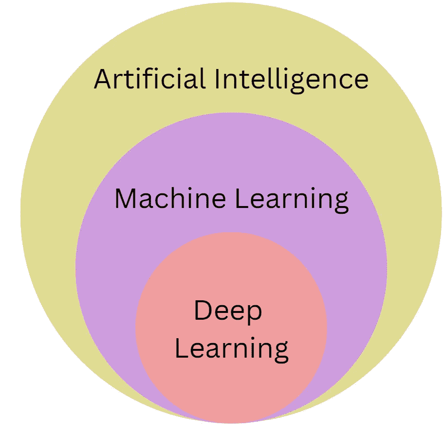

# 什么是人工智能？

> 原文：<https://towardsdatascience.com/what-is-artificial-intelligence-79bbcde38998>

## 了解人工智能、机器学习和深度学习的区别

安德烈亚斯·菲施格尔在 [Unsplash](https://unsplash.com?utm_source=medium&utm_medium=referral) 上的照片

人工智能(简称:AI)描述了试图教会计算机人类学习和思考。与算法相反，机器应该能够解决它没有直接编程的学习任务。

# 什么是人工智能？

人工智能的概念出现的时间比大多数人预期的要长。早在 1950 年，艾伦·图灵就在他的研讨会论文《计算机器与智能》中使用了这个术语，并在其他内容中探讨了机器是否能思考的问题。

他还开发了著名的“图灵测试”，这是第一个决定计算机是否是“人工智能”的方法。测试设置相对简单。测试人员向第二测试人员和计算机询问特定应用领域内的不同问题。之后，提问的参与者收到答案，却不知道哪个来自人类，哪个来自计算机。

现在它必须试着决定哪个答案是人类的，哪个不是。如果它在超过 50%的情况下不能正确地做出这种分配，计算机被认为是人工智能的，因为它的答案在一半的情况下被认为与人类的答案一样。

虽然图灵的工作被认为是人工智能发展的基石，但近年来其他定义也开始出现。这本书由 Stuart Russell 和 Peter Norvig ( [人工智能，一种现代方法](http://aima.cs.berkeley.edu/))撰写，已经成为文学的基石之一。

在本书中，作者定义了他们眼中人工智能应该实现的四个不同目标:

人工智能的定义|来源:作者

不管人工智能的定义是什么，它都是计算机科学的一个子领域，使用大型数据集和统计方法来尝试学习关系，并将其应用于新数据。

# 人工智能有哪些类型？

**窄** AI(也称为弱 AI 或人工窄智能(ANI))指的是针对特定用例进行训练并为其取得非常好结果的模型。在这个特定的领域，它们甚至可以比人类更优秀。今天已经围绕在我们周围的大多数人工智能系统都被归类为狭义人工智能。其中包括，例如，亚马逊的 Alexa 或苹果的 Siri 等语音系统，以及自动驾驶汽车中的驾驶助手。

这与所谓的**广义 AI** (也称为强 AI 或人工通用智能(AGI))形成对比，后者目前仍是一种理论现象。这个术语指的是拥有与人类智力相当的智能的计算机。这意味着该模型可以在学习的同时独立地很好地解决各种各样的应用。

# 人工智能为什么重要？

人工智能已经在许多领域扮演了重要角色。例如，公司能够做出更好的决策，改进他们的流程，并使他们的产品更好地适应客户的需求。与此同时，使用人工智能的产品在许多情况下使我们的生活变得更容易，例如在驾驶时或购物时提出建议时使用语音助手。

一般来说，人工智能非常重要，原因包括:

*   **接管重复性的任务**:人工智能不仅可以自动化重复性的过程，例如在生产中，还可以持续改进它们。人类可以从这些通常繁琐的任务中解脱出来，可以全身心地投入到其他任务中。
*   **提高现有产品的效用**:我们周围的许多应用和产品已经达到了高质量水平。然而，人工智能可以进一步改善它们，并使它们适应需求。例如，语音系统可以通过消除搜索某些功能和直接回答问题的需要来增加手机、计算机甚至网站的可用性。
*   **使用来自数据的上下文**:使用人工智能，特别是[深度学习](https://databasecamp.de/en/ml/deep-learning-en)开辟了识别大量数据中的相关性并应用它们的可能性。这些也可能是我们人类甚至没有意识到的关系。这产生了我们可以利用的新知识。

# 人工智能有哪些应用？

今天，我们已经在有意识和无意识地使用各种人工智能模型。以下列表是最普遍的系统的执行情况:

*   **语音识别**:无论是在车上、手机上，还是用亚马逊 Alexa 等特殊设备，现在很多设备都内置了语音识别。借助人工智能训练出来的各种模型作为基础。
*   **计算机视觉**:机器识别物体或解读图像的能力也是因为人工智能。例如，它已经被用于在 x 光的基础上进行医学诊断，或者在照片中识别和标记人。
*   **推荐**:无论是在 YouTube、电子商务门户网站，还是网飞，这些提供商都试图做出尽可能精确的推荐，这样我们作为客户，要么在平台上停留更长时间，要么购买更多产品。这些建议基于各种人工智能算法和模型。

# 人工智能有哪些领域？

人工智能这个术语是一个总括术语，包括所有旨在教会机器或计算机人类行为的领域。还包括[机器学习](https://databasecamp.de/en/machine-learning)的领域，它试图借助统计方法，如[主成分分析](https://databasecamp.de/en/statistics/principal-component-analysis-en)或[决策树](https://databasecamp.de/en/ml/decision-trees)，一步步改进其结果，以及一个学习过程。

人工智能领域|来源:作者

最后还有[深度学习](https://databasecamp.de/en/ml/deep-learning-en)，也是机器学习的一个子领域。它使用一个[神经网络](https://databasecamp.de/en/ml/artificial-neural-networks)的结构来计算其结果。与机器学习领域中的简单模型相比，这些多层网络还使得学习更复杂的关系成为可能。

# 深度学习与机器学习

[深度学习](https://databasecamp.de/en/ml/deep-learning-en)是[机器学习](https://databasecamp.de/en/machine-learning)的一个子领域，与[机器学习](https://databasecamp.de/en/machine-learning)不同的是，学习过程中没有人类参与。这是基于这样一个事实，即只有[深度学习](https://databasecamp.de/en/ml/deep-learning-en)算法能够处理非结构化数据，如图像、视频或音频文件。另一方面，其他机器学习模型需要人类的帮助来处理这些数据，例如，告诉它们图像中有一辆汽车。[另一方面，深度学习](https://databasecamp.de/en/ml/deep-learning-en)算法可以自动将非结构化数据转换为数值，然后将这些数据纳入预测，并识别结构，而无需任何人类互动。

此外，[深度学习](https://databasecamp.de/en/ml/deep-learning-en)算法能够处理大量数据，因此也能够处理比传统[机器学习](https://databasecamp.de/en/machine-learning)模型更复杂的任务。然而，这是以深度学习模型的训练时间明显更长为代价的。同时，这些模型也很难解释。也就是说，我们无法理解一个[神经网络](https://databasecamp.de/en/ml/artificial-neural-networks)是如何做出一个好的预测的。

# 这是你应该带走的东西

*   人工智能是指试图教会计算机像人类一样思考。
*   弱人工智能和强人工智能是有区别的。前者指的是在单个用例中交付非常好的结果的模型。而强 AI 则是堪比人类的智力。
*   如今，我们已经在各种应用中遇到了人工智能，如推荐系统、语音识别或计算机视觉。

*如果你喜欢我的作品，请在这里订阅***或者查看我的网站* [*数据大本营*](http://www.databasecamp.de/en/homepage) *！还有，媒体允许你每月免费阅读* ***3 篇*** *。如果你想让***无限制地访问我的文章和数以千计的精彩文章，不要犹豫，通过点击我的推荐链接:*[https://medium.com/@niklas_lang/membership](https://medium.com/@niklas_lang/membership)获得会员资格，每个月只需支付 ***5*****

***     ***