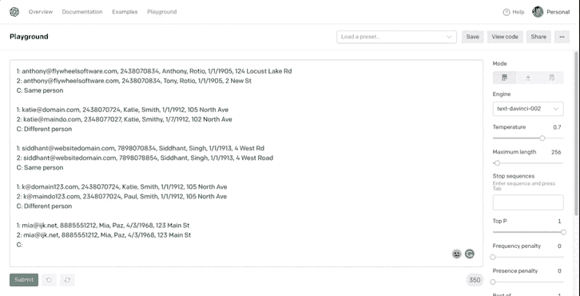
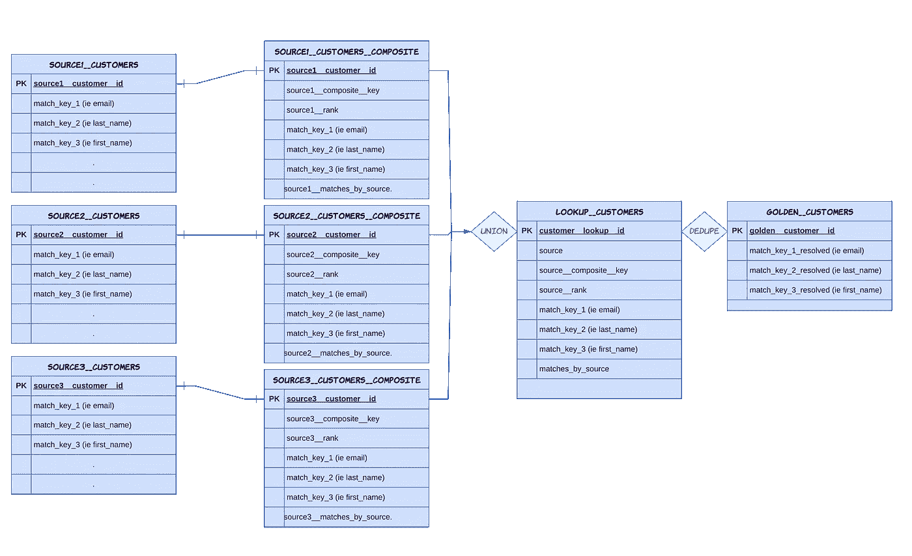
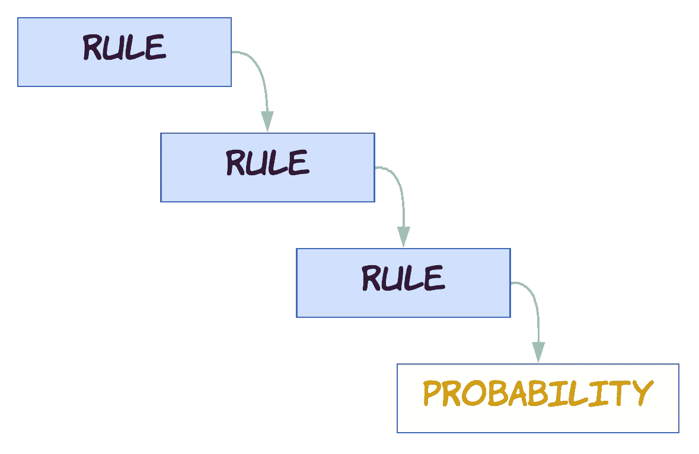
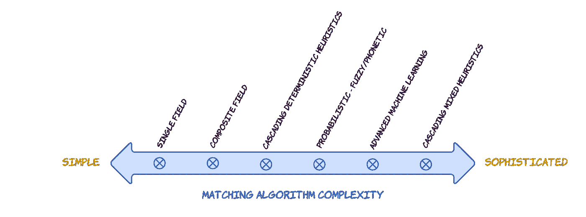
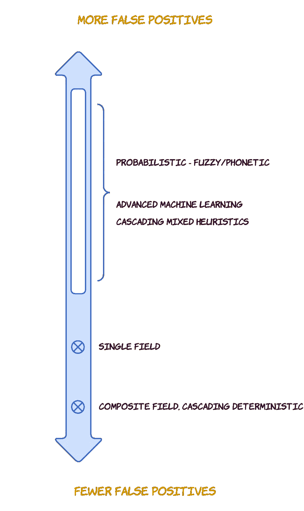
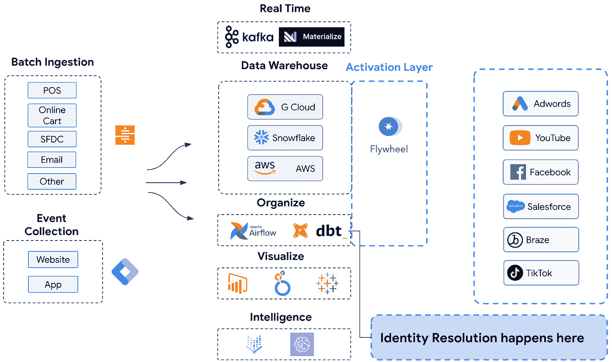

# 缺少什么 CDP 身份解析？

> 原文：<https://towardsdatascience.com/what-is-cdp-identity-resolution-missing-301edafd4d6a>

## 提示:您的大部分客户数据

作者图片

如果你在一家数据驱动的公司或组织中工作，你可能会遇到这样的挑战:创建客户的单一视图，以便根据他们的数据更准确有效地与他们沟通。也许你试图在数据仓库中解决它，或者通过使用第三方客户数据平台(CDP)。您能自信地说您已经解决了身份解析问题，并对您的客户有了一个单一的看法吗？一旦你做到了，分析和激活你的客户数据就很容易了。如果你还没有到达那里，不要害怕——你并不孤单！让我们一起深入了解身份解析的基础，并找出为什么数据仓库是构建这一基础的最佳场所，以及为什么 CDP 不能让您了解全貌。

设身处地为你的顾客 Mia 想想。Mia 通过许多不同的方式与您的组织进行沟通。如果她对产品或服务有疑问，她可以致电客户支持。她可能会浏览你的网站或应用程序，并采取任何数量的行动。她可能会(也可能不会)打开你的营销或销售团队发来的电子邮件或短信。这些交互中的每一个都会在数据库中创建一个记录。身份解析是协调这些记录以创建 Mia 的单一视图的行为。如果你能准确地做到这一点，你就有办法把你对 Mia 的所有了解结合起来，这样你就能以一种对她和你的组织都更有价值的方式与她交流。如果你不能准确地做到这一点，你可能会把别人误认为 Mia，给她发送不相关的垃圾信息，或者向 Mia 透露一些你不应该透露的信息。在最好的情况下，这对您的客户来说是令人沮丧的，对您的组织来说是低效的。另一方面，如果你在一个受监管的行业运营，这甚至意味着治理或法律问题。无论哪种方式，你都要努力把这件事做好。

一些数据领导者选择将身份解析问题外包给他们的客户数据平台(CDP)合作伙伴。今天，我们看到许多创新的数据和分析领导者不再使用基于 CDP 的身份解析，而是将这一重要流程构建到他们的[现代客户数据堆栈](https://medium.com/towards-data-science/the-modern-customer-data-stack-3cd91a3e79d1)的核心。让我们看一下关于身份解析的几个关键主题，以便在您与 Mia 和您的其他客户更好地合作时，帮助您和您的团队取得成功:

1.  **缺少什么 CDP 身份解析**
2.  **身份解析如何工作**
3.  **选择匹配算法**
4.  **底线:处理数据仓库中的身份解析**

# 缺少什么 CDP 身份解析:您的大部分客户数据

CDP 是位于网站和应用程序之间的系统。总体思路是，您的前端工程师在您的所有酒店中部署一组通用的标签和 SDK 元素，然后 CDP 集中将这些事件和用户元数据转换为许多下游服务(如 Google Analytics、脸书、Adobe Analytics、Optimizely 等)的正确格式，而不是为下游服务实施每个 SDK。事件收集和跟踪是 CDP 的谋生之道，他们做得很好，但这些 CDP 公司最近除了事件跟踪之外，还大肆宣传他们的身份解析能力。

即使 CDP 可能完美地执行身份解析(他们不能)，也有一个大问题:CDP 不能访问您已经在数据仓库或数据湖中收集的大多数客户数据。

*如果您的整个身份识别策略是使用您的 CDP(上面的 x ),您将错过许多渠道的身份识别，在这些渠道中，您的客户在网站和应用程序活动之外进行互动。最好是在数据仓库(上面的 1000)中最终解决这个问题，所有的客户数据都在数据仓库中。—作者图片*

让 CDP 成为您的身份解析策略的基础，类似于让您的 CRM 或电子邮件平台来解决这个问题。这些平台只能看到你的客户数据的一小部分。如果您采用这种方法，在一个或多个边缘平台中优先考虑身份解析，您将无法实现单一客户视图的目标—您解析了客户的 web 属性视图，但仍有很大一部分有价值的客户数据被锁定在数据仓库中未解析的记录中。如果您想要检查或激活与 CDP 中可用数据无关的客户数据，这可能会有问题。例如，如果您想在 Tableau 中构建一个收入仪表板，按客户类型显示收入，而您的 CDP 不能访问您公司的交易数据，那么基于 CDP 的身份解析就不会对您有很大帮助。任何身份解析策略都需要以客户数据的聚合地为基础。在[现代客户数据栈](https://medium.com/towards-data-science/the-modern-customer-data-stack-3cd91a3e79d1)中，那就是数据仓库。

在收集客户数据的边缘平台(如 CRMs 和 CDP)中，强大的数据验证非常重要，跨 web 属性的身份解析也很有价值，但所有这些都应该是构建在数据仓库之上的中央身份解析策略的输入。

# 身份解析的工作原理

## 问题是

上面介绍的例子中，Mia 解决了人们的身份解析问题。我们感兴趣的是解析所有与我们交流的人的身份。在这个例子中,“人”是我们试图为其解析身份的实体。您还可以选择为不同的实体解析身份。如果 Mia 为您销售的公司工作，您可能希望维护一个公司或帐户实体，并跨公司或帐户解析身份。可能存在管理多个账户或公司的母账户或母公司，它们可能是另一个实体。您可以将实体视为您的组织或业务用来构建和运营组织的名词(客户或用户、交易、产品、事件等)。对于身份解析，我们关心您的组织可能想要与之通信的实体——如用户或客户或潜在客户或人；账户或人群；父帐户或帐户组。为了建立身份解析的基础，我们需要回答一个看似显而易见的问题:如何定义这些实体？

还是用人吧。当你查看数据库中的记录时，你如何定义一个人？Mia 记录中的某些字段可能如下所示:

样本客户记录—按作者分类的图片

那么这里哪个字段定义了 Mia？或许是电子邮件？我们可以把它形式化为一个规则，说所有具有相同电子邮件地址的行代表同一个人。嗯，如果 Mia 随着时间的推移更改了她的电子邮件地址，会发生什么情况？或者 Mia 是否和她家里的某个人共用一个电子邮件地址？让我们来看看这组记录:

为身份解析准备的样本记录—按作者分类的图像

直觉上，看起来前两行代表同一个人，第三行不是。如果我们天真地决定仅使用电子邮件字段来解析身份，我们不会得出相同的结论，我们会认为第一行和第三行代表同一个人，而第二行代表不同的人。天真地使用一个列来解析身份似乎是一种有限的方法。如果你仔细观察，你会发现，如果我们选择“电话”领域，我们也会同样失败。

标识解析是使用匹配规则或算法来确定哪些记录代表同一实体的过程。

身份解析的第一个关键问题是选择规则或算法。

## 匹配的类型

当选择用于身份解析的规则或算法时，您可以在一个轴上从简单到复杂地考虑一系列选项。

匹配算法复杂性连续体—作者图片

在我们上面的例子中，使用一个像“电子邮件”或“电话”这样的字段会在左边。另一方面，你可以使用非常复杂的东西，比如用最先进的[转换器](https://en.wikipedia.org/wiki/Transformer_(machine_learning_model))(机器学习模型)进行分类。下面是 GPT-3 达芬奇(在撰写本文时接近最先进水平)在给出几个例子后确定两个记录是否代表同一个人:

GPT-3 达芬奇解决一个身份解析问题|鸣谢:OpenAI Playground OpenAI.com—作者提示的帐户和示例

在这两个极端之间，有许多方法非常适合您的数据生态系统。我们来看几个。

**单字段匹配—如上所述**

这种方法使用一个简单的规则，比如如果 email=email 跨越两个记录，它们代表同一个人。因此，实现该方法的一种方法可能如下所示:

1.  收集所有包含客户记录的源表。
2.  对将要匹配的字段中的源表进行重复数据删除。
3.  编写一个查询，将所选匹配字段上的所有表联接起来。
4.  决定从每个表中选择哪些附加字段
5.  对于只存在于一个源表中的字段，您可以简单地选择它们
6.  对于跨表存在的字段，将每个源中的每个字段与您想要的等级或优先级结合起来

**复合字段匹配**

在这里，我们开发了一个更严格的规则，即只有当几个字段在记录中匹配时才存在匹配。以下是数据仓库中组合键标识解析的关键步骤:

1.  识别匹配关键字 **:** 第一步是确定您将使用哪些字段或列来确定哪些个体在源内和跨源是*相同的*个体。匹配关键字的典型例子可能是电子邮件地址*和姓氏*。
2.  创建一个组合键:当您确定了匹配键后，您可以在每个数据源中将它们组合成一个组合键，从而将匹配键组合成一个字段。一种简单的重复数据删除方法是使用组合键来查找重复项，并按照从最近到最早的*更新时间戳*的顺序对重复项进行排序，但是在为每个记录分配源排序时有几种选择。将这些新字段写入新版本的源表。
3.  聚合源表:下一步是将先前创建的表合并到一个源查找表中，该表包含所有源表中的所有客户记录。我们称之为查找表。
4.  定义一个优先矩阵:现在我们将需要跨源解析身份，因为我们应该有一些跨源的重叠，其中有来自不同源的具有相同组合键的记录，其中源等级指示它是来自每个源的最新或最好的。在这里，我们可以定义一个优先矩阵，为每个匹配关键字和其他字段确定我们信任该字段的源的顺序。例如，数据源 A 可能是电子邮件字段的最佳来源，然后是数据源 C，最后是数据源 b，但是对于电话号码字段，顺序可能不同。
5.  分配客户 ID **:** 最后一步是简单地获取具有相同匹配键的记录，并为匹配的客户记录组生成一个唯一的客户标识符。生成的每个客户 ID 都可以用于将客户源链接在一起。我们现在已经解决了跨源问题，为数据仓库中的每个唯一客户创建了一个黄金记录。这个过程是这样的:

组合键实体关系示例-作者图片

使用组合键匹配时，即使在给定的源中更新了底层的匹配字段，也要决定是否希望随着时间的推移持久化 id，这一点很重要。例如，如果某个 Salesforce 联系人在 Salesforce 中更改了其电子邮件地址，由于该联系人的 Salesforce ID 没有更改，您希望将此人视为数据仓库中的同一个人还是不同的人？我们已经看到它是根据业务规则以两种方式实现的。

**概率匹配**

这种方法使用概率对记录的相似程度进行评分。然后，根据您已经知道代表或不代表同一个人的一些示例的分数，为这个分数设置一个阈值。如果一对记录的得分达到或超过阈值，则认为它们代表同一个人；如果他们的得分低于，他们被认为是独一无二的。

在身份解析中有许多用于概率匹配的评分方法。以下是一些受欢迎的选择:

模糊字符串匹配

*   Levenshtein 距离算法:大致基于匹配字符串所需的编辑次数
*   汉明距离算法:大致基于字符串中不同字符的数量，基于位置
*   仿射间隙距离算法:类似于汉明，但删除或插入被给予一点休息
*   Jaro-Winkler 距离算法:字符串中相似位置出现的字符的大致数量，不包括乱序的字符

语音匹配

*   变音算法
*   桑迪克斯

**级联确定性启发式匹配(级联规则)**

级联试探法或级联规则是一种身份解析算法，您可以按照从最严格到最不严格的顺序应用不同的规则或子算法。

一个例子可能是这样的:

在电子邮件、姓氏、出生日期上完全匹配记录

对于所有不匹配的记录

1.  尝试将它们与电子邮件中先前匹配的记录以及姓氏的前三个字母进行匹配
2.  尝试将它们与电子邮件中的其他未匹配记录以及姓氏的前三个字母进行匹配

对于所有仍然不匹配的记录

1.  尝试仅将它们与电子邮件地址上先前匹配的记录进行匹配
2.  尝试仅将它们与电子邮件地址上的其他剩余不匹配记录进行匹配

级联规则示例-按作者排序的图像

**高级机器学习匹配**

虽然概率匹配可以被认为是一种基本类型的机器学习匹配，但是还有许多其他更高级的机器学习方法也可以用于身份解析。这是类固醇的概率匹配。想想聚类算法和深度神经网络给你的答案往往是无法解释的。这使得审计具有挑战性，并且对您的业务利益相关者来说就像一个黑盒。使用上面显示的 Transformer 示例，您可以有效地训练神经网络，以给出与人类相似的结果，只要人类标记训练数据。

考虑这种方法时的一个关键问题是，您的团队中是否有一些人，您可以信任他们来决定记录是否匹配？在您的组织中，有没有人是您如此信任以至于将组织的信誉置于危险境地的？如果这些人存在，你应该让他们不时地标记你的训练数据和审核推理管道。如果这些人不存在，这可能不是一个很好的解决方案。

**级联混合启发式匹配(包括概率性)**

级联混合试探法是一种身份解析算法，您可以按照从最严格到最不严格的顺序应用不同的规则或子算法，也可以包括概率匹配。

下面的示例使用了前面的级联确定性匹配示例，但增加了最终的概率匹配步骤:

在电子邮件、姓氏、出生日期上完全匹配记录

对于所有不匹配的记录，

1.  尝试将它们与电子邮件中先前匹配的记录以及姓氏的前三个字母进行匹配
2.  尝试将它们与电子邮件中的其他未匹配记录以及姓氏的前三个字母进行匹配

对于所有仍然不匹配的记录，

1.  尝试仅将它们与电子邮件地址上先前匹配的记录进行匹配
2.  尝试仅将它们与电子邮件地址上的其他剩余不匹配记录进行匹配

对于所有仍然不匹配的记录，

1.  尝试将它们与之前在发音相似的电子邮件字符串上匹配的记录进行匹配(**概率**匹配)
2.  尝试将它们与语音相似的电子邮件字符串中其他剩余的不匹配记录进行匹配(**概率**匹配)

级联混合启发式示例-按作者排序的图片

所以我们用这些例子映射的连续体看起来有点像这样:

各种匹配算法的复杂度分布—按作者分类的图片

其中一些的顺序还可以讨论，但是这对于我们在这里的讨论来说已经足够了。

# 选择匹配算法

## 假阳性和假阴性

在身份解析的上下文中，我们可以认为误报是不应该发生的匹配。例如，合并两个不是同一个人的数据。想象一下金融行业中的一个例子，误报可能意味着银行错误地告诉某人他们已经透支了他们的账户，或者在医疗保健行业中，将 HIPAA 敏感信息披露给了错误的患者。这对客户和您的公司来说可能是灾难性的。

另一方面，假阴性会遗漏本应匹配的对象。在客户服务领域，这可能代价高昂，因为客户可能无法获得重要信息。通常在销售和营销领域，这意味着一小部分收入留在桌面上，因为某个特定活动的目标受众较少。

除了高风险、关键客户服务使用案例之外，误报通常比漏报更糟糕。让我们想想我们的匹配算法和它们的误报倾向。

对于确定性选项，如单字段匹配、复合字段匹配和级联确定性试探法，假阳性率通常很低。该比率与您的数据质量密切相关，不会更差。如果您有关于您的客户的最新信息，并且在您的客户与您通信时进行了强有力的验证，确定性选项将使您的误报率最低，因此这通常是一个好方法。

对于概率选项，如模糊/语音字符串匹配、高级 ML 和级联混合试探法，假阳性率通常更高。这是因为速率取决于实施和阈值选择(除了数据质量之外)。在这里，您从与确定性选项相同的基线开始，即数据的质量和新鲜度，并且可能会由于对确定匹配的分数设置宽松的阈值而受到进一步的负面影响。典型地，概率选项给出了更高的误报率，并且对于该决策标准来说通常是更差的方法。

每种类型的匹配算法产生的误报的相对数量，大约-按作者排序的图片

## 费用

让我们先考虑一下成本。上面那个花哨的 GPT-3 匹配示例使用 OpenAI 的 API……一次调用花费了大约 0.01 美元。就其本身而言，一便士听起来可能不算多，但请考虑一个拥有 10 万名客户的数据库。假设我们有这 100，000 名客户的记录，这些记录来自三个不同的来源——product _ users、salesforce_contact 和 marketo_leads。使用 GPT-3 的身份解析的简单实现可能如下所示:

1.  遍历 product_users 表中的每个客户记录(100，000)
2.  对于每条记录，使用 GPT-3 匹配(100，000)将该记录与 salesforce_contact 表中的每条记录进行比较
3.  遍历所有匹配和不匹配的记录(100，000–200，000)
4.  对于每条记录，使用 GPT-3 匹配(100，000)将该记录与 marketo_leads 表中的每条记录进行比较

在每个 API 调用 0.01 美元的情况下，您的小型身份解析项目将获得 2 亿到 3 亿美元的投资。这还不包括每个源中的重复数据消除和合并。客户数量相对较少，只有 10 万人。哎哟。

有一些技术可以避免这些天真的穷举循环。一种流行的方法叫做阻塞。分块就是限制用于比较的数据块的大小，而不牺牲太多的准确性。一种简单的阻塞形式如下所示:

1.  按照要用于匹配的字段对所有来源进行排序
2.  从源 a 中选择一条记录，我们称之为记录 R
3.  仅将该记录与源 B 和 C 中距离位置为+/- 1000 条记录的记录进行比较，如果记录 R 位于排序顺序中的适当位置，则它将在该源中。

封锁可以帮助大幅降低先进技术的成本，但与替代方案相比，它们仍然非常昂贵。

对于一些更简单的方法，您可以在数据仓库或数据湖中对数据使用原生 SQL 查询来完成所有或几乎所有的处理。云数据仓库解决方案之间存在非常良性的竞争，这降低了基于 SQL 的计算成本，并使基于 SQL 的身份解析方法从成本角度来看更具吸引力。

下面是不同匹配策略的成本比较的大概情况:

各种匹配算法的相对成本，取决于实现—图片由作者提供

## 就地处理与内存处理

除了使用 SQL 在数据仓库或数据湖中就地处理带来的成本优势之外，这还是一种非常数据治理和数据透明友好的身份解析管理方式。

## 数据治理

就地处理是一种治理友好的方法，因为使用这种方法，数据永远不会因为身份解析而离开数据仓库。当您使用数据仓库或数据湖的本机 SQL 引擎处理数据时，客户数据的副本存储在其他地方的可能性比我称之为内存中处理的可能性要小。数据仓库引擎也使用内存，但我们在这里使用内存中是指将数据从数据仓库或数据湖中取出，放入其他一些内存中并进行一些处理。

这方面的一个例子是在 Kubernetes 集群上运行一些 python 身份解析代码。假设您正在使用一种级联方法，并决定将当前级联步骤的结果存储在一个 blobstore(如 S3 或谷歌云存储桶)中，以供后续级联步骤参考。如果您不小心管理 blobstore，这可能是一个治理问题。

在 GDPR 和 CCPA，客户有权在请求删除后的 30-45 天内删除其数据。即使问题仅限于数据仓库中的数据，管理这些请求也是一项挑战。如果您在 S3 有可能包含客户数据的文件，那么当这些删除请求(有时称为“清理请求”)到来时，您也需要监视和搜索这些文件。一个好的原则是尽可能将数据保存在数据仓库或数据湖中，将管理这些请求的问题集中到一个地方。如果您确实有文件浮动的存储桶，一个好的做法是将存储桶的生存时间限制为 14 天或更短，以便在 30-45 天的时间限制内自动删除它们。

## 数据透明度

如果您将数据发送到他们的 SaaS 平台进行处理，有一些第三方服务，如客户数据平台(CDP)，可以为您进行身份解析。这种方法存在一些挑战，但我们经常听到的是，这可能是一个不透明的“黑盒”。组织通常无法了解身份解析是如何进行的，这可能会导致对流程缺乏信心、不可移植性和供应商锁定—即使您不再需要 CDP 提供的其他服务。

就地处理与内存处理—按作者分类的图片

## 将所有这些放在一起—选择匹配算法

在评估匹配算法选项时，对于我接触过的数百家组织中的大多数来说，有两个选择最为突出:

**复合字段匹配**和**级联确定性启发式匹配**

这两种方法都提供了较低的误报率和相对较低的成本，并且可以实现为使用 SQL 就地处理数据。这两者之间的权衡是实施的简单性和成本—复合字段匹配提供了更简单的实施和更低的成本，代价是通常更高的假阴性率(为活动定位留下了更多机会)。

# **底线:处理数据仓库中的身份解析**

如今，业界围绕身份解析开展了大量工作。许多 CDP 提供商将在数据仓库之外提供具有黑盒实施的通用解决方案，这可能不适合您的业务。虽然您可以选择实现哪些匹配算法来进行身份解析，但是实现身份解析解决方案的位置更加明确。在现代客户数据堆栈中，身份解析是在数据仓库之上实现的。

现代客户数据堆栈—作者图片

最常见的是，我们看到这是在开源工具中实现的，如用于声明性 SQL 的 dbt，并通过 Airflow 进行编排，但也有许多工具可用于定义和安排您的身份解析解决方案。只要有可能，就将您的身份解析工作集中在聚集客户数据的数据仓库或数据湖上。这提供了最准确、最灵活和最有效的方法来确保身份解析考虑到您拥有的每个客户的所有数据。借助一个考虑到**所有**客户数据的强大身份解析策略，您可以在未来几年与客户进行更有效、更有价值的沟通。