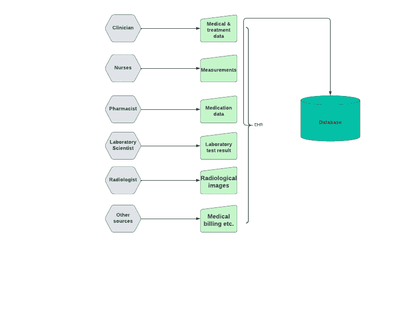

# 什么是临床数据科学？(第一部分)

> 原文：<https://towardsdatascience.com/what-is-clinical-data-science-part-1-ebe135efb462>

## 对不断发展的临床数据科学领域的温和介绍

欧文·比尔德在 [Unsplash](https://unsplash.com?utm_source=medium&utm_medium=referral) 上的照片

在本文和随后的其他系列文章中，我将深入挖掘临床数据科学的本质。

本系列讨论的要点概述如下:

1.  临床数据科学导论
2.  临床数据科学及相关领域
3.  临床数据的来源
4.  监管约束

**什么是临床数据科学**

临床数据科学是一个专注于将数据科学应用于医疗保健的领域，目标是改善患者和医疗保健系统的整体福祉。牢记这一目标，临床数据科学家利用医疗保健系统每天生成的海量数据来解决与健康相关的挑战。

临床数据科学与生物医学数据科学、医疗保健分析和生物医学信息学等领域有着密切的联系，尽管有某些区别。在继续之前，我想用下面几行来指出这些领域之间的区别，以便更好地了解讨论的主要领域。

> 生物医学数据科学涉及对大规模生物数据集进行分析，以便理解和提出健康相关问题的解决方案。根据[维基百科](https://en.wikipedia.org/wiki/Health_care_analytics)的说法，医疗保健分析是指医疗保健核心领域产生的数据，包括索赔和成本数据、制药和研究&开发数据、临床数据、患者行为&情感数据，可以进行的分析活动。换句话说，与临床数据科学相比，我们可以认为健康分析的范围更小。另一方面，生物医学信息学通过采用计算和传统方法，关注生物医学信息、数据和知识的最佳使用，以解决问题和做出决策。

在理解了这些领域的细微差别之后，现在让我们开始研究临床数据科学最重要的组成部分之一，电子健康记录(EHR)。与其他数据科学领域一样，数据就像推动任何分析操作引擎的燃料，没有它，我们就无法进行任何分析。在当今世界，我们被一系列可以记录临床数据的联网设备所包围。由于数据科学的整个领域都是基于操纵数据以获得洞察力，因此收集这些数据是数据科学的核心。

EHR 是参与患者护理的个人的所有信息的综合集合。这包括来自临床医生、实验室、放射成像、健康保险、社会人口统计、基因测序数据等的记录。另一个通常与 EHR 互换使用的术语是电子病历(EMR)。虽然 EHR 更复杂，但电子病历非常受限制，因为它主要集中在单一实践中的患者医疗和治疗历史。EMR 是临床医生办公室中传统纸质记录的电子版本。

一般来说，EHR 的信息来源可以归结为四点。**谁**记录了**什么**信息**什么时候**和**为什么**被记录下来。“谁”回答记录信息的医护人员。这可能是内科医生、药剂师、护士、实验室科学家、放射学家等。这些人员获取的数据的性质差异很大，因此信息的类型(即内容)由记录者决定。例如，临床医生可以记录关于患者的医疗和治疗历史的信息，药剂师记录关于药物治疗的信息，护士可以记录诸如体重和身高测量的临床观察数据，实验室科学家记录诸如实验室测试订单和实验室测试结果等实验室数据。“什么”回答了具体的时间戳，如门诊/医院就诊、入院时记录的数据以及出院时记录的数据。“为什么”回答了记录数据的原因。

值得注意的是，大量信息被整合到 EHR 系统中，因为它涵盖面很广。概括地说，我们可以根据记录数据的人员将这些数据分类成不同的形式。我们可以有药物治疗数据、临床观察数据、社会人口统计数据、实验室数据、包含账单信息的数据等。

原始临床数据保存在数据库中，无论是关系数据库还是非关系数据库，以便进行充分的记录(即存储)和简单的检索。根据他们的需求，一些管理临床数据库的组织有他们自己的方法(模型)来存储和访问他们的数据。因此，对现有模型的熟悉以及对如何在必要时设置自定义模型的深刻理解是临床数据科学家工作的重要组成部分。临床数据模型的示例包括集成生物学和床边的信息学(i2b2)、PCORnet(以患者为中心的结果研究网络)、观察健康数据科学和信息学(OHDSI，管理 OMOP[观察结果医疗合作]数据模型)、Sentinel 等。所有这些模型都有特定的目标，因此它们的架构在某些方面有所不同。将原始数据(来自源)转换成特定模型的过程被称为“提取、转换和加载”(ETL)过程。

作者图像:临床数据流的图像表示

临床数据一旦以被认为最合适的格式保存，无论是为了解决各种临床相关问题还是为了其他类型的研究，科学家们都会采用各种方法来获取数据。我们利用一组查询形式的标准从数据库中检索所需的数据，数据库管理系统(DBMS)随后从数据库中提取所请求的数据。一种查询语言，最常见的是结构化查询语言(SQL ),用于指定这组需求。然后，获得的数据可用于进一步的分析操作。

我们可以使用检索到的数据来回答关于整个数据库中个人特征的问题，并使用它来研究特征如何随时间变化。我们可以回答这样的问题:

1.  被诊断为肥胖的患者平均体重是多少？
2.  糖尿病视网膜病变在诊断为糖尿病的患者中的发病率是多少？
3.  高血压患者有多大比例的高血压视网膜病变？
4.  冠心病患者平均住院时间是多少？

如您所见，如果数据存在于数据库中，我们的查询可以回答许多问题。

在处理临床数据时，法规限制是一个主要问题。《1996 年联邦健康保险流通与责任法案》是相关机构为实现这一目标而实施的法律之一(HIPAA)

处理临床数据时的一个核心问题是法规约束。与医疗保健专业人员一样，临床数据科学家也应该遵循最佳实践，并建立标准来保证患者隐私得到认可和保护。1996 年联邦健康保险可携带性和责任法案(HIPAA)和欧盟通用数据保护条例是相关当局为实现这一目标而实施的一些法律。在 EHR，涉及患者数据和其他敏感数据的研究也受机构特定指南和管理机构(如机构审查委员会(IRB ))的管辖，部分原因是担心机构和医疗保健提供商的责任。因此，最常见的临床数据集是去身份化(即匿名化)和 HIPAA 限制的数据集。

> 去识别的临床数据集是观察患者数据的集合，这些数据已经去除了所有直接的患者健康信息(PHI)成分。IRB 许可对于访问去识别的临床数据集是不必要的。
> 
> 具有 HIPAA 限制的临床数据集包括观察性患者信息，如入院、出院、服务、出生和死亡日期，以及城市、州、五位数或更多位数的邮政编码，以及以年、月、日或小时表示的年龄。未经患者同意或 HIPAA 豁免，HIPAA 限制的临床数据集可用于或共享研究、公共卫生或医疗保健业务。

**结论**

在这篇介绍性文章中，我解释了临床数据科学需要什么，以及它与其他密切相关的学科之间的差异。此外，我们还观察到了 EHR 在临床数据科学领域的重要性。为了解决与临床相关的问题，我们研究了产生临床数据的来源，以及如何在数据库中存储和检索这些数据。最后，我们检查了临床数据使用中的法规约束。在本系列的后续文章中，以临床数据科学为背景，重点将放在数据检索之后的“进一步分析操作”上。

参考

<https://www.healthit.gov/buzz-blog/electronic-health-and-medical-records/emr-vs-ehr-difference>  <https://www.ncbi.nlm.nih.gov/pmc/articles/PMC3824370/>  <https://bmcmedinformdecismak.biomedcentral.com/articles/10.1186/s12911-019-0837-5>  

[https://en . Wikipedia . org/wiki/Data _ retrieval #:~:text = In % 20 order % 20 to % 20 retrieve % 20 the，used % 20 to % 20 prepare % 20 the % 20 query](https://en.wikipedia.org/wiki/Data_retrieval#:~:text=In%20order%20to%20retrieve%20the,used%20to%20prepare%20the%20queries)。

<https://bmcmedethics.biomedcentral.com/articles/10.1186/s12910-017-0184-y>  

[https://www . research gate . net/publication/332988365 _ Clinical _ Data _ Sources _ and _ Types _ Regulatory _ Constraints _ Applications](https://www.researchgate.net/publication/332988365_Clinical_Data_Sources_and_Types_Regulatory_Constraints_Applications)