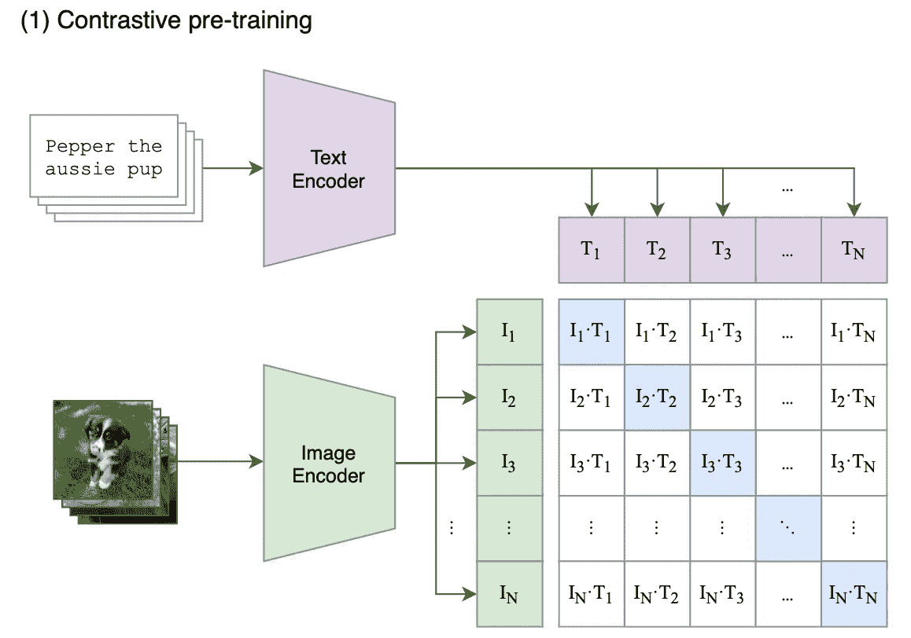
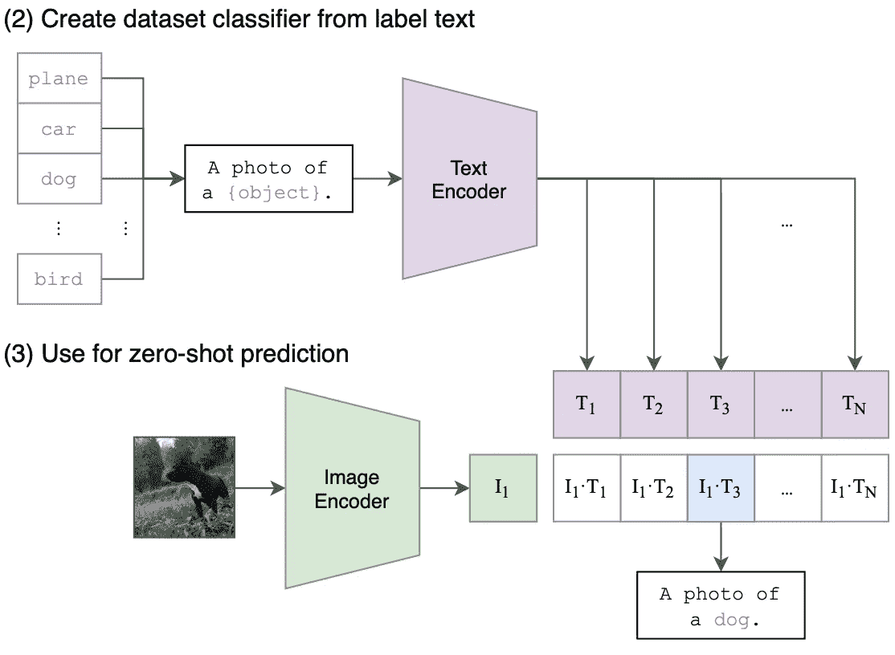

# 什么是 CLIP，为什么它会成为病毒？

> 原文：<https://towardsdatascience.com/what-is-clip-and-why-is-it-becoming-viral-d3ba20c0068>

## 当神经网络使用如此多的数据时，它就变得“通用”了

图一。数十亿张图片存储在互联网上的云端。将它们用于机器学习可能会非常有帮助。从[https://unsplash.com/photos/M5tzZtFCOfs](https://unsplash.com/photos/M5tzZtFCOfs)检索的图像。

预定义的类和类别:这是新的类在重新训练后只能由机器学习和神经网络进行分类的限制。一段时间以来，这种再培训和微调程序几乎已经成为“标准”——这是一种如此普遍的做法，以至于人们忘记了这仍然是一个有待解决的问题……至少在引入 CLIP 之前是如此。

# 那么，到底什么是剪辑？

CLIP(对比语言-图像预训练)是一种不同于视觉社区中常见实践的训练过程。在一段时间内，模型/训练方法的能力在跨越 1000 个类的 ImageNet 数据集上进行了基准测试。我们在 ImageNet 的子集上进行训练，并在不同的子集上进行测试，以测量模型的泛化能力。虽然简单明了，但这种约定忽略了互联网上的指数级图像集合及其可能带来的潜在好处；剪辑，确实表明，这是我们错过了很多。

图二。剪辑预训练方法。图片来自 https://arxiv.org/abs/2103.00020。

除了网上检索的大量图像，CLIP 还利用了文本，这在它提出的时候是一种有点非正统的设置。与使用图像编码器(例如，CNN)和分类器(例如，全连接网络)的传统模型相反，CLIP 联合训练图像编码器和文本编码器，以促进通过对比学习形成一对的编码器之间的紧密嵌入空间，如图 2 所示。如果你对对比学习不熟悉，请参考这篇文章[这里](/contrastive-learning-in-3-minutes-89d9a7db5a28)。

图 3。剪辑分类管道。从图 1 中检索的图像。剪辑预训练方法。从[https://arxiv.org/abs/2103.00020](https://arxiv.org/abs/2103.00020)检索的图像。

成功的训练将导致文本和图像指向非常接近的同一物体。例如，句子“一张小狗的照片”的嵌入将在实际的狗图像附近。在对一组有限的类进行推理时(图 3。)，我们可以简单的把类名放到一个句子里，找到最接近查询图像的文本嵌入。

因为 CLIP 是在极其庞大的 4 亿图文对上训练的，所以几乎成了“零拍”。你能想到的任何类几乎肯定是这个庞大数据集的一部分；你不需要任何再培训，任何课程，任何额外的数据。

# 我们如何使用剪辑？

尽管它很简单，但我们大多数人都无法访问硬件来处理 4 亿个图像-文本数据集，也无法访问数据集本身。但是由于其零触发能力，预训练检查点对于所有后续分类任务是通用的。 [OpenAI](https://openai.com) 在他们的 GitHub 上公布了训练和检查站的代码:

  

只需遵循安装程序并运行*图像编码器*和*文本编码器*即可获得它们各自的功能。

# 超越简单的分类

图像之外的许多数据集也包含文本标签。因此，文本和图像的精确匹配可以用于其他领域。下面我们列出了 CLIP 的几个有趣的扩展:

## 音响化

图 4。将结果声音化。从[https://arxiv.org/abs/2112.09726](https://arxiv.org/abs/2112.09726)中检索到的图像。

Lin 等人试图通过 CLIP 将最接近的声音标签与视频本身进行匹配，来缓解视频编辑过程中在视频上叠加声音所耗费的时间。有关该方法的详细信息，请参见此处的。

## 夹子锻造

图 5。剪辑伪造结果。从[https://arxiv.org/abs/2110.02624](https://arxiv.org/abs/2110.02624)检索到的图像。

CLIP-Forge 将文本与形状渲染进行匹配，以使用未标记的 3D 对象数据集实现零射击 3D 形状生成。有关该方法的详细信息，请参见此处的[和](https://arxiv.org/abs/2110.02624)。

# 结束注释

CLIP 是 vision 社区中的一股清新之风，它鼓励我们重新思考互联网上越来越多的可用资源。毫无疑问，在不久的将来，更多新奇有趣的应用将会从这个优雅的想法中衍生出来。

*感谢您坚持到现在*🙏！*我不断写关于计算机视觉和深度学习的文章，所以* [*订阅*](https://taying-cheng.medium.com/membership) *到 Medium 通过我了解更多:)*