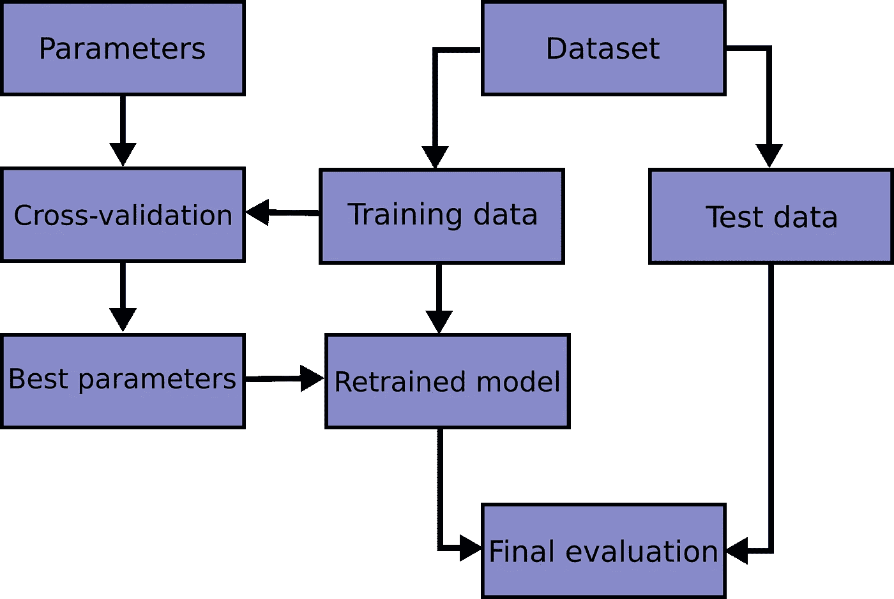
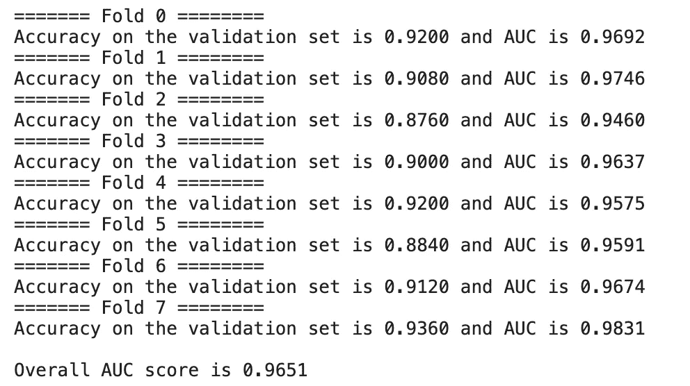

# 通过交叉验证评估和改进模型性能

> 原文：<https://towardsdatascience.com/what-is-cross-validation-in-machine-learning-14d2a509d6a5>

## *了解什么是交叉验证——构建通用模型的基本技术*

图片作者。

交叉验证*的概念*直接来源于我上一篇文章中提到的[过度拟合](/overcome-the-biggest-obstacle-in-machine-learning-overfitting-cca026873970)。

**交叉验证是避免过度拟合和更好地理解预测模型性能的最有效技术之一。**

当我写过度拟合时，我将我的数据分为训练集和测试集。训练集用于训练模型，测试集用于评估模型的性能。但是这种方法通常应该避免，并且不应该应用在真实世界的场景中。

这是因为**如果我们长时间训练我们的模型，直到我们找到正确的配置，我们可能会在测试集中引起过度拟合。**这个概念被称为*数据泄露*，是该领域最常见、最具影响力的问题之一。事实上，如果我们训练我们的模型在测试集上表现良好，那么它将只对那个测试集的*有效。*

我说的*配置*是什么意思？每个模型由一系列**超参数**表征。这里有一个定义

> 模型超参数是一种外部配置，其值无法从数据中估计。更改超参数会相应地更改模型在数据上的行为，从而提高或降低我们的性能。

例如，Sklearn 的*决策树分类器*树，有 *max_depth* 作为管理树深度的超参数。改变这个超参数会改变模型的性能，不管是好是坏。除非通过实验，否则我们无法预先知道 max_depth 的理想值。除了 max_depth，决策树还有很多其他的超参数。

当我们[选择在数据集上使用的模型](https://pub.towardsai.net/a-framework-for-model-selection-ea4dcda2cb3a)时，我们需要了解哪些是最好的超参数配置。该活动称为*超参数调整*。

一旦我们找到了最佳配置，您就可以将具有最佳配置的最佳模型带到“真实”世界，即由模型从未见过的数据组成的测试集。

为了在不直接测试测试集的情况下测试配置，我们引入第三组数据，称为**验证集**。

总的流程是这样的:

1.  我们在训练集上训练模型
2.  我们在验证集上测试当前配置的性能
3.  当且仅当我们对验证集的性能满意时，我们才在测试集上测试。

但是，为什么要增加一套额外的性能评估来使我们的生活变得复杂呢？为什么不使用经典的训练测试集分割？

原因很简单，但却极其重要。

> 机器学习是一个迭代的过程。

我所说的迭代是指**一个模型可以而且必须用不同的配置**评估几次，以便我们理解哪一个是性能最好的条件。验证集允许我们测试不同的配置，并为我们的场景选择最佳的配置，而没有过度拟合的风险。

但是有一个问题。通过将我们的数据集分成三部分，我们也**减少了可用于我们训练模型的例子数量。**此外，由于通常的分割比例为 50–30–20，因此模型结果可能随机取决于数据在不同集合中的分布情况。

交叉验证通过从等式中移除验证集并保留模型可用于学习的示例数量来解决这个问题。

# 什么是交叉验证？

交叉验证是机器学习中最重要的概念之一。这是因为它允许我们创建能够*泛化的模型—* 也就是说，即使对不属于训练集的数据也能够创建一致的预测。

能够概括的模型是有用的、强大的模型。

交叉验证意味着**将我们的训练数据分成不同的部分，并在这些部分的子集上测试我们的模型。**测试集继续用于最终评估，而模型性能在交叉验证生成的部分上进行评估。这种方法被称为 **K 倍交叉验证**，稍后我们将看到更详细的内容。

下面是一张图，总结了到目前为止的这句谚语。

来源:Sklearn (BSD 许可证)

# k 倍交叉验证

交叉验证可以用不同的方式完成，每种方法适用于不同的场景。在本文中，我们将研究 K 倍交叉验证，这是目前最流行的交叉验证技术。其他流行的变体是*分层*交叉验证和基于组的交叉验证。

训练集被分成 K 个部分(我们称之为“部分”)，模型在 *k-1* 部分进行训练。剩余部分用于评估模型。

这一切都发生在所谓的*交叉验证循环*中。这里有一张来自 Scikit-learn.org 的图片清楚地展示了这个概念

来源:Sklearn (BSD 许可证)

在通过每次分割进行交互后，我们将得到最终的平均表现结果。这增加了性能的有效性，因为在训练数据集的每个部分上训练了“新”模型。然后，我们将得到一个总结了模型在许多验证步骤中的性能的最终分数——与查看单次迭代的性能相比，这是一个非常可靠的方法！

让我们来分解这个过程:

1.  随机化数据集的每一行
2.  将数据集分成 k 个部分
3.  对于每组
    1。创建测试部分
    2。将剩余部分用于培训
    3。对模型进行训练，并在上述设备
    4 上对其进行评估。拯救表演
4.  通过在流程结束时取平均分数来评估整体绩效

k 的值通常是 5 或 10，但是**斯特奇斯法则**可以用来建立更精确的分裂数

*拆分数量= 1 + log2(N)*

其中 N 是样本总数。

# 交叉验证循环

我刚才提到了交叉验证循环。让我们更深入地了解这个基本但经常被年轻分析师忽视的概念。

做交叉验证，本身就已经很有用了。但在某些情况下，有必要更进一步，测试新的想法和假设，以进一步改善你的模型。

所有这些都必须在交叉验证循环中完成，这是上面提到的流程的第 3 点。

> 每个实验都必须在交叉验证循环中进行。

由于交叉验证允许我们多次训练和测试模型，并在最后以平均值收集整体性能，**我们需要在交叉验证循环中插入所有改变模型行为的逻辑。如果做不到这一点，就无法衡量我们假设的影响。**

现在让我们看一些例子。

# 在 Python 中实现 K-Fold 交叉验证

这里有一个在 Python 中应用交叉验证的模板。我们将使用 Sklearn 为分类任务生成虚拟数据集，并使用准确性和 ROC-AUC 分数来评估我们的模型。

图片作者。

# 结论

交叉验证是进行机器学习时要考虑的第一步，也是最重要的一步。

永远记住:如果我们想做特性工程，添加逻辑或测试其他假设——a**总是先用 KFold 分割数据，然后在交叉验证循环中应用这些逻辑。**

如果我们有一个良好的交叉验证框架，其中的验证数据代表现实和训练数据，那么我们就可以创建良好的、高度通用的机器学习模型。

很高兴你来了。希望您会发现这篇文章很有用，并在您的代码库中实现它的片段。

如果你想支持我的内容创作活动，请随时关注我下面的推荐链接，并加入 Medium 的会员计划。我将收到你投资的一部分，你将能够以无缝的方式访问 Medium 的大量数据科学文章。

<https://medium.com/@theDrewDag/membership> 