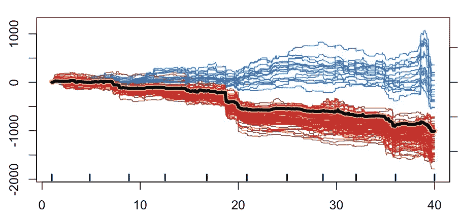
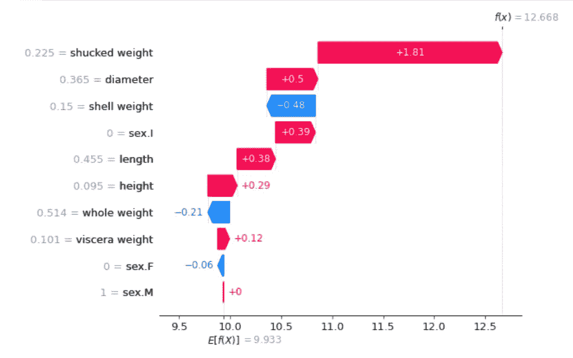

# 什么是可解释的机器学习？

> 原文：<https://towardsdatascience.com/what-is-interpretable-machine-learning-2d217b62185a>

## IML 介绍——旨在使机器学习模型为人类所理解的领域

(用 [DALLE Mini](https://www.craiyon.com/) 创建)

我们应该永远相信一个表现良好的模型吗？

一个模特可能会拒绝你的抵押贷款申请或者诊断出你患有癌症。这些决定是有后果的。后果严重。即使他们是正确的，我们也会**期待一个解释**。

人类可以给一个。人类能够告诉你，你的收入太低，或者一群细胞是恶性的。为了从一个模型中得到类似的解释，我们把目光投向了**的可解释机器学习领域**。

我们探索这个领域，了解它的目标是什么。我们讨论提供解释的两种主要方法:

*   本质上可解释的模型
*   模型不可知的方法

我们还讨论不太突出的方法:

*   因果模型
*   反事实的解释
*   对立的例子
*   非不可知方法

最后，我们谈谈从技术解释到人性化解释需要做些什么。

# 什么是 IML？

可解释的机器学习是一个研究领域。它旨在建立人类可以理解的机器学习模型。这包括开发:

*   解释黑盒模型的方法
*   建模方法用于构建易于解释的模型

向不太懂技术的观众解释机器学习的方法也属于 IML 的领域。

> IML 的目标是建立人类能够理解的模型

理解一个模型意味着理解个体预测是如何做出的。我们称这些为**本地解释**。有了这些，我们想知道每个单独的模型特征是如何对预测做出贡献的。

这也意味着理解一个模型作为一个整体是如何工作的。也就是理解模型用来做预测的趋势。我们称这些为**全球诠释**。

# 本质上可解释的模型

第一种方法是构建**内在可解释的**模型。这些是人类能够理解的简单模型。这不需要额外的方法。我们只需要查看模型的参数或模型摘要。这些将告诉我们预测是如何做出的，模型捕捉到了什么趋势。

> 内在可解释=无需额外方法即可理解

例如，我们在**图 1** 中有一个决策树。它被训练来预测某人是否会在汽车贷款上违约(是)或不违约(否)。这是一个内在可解释的模型。

为了理解为什么会做出某种预测，我们可以沿着树往下看。观察不同的划分，我们可以看到模型捕捉到的趋势——较低的年龄、较低的收入和学生身份都与较高的违约风险相关。

图 1:决策树的例子(来源:作者)

其他例子有**线性和逻辑回归**。为了理解这些模型是如何工作的，我们可以看看赋予每个模型特征的参数值。参数*特征值给出了该特征对预测的贡献。参数的符号和大小告诉我们特征和目标变量之间的关系。

使用这些模型会让我们远离机器学习。我们转向一种更加统计的思维模式来构建模型。建立一个内在可解释的模型需要更多的思考。我们需要在功能工程上投入更多的时间，选择一小组[不相关的功能](/characteristics-of-a-good-feature-4f1ac7a90a42)。好处是有一个易于解释的简单模型。

有些问题不能用简单的模型来解决。对于像图像识别这样的任务，我们转向更难解释的或黑盒模型。我们可以在**图 2** 中看到一些这样的例子。

图 2:本质上可解释的模型与黑盒模型(来源:作者)

黑盒模型太复杂，人类无法直接理解。为了理解随机森林，我们需要同时理解所有的决策树。类似地，神经网络会有太多的参数，无法一次理解。我们需要额外的方法来窥探黑盒。

# 模型不可知的方法

这就把我们带到了[模型不可知的](/what-are-model-agnostic-methods-387b0e8441ef)方法。这些方法包括 PDP、ICE 图、ALE 图、SHAP、LIME 和 Friedman 的 h-statistic。这些方法可以解释任何模型。该算法实际上被视为一个黑盒，可以替换为任何其他模型。

> 使用代理模型和置换，模型不可知的方法可以解释任何模型

一种方法是使用代理模型。 这些方法从使用原始模型开始进行预测。然后，我们根据这些预测训练另一个模型(即代理模型)。也就是说，我们使用原始模型的预测，而不是目标变量。通过这种方式，代理模型了解了用于进行预测的原始模型的特征。

重要的是代理模型本质上是可解释的。比如我们上面讨论的模型之一。这允许我们通过直接查看代理模型来解释原始模型。

另一种方法是使用**排列**。这涉及到更改/置换模型特征。我们使用该模型对这些置换特征进行预测。然后我们可以理解特征值的变化如何导致预测的变化。

排列方法的一个好例子是[PDP 和 ICE Plots](/the-ultimate-guide-to-pdps-and-ice-plots-4182885662aa) 。你可以在**图 3** 中看到其中一个。具体来说，**冰图**由所有单独的线给出。在我们的数据集中，每个观察值都有一行。为了创建每条线，我们置换一个特征的值并记录结果预测。我们这样做的同时保持其他特性的值不变。粗黄线是 **PDP** 。这是所有单独线条的平均值。

图 3: PDP 和 ICE 图示例(来源:作者)

我们可以看到，平均而言，预测随着特征而降低。观察冰图，有些观察结果并不符合这一趋势。这表明我们的数据中存在潜在的相互作用。

PDP 和 ICE 图是全球解释方法的一个例子。我们可以用它们来理解模型捕捉到的趋势。它们不能用来理解个人预测是如何做出的。

沙普利值可以。如**图 4** 所示，每个模型特征都有一个值。它们告诉我们，当与平均预测**E[f(x)】**相比时，每个特征如何对预测 **f(x)** 做出贡献。

图 Shapley 值的例子(来源:作者)

过去，Shapley 值是用排列来近似的。最近一种叫做 [SHAP](/introduction-to-shap-with-python-d27edc23c454) 的方法显著提高了这些近似的速度。它使用排列和代理模型的组合。单个观察值的特征值被置换。然后根据这些值训练线性回归模型。该模型的权重给出了近似的 Shapley 值。

通常，这种方法被称为**本地代理模型**。我们根据个别预测而不是所有预测的排列来训练代理模型。石灰是另一种使用这种方法的方法。

# 其他 IML 方法

内在可解释模型和模型不可知方法是 IML 的主要方法。其他一些方法包括**因果模型**、**反事实**、**解释**和**对立例子**。事实上，任何旨在理解模型如何做出预测的方法都属于 IML 的范畴。已经为特定模型开发了许多方法。我们称这些**为非不可知方法**。

> IML 包括任何用于理解模型如何做出预测的方法

## 因果模型

机器学习只关心相关性。一个模型可以使用原产国来预测患皮肤癌的几率。然而，真正的原因是每个国家不同程度的日照。我们称原产地为日照量的代表。

在构建因果模型时，我们的目标是只使用因果关系。我们不想包含任何代表真正原因的模型特征。要做到这一点，我们需要依赖领域知识，并在特征选择上投入更多的精力。

建立因果模型并不意味着模型更容易解释。这意味着任何解释都将忠实于现实。特征对预测的贡献将接近事件的真正原因。你给出的任何解释也会更有说服力。

你为什么诊断我得了皮肤癌？

“因为你来自南非”，并不是一个令人信服的理由。

## **反事实解释**

反事实的解释可以被认为是一种排列方法。它们依赖于特征值的排列。重要的是，他们专注于寻找改变预测的特征值。例如，我们想知道从阴性诊断到阳性诊断需要什么。

更具体地说，反事实解释是我们为了改变预测而需要对特征值做出的最小改变。对于连续目标变量，变化将是预定义的百分比或数量。

反事实解释对于回答相反的问题很有用。客户将他们的当前位置与潜在的未来位置进行比较的问题。例如，在贷款被拒绝后，他们可以问:

“我怎么才能被接受？”

对于反事实的解释，我们可以回答:

“你需要增加 200 美元的月收入”或者“你需要减少 10000 美元的现有债务”。

## **对抗性例子**

对立的例子是导致非直觉预测的观察。如果人类看了这些数据，他们会做出不同的预测。

寻找对立的例子类似于反事实的解释。不同的是，我们想要改变特征值来有意欺骗模型。我们仍在试图理解这个模型是如何工作的，但不是提供解释。我们希望找到模型中的弱点，并避免[对抗性攻击](/what-is-adversarial-machine-learning-dbe7110433d6)。

对立的例子在像图像识别这样的应用中很常见。有可能创建对人类来说看起来完全正常的图像，但是导致不正确的预测。

例如，谷歌的研究人员展示了引入一层噪声如何改变图像识别模型的预测。看着**图 5** ，你可以看到，对于人类来说，这层噪声甚至是不可察觉的。然而，这个模型现在预测熊猫是一只长臂猿。

图 5:对抗的例子(来源: [I. Goodfellow 等。艾尔。](https://arxiv.org/pdf/1412.6572.pdf))

## **非不可知方法**

已经为特定的黑盒模型开发了许多方法。对于基于树的方法，我们可以计算每个特征的分裂次数。对于神经网络，我们有像像素分解和[深度提升](https://github.com/kundajelab/deeplift)这样的方法。

尽管 SHAP 被认为是模型不可知的，但它也有非不可知的近似方法。例如，TreeSHAP 只能用于基于树的方法，而 DeepSHAP 只能用于神经网络。

明显的缺点是非不可知方法只能用于特定的模型。这就是为什么研究一直指向不可知论的方法。这些为我们选择算法提供了更大的灵活性。这也意味着我们的解释方法是经得起未来考验的。它们可以用来解释尚未开发的算法。

# 从解释到说明

我们讨论的方法都是技术性的。数据科学家使用它们向其他数据科学家解释模型。实际上，我们将被期望向非技术观众解释我们的模型。这包括同事、监管者或客户。为此，我们需要弥合技术解释和人性化解释之间的差距。

您需要:

*   根据观众的专业知识调整级别
*   仔细考虑要解释哪些特征

一个好的解释不一定需要解释所有特征的贡献。

我们将在下面的文章中更深入地讨论这个过程。作为一个例子，我们走过如何使用 SHAP 特征贡献来给出一个令人信服的解释。

 [## 解释预言的艺术

### 如何以人性化的方式解释你的模型

towardsdatascience.com](/the-art-of-explaining-predictions-22e3584ed7d8) 

IML 是一个令人兴奋的领域。如果您想了解更多，请查看下面的教程:

 [## Python SHAP 简介

### 如何创造和解释 SHAP 情节:瀑布，力量，决定，SHAP 和蜂群

towardsdatascience.com](/introduction-to-shap-with-python-d27edc23c454)  [## PDP 和 ICE 绘图的最终指南

### 部分依赖图和个人条件期望背后的直觉、数学和代码(R 和 Python)

towardsdatascience.com](/the-ultimate-guide-to-pdps-and-ice-plots-4182885662aa) 

我希望这篇文章对你有帮助！如果你想看更多，你可以成为我的 [**推荐会员**](https://conorosullyds.medium.com/membership) **来支持我。你可以访问 medium 上的所有文章，我可以得到你的部分费用。**

 [## 通过我的推荐链接加入 Medium 康纳·奥沙利文

### 作为一个媒体会员，你的会员费的一部分会给你阅读的作家，你可以完全接触到每一个故事…

conorosullyds.medium.com](https://conorosullyds.medium.com/membership) 

你可以在|[Twitter](https://twitter.com/conorosullyDS)|[YouTube](https://www.youtube.com/channel/UChsoWqJbEjBwrn00Zvghi4w)|[时事通讯](https://mailchi.mp/aa82a5ce1dc0/signup)上找到我——注册免费参加 [Python SHAP 课程](https://adataodyssey.com/courses/shap-with-python/)

## 图像来源

所有图片都是我自己的或从[www.flaticon.com](http://www.flaticon.com/)获得的。在后者的情况下，我拥有他们的[保费计划](https://support.flaticon.com/hc/en-us/articles/202798201-What-are-Flaticon-Premium-licenses-)中定义的“完全许可”。

## 参考

C.莫尔纳尔、**可解释机器学习** (2021)、[https://christophm.github.io/interpretable-ml-book/](https://christophm.github.io/interpretable-ml-book/)

南 Masís，**用 Python 进行可解释的机器学习** (2021)

莫拉法、卡拉米、郭、拉格林和刘，2020 年。**机器学习的因果可解释性——问题、方法和评估**。[https://arxiv.org/abs/2003.03934](https://arxiv.org/abs/2003.03934)

微软，**因果关系与机器学习**，[https://www . Microsoft . com/en-us/research/group/causal-inference/](https://www.microsoft.com/en-us/research/group/causal-inference/)