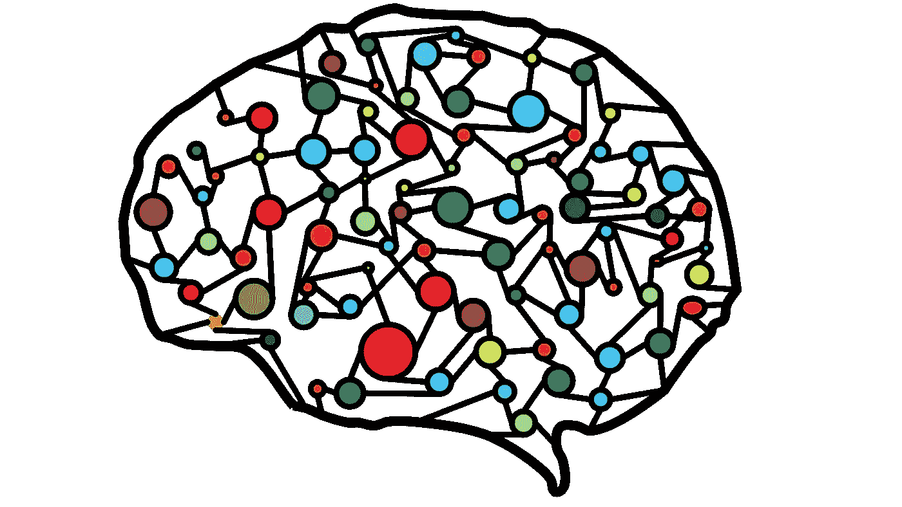
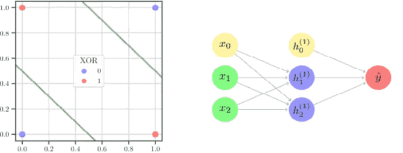

# 什么是神经-符号整合？

> 原文：<https://towardsdatascience.com/what-is-neural-symbolic-integration-d5c6267dfdb0>

## 走向[深度关系学习](https://medium.com/tag/deep-relational-learning)

## *深入了解象征性人工智能与深度学习相结合的历史*

神经-符号整合的主要目的是用神经网络捕捉符号和逻辑推理。(图片来自 [pixabay](https://pixabay.com/illustrations/artificial-neural-network-ann-3501528/) )

近十年来，深度学习一直是人工智能领域大部分进展、成功和炒作背后的推动力量。它接管这个领域的速度如此之快，以至于许多人通常会将这两个领域混淆为等同的。

> **人工智能⊃机器学习⊃深度学习**

虽然深度学习目前的成功和采用在很大程度上盖过了前面的技术，但这些技术仍然有一些有趣的功能。在本文中，我们将研究一些原始的符号人工智能原则，以及它们如何与深度学习相结合，以利用这两种看似不相关(甚至矛盾)的学习和人工智能方法的优势。

# 人工智能历史一瞥

从历史上看，AI 的象征性和次象征性立场的两个包含流以很大程度上独立的方式演变，每个阵营都专注于自己选定的狭隘问题。最初，研究人员倾向于对人工智能采用离散的、符号化的方法，目标是从知识表示、推理和规划到自动定理证明的问题。

虽然符号人工智能中的特定技术变化很大，但该领域在很大程度上是基于 ***数学逻辑*** ，这被视为符号操作的大多数底层概念的适当(“简洁”)表示形式。考虑到这种形式主义，人们过去常常为人工智能设计大型知识库、专家和产生式规则系统以及专门的编程语言。

这些符号逻辑表示随后也被普遍用于机器学习(ML)子领域，特别是以[归纳逻辑编程](https://link.springer.com/referenceworkentry/10.1007%2F978-0-387-30164-8_396)(在[以前的文章](https://medium.com/@sir.gustav/what-is-relational-machine-learning-afbe4a9c4231)中讨论过)的形式，它引入了将*背景知识*整合到学习模型和算法中的强大能力。

这种基于逻辑的方法对 ML 的主要优点是对人类透明、演绎推理、包含专家知识和从小数据中进行结构化概括。

然而，也有一些主要的缺点，包括计算复杂性，无法捕捉现实世界的噪音问题，数值，和不确定性。由于这些问题，大多数符号化的人工智能方法仍然停留在它们优雅的理论形式上，从未真正在应用中看到任何更大的实际采用(与我们今天看到的相比)。

与此同时，随着计算能力和可用数据量的进步，另一种人工智能方法开始获得动力。 ***统计机器学习*** ，原本针对回归、分类等“狭义”问题，已经开始深入 AI 领域。

这只是随着 ***深度学习*** (DL)时代的到来而升级，随着这个时代的到来，这个领域完全被亚符号、连续、分布式的表征所主宰，似乎结束了符号人工智能的故事。

## 深度学习的兴起

神经网络的概念(在深度学习“重塑品牌”之前被称为神经网络)实际上已经存在了几十年，经历了各种起伏。它可以追溯到 1943 年，第一个计算神经元问世[1]。将这些一层层堆叠起来，在 20 世纪 80 年代和 90 年代已经非常流行了。然而，在那个时候，他们仍然在与更成熟的、理论上更有根据的学习模型(如支持向量机)的竞争中失利。

神经网络的真正复兴始于 2010 年在提高语音识别任务准确性方面的快速实证成功[2]，开启了现在公认的现代深度学习时代。不久之后，神经网络也开始在计算机视觉中展示同样的成功。

面对神经网络在这些机器感知标准基准上不可否认的有效性，研究人员慢慢地(有时不情愿地)开始放弃他们为支持向量机设计的高级特征提取管道，转而采用神经架构制作的新实践。

随着这种范式的转变，许多 80 年代和 90 年代的神经网络变体被重新发现或新引入。受益于现代 GPU 并行处理能力的大幅提升，以及不断增加的可用数据量，深度学习一直在稳步铺平道路，以完全主导(感知)ML。

吸收张量样本的卷积神经网络中共享权重的典型(对称)模式。图片由作者提供。

> ***CNN 上的间奏曲。*** *最成功的神经网络架构之一是卷积神经网络(CNN)[3]⁴(追溯到 1982 年的 Neocognitron [5])。CNN 引入的显著特征是使用了*共享权重*和*共享*的思想。*
> 
> *此处由卷积滤波器的应用引起的共享权重引入了等方差 w.r.t .滤波器的相应变换，同时通过池化在顶部并入聚合函数，将其进一步扩展到该变换*不变性*。这种技术已经被证明在涉及翻译(移位)* **对称**的各种任务中非常有用。 *(我们将在后续文章中更详细地探讨这些概念。)*

## 可微分规划

在实验成功的巨大推动下，DL 在很大程度上从最初的生物大脑启发的感知智能模型转向“任何在实践中有效的”工程方法。本质上，这个概念演变成一种非常通用的方法，使用*梯度下降*来优化几乎任意的*嵌套函数*的参数，许多人喜欢将这个领域重新命名为*可微分编程*。这种观点为各种新算法、技巧和调整提供了更多的空间，这些新算法、技巧和调整以各种吸引人的名字引入底层功能块(仍然主要由基本线性代数运算的各种组合组成)。

但是随着这种演变，我们也开始看到深度学习社区对结构化、类似程序的符号表示的兴趣，尽管可能是以一种意想不到的方式。事实上，现代神经架构不再是在越来越大的数据集上堆叠越来越多的完全连接的层，而是以某种结构偏差的形式将越来越多的*先验知识*整合到可区分的程序中，以便完成需要更高抽象水平的更复杂的任务。⁷

究竟有多少这种先验知识要包含在模型中，一直是人工智能研究人员之间许多激烈辩论的主题。⁸

# 神经符号整合

虽然在超人的感知水平上慢慢饱和，但我们已经看到 DL 进一步扩展到最多样的领域，这些领域最初实际上被认为是象征性的——从玩游戏和语言建模开始，然后发展到编程、算法推理，甚至定理证明。

虽然现在看起来经过足够的调整，大型神经网络正在解决手头的每一个人工智能问题，但指出神经网络的概念本身缺乏许多被认为是人工智能系统的基本功能可能是好的，例如捕捉关系和组合结构，抽象概念的符号推理，鲁棒性和透明性[9](见 [Gary Marcus](https://medium.com/u/d7e74ac84d28?source=post_page-----d5c6267dfdb0--------------------------------) 在 medium 上关于该主题的帖子！).

另一方面，这些能力是由基于逻辑的方法自然提供的。因此，试图以有效的方式整合这两个互补的人工智能流已经成为研究人员的极大兴趣。⁰

> 现在，许多人认为，深度学习与符号化、基于逻辑的方法中存在的高级推理能力相结合，是迈向更通用的人工智能系统的必要条件[9，11，12]。

W 虽然主流(深度学习)社区对人工智能的符号方面的兴趣是相当新的，但实际上在一个名为 [*用于学习和推理的神经符号整合*](https://people.cs.ksu.edu/~hitzler/nesy/) (NSI)的相当小的社区中，已经有一长串专注于该主题的研究[12]。

NSI 传统上专注于在神经网络内模拟*逻辑推理*，为符号和子符号表示与计算之间的对应关系提供各种视角。从历史上看，该社区的目标大多是分析的一致性和理论模型的表现力，而不是实际的学习应用(这可能是他们被主流研究边缘化的原因)。

然而，鉴于前面提到的神经/深度学习概念的最近发展，NSI 领域现在正获得比以往任何时候都更大的势头。

## 从符号到神经元

也许令人惊讶的是，由于早期讨论的符号人工智能的优势，神经和逻辑演算之间的对应关系在历史上已经很好地建立起来了。

再仔细观察一下，麦卡洛克和皮茨[1]在 1943 年的论文“*对神经活动*中固有思想的逻辑演算”中首次提出的计算神经元，我们可以看到，它实际上被认为是在输入(二进制值)命题上模仿*逻辑*门。这个想法是基于这样一个事实，即合取和析取的逻辑连接词可以很容易地通过带权重的二进制阈值单元进行编码——即*感知器*，这是一种优雅的学习算法，不久后将推出。

逻辑 AND 和 OR 函数可以简单地用单个阈值神经元(感知器)来表示。(图片来自[13]作者的学生马丁·克鲁茨基)

这种线性感知器不能计算逻辑 XOR 函数被认为是一个重要的限制，对该领域产生了深远的负面影响。众所周知，这可以通过将多个这样的感知器相互堆叠来轻松解决，从而能够表示更复杂的逻辑嵌套函数。然而，当时缺少这种“*神经网络*的权重的有效学习算法，导致大多数研究人员(和资金)放弃了这种连接主义的想法，转而支持符号和其他统计方法。⁴

XOR 函数可以被认为是 OR 和 NAND 的组合，它只能通过将神经元堆叠成具有隐藏层的神经网络来表示。(图片来自[13]作者的学生马丁·克鲁茨基)

直到 20 世纪 80 年代，用于嵌套函数微分的*链规则*作为*反向传播*方法被引入，以计算这种神经网络中的梯度，而这种神经网络又可以通过梯度下降方法进行训练。然而，为此，研究人员不得不用*可微分的*激活函数取代最初使用的二进制阈值单元，如 sigmoids，这开始在神经网络和它们清晰的逻辑解释之间挖掘一条鸿沟。

## 从逻辑到深度学习

在深度学习的现代背景下，单个神经元和逻辑连接词之间的这些老派相似之处可能看起来很奇怪。

然而，有趣的是，即使是深度学习的现代思想最初也不仅仅局限于神经网络，而是普遍适用于“对有用概念的分层组合进行建模的方法”，这些方法在来自输入样本的目标变量的不同推理路径中被重用[15]。

虽然这些概念通常通过深度学习中隐藏神经元/层的计算来实例化，但这种分层抽象对于人类思维和*逻辑推理*来说通常也很常见。

*   事实上，逻辑是从更简单的前提中以层次(嵌套)的方式演绎有用概念的科学。当在逻辑中构造一个证明时，辅助引理经常被创建来以非常相似的方式在范围上降低理论的复杂性。

> *因此，虽然抽象的层次级别通常由神经网络的隐藏层表示，但它们也可以被认为是"*复杂的命题公式，重用了许多子公式 *"
> (引自 Y. Bengio 的《学习 AI 的深度架构》摘要【15】)。*

从 NSI 的角度来看，这不仅仅是一些隐喻，而是反映这种范式的许多实际系统在整个 90 年代继续明确地展示了逻辑推理的层次结构和经典神经网络之间的对应关系，例如流行的基于知识的人工神经网络(KBANN) [16]。

KBANN 方法的例子:(a)命题规则集；(b)被视为与或依赖图的规则；每个命题被表示为一个单元(额外的单元也被添加以表示析取定义，例如 b)，并且它们的权重和偏差被设置为使得它们实现 and 或 or 门，例如，权重 b->a 和 c->a 被设置为 4，单元 a 的偏差(阈值)被设置为-6；(d)在各层之间添加低权重链接作为未来学习的基础(例如，可以通过增加这些权重中的一个来向规则添加前提)。由[理查德·麦克林](https://www.d.umn.edu/~rmaclin/)拍摄的图片，配有原始说明。

*   KBANN 是一个建立在连接主义学习技术之上的混合学习系统，它按照所提出的精神，将由*命题逻辑程序*表示的特定于问题的“领域理论”映射到*前馈神经网络*，然后使用反向传播来提炼这个重构的知识。

这个想法后来也通过提供从学习网络中提取符号知识的相应算法得到了扩展，完成了在 NSI 社区中被称为“*神经符号学习循环*”的过程。

神经符号学习循环的概念。首先，数据(D)用于创建或学习(P)符号模型(S)。然后，这被翻译(R)成神经网络(N)，在该神经网络上执行结构(T)和权重(W)学习改进，并且符号模型被提取(E)回来。然后，循环可以继续迭代地改进模型。图片由作者的同事 Martin Svatos 从[18]获得，在那里对该想法进行了实验评估。

然而，正如本吉奥所想象的那样，这种直接的神经-符号对应不可避免地局限于前述的*命题*逻辑设置。由于缺乏用*关系*逻辑表示对涉及抽象知识的复杂现实生活问题建模的能力(在我们的[上一篇文章](https://medium.com/@sir.gustav/what-is-relational-machine-learning-afbe4a9c4231)中解释过)，命题神经-符号整合的研究仍然是一个小领域。

## 关系级 NSI 的问题

虽然前面提到的*命题*逻辑公式和神经网络之间的对应非常直接，但将相同的原理转移到*关系*设置中是 NSI 研究人员传统上一直在努力应对的一个主要挑战。问题是，在命题设置中，只有现有输入命题的(二进制)*值*在变化，而逻辑程序的结构是固定的。

这很容易被认为是位于命题解释(特征向量)之上的布尔电路(神经网络)。然而，*相关的*程序输入解释不再被认为是固定(有限)数量的命题上的独立值，而是给定世界中真实的*相关的*事实的*无界集合*(“最小 Herbrand 模型”)。因此，在这种表示之上的逻辑推理的结构也不能再由固定的布尔电路来表示。

*   因此，核心障碍是，[还是](https://medium.com/@sir.gustav/what-is-relational-machine-learning-afbe4a9c4231)，将关系推理结构的可能无限变化编码成神经网络的某个有限的固定结构。⁹

经典神经网络无法捕捉命题表达之外的逻辑推理，这种情况通常被称为*命题固定*，由约翰·麦卡锡创造【20】。

从那时起，NSI 社区提出了许多理论观点来处理关系逻辑的非约束性质，然而，这些理论观点比上面概述的基于知识的神经网络建模方法更加奇特，并且从未真正在实践中得到广泛采用。

从更实际的角度来看，许多成功的 NSI 作品利用各种形式的[命题化](https://link.springer.com/referenceworkentry/10.1007%2F978-0-387-30164-8_680)(和“张量化”)将关系问题转化为方便的数字表示[24]。然而，这种基于*固定大小的*数字向量(或张量)表示的方法有一个原则性的问题，因为它们本质上不足以捕捉关系逻辑推理的*无约束*结构。因此，所有这些方法仅仅是真实的底层关系语义的近似。

*   请注意，这个问题与[上一篇文章](https://medium.com/@sir.gustav/what-is-relational-machine-learning-afbe4a9c4231)中讨论的*关系学习*问题密切相关。毫不奇怪，为了用神经网络捕捉关系逻辑表达，许多 NSI 研究人员转向了 ML 从业者用来处理关系数据表示的类似技术(例如，命题化)。

## 动态神经计算

然而，与此同时，一种基于 ***动态计算图*** 的新的神经架构流在现代深度学习中变得流行，以处理各种序列、集合和树的(非命题)形式的结构化数据。最近，对任意(不规则)图的扩展变得非常流行，成为[图神经网络](https://distill.pub/2021/gnn-intro/) (GNNs)。

这些*动态*模型最终能够跳过将关系表示(如关系逻辑程序的解释)转换为固定大小的向量(张量)格式的预处理步骤。它们通过将输入数据结构中的变化有效地反映到神经模型自身结构中的*变化中来实现，其中*受反映相应模型先验的某个*共享参数化*(对称)方案的约束。

虽然到目前为止介绍的特定动态深度学习模型，如 GNNs，仍然只是某种程度上特定的图传播试探法，而不是通用的(逻辑)推理器，但动态神经计算的范式最终打开了一扇门，以正确反映神经网络中的*关系*逻辑推理，在上面概述的命题 NSI(例如，KBANN)的经典精神中。⁵

在下一篇文章的[中，我们将探索如何用这种动态神经建模方法来实现广受欢迎的关系型 NSI。特别是，我们将展示如何使神经网络直接学习](/from-graph-ml-to-deep-relational-learning-f07a0dddda89) [*关系*](/what-is-relational-machine-learning-afbe4a9c4231) 逻辑表示(超越图形和 GNNs)，最终受益于 ML 和 AI 的符号和深度学习方法。

[1]麦卡洛克，沃伦和沃尔特皮茨。"对神经活动中固有思想的逻辑演算."数学生物物理学通报 5.4(1943):115–133。

[2] Hinton，Geoffrey 等人，“用于语音识别声学建模的深度神经网络:四个研究小组的共同观点” *IEEE 信号处理杂志*29.6(2012):82–97。

[3] LeCun，Yann 等，“基于梯度的学习在文档识别中的应用”美国电气和电子工程师学会会议录 86.11(1998):2278–2324。

4.我们在这里强调 CNN，因为它们的原则在[的后续文章【T5(s)】中会更加重要。](/from-graph-ml-to-deep-relational-learning-f07a0dddda89)

[5]福岛、国彦和三宅一生。" Neocognitron:视觉模式识别机制的自组织神经网络模型."*神经网络中的竞争与合作*。施普林格，柏林，海德堡，1982。267–285.

[6]翁、鞠扬、纳伦德拉·阿胡贾和黄煦涛。" Cresceptron:自适应增长的自组织神经网络."*【Proceedings 1992】ij CNN 国际神经网络联合会议*。第一卷。IEEE，1992 年。

7.请注意，在这里，在归纳逻辑编程方法中使用背景知识与[关系 ML](https://medium.com/@sir.gustav/what-is-relational-machine-learning-afbe4a9c4231) 相似。

8.虽然许多宣誓的深度学习支持者会争辩说，不应该有这样的先验偏见，所有的知识都应该直接从原始数据中学习，但基于深度学习主导特征工程的先例，看看 CNN 也许是有益的，它以翻译不变性的形式准确地编码了这样的结构偏见。

[9]加里·马库斯。"人工智能的下一个十年:迈向强大人工智能的四个步骤."arXiv 预印本 arXiv:2002.06177 (2020)。

10.然而，经典神经模型的黑盒性质(对其学习能力的大多数确认是通过经验而非分析完成的)使得与符号系统的一些直接集成(可能提供缺失的能力)变得相当复杂。

从统计关系到神经符号人工智能。arXiv 预印本 arXiv:2003.08316 (2020)。

[12] Besold，Tarek R .等人，“神经符号学习和推理:调查和解释” *arXiv 预印本 arXiv:1711.03902* (2017)。

[13]马丁，克鲁茨基。*探索深度学习中的对称性*。理学学士论文。布拉格的捷克技术大学，2021。

14.有趣的是，我们注意到，即使在现代深度学习中，简单的逻辑异或函数实际上仍然很难正确学习，我们将在后续文章中讨论这一点。

[15]本吉奥，约舒阿。*学习人工智能的深度架构*。现在出版公司，2009 年。

16 Towell，Geoffrey G .和 Jude W. Shavlik。"基于知识的人工神经网络."*人工智能*70.1–2(1994):119–165。

[17]麦克林，理查德 F. *从指导和经验中学习:将过程域理论整合到基于知识的神经网络中的方法*。威斯康星大学麦迪逊分校计算机科学系，1995 年。

[18] Svatos，Martin 和 Sourek，Gustav 和 Zelezny，Filip。"重温神经符号学习循环."神经-符号整合研讨会@ IJCA，2019 年。

19.注意与我们在[上一篇文章](https://medium.com/@sir.gustav/what-is-relational-machine-learning-afbe4a9c4231)中讨论的命题和关系机器学习的相似性。

[20]约翰·麦卡锡。"联结主义的认识论挑战."行为和脑科学 11.1(1988):44–44。

21.然而，公平地说，这是任何标准学习模型的情况，例如支持向量机或树集成，它们本质上也是命题的。

22.例如，一个突出的想法是用实数(向量)对逻辑程序的(可能是无限的)解释结构进行编码，并基于通用近似定理将关系推理表示为它们之间的(黑盒)映射。然而，这假设未绑定的关系信息隐藏在基础实数的未绑定的小数部分中，这对于任何基于梯度的学习来说自然是完全不切实际的。

23.我们注意到，这是当时的状况，近年来情况发生了相当大的变化，一些现代国家统计机构的办法现在相当恰当地处理了这个问题。

[24]frana、Manoel VM、Gerson Zaverucha 和 Artur S. d'Avila Garcez。"使用人工神经网络的底部子句命题化的快速关系学习."*机器学习*94.1(2014):81–104。

25.同时，GNNs 最近也被 NSI 社区认为是一个有前途的未来方向:
Lamb，Luis C .等.*图形神经网络与神经符号计算相遇:综述与展望。*“arXiv 预印本 arXiv:2003.00330 (2020)。