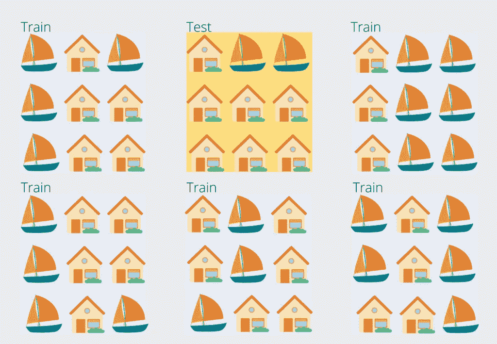

# 机器学习中什么是过拟合？

> 原文：<https://towardsdatascience.com/what-is-overfitting-in-machine-learning-dc7e4de1c892>

## 了解过度合身的基本知识


安妮·斯普拉特在 [Unsplash](https://unsplash.com?utm_source=medium&utm_medium=referral) 上的照片


过度拟合是数据科学领域的一个术语，描述了模型过于适应训练数据集的特性。因此，该模型在新的、看不见的数据上表现不佳。然而，[机器学习](https://databasecamp.de/en/machine-learning)模型的目标是一个很好的泛化，所以新数据的预测成为可能。

# 什么是过度拟合？

术语“过度拟合”用在预测模型的上下文中，这些模型对于训练数据集来说过于具体，因此会学习数据的分散性。当模型对于底层数据来说结构过于复杂时，通常会出现这种情况。问题在于，经过训练的模型泛化能力很差，也就是说，对新的、看不见的数据提供的预测不充分。另一方面，在训练数据集上的性能非常好，这就是为什么人们可以假定模型质量很高。

一些因素可能预示着早期即将过度拟合:

*   **小数据集**:如果训练中只有几个单独的数据集，那么这些数据集很有可能只是被记住了，而且可用的信息太少，无法学习底层结构。模型的训练参数越多，问题就越多。例如，一个[神经网络](https://databasecamp.de/en/ml/artificial-neural-networks)在每个隐藏层上都有大量的参数。因此，模型越复杂，数据集就应该越大。
*   **训练数据集的选择**:如果数据集的选择已经不平衡，那么很有可能模型会对其进行训练，从而泛化能力较差。从[人群](https://databasecamp.de/en/statistics/population-and-sample)中抽取的样本应始终随机选取，以避免出现选择偏差。为了在选举期间进行推断，不仅应该调查一个投票站的选民，因为他们不能代表整个国家，而只能代表该选区的意见。
*   **多个训练时期**:一个模型训练几个时期，每个时期的目标是进一步最小化损失函数，从而提高模型的质量。然而，在某一点上，只有通过更多地适应训练数据集才能实现[反向传播](https://databasecamp.de/en/ml/backpropagation-basics)的改进。

# 如何识别过度拟合？

不幸的是，没有一个中心分析可以确定一个模型是否过度拟合。然而，有一些参数和分析可以提供即将发生的过度拟合的指示。最好也是最简单的方法是查看迭代过程中模型的误差曲线。

如果训练数据集中的误差继续减小，但验证数据集中的误差又开始增大，这表明模型与训练数据太接近，因此泛化能力很差。可以用损失函数进行相同的评估。

为了构建这样一个图，你需要所谓的验证或测试集，即模型的看不见的数据。如果数据集足够大，通常可以分割出 20–30%的数据集，并将其用作测试数据集。否则，也有可能使用所谓的 k 倍交叉验证，这在某种程度上更复杂，因此也可用于较小的数据集。

数据集被分成 k 个大小相等的块。随机选择其中一个块作为测试数据集，其他块依次作为训练数据。然而，在第二训练步骤中，另一个块被定义为测试数据，并且重复该过程。



k 倍交叉验证示例|来源:作者

块的数量 k 可以任意选择，并且在大多数情况下，选择 5 到 10 之间的值。过大的值会导致模型偏差较小，但过度拟合的风险会增加。太小的 k 值会导致更有偏差的模型，因为它实际上对应于保留方法。

# 如何防止过度拟合？

有许多不同的方法可以防止过度拟合，或者至少降低过度拟合的可能性。根据以下建议，在许多情况下，两个就足以降低过度拟合的风险:

*   **数据集**:数据集在避免过拟合方面起着非常重要的作用。它应该尽可能大，包含不同的数据。此外，应该在数据准备过程中花费足够的时间。如果不正确或缺失的数据出现得太频繁，复杂性就会增加，过度拟合的风险也会相应增加。另一方面，干净的数据集使模型更容易识别底层结构。
*   **数据扩充**:在许多应用中，例如[图像识别](https://databasecamp.de/en/use-case/cnn-in-tensorflow)，使用单独的数据集，并将其稍加修改后提供给模型用于训练。例如，这些更改可以是图像的黑白副本，也可以是带有一些拼写错误的相同文本。这使得模型更加稳定，并帮助它学习处理数据变化，变得更加独立于原始训练数据集。
*   **停止规则**:当开始一个模型时，你指定一个最大的历元数，在此之后训练结束。此外，在早期阶段停止训练可能是有意义的，例如，如果它在几个时期内没有取得任何实际进展(损失函数不再减小)，因此存在模型陷入过拟合的风险。在 TensorFlow 中，可以为此定义单独的回调:

```
callback = tf.keras.callbacks.EarlyStopping(monitor='loss', patience=3)
```

*   **特征选择**:数据集通常包含各种作为模型输入的特征。当模型不够复杂以至于不能代表底层结构时，就会出现这种欠拟合。另一个问题可能是计算关系所需的数据集中缺少重要的特征。然而，并非所有这些都是预测正确结果所真正需要的。一些特征甚至可能[相关](https://databasecamp.de/en/statistics/correlation-and-causation)，即相互依赖。如果有大量特征可用，则应借助合适的算法进行预选。否则，模型的复杂性增加，过度拟合的风险也很高。

# 过度拟合与欠拟合

然而，在避免过度拟合时必须小心，因为它也可能漂移到另一个极端，即所谓的欠拟合。当模型不能从给定的数据中识别出潜在的结构时，我们称之为欠拟合，因此在泛化方面的结果也很差。可以通过训练误差停滞在高水平并且不再降低的事实来识别拟合不足。

当模型不够复杂以至于不能代表底层结构时，就会出现这种欠拟合。另一个问题可能是计算关系所需的数据集中缺少重要的特征。

# 这是你应该带走的东西

*   过度拟合是数据科学领域中的一个术语，它描述了一个模型的属性，即它对训练数据集的适应性太强。
*   通常可以通过测试数据集中的误差再次增加，而训练数据集中的误差继续减少这一事实来识别。
*   其中，可以通过插入早期停止规则或通过提前从数据集中移除与其他特征相关的特征来防止过度拟合。

*如果你喜欢我的作品，请在这里订阅*[](https://medium.com/subscribe/@niklas_lang)**或者查看我的网站* [*数据大本营*](http://www.databasecamp.de/en/homepage) *！还有，medium 允许你每月免费阅读* ***3 篇*** *。如果你希望有****无限制的*** *访问我的文章和数以千计的精彩文章，不要犹豫，点击我的推荐链接:*[【https://medium.com/@niklas_lang/membership】](https://medium.com/@niklas_lang/membership)每月花$***5****获得会员资格**

*[](/understanding-the-backpropagation-algorithm-c7a99d43088b)  [](/intuitive-guide-to-artificial-neural-networks-17805150e91a)  [](/exception-handling-in-python-8cc8f69f16ad) *